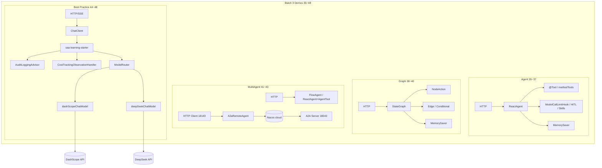

# Phase 3: 48 个独立 Demo (Batch 3: 35~48) - Research

**Researched:** 2026-07-04
**Domain:** Spring AI Alibaba Agent Framework / Graph Runtime / Multi-Agent / Streaming / Observability / Model Routing
**Confidence:** HIGH（Maven BOM + 本地 1.1.2.2 JAR `javap` 核验；教程伪 API 已对照 JAR 纠偏）

<user_constraints>
## User Constraints (from CONTEXT.md)

### Locked Decisions
- **D-01:** 本周期只交付/验收 Demo 35~48（ROADMAP Plan priority note 再次+末批合并；用户明确「剩余所有 demo」）。
- **D-02:** 01~34 已交付且 compile gate 通过，本周期不触碰、不重写、不纳入本批验收。
- **D-03:** 35~48 当前均不存在，全部从教程规格新建（非审计修齐）。
- **D-04:** 包根 `com.flywhl.saa.<模块>`，作者 `@author flywhl`。
- **D-05:** 端口 `examples/NN-xxx` → `180NN`；Server/Client 配对时 Client = Server+100（43-a2a-nacos 若双进程：Server 18043 / Client 18143）。
- **D-06:** 子模块 `pom.xml` parent 指向仓库父 POM，零版本号；双 BOM 由父 POM 管理。
- **D-07:** 禁用废弃 API：`PromptChatMemoryAdvisor`、`CallAroundAdvisor`/`AdvisedRequest`/`AdvisedResponse`、`FunctionCallback`、可变 Options setter。
- **D-08:** 零 TODO / 零伪代码；每个 Demo 具备 README + `api.http` + REST + curl 与预期输出。
- **D-08b:** 小 DTO/record 优先与使用方同包，勿盲目拆 `model` 子包（CLAUDE.md / saa-conventions）。
- **D-09:** 35~48 全部依赖 `saa-learning-common`，`@Import(GlobalExceptionHandler.class)`，统一 `Result<T>`（与 04+ 一致）。
- **D-10:** `saa-learning-starter`（审计/路由/成本）在 **44~48 best-practice 批次强制引入**（与次批 D-10 对照：次批不引入，本批 44~48 必须复用 starter，不重复实现 ModelRouter/CostRecorder/AuditLoggingAdvisor）。
- **D-11:** Chat/Agent 模型一律 DashScope（ADR-003）；多模型路由 Demo（47）可额外引入 DeepSeek（`DEEPSEEK_API_KEY`），与 03-multi-model 模式一致。
- **D-12:** 每个 Demo 的接口/目录/配置以对应 `docs/tutorial/NN-*.md`「可运行 Demo」小节为权威规格；README 模板遵循 `examples/README.md` §3。
- **D-13:** 章节映射（examples/README SSOT）：
  - 35/36/37 → `docs/tutorial/13-Agent.md`
  - 38/39/40 → `docs/tutorial/14-Workflow.md`
  - 41/42/43 → `docs/tutorial/15-MultiAgent.md`
  - 44 → `docs/tutorial/17-Streaming.md`
  - 45/46 → `docs/tutorial/18-Observability.md`
  - 47/48 → `docs/tutorial/20-企业实践.md`（路由/降级；starter 装配可参考 `docs/tutorial/19-BestPractice.md`）
- **D-14:** 教程若只给部分 Demo 完整代码，其余 Demo 按同章 API 与 examples/README 演示要点补齐最小可运行形态，风格对齐已交付的 09~34。
- **D-15:** 中间件依赖在各 Demo README 顶部声明 `bash scripts/infra.sh up <profiles>`：
  - 35~42 Agent/Graph/Multi-Agent → 默认无中间件（进程内）；若实现依赖 Redis checkpoint / 记忆则声明 `core`
  - 43-a2a-nacos → `cloud`（Nacos）
  - 44 stream → 无
  - 45 observability → 可选 `core` 若挂 Prometheus 本地抓取说明；默认无强制中间件，README 写清 metrics 端点
  - 46 logging → 无
  - 47/48 routing/fallback → 无（多模型 Key）
- **D-16:** 无中间件的 Demo README 写「无」。
- **D-17:** 再次批硬门禁：`mvn -pl common,starter -am clean install` 后，35~48 各 Demo `mvn -f examples/NN-xxx/pom.xml -q compile` 全绿。
- **D-18:** 模型调用冒烟 IT：至少为 35、38、41、44、47 各加一个 `@EnabledIfEnvironmentVariable(named="AI_DASHSCOPE_API_KEY", matches=".+")` 的 IT；中间件 Demo（43）用文档声明手动 infra（与 34 一致）。
- **D-19:** examples 保持独立应用（parent `relativePath`），不强制挂入父 POM `<modules>`。
- **D-20:** 建议按能力域拆 plan，便于并行 wave：
  1. Agent（35~37）
  2. Graph / Workflow（38~40）
  3. Multi-Agent（41~43，含 A2A/Nacos）
  4. Stream + Observability + Logging（44~46）
  5. Routing + Fallback（47~48，强制 starter）
  6. 再次批编译门禁（35~48 compile 全绿 + 约定扫描）
- **D-21:** 新 plan 编号从 `03-09` 起，**不覆盖**已交付的 `03-01`~`03-08`。

### Claude's Discretion
- 教程未给出完整代码的 Demo（如 36/37/40/46）按同章 API 与相邻 Demo 模式补齐。
- Agent/Graph 依赖坐标以父 POM BOM 实际 artifact 为准（ReactAgent / StateGraph 等 SAA Graph API）。
- HITL（37）用最小「暂停→人工确认→恢复」REST 演示即可。
- Saga（40）用最小补偿节点演示，不引入外部事务中间件。
- 45 observability：Micrometer 指标暴露 `/actuator/prometheus`；Grafana 看板可文档化，不强求 compose 内嵌 Grafana。
- 47/48：优先复用 `saa-learning-starter` 的 `ModelRouter` / 成本与降级策略，Demo 只做装配与 REST 演示层。

### Deferred Ideas (OUT OF SCOPE)
- 全量 Demo 的集成测试补齐、version-audit / spring-ai-2-readiness 全仓门禁 → Phase 3 收口或 Phase 7
- 父 POM `<modules>` 挂载 examples → 按需，非本批必须
- Phase 3 全量 VERIFICATION.md（48/48）→ 本批 execute + UAT 之后
</user_constraints>

<phase_requirements>
## Phase Requirements

| ID | Description | Research Support |
|----|-------------|------------------|
| REQ-phase-3-demos | 将教程各章核心 API 落成 48 个可独立 `mvn spring-boot:run` 的最小 Demo；编号/命名/端口以 examples/README.md 为 SSOT，满足 HANDOFF §3 验收 | 本文件覆盖 **仅 35~48**：Maven 坐标、教程完整度、包/端口、infra、starter 装配、API 纠偏、验证架构；01~34 已交付不在范围 |
</phase_requirements>

## Summary

Batch 3 交付剩余 14 个 Demo（35~48），全部缺失、从教程规格新建。核心技术栈是 SAA **1.1.2.2** 的 `spring-ai-alibaba-agent-framework`（传递 `graph-core`）与 `spring-ai-alibaba-starter-a2a-nacos`；44~48 强制依赖 `saa-learning-starter`。

**关键发现：** 教程「可运行 Demo」中多处 API 是教学简化写法，与本地 JAR **不一致**。Executor **必须以 1.1.2.2 JAR 为准**，教程只定业务场景与 curl 预期。最大偏差：无 `SupervisorAgent` 类、无 `Skill.of` / `.maxIterations()` / `.interruptBefore()` / `AgentTool.from(agent, desc)` / `AggregationStrategy.addAggregatedEdge` / `A2aRemoteAgent.nacosServiceName()`。

**Primary recommendation:** Plans `03-09`~`03-14` 按 D-20 六组拆分；每个 Agent/Graph Demo 的 Task 必须引用下方「教程→JAR API 映射表」，禁止照抄教程伪代码直接编译。

## Architectural Responsibility Map

| Capability | Primary Tier | Secondary Tier | Rationale |
|------------|-------------|----------------|-----------|
| ReactAgent / Skills / HITL（35~37） | API / Backend | — | 进程内 Agent 循环 + REST 入口 |
| StateGraph / 并行 / Saga（38~40） | API / Backend | — | Graph Runtime 编排，MemorySaver 进程内 |
| FlowAgent 四模式 + Supervisor（41~42） | API / Backend | — | 同 JVM 多智能体拓扑 |
| A2A + Nacos（43） | API / Backend | Database / Storage（Nacos） | 双进程 + 注册发现 |
| SSE 流式（44） | API / Backend | Browser / Client（消费方） | MVC `Flux` → SSE |
| Metrics / Cost（45） | API / Backend | — | Actuator + Micrometer；Grafana 仅文档 |
| 结构化日志 / TraceId（46） | API / Backend | — | MDC + AuditLoggingAdvisor |
| 多模型路由 / 降级（47~48） | API / Backend | — | starter `ModelRouter` + 双 ChatModel |

## Project Constraints (from .cursor/rules/ + saa-conventions)

> `.cursor/rules/` 不存在；以下来自 `.claude/skills/saa-conventions/SKILL.md` 与 `CLAUDE.md`（同等强制）。

- Java 21 · Boot 3.5.16 · SAA 1.1.2.2 · Extensions 1.1.2.2 · Spring AI 1.1.2；子模块零版本号；双 BOM 必须继承父 POM
- 包根 `com.flywhl.saa.<mod>`，`@author flywhl`；端口 `180NN`；Client = Server+100
- 小 DTO/record 同包，勿盲目拆 `model`
- 复用 common + starter（44~48）；禁用废弃 Advisor/FunctionCallback/可变 Options setter
- 密钥仅环境变量；中间件用 `scripts/infra.sh` profiles
- 模型 IT：`@EnabledIfEnvironmentVariable(named="AI_DASHSCOPE_API_KEY", matches=".+")`

## Standard Stack

### Core

| Library | Version | Purpose | Why Standard |
|---------|---------|---------|--------------|
| `spring-ai-alibaba-agent-framework` | 1.1.2.2（BOM） | ReactAgent、FlowAgent、AgentTool、HITL/Skills hooks | [VERIFIED: spring-ai-alibaba-bom-1.1.2.2.pom + 本地 JAR] |
| `spring-ai-alibaba-graph-core` | 1.1.2.2（BOM，agent-framework **传递依赖**） | StateGraph、KeyStrategy、MemorySaver、CompileConfig | [VERIFIED: agent-framework POM 声明 compile 依赖] |
| `spring-ai-alibaba-starter-a2a-nacos` | 1.1.2.2（BOM） | A2A Server/Client + Nacos 注册发现 | [VERIFIED: BOM + starter POM + configuration-metadata] |
| `spring-ai-alibaba-starter-dashscope` | 1.1.2.2（extensions-bom） | DashScope ChatModel | 全仓 ADR-003 |
| `saa-learning-common` | 1.0.0-SNAPSHOT | `Result<T>` / `GlobalExceptionHandler` | D-09 |
| `saa-learning-starter` | 1.0.0-SNAPSHOT | `ModelRouter` / `AuditLoggingAdvisor` / `CostRecorder` | D-10，仅 44~48 |

### Supporting

| Library | Version | Purpose | When to Use |
|---------|---------|---------|-------------|
| `spring-ai-starter-model-deepseek` | Spring AI BOM 1.1.2 | 第二 ChatModel | **47/48**（及 ModelRouter 装配条件） |
| `spring-boot-starter-actuator` | Boot BOM | `/actuator/*` | **45**（及可选 47/48 健康） |
| `micrometer-registry-prometheus` | Boot BOM | Prometheus scrape | **45** |
| `spring-boot-starter-web` | Boot BOM | REST + SSE（Flux） | 全部 Demo |
| `io.github.a2asdk:a2a-java-*` | 0.2.5.Beta2（a2a-nacos 传递） | A2A 协议实现 | **43** 传递，勿手写版本 |

### Alternatives Considered

| Instead of | Could Use | Tradeoff |
|------------|-----------|----------|
| `agent-framework` only | 显式再声明 `graph-core` | 教程警告版本冲突风险；**只声明 agent-framework**（38~40 同） |
| `SupervisorAgent`（教程） | `ReactAgent` + `AgentTool.create` 或 `SubAgentInterceptor` | JAR **无** SupervisorAgent 类 |
| Redis Checkpoint | `MemorySaver` | D-15 默认无中间件；生产才需 Redis |
| 手写 CostTracking | starter `CostTrackingObservationHandler` | D-10 禁止重复实现 |

**Installation（各 Demo pom 片段，零版本号）：**

```xml
<!-- 35~42 通用 Agent/Graph/MultiAgent -->
<dependency>
  <groupId>com.alibaba.cloud.ai</groupId>
  <artifactId>spring-ai-alibaba-agent-framework</artifactId>
</dependency>
<dependency>
  <groupId>com.alibaba.cloud.ai</groupId>
  <artifactId>spring-ai-alibaba-starter-dashscope</artifactId>
</dependency>
<dependency>
  <groupId>com.flywhl.saa</groupId>
  <artifactId>saa-learning-common</artifactId>
</dependency>

<!-- 43 额外 / 替换：双模块均加 a2a-nacos；Client 另加 dashscope -->
<dependency>
  <groupId>com.alibaba.cloud.ai</groupId>
  <artifactId>spring-ai-alibaba-starter-a2a-nacos</artifactId>
</dependency>

<!-- 44~48 强制 starter；47/48 另加 deepseek -->
<dependency>
  <groupId>com.flywhl.saa</groupId>
  <artifactId>saa-learning-starter</artifactId>
</dependency>
```

**Version verification:** 本地 `~/.m2/.../spring-ai-alibaba-bom/1.1.2.2/` 已确认 `agent-framework`、`graph-core`、`starter-a2a-nacos` 均为 **1.1.2.2**。[VERIFIED: local Maven cache]

## Package Legitimacy Audit

> 本批 **不引入** 仓库 BOM 之外的新坐标；全部为父 POM 已管理的 Alibaba/Spring 官方构件或本仓库模块。

| Package | Registry | Age | Downloads | Source Repo | slopcheck | Disposition |
|---------|----------|-----|-----------|-------------|-----------|-------------|
| `com.alibaba.cloud.ai:spring-ai-alibaba-agent-framework` | Maven Central | SAA 1.1.x 线 | N/A（BOM 锁定） | github.com/alibaba/spring-ai-alibaba | N/A（Java/Maven） | Approved — [VERIFIED: BOM] |
| `com.alibaba.cloud.ai:spring-ai-alibaba-starter-a2a-nacos` | Maven Central | 1.1.2.2 | N/A | 同上 | N/A | Approved — [VERIFIED: BOM] |
| `org.springframework.ai:spring-ai-starter-model-deepseek` | Maven Central | Spring AI 1.1.2 | N/A | spring-projects/spring-ai | N/A | Approved — 已用于 03-multi-model |
| `io.micrometer:micrometer-registry-prometheus` | Maven Central | Boot BOM | N/A | micrometer-metrics | N/A | Approved |
| `com.flywhl.saa:saa-learning-starter` | 本仓库 | — | — | 本地模块 | N/A | Approved |

**Packages removed due to slopcheck [SLOP] verdict:** none（无 npm/PyPI 新包）
**Packages flagged as suspicious [SUS]:** none

*slopcheck 面向 npm/PyPI；本批 Java 坐标以官方 BOM + 本地 JAR 为权威。*

## 教程「可运行 Demo」完整度矩阵（35~48）

| Demo | 工程名 | 端口 | 包根（推荐） | 教程代码完整度 | Executor 必须发明的部分 |
|------|--------|------|--------------|----------------|-------------------------|
| 35 | agent-demo | 18035 | `com.flywhl.saa.agentdemo` | **高**（Config/Tools/Controller/curl） | API 纠偏：`methodTools`、`ModelCallLimitHook`、`Result` 包装 |
| 36 | agent-skills-demo | 18036 | `com.flywhl.saa.agentskills` | **低**（仅 `Skill.of` 伪代码） | `ClasspathSkillRegistry`/`FileSystemSkillRegistry` + `SkillsAgentHook`/`SkillsInterceptor` + classpath `SKILL.md` 资源 |
| 37 | agent-hitl-demo | 18037 | `com.flywhl.saa.agenthitl` | **低**（`interruptBefore` 伪代码） | `HumanInTheLoopHook.approvalOn(toolName)` + REST：`POST /hitl/start`、`POST /hitl/approve?threadId=` |
| 38 | workflow-demo | 18038 | `com.flywhl.saa.workflow` | **中**（章目标注基础图，代码在 39） | **线性** StateGraph：START→rewrite→retrieve→generate→END + MemorySaver；与 39 并行图区分 |
| 39 | graph-parallel-demo | 18039 | `com.flywhl.saa.graphparallel` | **高**（并行诊断完整代码） | API 纠偏：`KeyStrategy.REPLACE`、`addEdge(START, List.of(...))` + `addEdge(List.of(...), merge)`，**无** `addAggregatedEdge` |
| 40 | graph-saga-demo | 18040 | `com.flywhl.saa.graphsaga` | **低**（§14.7 片段） | 扣库存→扣款→条件边→补偿节点；内存 Map 模拟，无外部事务中间件 |
| 41 | multi-agent-demo | 18041 | `com.flywhl.saa.multiagent` | **低**（仅点名四模式） | 四个端点或一个聚合 Controller：`SequentialAgent` / `ParallelAgent` / `LlmRoutingAgent` / `LoopAgent` |
| 42 | supervisor-demo | 18042 | `com.flywhl.saa.supervisor` | **高**（但类名错误） | **无 SupervisorAgent**：`ReactAgent` supervisor + `AgentTool.create(subAgent)` + 子 Agent `.description()` |
| 43 | a2a-nacos-demo | 18043 / **18143** | `com.flywhl.saa.a2anacos.server` / `.client` | **低**（`nacosServiceName` 伪代码） | 双模块对齐 34：Server 注册 AgentCard，Client `A2aRemoteAgent` + `NacosAgentCardProvider`；infra `cloud` |
| 44 | stream-demo | 18044 | `com.flywhl.saa.stream` | **中**（§17.5，`toJson` 示意） | `ObjectMapper` 序列化 `Result`；事件 `message`/`error`/`done`；注入 starter Advisor |
| 45 | observability-demo | 18045 | `com.flywhl.saa.observability` | **中**（yml+curl；Handler 与 starter 重复） | **复用 starter** `CostTrackingObservationHandler`，勿复制教程 `@Component` 版；actuator+prometheus |
| 46 | logging-demo | 18046 | `com.flywhl.saa.logging` | **无独立小节** | Filter/Interceptor 写 MDC `traceId`；`AuditLoggingAdvisor` 挂 ChatClient；日志含同一 traceId |
| 47 | routing-demo | 18047 | `com.flywhl.saa.routing` | **高**（Controller） | 双模型 Bean 名满足 starter 条件；可选 Demo 内 `CostAwareRoutingPolicy`（教程 §20.2）叠在 `ModelRouter` 外 |
| 48 | fallback-demo | 18048 | `com.flywhl.saa.fallback` | **与 47 同节** | 聚焦 `reportFailure` 降级：`GET /fallback/status`（`isFallbackActive`）+ 模拟主模型失败路径 |

## 教程 → 1.1.2.2 JAR API 映射（强制）

| 教程写法 | 实际 API（1.1.2.2） | 影响 Demo |
|----------|---------------------|-----------|
| `.tools(dtcLookupTools)` 传 `@Component` | `.methodTools(dtcLookupTools)` 或 `.tools(ToolCallback...)` | 35~37, 41~42 |
| `.maxIterations(6)` | `.hooks(ModelCallLimitHook.builder().runLimit(6).build())` | 35~37, 42 |
| `.interruptBefore("execute_payment")` | `.hooks(HumanInTheLoopHook.builder().approvalOn("execute_payment", "...").build())`；或 Graph `CompileConfig.interruptBefore` | 37 |
| `.skills(List.of(Skill.of(...)))` | `SkillsAgentHook` / `SkillsInterceptor` + `SkillRegistry`（`ClasspathSkillRegistry` / `FileSystemSkillRegistry`，在 **graph-core**） | 36 |
| `AgentTool.from(agent, "desc")` | `AgentTool.create(reactAgent)` 或 `getFunctionToolCallback(reactAgent)`；描述用子 Agent `.description(...)` | 42 |
| `com...agent.tool.AgentTool` | `com.alibaba.cloud.ai.graph.agent.AgentTool` | 42 |
| `SupervisorAgent.builder()...` | **类不存在**。用 `ReactAgent.builder().tools(AgentTool.create(sub)).description(...)`；或 `SubAgentInterceptor` | 42 |
| `KeyStrategy.replace()` | `KeyStrategy.REPLACE` / `APPEND` / `MERGE` 常量 | 38~40 |
| `new StateGraph(name, () -> Map.of(...))` | `new StateGraph(name, (KeyStrategyFactory) () -> Map.of(...))` | 38~40 |
| `AggregationStrategy.allOf()` + `addAggregatedEdge` | `NodeAggregationStrategy.ALL_OF` 存在但 **无** `addAggregatedEdge`；并行用 `addEdge(START, List.of(a,b))` + `addEdge(List.of(a,b), merge)` | 39 |
| `CompileConfig.checkpointSaver(saver)` | `CompileConfig.builder().saverConfig(...)` 或 Agent `.saver(MemorySaver)`；查 `SaverConfig` API | 38~40 |
| `LoopAgent.bodyAgent` / `exitCondition` / `maxIterations` | `.subAgent(agent)` + `.loopStrategy(new CountLoopStrategy(n))` 或 `ConditionLoopStrategy(predicate)` | 41 |
| `LlmRoutingAgent.routes(Map).routingPrompt(...)` | `.model(chatModel).systemPrompt(...).subAgents(List.of(...))`（路由靠子 Agent name/description） | 41 |
| `A2aRemoteAgent.nacosServiceName("...")` | `.agentCardProvider(nacosAgentCardProvider)`；配置 `spring.ai.alibaba.a2a.nacos.*` + `discovery.enabled` | 43 |
| `officeSupervisor.call(request).getText()` | `ReactAgent.call(String)` → `AssistantMessage.getText()`；FlowAgent 用 `invoke` → `Optional<OverAllState>` | 41~42 |

[VERIFIED: javap on agent-framework-1.1.2.2.jar + graph-core-1.1.2.2.jar + starter-a2a-nacos metadata]

## Architecture Patterns

### System Architecture Diagram



### Recommended Project Structure

```
examples/35-agent-demo/
├── pom.xml
├── README.md
├── api.http
└── src/main/java/com/flywhl/saa/agentdemo/
    ├── AgentDemoApplication.java      # @Import(GlobalExceptionHandler)
    ├── VehicleDiagnosisAgentConfig.java
    ├── DtcLookupTools.java            # @Tool 同包
    └── AgentController.java           # Result.ok(...)

examples/43-a2a-nacos-demo/            # 对齐 34-mcp-nacos-demo
├── README.md
├── api.http
├── inventory-a2a-server/              # port 18043
│   └── .../a2anacos/server/
└── office-a2a-client/                 # port 18143
    └── .../a2anacos/client/
```

### Pattern 1: ReactAgent 最小可编译形态（35）

**What:** DashScope + methodTools + ModelCallLimitHook + MemorySaver
**When to use:** 35 及所有需要单 Agent 的场景

```java
// Source: javap ReactAgent / Builder / ModelCallLimitHook (1.1.2.2)
ReactAgent agent = ReactAgent.builder()
    .name("vehicle-diagnosis-agent")
    .model(dashScopeChatModel)
    .systemPrompt("...")
    .methodTools(dtcLookupTools)
    .hooks(ModelCallLimitHook.builder().runLimit(6).build())
    .saver(new MemorySaver())
    .build();
AssistantMessage msg = agent.call(query);
```

### Pattern 2: Supervisor 无 SupervisorAgent（42）

```java
// Source: javap AgentTool / ReactAgent.Builder
ReactAgent calendar = ReactAgent.builder()
    .name("calendar-agent")
    .description("处理日程查询、安排会议等日程相关任务")
    .model(chatModel)
    .methodTools(calendarTools)
    .hooks(ModelCallLimitHook.builder().runLimit(4).build())
    .build();

ReactAgent supervisor = ReactAgent.builder()
    .name("office-supervisor")
    .model(chatModel)
    .tools(AgentTool.create(calendar), AgentTool.create(emailAgent))
    .systemPrompt("你是企业办公助手总控...")
    .hooks(ModelCallLimitHook.builder().runLimit(6).build())
    .build();
```

### Pattern 3: 并行 Graph（39）

```java
// Source: javap StateGraph — addEdge(String, List) / addEdge(List, String)
StateGraph graph = new StateGraph("parallel-diagnosis", () -> Map.of(
    "question", KeyStrategy.REPLACE,
    "kbResults", KeyStrategy.REPLACE,
    "historyResults", KeyStrategy.REPLACE,
    "answer", KeyStrategy.REPLACE));

graph.addNode("searchKb", node_async(nodes::searchKnowledgeBase))
     .addNode("searchHistory", node_async(nodes::searchTicketHistory))
     .addNode("generateAnswer", node_async(nodes::generateAnswer))
     .addEdge(StateGraph.START, List.of("searchKb", "searchHistory"))
     .addEdge(List.of("searchKb", "searchHistory"), "generateAnswer")
     .addEdge("generateAnswer", StateGraph.END);
```

### Pattern 4: starter 装配（44~48）

```java
// ModelRouter 仅当容器存在 dashScopeChatModel + deepSeekChatModel
// AuditLoggingAdvisor / CostTrackingObservationHandler 默认开启（matchIfMissing=true）

@Bean
ChatClient chatClient(ChatClient.Builder builder, AuditLoggingAdvisor audit) {
    return builder.defaultAdvisors(audit).build();
}

// 47/48
ChatModel model = modelRouter.route();
try {
    return ChatClient.builder(model).build().prompt().user(q).call().content();
} catch (Exception e) {
    modelRouter.reportFailure(model, e);
    return ChatClient.builder(modelRouter.route()).build().prompt().user(q).call().content();
}
```

**Starter 条件装配要点** [VERIFIED: `SaaLearningAutoConfiguration.java`]:
| Bean | 条件 |
|------|------|
| `ModelRouter` | `@ConditionalOnBean(name={"dashScopeChatModel","deepSeekChatModel"})` |
| `AuditLoggingAdvisor` | `saa.learning.audit-enabled=true`（默认 true） |
| `CostTrackingObservationHandler` | `saa.learning.cost-tracking.enabled=true`（默认 true） |
| `CostRecorder` | 默认 `LoggingCostRecorder` |

Starter **不会**自动把 Advisor 挂到 ChatClient——Demo 必须显式 `defaultAdvisors(audit)`。

### Anti-Patterns to Avoid

- **照抄教程伪 API：** 必然编译失败；以 JAR 映射表为准
- **35~42 引入 starter：** 违反 D-10（仅 44~48）
- **44~48 手写 ModelRouter/CostRecorder/AuditLoggingAdvisor：** 违反 D-10
- **38/39 同时声明 agent-framework + 显式 graph-core 版本：** 版本冲突风险
- **拆 `model` 子包放单用 record：** JDT 假红（D-08b）
- **43 硬编码远程 Agent URL：** 应用 Nacos discovery，对齐 34

## Don't Hand-Roll

| Problem | Don't Build | Use Instead | Why |
|---------|-------------|-------------|-----|
| ReAct 循环 | while+ChatClient | `ReactAgent` | 框架处理 tool 决策与状态 |
| 主备降级状态机 | 自写熔断 | `FallbackModelRouter` | starter 已测（`FallbackModelRouterTest`） |
| 成本估算 Handler | 复制教程 §18.5 | starter `CostTrackingObservationHandler` | D-10 |
| 审计脱敏日志 | 自写 Advisor | `AuditLoggingAdvisor` | 已实现 Call+Stream |
| A2A 协议编解码 | 手写 JSON-RPC | `spring-ai-alibaba-starter-a2a-nacos` | 含 Server/Client 自动装配 |
| 统一错误体 | 各 Demo 自定 Map | `Result<T>` + `GlobalExceptionHandler` | D-09 |

**Key insight:** 本批后半（44~48）的价值是 **验证 starter 自动装配**，不是再实现一遍路由/成本。

## Common Pitfalls

### Pitfall 1: 教程 API 与 JAR 不一致导致整批编译红
**What goes wrong:** Executor 粘贴教程代码，`SupervisorAgent` / `Skill.of` / `maxIterations` 找不到符号
**Why it happens:** 教程为教学简化，1.1.2.2 已演进为 Hook/Interceptor 模型
**How to avoid:** 每个 Task 的 `read_first` 含本 RESEARCH 映射表；首个 Agent Demo 先 `mvn compile` 验证模式
**Warning signs:** IDE 报 `程序包 ...agent.flow.agent.SupervisorAgent 不存在`

### Pitfall 2: HITL 恢复丢失 threadId
**What goes wrong:** 第二次 invoke 从头跑而非从中断点继续
**Why it happens:** `RunnableConfig.threadId` 不一致或未使用同一 `MemorySaver`
**How to avoid:** start 接口返回 `threadId`；approve 必须带同一 id；文档写明
**Warning signs:** 确认后再次要求审批或重复执行工具

### Pitfall 3: ModelRouter Bean 未装配（47/48）
**What goes wrong:** 注入 `ModelRouter` 失败
**Why it happens:** 缺少 `deepSeekChatModel` 或 Bean 名不匹配
**How to avoid:** 对齐 `03-multi-model-demo`：同时引入 dashscope + deepseek starter；确认自动装配 Bean 名为 `dashScopeChatModel` / `deepSeekChatModel`
**Warning signs:** `NoSuchBeanDefinitionException: ModelRouter`

### Pitfall 4: 并行边挂起
**What goes wrong:** `allOf` 语义下某分支异常导致永不结束
**Why it happens:** 并行节点抛错未收敛
**How to avoid:** Demo 节点用内存假数据保证成功；README 注明生产需超时
**Warning signs:** curl 一直挂起

### Pitfall 5: A2A/Nacos 配置键与 MCP 混淆
**What goes wrong:** 43 误用 `spring.ai.alibaba.mcp.nacos.*`
**Why it happens:** 34 是 MCP Registry，43 是 A2A
**How to avoid:** 使用 `spring.ai.alibaba.a2a.nacos.server-addr` / `registry.enabled` / `discovery.enabled` / `server.card.*`
**Warning signs:** Nacos 无 AgentCard，Client 发现失败

### Pitfall 6: starter 已引入但审计日志不出现
**What goes wrong:** 依赖了 starter，AUDIT logger 无输出
**Why it happens:** 未把 `AuditLoggingAdvisor` 加入 `ChatClient.defaultAdvisors`
**How to avoid:** 44~48 统一 Config 显式挂载
**Warning signs:** 只有业务日志无 `AUDIT` logger

## Code Examples

### HITL 最小 REST（37）

```java
// Source: HumanInTheLoopHook.Builder.approvalOn (javap)
HumanInTheLoopHook hitl = HumanInTheLoopHook.builder()
    .approvalOn("execute_payment", "支付操作需人工确认")
    .build();

ReactAgent agent = ReactAgent.builder()
    .name("approval-agent")
    .model(chatModel)
    .methodTools(highRiskTools)
    .hooks(hitl, ModelCallLimitHook.builder().runLimit(6).build())
    .saver(new MemorySaver())
    .build();

// start: agent.invoke(input, RunnableConfig.builder().threadId(id).build())
// approve: agent.invoke(/* resume */, sameConfig) — 以 InterruptionMetadata / 官方 resume 语义为准，execute 时对照 InterruptionMetadata API
```

### Saga 最小图（40）

```java
// Source: 教程 §14.7 语义 + StateGraph 条件边 API
graph.addNode("deductInventory", node_async(nodes::deductInventory))
     .addNode("chargePayment", node_async(nodes::chargePayment))
     .addNode("compensateInventory", node_async(nodes::compensateInventory))
     .addEdge(StateGraph.START, "deductInventory")
     .addEdge("deductInventory", "chargePayment")
     .addConditionalEdges("chargePayment",
         state -> Boolean.TRUE.equals(state.value("paymentSuccess").orElse(false)) ? "success" : "failure",
         Map.of("success", StateGraph.END, "failure", "compensateInventory"))
     .addEdge("compensateInventory", StateGraph.END);
// 提供 query 参数 forceFail=true 触发补偿路径，便于 curl 验证
```

### A2A 配置键（43）

```yaml
# Server 18043 — Source: starter-a2a-nacos configuration-metadata
spring:
  ai:
    alibaba:
      a2a:
        nacos:
          server-addr: 127.0.0.1:8848
          username: nacos
          password: nacos
          registry:
            enabled: true
        server:
          card:
            name: inventory-agent
            description: 库存查询智能体
# Client 18143
# discovery.enabled: true
# A2aRemoteAgent.builder().name(...).agentCardProvider(nacosAgentCardProvider).build()
```

### 统一 SSE（44）

```java
// Source: docs/tutorial/17-Streaming.md §17.5 + ObjectMapper 实装
@GetMapping(value = "/chat/stream-unified", produces = MediaType.TEXT_EVENT_STREAM_VALUE)
public Flux<ServerSentEvent<String>> streamUnified(@RequestParam String message) {
    return chatClient.prompt().user(message).stream().chatResponse()
        .map(cr -> ServerSentEvent.<String>builder()
            .event("message")
            .data(Optional.ofNullable(cr.getResult().getOutput().getText()).orElse(""))
            .build())
        .concatWith(Flux.just(ServerSentEvent.<String>builder().event("done").data("").build()))
        .onErrorResume(ex -> Flux.just(ServerSentEvent.<String>builder()
            .event("error")
            .data(objectMapper.writeValueAsString(Result.fail(...)))
            .build()));
}
```

## State of the Art

| Old Approach | Current Approach | When Changed | Impact |
|--------------|------------------|--------------|--------|
| 直接 graph-core 手写一切 | 优先 agent-framework，Graph 仅 38~40 | SAA 1.1.x | 35/41/42 用高层 API |
| 教程 SupervisorAgent 类 | ReactAgent + AgentTool | 1.1.2.2 JAR 现状 | 42 必须改写法 |
| Skills 作 Builder 参数 | Hook + Interceptor + SkillRegistry | 1.1.2.x | 36 用资源文件 SKILL.md |
| CallAroundAdvisor | CallAdvisor / ChatClientRequest | Spring AI 1.1 | D-07 |

**Deprecated/outdated（本批禁用）:**
- `PromptChatMemoryAdvisor`、`CallAroundAdvisor`、`FunctionCallback`、可变 Options setter
- 教程中的 `SupervisorAgent`、`Skill.of`、`AgentTool.from(agent, desc)`、`AggregationStrategy.addAggregatedEdge` 作为**不可编译参考**

## Plan 分组建议（D-20 / D-21）

| Plan | Wave | Demos | 依赖 |
|------|------|-------|------|
| `03-09` | 1 | 35, 36, 37 Agent | common install |
| `03-10` | 1 | 38, 39, 40 Graph | common install |
| `03-11` | 1 | 41, 42, 43 MultiAgent | common；43 需 cloud 文档 |
| `03-12` | 1 | 44, 45, 46 Stream/Obs/Log | **common+starter** install |
| `03-13` | 1 | 47, 48 Routing/Fallback | **common+starter**；DeepSeek Key |
| `03-14` | 2 | compile gate 35~48 | depends_on 03-09~13 |

Wave 1 五组可并行（max_concurrent_agents=3 时分两轮）。`03-12`/`03-13` 依赖 starter 已 `mvn install`。

## Assumptions Log

| # | Claim | Section | Risk if Wrong |
|---|-------|---------|---------------|
| A1 | DashScope/DeepSeek 自动装配 Bean 名恰为 `dashScopeChatModel` / `deepSeekChatModel`（与 03 参数名注入一致） | starter 装配 | ModelRouter 不创建；需显式 `@Bean` 命名 |
| A2 | HITL resume 通过同一 `threadId` 再次 `invoke` 即可（InterruptionMetadata 细节 execute 时微调） | 37 | REST 契约需小改 |
| A3 | 并行 fan-in 仅用 `addEdge(List, node)` 即可表达 allOf，无需 `NodeAggregationStrategy` 显式参数 | 39 | 若运行时语义不符需查 Graph 源码补策略 |
| A4 | 43 双模块命名 `inventory-a2a-server` / `office-a2a-client` 可调整，只要端口 18043/18143 | 43 | 无功能风险 |

**若表非空：** A1 建议在 47 的 Task 中先写一个 contextLoads 验证 ModelRouter bean。

## Open Questions

1. **ClasspathSkillRegistry 资源布局**
   - What we know: 类在 graph-core，SkillsAgentHook 依赖 SkillRegistry
   - What's unclear: classpath 上 SKILL.md 的官方目录约定
   - Recommendation: execute 时读 `SkillScanner` / 官方 skills 样例；fallback 用 `FileSystemSkillRegistry` 指向 `src/main/resources/skills/`

2. **A2A Server 是否必须暴露 ReactAgent Bean**
   - What we know: `GraphAgentExecutor` 在 a2a-nacos starter 中
   - What's unclear: 最小 Server 是自动暴露已有 ReactAgent 还是需额外 `@Bean` AgentCard
   - Recommendation: 对照 starter `A2aServerAutoConfiguration` 与官方 a2a 样例；对齐 34 的「先 Server 后 Client」启动顺序

## Environment Availability

| Dependency | Required By | Available | Version | Fallback |
|------------|------------|-----------|---------|----------|
| JDK | 全部 compile | ✓ | 21.0.2 | — |
| Maven | 全部 | ✓ | 3.9.14 | — |
| Docker / OrbStack | 43 Nacos | ✓ | 29.4.0 | 文档声明手动 infra |
| `AI_DASHSCOPE_API_KEY` | 冒烟 IT / curl | ✓（当前环境） | — | IT skip |
| `DEEPSEEK_API_KEY` | 47/48 | ✓（当前环境） | — | ModelRouter 不装配 |
| Nacos（cloud profile） | 43 | 按需 `infra.sh up cloud` | compose 内 | 手动文档 |

**Missing dependencies with no fallback:** none for compile gate

**Missing dependencies with fallback:** Nacos 仅 43 运行时需要；compile 不依赖

## Validation Architecture

> `workflow.nyquist_validation: true` — 必须包含。

### Test Framework

| Property | Value |
|----------|-------|
| Framework | JUnit 5（`spring-boot-starter-test`，Boot BOM） |
| Config file | 各 Demo 默认；无根 surefire 特殊配置 |
| Quick run command | `mvn -f examples/NN-xxx/pom.xml -q compile` |
| Full suite command | `mvn -pl common,starter -am clean install && for d in 35 36 ... 48; do mvn -f examples/${d}-*/pom.xml -q compile \|\| exit 1; done` |
| Smoke IT（有 Key） | `mvn -f examples/NN-xxx/pom.xml test`（仅 35/38/41/44/47） |

### Phase Requirements → Test Map

| Req ID | Behavior | Test Type | Automated Command | File Exists? |
|--------|----------|-----------|-------------------|-------------|
| REQ-phase-3-demos | 35 compile + ReactAgent 调用 | unit/smoke IT | `mvn -f examples/35-agent-demo/pom.xml test` | ❌ Wave 0 |
| REQ-phase-3-demos | 38 compile + Graph invoke | smoke IT | `mvn -f examples/38-workflow-demo/pom.xml test` | ❌ Wave 0 |
| REQ-phase-3-demos | 41 compile + FlowAgent | smoke IT | `mvn -f examples/41-multi-agent-demo/pom.xml test` | ❌ Wave 0 |
| REQ-phase-3-demos | 44 compile + SSE 非空 | smoke IT | `mvn -f examples/44-stream-demo/pom.xml test` | ❌ Wave 0 |
| REQ-phase-3-demos | 47 compile + ModelRouter 非空 | smoke IT | `mvn -f examples/47-routing-demo/pom.xml test` | ❌ Wave 0 |
| REQ-phase-3-demos | 35~48 全 compile | compile gate | plan `03-14` 脚本 | ❌ Wave 0 |
| REQ-phase-3-demos | 43 Nacos A2A | manual | README curl；infra cloud | ❌ 文档门禁 |
| REQ-phase-3-demos | 无废弃 API / 无硬编码密钥 | grep gate | `03-14` 扫描 | ❌ Wave 0 |

### Sampling Rate

- **Per task commit:** `mvn -f examples/NN-xxx/pom.xml -q compile`
- **Per wave merge:** 该 plan 内全部 Demo compile
- **Phase gate:** `03-14` 全量 35~48 compile + 约定扫描；有 Key 时跑 35/38/41/44/47 IT

### Wave 0 Gaps

- [ ] 各冒烟 IT 类（模式对齐 `examples/20-structured-output-demo/.../StructuredOutputDemoApplicationIT.java`）
- [ ] `03-14` compile-gate 脚本或 plan 内 shell 循环
- [ ] 43 README 启动顺序与手动验证清单（对齐 34）
- [ ] Framework：已有 JUnit5，无需新装

冒烟 IT 模板：

```java
@SpringBootTest
@EnabledIfEnvironmentVariable(named = "AI_DASHSCOPE_API_KEY", matches = ".+")
class AgentDemoApplicationIT {
    @Autowired ReactAgent vehicleDiagnosisAgent;
    @Test
    void diagnoseReturnsText() {
        assertThat(vehicleDiagnosisAgent.call("P0420是什么").getText()).isNotBlank();
    }
}
```

## Security Domain

### Applicable ASVS Categories

| ASVS Category | Applies | Standard Control |
|---------------|---------|-----------------|
| V2 Authentication | 43 仅本地 Nacos 开发凭证 | README 警告生产更换（对齐 34 T-34-01） |
| V3 Session Management | 37 threadId | 使用 UUID，禁止可预测自增 |
| V4 Access Control | 37 HITL 工具 | `approvalOn` 高风险工具白名单 |
| V5 Input Validation | 全部 REST | `@RequestParam` + 业务校验；`Result` 错误体 |
| V6 Cryptography | no | 密钥仅环境变量，不入库 |

### Known Threat Patterns for SAA Agent Demos

| Pattern | STRIDE | Standard Mitigation |
|---------|--------|---------------------|
| Prompt 注入导致乱调工具 | Tampering | `maxIterations`/`ModelCallLimitHook`；HITL 高风险工具 |
| threadId 枚举劫持会话 | Elevation | UUID threadId；不暴露内部 state |
| Actuator/prometheus 公网暴露 | Information Disclosure | Demo 仅本机；README 注明生产鉴权 |
| 审计日志泄露 PII | Information Disclosure | `AuditLoggingAdvisor` 手机号脱敏 |
| Nacos 默认口令 | Elevation | README 安全提示，与 34 一致 |
| 硬编码 API Key | Information Disclosure | `${AI_DASHSCOPE_API_KEY}` only |

## Sources

### Primary (HIGH confidence)
- 本地 `spring-ai-alibaba-bom-1.1.2.2.pom` — artifact 坐标与版本
- `javap`：`ReactAgent`、`Builder`、`AgentTool`、`HumanInTheLoopHook`、`ModelCallLimitHook`、`FlowAgent*`、`StateGraph`、`A2aRemoteAgent`、`NacosAgentCardProvider`
- `starter-a2a-nacos` `spring-configuration-metadata.json` — A2A 配置键
- `starter/src/main/java/.../SaaLearningAutoConfiguration.java` — 装配条件
- `docs/tutorial/13~15,17,18,19,20-*.md` — 业务规格与 curl
- `examples/README.md` — 编号/端口 SSOT
- `examples/20-structured-output-demo/...IT.java` — 冒烟 IT 模式
- `examples/34-mcp-nacos-demo/` — 双模块 + cloud profile 模式
- `examples/03-multi-model-demo/` — 双模型并存

### Secondary (MEDIUM confidence)
- `docs/00-overview/02-版本调研报告.md` — starter-a2a-nacos 等企业 Starter 列表
- 教程伪 API 与 JAR 差异（已用 JAR 纠偏，教程本身为 MEDIUM 教学文档）

### Tertiary (LOW confidence)
- Skills 资源目录布局、A2A Server 最小 Bean 集 — execute 时对照自动装配类确认（见 Open Questions）

## Metadata

**Confidence breakdown:**
- Standard stack: **HIGH** — BOM + 本地 JAR
- Architecture: **HIGH** — 已交付 Demo 模式 + starter 源码
- API 纠偏: **HIGH** — javap 核验
- Skills/A2A 细配: **MEDIUM** — 类存在，资源/自动装配细节待 execute 微调
- Pitfalls: **HIGH** — 来自教程踩坑表 + JAR 差异

**Research date:** 2026-07-04
**Valid until:** 2026-08-04（SAA 1.1.2.2 锁定期内稳定）

---

## RESEARCH COMPLETE

**Phase:** 03 - 48-demo（Batch 3: demos 35~48）
**Confidence:** HIGH

### Key Findings
- 35~48 全部缺失；plans 从 **03-09** 起，六组：Agent / Graph / MultiAgent / Stream-Obs-Log / Routing-Fallback / compile-gate
- Maven：`spring-ai-alibaba-agent-framework`（传 graph-core）、`spring-ai-alibaba-starter-a2a-nacos`（43）、`saa-learning-starter`（**仅 44~48**）；零版本号
- **教程多处 API 不可编译**——无 `SupervisorAgent`、`Skill.of`、`.maxIterations`、`AgentTool.from`、`addAggregatedEdge`、`nacosServiceName`；必须以 JAR 映射表为准
- 端口 18035~18048；43 Client **18143**；infra 仅 43 需 `cloud`
- 冒烟 IT：35、38、41、44、47；compile gate 覆盖全部 35~48

### File Created
`.planning/phases/03-48-demo/03-RESEARCH.md`

### Confidence Assessment
| Area | Level | Reason |
|------|-------|--------|
| Standard Stack | HIGH | BOM + 本地 JAR |
| Architecture | HIGH | starter/34/03 模式对齐 |
| Pitfalls | HIGH | 教程/JAR 差异已核验 |

### Open Questions
- Skills 的 classpath 资源布局；A2A Server 最小自动装配 Bean 集（execute 时对照 autoconfigure）

### Ready for Planning
Research complete. Planner can create PLAN.md files `03-09`~`03-14`.
