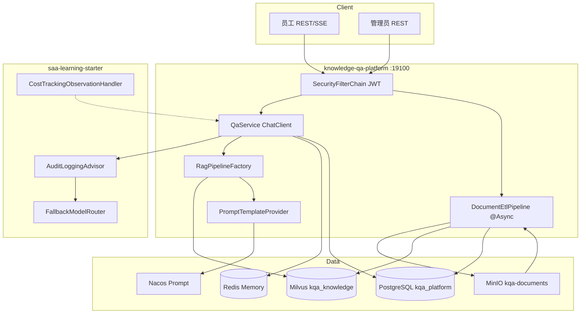

# Phase 4: 知识库问答平台 - Research

**Researched:** 2026-07-05
**Domain:** Spring AI Alibaba 1.1.2.2 企业 RAG 问答平台（Milvus + PostgreSQL + Redis + JWT + SSE）
**Confidence:** HIGH（Demo/starter 模式已验证）；MEDIUM（JWT 自签发、Nacos 发布、chunk overlap 与 1.1.2 API 对齐）

## Summary

Phase 4 是在 **已完成骨架**（`projects/knowledge-qa-platform`）上把 63+ 占位类替换为可运行实现。技术主干已在 Phase 3 Demo 与 `saa-learning-starter` 中验证：**Modular RAG** 抄 `examples/28-advanced-rag-demo/AdvancedRagConfig`；**Citation** 抄 `examples/29-hybrid-rag-demo/RagController` 的「共享 `VectorStoreDocumentRetriever` + 应用层组装」模式；**SSE** 抄 `examples/44-stream-demo/StreamController`；**Redis Memory** 抄 `examples/17-redis-memory-demo/MemoryConfig` + `RedisChatMemoryRepository`；**多模型降级** 抄 `examples/48-fallback-demo/FallbackController` + starter `FallbackModelRouter`；**Nacos Prompt 消费** 抄 `examples/08-prompt-nacos-demo/PromptNacosController`。

**首要阻塞项（Wave 0）：** 骨架 Java 源文件落在错误目录 `src/main/java/com\/flywhl\/...`（字面反斜杠路径），仅 `KnowledgeQaApplication.java` 在正确路径 `com/flywhl/saa/knowledgeqa/`。实现前必须 **整树迁移到标准 Maven 包路径**，否则 IDE/编译器行为不一致。

**Primary recommendation:** 严格按 CONTEXT D-04 五波顺序实现；每波 `mvn -f projects/knowledge-qa-platform/pom.xml compile` 门禁；RAG/ETL/Citation 复用 Demo 已验证类名与装配顺序，JWT 用 Spring Security 6.5 `NimbusJwtEncoder`/`NimbusJwtDecoder` 对称密钥自签发，Testcontainers 补 `testcontainers-redis` 依赖。

<user_constraints>
## User Constraints (from CONTEXT.md)

### Locked Decisions

#### 交付策略（棕地续作）
- **D-01:** 以 `projects/knowledge-qa-platform/README.md` 为 **接口与架构 SSOT**；占位类全部替换为可运行实现，删除「骨架占位」注释，零 TODO/伪代码。
- **D-02:** 不改动已锁定的骨架资产：`db/schema.sql` + `data.sql`、`application.yml` 键名、`docker-compose.override.yml`、`http/api.http` 路径与权限矩阵——实现必须对齐而非重设计契约。
- **D-03:** 父 POM `<modules>` 仍不挂载本项目；独立 `mvn -f projects/knowledge-qa-platform/pom.xml` 构建运行（与 examples 一致）。
- **D-04:** 实现波次按 README §9 迭代清单拆 plan（5 波），每波结束 `mvn compile` 门禁，末波全量验收：
  1. `config/*`（Security JWT / AI / VectorStore / Memory / MinIO / OpenAPI）
  2. `rag/*`（ETL 异步流水线 + RAG 管线 + Citation）
  3. `controller` + `service`（认证 / 问答 SSE / 会话 / 反馈）
  4. `admin/*`（知识 / Prompt / 用户 / 审计 / 看板）
  5. 测试 + HANDOFF §7 门禁 + curl UAT

#### 工程约定（继承 Phase 1–3，不可偏离）
- **D-05:** 包根 `com.flywhl.saa.knowledgeqa`，`@author flywhl`；复用 `saa-learning-common` + `saa-learning-starter`。
- **D-06:** 禁用废弃 API：`PromptChatMemoryAdvisor`、`CallAroundAdvisor`/`AdvisedRequest`/`AdvisedResponse`、`FunctionCallback`、可变 Options setter。
- **D-07:** 密钥仅环境变量；`MessageChatMemoryAdvisor` + 显式 `conversationId`；Options 一律 Builder。
- **D-08:** Entity/DTO/VO 字段与 `db/schema.sql` 列名对齐；JPA `ddl-auto=none`。

#### RAG 管线
- **D-09 ~ D-12:** Modular RAG（`RetrievalAugmentationAdvisor` + `RewriteQueryTransformer` + `VectorStoreDocumentRetriever`）；`kqa.rag.*` 参数；Milvus `kqa_knowledge`；Chunk 元数据与 `kb_chunk.milvus_pk` 一一对应。

#### Citation 与 SSE 协议
- **D-13 ~ D-15:** 同步/流式 citation 协议；`CitationPostProcessor` 从 Document metadata 组装；正文不内联脚注。

#### 文档入库（ETL）
- **D-16 ~ D-18:** 异步 ETL 状态机；MinIO→Tika→TokenTextSplitter→Milvus+PG；级联删除与 reindex。

#### 多模型 / 记忆 / Prompt
- **D-19 ~ D-22:** ChatClient Advisor 链；Redis ChatMemory；Prompt 三级回退 + Nacos 发布。

#### 安全与权限
- **D-23 ~ D-25:** OAuth2 Resource Server JWT；RBAC；`KnowledgeOpsTools` ADMIN 校验。

#### 后台域 / 测试
- **D-26 ~ D-31:** 五组 admin API；Testcontainers PG+Redis；HANDOFF §7；`04-UAT.md`。

### Claude's Discretion
- MapStruct Converter 与 Repository 查询方法的具体命名/派生查询。
- SSE 实现选用 `SseEmitter` 或 `Flux` 包装，只要事件类型契约不变。
- 单元测试覆盖率的细粒度分配（核心路径优先：Auth、ETL、RAG、QaService）。
- Knife4j 分组标签命名。

### Deferred Ideas (OUT OF SCOPE)
- 独立 Web 管理前端、文档级 ACL、专用 Rerank 服务、语义答案缓存、ES 混合检索。
</user_constraints>

<phase_requirements>
## Phase Requirements

| ID | Description | Research Support |
|----|-------------|------------------|
| REQ-phase-4-knowledge-qa | knowledge-qa-platform（19100）：MinIO+ETL、RAG+Citation、多模型、Redis Memory、Prompt、Security+审计、SSE；PG+Milvus+Redis | 本 RESEARCH 十节 + D-04 五波顺序 |
</phase_requirements>

## Architectural Responsibility Map

| Capability | Primary Tier | Secondary Tier | Rationale |
|------------|-------------|----------------|-----------|
| JWT 登录/鉴权 | API / Backend | — | `SecurityConfig` + `AuthService` 签发与校验；Resource Server 过滤器 |
| 文档上传/ETL | API / Backend | MinIO / Milvus / PostgreSQL | Controller 同步写元数据；`@Async` 流水线写向量与 chunk |
| RAG 检索增强 | API / Backend | Milvus | `RagPipelineFactory` + Advisor 链在 `QaService` 调用 |
| Citation 组装 | API / Backend | PostgreSQL（回查标题） | 应用层从 retriever 结果 + metadata，非模型生成 |
| SSE 流式输出 | API / Backend | — | `QaController` 返回 `text/event-stream` |
| 会话记忆 | API / Backend | Redis | `MessageChatMemoryAdvisor` + `RedisChatMemoryRepository` |
| Prompt 版本化 | API / Backend | PostgreSQL + Nacos | `PromptAdminController` 写 DB；`PromptPublishService` 推 Nacos |
| 审计/成本 | API / Backend | PostgreSQL + Micrometer | starter Advisor + `audit_log` 表 + `CostRecorder` |
| 运营看板 | API / Backend | PostgreSQL | 聚合 `qa_message`/`audit_log`/知识规模 |

## Standard Stack

### Core

| Library | Version | Purpose | Why Standard |
|---------|---------|---------|--------------|
| `spring-boot-starter-oauth2-resource-server` | Boot 3.5.16 BOM | JWT Resource Server | [CITED: Spring Security 6.5 JWT docs] 官方 Nimbus 集成，禁第三方 jjwt |
| `spring-ai-rag` | Spring AI 1.1.2 | `RetrievalAugmentationAdvisor` | [VERIFIED: `28-advanced-rag-demo`] 仓库已跑通 |
| `spring-ai-starter-vector-store-milvus` | Spring AI 1.1.2 | 向量库 | [VERIFIED: `24-milvus-demo`] + `application.yml` collection `kqa_knowledge` |
| `spring-ai-tika-document-reader` | Spring AI 1.1.2 | ETL 解析 | [CITED: `docs/tutorial/09-RAG.md` §9.2] |
| `spring-ai-alibaba-starter-nacos-prompt` | SAA 1.1.2.2 | Prompt 热更新消费 | [VERIFIED: `08-prompt-nacos-demo`] |
| `saa-learning-starter` | 1.0.0-SNAPSHOT | 审计/路由/成本 | [VERIFIED: `SaaLearningAutoConfiguration`] |
| `minio` | 父 POM BOM | 原始文档存储 | 骨架 `kqa.minio.*` 已锁定 |
| `knife4j-openapi3-jakarta-spring-boot-starter` | 4.5.0 | API 文档 | ADR-006 |

### Supporting

| Library | Version | Purpose | When to Use |
|---------|---------|---------|-------------|
| `org.testcontainers:postgresql` | Boot BOM | IT 业务库 | Wave 5 集成测试 |
| `org.testcontainers:junit-jupiter` | Boot BOM | Testcontainers 基座 | 同上 |
| `org.testcontainers:redis` | Boot BOM | IT Redis | **Wave 5 需新增 pom 依赖**（当前 pom 缺失） |
| `com.alibaba.nacos:nacos-client` | SAA 传递或显式 | `ConfigService.publishConfig` | `PromptPublishService` 推送 Nacos |

### Alternatives Considered

| Instead of | Could Use | Tradeoff |
|------------|-----------|----------|
| `RetrievalAugmentationAdvisor` | `QuestionAnswerAdvisor` | CONTEXT D-09 锁定 Modular RAG；27-demo 仅作对比 |
| 自写 JWT 库 | jjwt | CONTEXT + pom 注释禁止 jjwt |
| JDBC ChatMemory | Redis 自定义 Repository | CONTEXT D-20 锁定 Redis；17-demo 已验证普通 Redis List |

**Installation（Wave 5 测试补齐）：**
```bash
# 在 projects/knowledge-qa-platform/pom.xml 增加（版本由 Boot BOM 管理）：
#   org.testcontainers:redis
# Prompt 发布若 ConfigService 未传递注入，增加 nacos-client（与 spring.cloud.nacos 对齐）
```

## Package Legitimacy Audit

> 本阶段无新增 npm 包；Java 依赖均来自父 POM BOM + 已声明的 `knowledge-qa-platform/pom.xml`。[VERIFIED: `mvn -f projects/knowledge-qa-platform/pom.xml compile` 2026-07-05 通过]

| Package | Registry | slopcheck | Disposition |
|---------|----------|-----------|-------------|
| Spring AI / SAA / Boot starters | Maven Central | N/A (Java) | Approved — 父 POM 锁定 |
| `testcontainers-redis` | Maven Central | N/A | Approved — Wave 5 计划新增 |

**Packages removed due to slopcheck [SLOP] verdict:** none
**Packages flagged as suspicious [SUS]:** none

---

## 1. Modular RAG（RetrievalAugmentationAdvisor + Milvus + Citation metadata）

### 参考类（直接抄装配）

| 类 | 路径 | 职责 |
|----|------|------|
| `AdvancedRagConfig` | `examples/28-advanced-rag-demo/.../AdvancedRagConfig.java` | **SSOT 装配模板** |
| `RagController` | `examples/29-hybrid-rag-demo/.../RagController.java` | Citation 双通道：Advisor 问答 + `retriever.retrieve()` 取证据 |
| `MilvusController` | `examples/24-milvus-demo/.../MilvusController.java` | `vectorStore.add` / `similaritySearch` + metadata |
| `RagPipelineFactory` | `projects/.../rag/RagPipelineFactory.java` | 实现落点（占位→Bean 工厂） |
| `CitationPostProcessor` | `projects/.../rag/CitationPostProcessor.java` | metadata → `CitationVO` |

### `RagPipelineFactory` 推荐实现（对齐 D-09~D-12）

```java
// 模式来源：AdvancedRagConfig + KqaProperties
var rewriteTransformer = RewriteQueryTransformer.builder()
        .chatClientBuilder(chatClientBuilder.build().mutate())  // 必须 mutate，防 RAG 递归
        .promptTemplate(promptTemplateProvider.getQueryRewriteTemplate())  // query-rewrite.st / Nacos
        .build();

var documentRetriever = VectorStoreDocumentRetriever.builder()
        .vectorStore(vectorStore)
        .similarityThreshold(kqaProperties.getRag().getSimilarityThreshold())  // 0.35
        .topK(kqaProperties.getRag().getTopK())  // 5
        .build();

DocumentPostProcessor scoreTopK = (query, documents) -> documents.stream()
        .sorted(Comparator.comparing(Document::getScore,
                Comparator.nullsLast(Comparator.reverseOrder())))
        .limit(kqaProperties.getRag().getTopK())
        .toList();

RetrievalAugmentationAdvisor ragAdvisor = RetrievalAugmentationAdvisor.builder()
        .queryTransformers(rewriteTransformer)
        .documentRetriever(documentRetriever)
        .documentPostProcessors(scoreTopK)
        .queryAugmenter(ContextualQueryAugmenter.builder()
                .allowEmptyContext(false)  // D-10：无召回拒答
                .build())
        .build();
```

**Factory 应暴露：** `RetrievalAugmentationAdvisor ragAdvisor()`、`VectorStoreDocumentRetriever documentRetriever()`（供 Citation 复用，避免双检索不一致）。

### ETL 写入时的 metadata 契约（Citation 溯源 SSOT）

入库 `Document` 时必须写入（`DocumentEtlPipeline`）：

| metadata key | 来源 | 用途 |
|--------------|------|------|
| `documentId` | `kb_document.id` | `CitationVO.documentId` |
| `chunkId` | `kb_chunk.id`（落库后）或 seq | `CitationVO.chunkId` |
| `title` | `kb_document.title` | `CitationVO.documentTitle` |
| `seqNo` | chunk 序号 | 排序/预览 |
| Milvus `Document.getId()` | UUID | 写入 `kb_chunk.milvus_pk` |

**Citation 组装（抄 29-demo，扩展字段）：**

```java
// CitationPostProcessor — 模式来自 RagController.ask()
List<Document> evidences = documentRetriever.retrieve(new Query(question));
List<CitationVO> citations = evidences.stream()
        .map(doc -> new CitationVO(
                (Long) doc.getMetadata().get("documentId"),
                (String) doc.getMetadata().get("title"),
                (Long) doc.getMetadata().get("chunkId"),
                truncate(doc.getText(), 512),
                doc.getScore()))
        .toList();
```

[CITED: `docs/tutorial/09-RAG.md` §9.5] 应用层拼接优于模型自述引用。

---

## 2. Spring Security JWT Resource Server（Boot 3.5 自签发）

### 参考与依赖

- pom 已含 `spring-boot-starter-oauth2-resource-server`（Nimbus，无 jjwt）[VERIFIED: `knowledge-qa-platform/pom.xml`]
- 仓库内 **无现成 JWT Demo**；按 Spring Security 6.5 对称密钥模式实现 [CITED: Spring Security 6.5 JWT Reference — `NimbusJwtDecoder.withSecretKey`]

### 推荐 Bean（`SecurityConfig` + `JwtConfig` 或合并）

```java
@Bean
JwtEncoder jwtEncoder(@Value("${KQA_JWT_SECRET}") String secret) {
    SecretKey key = new SecretKeySpec(secret.getBytes(StandardCharsets.UTF_8), "HmacSHA256");
    return new NimbusJwtEncoder(new ImmutableSecret<>(key));
}

@Bean
JwtDecoder jwtDecoder(@Value("${KQA_JWT_SECRET}") String secret) {
    SecretKey key = new SecretKeySpec(secret.getBytes(StandardCharsets.UTF_8), "HmacSHA256");
    return NimbusJwtDecoder.withSecretKey(key).macAlgorithm(MacAlgorithm.HS256).build();
}

@Bean
SecurityFilterChain filterChain(HttpSecurity http) throws Exception {
    return http
            .csrf(csrf -> csrf.disable())
            .authorizeHttpRequests(auth -> auth
                    .requestMatchers("/api/auth/login", "/actuator/health").permitAll()
                    .requestMatchers("/api/admin/**").hasRole("ADMIN")
                    .requestMatchers("/api/**").hasAnyRole("ADMIN", "EMPLOYEE")
                    .anyRequest().authenticated())
            .oauth2ResourceServer(oauth2 -> oauth2
                    .jwt(jwt -> jwt.jwtAuthenticationConverter(jwtAuthenticationConverter())))
            .build();
}
```

### `AuthService.login` 签发（`JwtClaimsSet`）

```java
JwtClaimsSet claims = JwtClaimsSet.builder()
        .issuer(kqaProperties.getSecurity().getJwt().getIssuer())  // knowledge-qa-platform
        .subject(user.getUsername())
        .claim("uid", user.getId())
        .claim("role", user.getRole())  // ADMIN / EMPLOYEE
        .issuedAt(now)
        .expiresAt(now.plus(kqaProperties.getSecurity().getJwt().getAccessTokenTtl()))  // 2h
        .build();
String token = jwtEncoder.encode(
        JwtEncoderParameters.from(JwsHeader.with(MacAlgorithm.HS256).build(), claims))
        .getTokenValue();
```

### 密码与角色

- `DelegatingPasswordEncoder`：`data.sql` 的 `{noop}` + 新建用户 `BCryptPasswordEncoder`（D-24）
- `JwtAuthenticationConverter`：将 claim `role` 映射为 `ROLE_ADMIN` / `ROLE_EMPLOYEE`（`hasRole` 自动加 `ROLE_` 前缀）
- `@EnableMethodSecurity` + Controller `@PreAuthorize` 对齐 `http/api.http` 矩阵

**密钥：** 新增环境变量 `KQA_JWT_SECRET`（256-bit+），`application.yml` 用 `${KQA_JWT_SECRET}` 占位——**不写入 yml 默认值**。

---

## 3. 异步 ETL 流水线（MinIO + Tika + TokenTextSplitter + Milvus + kb_chunk）

### 参考类

| 类 | 路径 |
|----|------|
| ETL 模式 | `docs/tutorial/09-RAG.md` §9.2 `KnowledgeIngestionPipeline` |
| 异步 | `projects/.../config/AsyncConfig.java`、`DocumentEtlPipeline.java`、`IngestStatusTracker.java` |
| 状态字段 | `db/schema.sql` `kb_document.status` |

### 流程（D-16~D-18）

```
POST /api/admin/documents
  → MinIO putObject + kb_document(UPLOADED)
  → documentEtlPipeline.ingestAsync(documentId)  // @Async

ingestAsync:
  UPLOADED → PARSING
  → minioClient.getObject(bucket, minio_object)
  → new TikaDocumentReader(InputStreamResource).read()
  → TokenTextSplitter.builder().withChunkSize(512).build().split(docs)
  → [可选] 手动 overlap 64 token（见 Pitfall）
  → 每条 chunk: 补 metadata → vectorStore.add(batch)
  → 批量 insert kb_chunk(milvus_pk=Document.getId(), text_preview, seq_no)
  → kb_document INDEXED + chunk_count
  失败 → FAILED + fail_reason
```

### TokenTextSplitter 与 D-11 对齐

[VERIFIED: Spring AI 1.1.2 API — `TokenTextSplitter.Builder`] 仅有 `withChunkSize`，**无 `withChunkOverlap`**。

| 选项 | 做法 |
|------|------|
| A（推荐） | `withChunkSize(512)` + `DocumentEtlPipeline` 内 sliding-window 后处理实现 64 token overlap |
| B | 记录 TECH-DEBT，overlap 暂为 0，UAT 仍可通过 |

教程 §9.2 旧写法 `new TokenTextSplitter(800, 350, 5, 10000, true)` 仍可用，但 **Builder + withChunkSize(512)** 更清晰 [CITED: Spring AI 1.1.2 TokenTextSplitter.Builder]。

### 删除/重建

- DELETE：`vectorStore.delete(filter by documentId metadata)` + `kb_chunk` CASCADE（schema 已 ON DELETE CASCADE）
- REINDEX：删向量 → 状态回 UPLOADED → 重跑 `ingestAsync`

### UAT 数据缺口

`data.sql` 中 `INDEXED` 文档 **无 `kb_chunk` 行、无 Milvus 向量**。[ASSUMED] Wave 2 末需 `DemoKnowledgeSeeder`（启动时检测 INDEXED 且无 chunk 则 reindex）或 UAT 步骤含 `POST .../reindex`，否则 D-31 端到端问答无法仅靠 PG 元数据完成。

---

## 4. SSE 流式（ChatClient + citations 在 meta 事件）

### 参考类

| 类 | 路径 |
|----|------|
| SSE 协议 | `examples/44-stream-demo/.../StreamController.java` |
| Advisor 挂载 | `examples/44-stream-demo/.../StreamConfig.java` |
| 契约 | `projects/knowledge-qa-platform/README.md` §6、`http/api.http` §2.2 |

### 推荐实现（Flux + ServerSentEvent，与 44-demo 一致）

```java
@GetMapping(value = "/api/qa/stream", produces = MediaType.TEXT_EVENT_STREAM_VALUE)
public Flux<ServerSentEvent<String>> stream(
        @RequestParam String conversationId,
        @RequestParam String question,
        @AuthenticationPrincipal Jwt jwt) {

    List<CitationVO> citations = citationPostProcessor.collect(question);  // retriever.retrieve

    return chatClient.prompt()
            .advisors(a -> a.param(ChatMemory.CONVERSATION_ID, conversationId))
            .user(question)
            .stream()
            .chatResponse()
            .map(resp -> ServerSentEvent.<String>builder()
                    .event("message")
                    .data(nullToEmpty(resp.getResult().getOutput().getText()))
                    .build())
            .concatWith(Flux.defer(() -> {
                Usage usage = lastResponse.getMetadata().getUsage();  // 缓存最后一帧 ChatResponse
                MetaPayload meta = new MetaPayload(citations, usage);
                return Flux.just(
                    ServerSentEvent.<String>builder().event("meta")
                        .data(objectMapper.writeValueAsString(meta)).build(),
                    ServerSentEvent.<String>builder().event("done").data("").build());
            }))
            .onErrorResume(ex -> Flux.just(buildErrorEvent(ex)));  // 44-demo buildErrorEvent
}
```

**要点：**
- `meta` 在 **流结束前的单独事件**（非 `done` 内嵌）；`done` data 为空字符串（44-demo 惯例）
- `error` payload 序列化 `Result<Void>`（44-demo `CommonResultCode.INTERNAL_ERROR`）
- citations 在流开始前或结束后发送均可；推荐 **检索一次、meta 一次**，避免双检索时用 Factory 暴露的同一 `documentRetriever`

---

## 5. MessageChatMemoryAdvisor + Redis

### 参考类

| 类 | 路径 |
|----|------|
| `MemoryConfig` | `examples/17-redis-memory-demo/.../MemoryConfig.java` |
| `RedisChatMemoryRepository` | `examples/17-redis-memory-demo/.../repository/RedisChatMemoryRepository.java` |
| `MemoryController` | `examples/17-redis-memory-demo/.../MemoryController.java` — `ChatMemory.CONVERSATION_ID` |
| 落点 | `projects/.../config/ChatMemoryConfig.java` |

### 装配

```java
@Bean
ChatMemory chatMemory(RedisChatMemoryRepository repo, KqaProperties props) {
    return MessageWindowChatMemory.builder()
            .chatMemoryRepository(repo)
            .maxMessages(props.getMemory().getMaxMessages())  // 20
            .build();
}

@Bean
MessageChatMemoryAdvisor messageChatMemoryAdvisor(ChatMemory chatMemory) {
    return MessageChatMemoryAdvisor.builder(chatMemory)
            .order(AdvisorOrder.MEMORY)  // starter/AdvisorOrder.java
            .build();
}
```

### TTL（D-20：`ttl: 7d`）

17-demo **无 TTL**；在 `RedisChatMemoryRepository.saveAll` 末尾加：

```java
redis.expire(key(conversationId), memoryTtl);  // Duration.parse("7d") → seconds
```

Key 前缀沿用 demo：`saa:chat-memory:{conversationId}` 或改为 `kqa:chat-memory:`（全项目统一即可）。

### 删除会话

`ConversationService.delete`：`chatMemory.clear(conversationId)` 或 `repository.deleteByConversationId` + PG 归档/软删（README DELETE 语义）。

**注意：** 普通 Redis 即可（17-demo 明确不依赖 Redis Stack）；与 CLAUDE.md「Redis Stack」约束针对 **向量** 场景，本会话记忆不受影响 [VERIFIED: `17-redis-memory-demo` README/类注释]。

---

## 6. FallbackModelRouter + AuditLoggingAdvisor + CostRecorder

### Starter 自动装配 [VERIFIED: `SaaLearningAutoConfiguration.java`]

| Bean | 条件 | 说明 |
|------|------|------|
| `FallbackModelRouter` | `@ConditionalOnBean(dashScopeChatModel, deepSeekChatModel)` | `saa.learning.primary-model` / `fallback-model` |
| `AuditLoggingAdvisor` | `audit-enabled=true` | **不会**自动挂到 ChatClient |
| `CostTrackingObservationHandler` | `cost-tracking.enabled=true` | 观测 `gen_ai.usage.*` → `CostRecorder` |

### `AiClientConfig` 推荐模式（合成 47/48/44-demo）

```java
@Bean
ChatClient qaChatClient(
        ModelRouter modelRouter,
        MessageChatMemoryAdvisor memoryAdvisor,
        RetrievalAugmentationAdvisor ragAdvisor,
        AuditLoggingAdvisor auditAdvisor,
        PromptTemplateProvider prompts) {

    ChatModel model = modelRouter.route();
    return ChatClient.builder(model)
            .defaultSystem(prompts.getQaSystemPrompt())
            .defaultAdvisors(
                    auditAdvisor,      // order: AdvisorOrder.AUDIT
                    memoryAdvisor,     // AdvisorOrder.MEMORY
                    ragAdvisor)        // AdvisorOrder.RETRIEVAL
            .build();
}
```

### 降级调用（抄 `FallbackController.chat`）

```java
ChatModel model = modelRouter.route();
try {
    return call(model, request);
} catch (Exception ex) {
    modelRouter.reportFailure(model, ex);
    return call(modelRouter.route(), request);
}
```

### 成本与看板

- Token 用量：`ChatResponse.getMetadata().getUsage()` [VERIFIED: `04-chat-demo/ChatController.java`]
- 全局成本：`CostTrackingObservationHandler` → `LoggingCostRecorder`（可替换写 DB）
- `DashboardStatsVO`：聚合 `qa_message` token 字段 + `CostRecorder` 日志/SQL + 反馈满意度 + `kb_document`/`kb_chunk` count

---

## 7. Nacos Prompt 发布模式

### 消费侧 [VERIFIED: `08-prompt-nacos-demo`]

- 依赖：`spring-ai-alibaba-starter-nacos-prompt`
- 配置：`spring.ai.nacos.prompt.template.enabled=true`（`application.yml` 已启用）
- API：`com.alibaba.cloud.ai.prompt.ConfigurablePromptTemplateFactory`
- Data ID：**固定** `spring.ai.alibaba.configurable.prompt`，Group `DEFAULT_GROUP` [CITED: `docs/tutorial/05-Prompt.md` §5.6]

### `PromptTemplateProvider` 三级回退（D-21）

```
1. promptTemplateFactory.getTemplate("qa-system")  // Nacos 热更新
2. promptTemplateRepository.findByTemplateKeyAndStatus(key, PUBLISHED)
3. classpath:prompts/qa-system.st / query-rewrite.st
4. promptTemplateFactory.create(name, defaultContent, defaults)  // 08-demo 强制兜底
```

### `PromptPublishService` 推送

1. DB：`prompt_template` 状态 DRAFT→PUBLISHED，旧 PUBLISHED→ARCHIVED
2. 组装 **全量** JSON 数组（所有 PUBLISHED 模板）：

```json
[
  {"name": "qa-system", "template": "..."},
  {"name": "query-rewrite", "template": "..."}
]
```

3. 调用 Nacos `ConfigService.publishConfig("spring.ai.alibaba.configurable.prompt", "DEFAULT_GROUP", json, "json")`

[ASSUMED] 需注入 `ConfigService`（`NacosConfigManager.getConfigService()` 或 `NacosFactory.createConfigService(properties)`）；若 `nacos-prompt` starter 未暴露 Bean，Wave 4 显式加 `nacos-client` 依赖并 `@Configuration` 创建。

**Prompt 与 D-15 冲突：** `data.sql` / `prompts/qa-system.st` 含「按 [1][2] 标注」——实现时 Provider 应 **去掉内联脚注指令**，与 API citations 字段一致。

---

## 8. Testcontainers（PostgreSQL + Redis）

### 现状

- pom 已有：`spring-boot-testcontainers`、`testcontainers-junit-jupiter`、`testcontainers-postgresql`
- **缺失：** `org.testcontainers:redis`（Wave 5 必须添加）
- 测试类占位：`KnowledgeQaApplicationTests.java`（空壳）

### 推荐基类（模式来自 `docs/tutorial/19-BestPractice.md`）

```java
@SpringBootTest
@Testcontainers
class KnowledgeQaIntegrationTest {

    @Container
    static PostgreSQLContainer<?> postgres = new PostgreSQLContainer<>("pgvector/pgvector:pg16")
            .withInitScript("schema.sql");  // 或 Flyway/Test SQL

    @Container
    static GenericContainer<?> redis = new GenericContainer<>("redis:7-alpine")
            .withExposedPorts(6379);

    @DynamicPropertySource
    static void props(DynamicPropertyRegistry registry) {
        registry.add("spring.datasource.url", postgres::getJdbcUrl);
        registry.add("spring.datasource.username", postgres::getUsername);
        registry.add("spring.datasource.password", postgres::getPassword);
        registry.add("spring.data.redis.host", redis::getHost);
        registry.add("spring.data.redis.port", () -> redis.getMappedPort(6379));
        // Milvus/AI：@MockBean VectorStore + ChatModel 或 @TestPropertySource 指向假 URL
    }
}
```

### 分层策略（D-28~D-29）

| 层级 | 命令 | 门控 |
|------|------|------|
| 单元 | `mvn -f projects/knowledge-qa-platform/pom.xml test` | 无 Key/Docker 全绿 |
| IT（PG+Redis） | 同上 | 需 Docker |
| 真实模型 | `@EnabledIfEnvironmentVariable(AI_DASHSCOPE_API_KEY)` | 抄 `44-stream-demo/StreamDemoApplicationIT` |
| Milvus IT | 可选 `@EnabledIfEnvironmentVariable` + 文档说明 | 不阻塞 CI |

---

## 9. API 陷阱 / SAA 1.1.2.2 Gotchas（Phase 3 沉淀）

| # | 现象 | 根因 | 修复 |
|---|------|------|------|
| G1 | 查询改写死循环 / OOM | `RewriteQueryTransformer` 用了带 RAG Advisor 的 Builder | **必须** `chatClientBuilder.build().mutate()` [VERIFIED: `AdvancedRagConfig` L35-37] |
| G2 | 无审计日志 | 以为 starter 会自动挂 Advisor | 显式 `defaultAdvisors(auditLoggingAdvisor)` [VERIFIED: `StreamConfig` 注释] |
| G3 | Memory 串会话 | 未传 `conversationId` | `.advisors(a -> a.param(ChatMemory.CONVERSATION_ID, id))` [VERIFIED: `MemoryController` L27] |
| G4 | 编译通过 IDE 报红 | 骨架在 `com\/flywhl\/` 错误目录 | Wave 0 迁移至 `com/flywhl/saa/knowledgeqa/` |
| G5 | chunk overlap 无效 | Spring AI **1.1.2 无 overlap API** | 手动 sliding 或记录限制 [VERIFIED: docs.spring.io 1.1.2 TokenTextSplitter] |
| G6 | Milvus 连接失败 | 冷启动 30~60s | compose health 后再启动 app [VERIFIED: HANDOFF §8] |
| G7 | 28-demo 有 milvus username/password | kqa `application.yml` 无此项 | 以 kqa yml 为准；若连接失败再对齐 docker compose |
| G8 | `QuestionAnswerAdvisor` import 路径 | 旧包 `chat.client.advisor.vectorstore` | 使用 `spring-ai-rag` 的 `RetrievalAugmentationAdvisor` |
| G9 | Prompt 包名 | 教程历史包名 | SAA 1.1.2.2 用 `com.alibaba.cloud.ai.prompt.*` [VERIFIED: `PromptNacosController` L17] |
| G10 | data.sql INDEXED 无向量 | 仅 PG 元数据 | Seeder 或 reindex UAT 步骤 |
| G11 | Options setter | 2.0 破坏点 | 一律 Builder；跑 `spring-ai-2-readiness.sh` |
| G12 | `@Tool` ADMIN | 角色在 ToolContext | 抄 `15-tool-security-demo/KnowledgeAdminTools.roleOf` |

---

## 10. 推荐实现顺序（D-04 五波 + Wave 0）

### Wave 0（编译前置，不计入 README §9 但阻塞一切）

1. 将 `src/main/java/com\/flywhl\/...` **63 个文件**迁移到 `com/flywhl/saa/knowledgeqa/`
2. 删除错误目录；确认 `@ConfigurationPropertiesScan` 能扫到 `KqaProperties`
3. `KqaProperties` + 各 `@Configuration` 加 `@Component`/`@Service` 注解
4. `mvn compile` 绿

### 波 1 — `config/*`

| 顺序 | 类 | 参考 |
|------|-----|------|
| 1 | `KqaProperties` | `application.yml` 键 |
| 2 | `SecurityConfig` + JWT Beans + `UserDetailsService` | §2 本 RESEARCH |
| 3 | `MinioConfig` | MinIO Java SDK |
| 4 | `VectorStoreConfig` | Milvus auto-config + `kqa.rag.*` 文档化 |
| 5 | `ChatMemoryConfig` | 17-demo |
| 6 | `AsyncConfig` | `@EnableAsync` + 线程池 bean name 供 `@Async("...")` |
| 7 | `AiClientConfig` | §1+§5+§6 |
| 8 | `OpenApiConfig` | Knife4j + Bearer JWT |
| 9 | `@Entity`/`Repository` 扫描验证 | `ddl-auto=none` 启动不报错 |

**门禁：** `mvn compile`；`curl /actuator/health`；login 返回 JWT

### 波 2 — `rag/*`

| 顺序 | 类 |
|------|-----|
| 1 | `RagPipelineFactory` |
| 2 | `CitationPostProcessor` |
| 3 | `DocumentEtlPipeline` + `IngestStatusTracker` |
| 4 | `DemoKnowledgeSeeder`（可选但 UAT 强烈建议） |
| 5 | admin 文档 service 调 ETL |

**门禁：** 上传→INDEXED；Milvus 有向量；`kb_chunk` 有行

### 波 3 — `controller` + `service`

| 顺序 | 类 |
|------|-----|
| 1 | `AuthService` / `AuthController` |
| 2 | `QaService`（sync + stream） |
| 3 | `QaController` / `FeedbackController` |
| 4 | `ConversationService` / `ConversationController` |

**门禁：** `http/api.http` §1~2 curl；SSE 四事件

### 波 4 — `admin/*`

| 顺序 | 域 |
|------|-----|
| 1 | 知识 `DocumentAdminController` |
| 2 | Prompt + `PromptPublishService` |
| 3 | 用户 / 审计 / 看板 |
| 4 | `KnowledgeOpsTools`（可选） |

### 波 5 — 测试 + 门禁

1. 添加 `testcontainers-redis`；补 IT + `@EnabledIfEnvironmentVariable` 用例
2. `mvn -f projects/knowledge-qa-platform/pom.xml clean install`
3. `bash scripts/version-audit.sh` + `bash scripts/spring-ai-2-readiness.sh .`
4. 产出 `04-UAT.md`

## Architecture Patterns

### System Architecture Diagram



### Recommended Project Structure

```
com/flywhl/saa/knowledgeqa/
├── config/          # Wave 1：Security, AiClient, VectorStore, Memory, MinIO, Async, OpenAPI, KqaProperties
├── rag/             # Wave 2：RagPipelineFactory, CitationPostProcessor, DocumentEtlPipeline, IngestStatusTracker
├── service/         # Wave 3：Auth, Qa, Conversation, Feedback
├── controller/      # Wave 3：对应 REST
├── admin/           # Wave 4：五组后台
├── prompt/          # Wave 4：PromptTemplateProvider, PromptPublishService
├── tool/            # Wave 4：KnowledgeOpsTools
├── model/           # entity/dto/vo — 对齐 schema.sql
├── repository/      # JPA
└── mapper/          # MapStruct
```

### Anti-Patterns to Avoid

- **双检索不一致：** Citation 用 retriever A、Advisor 内嵌 retriever B → 必须 Factory 单例 retriever
- **在 RewriteQueryTransformer 上用完整 ChatClient（含 RAG）** → G1 递归
- **Prompt 要求 [1][2] 脚注 + API citations** → 违反 D-15
- **IT 强依赖 Milvus** → 阻塞无 Docker CI（D-28）

## Don't Hand-Roll

| Problem | Don't Build | Use Instead | Why |
|---------|-------------|-------------|-----|
| JWT 解析/签名 | jjwt 自实现 | `NimbusJwtEncoder`/`NimbusJwtDecoder` | Boot BOM 管理、算法安全 |
| Naive RAG | 手写 prompt 拼 context | `RetrievalAugmentationAdvisor` | 查询改写/空上下文策略 |
| 会话记忆存储 | HashMap | `MessageWindowChatMemory` + Redis Repository | 驱逐策略/工具调用完整性 |
| 模型熔断 | 自写 CircuitBreaker | `FallbackModelRouter` | starter 已测 |
| Prompt 轮询 Nacos | 定时 pull | `ConfigurablePromptTemplateFactory` | SAA Listener 推送 |
| 成本采集 | 解析响应字符串 | `CostTrackingObservationHandler` | `gen_ai.usage.*` 标准指标 |

## Common Pitfalls

### Pitfall 1: 骨架目录字面量 `com\/flywhl\/`
**What goes wrong:** 63 类不在标准包路径，IDE/JDT 与 Maven 行为分裂  
**How to avoid:** Wave 0 整树迁移  
**Warning signs:** 仅 `KnowledgeQaApplication` 在正确路径

### Pitfall 2: Spring AI 1.1.2 无 chunk overlap
**What goes wrong:** D-11 `chunk-overlap=64` 无法一行配置  
**How to avoid:** ETL 内 sliding window 或 Assumptions Log 确认  
**Warning signs:** 编译无 `withChunkOverlap`

### Pitfall 3: 演示文档无向量
**What goes wrong:** UAT 提问无 citation  
**How to avoid:** Seeder 或 admin reindex + MinIO 演示文件  
**Warning signs:** `kb_chunk` 表空但 `kb_document.status=INDEXED`

### Pitfall 4: Advisor 顺序错误
**What goes wrong:** Memory 在 RAG 之后，改写看不到历史  
**How to avoid:** `AdvisorOrder.AUDIT < MEMORY < RETRIEVAL` [VERIFIED: `AdvisorOrder.java`]

## Code Examples

### Modular RAG（来源：28-advanced-rag-demo）

```java
// Source: examples/28-advanced-rag-demo/.../AdvancedRagConfig.java
var rewriteTransformer = RewriteQueryTransformer.builder()
        .chatClientBuilder(chatClientBuilder.build().mutate())
        .build();
var ragAdvisor = RetrievalAugmentationAdvisor.builder()
        .queryTransformers(rewriteTransformer)
        .documentRetriever(documentRetriever)
        .documentPostProcessors(scoreReranker)
        .queryAugmenter(ContextualQueryAugmenter.builder().allowEmptyContext(false).build())
        .build();
```

### SSE（来源：44-stream-demo）

```java
// Source: examples/44-stream-demo/.../StreamController.java
return chatClient.prompt().user(message).stream().chatResponse()
        .map(r -> ServerSentEvent.<String>builder().event("message").data(text).build())
        .concatWith(Flux.just(ServerSentEvent.<String>builder().event("done").data("").build()))
        .onErrorResume(ex -> Flux.just(buildErrorEvent(ex)));
```

### Redis Memory（来源：17-redis-memory-demo）

```java
// Source: examples/17-redis-memory-demo/.../MemoryController.java
chatClient.prompt()
        .advisors(a -> a.param(ChatMemory.CONVERSATION_ID, userId))
        .user(message)
        .call()
        .content();
```

## State of the Art

| Old Approach | Current Approach | When Changed | Impact |
|--------------|------------------|--------------|--------|
| `QuestionAnswerAdvisor` | `RetrievalAugmentationAdvisor` | Spring AI 1.1 Modular RAG | kqa 必须用后者 |
| `PromptChatMemoryAdvisor` | `MessageChatMemoryAdvisor` | Spring AI 1.1 | 禁用旧 API |
| TokenTextSplitter 无 overlap | overlap in 1.1.3+ PR #4054 | post-1.1.2 | 1.1.2 需手动 overlap |
| jjwt | Nimbus via Boot | Boot 3.x | pom 已对齐 |

## Assumptions Log

| # | Claim | Section | Risk if Wrong |
|---|-------|---------|---------------|
| A1 | `ConfigService.publishConfig` 可通过 nacos-client 注入 | §7 | Prompt 发布需 spike |
| A2 | Wave 2 Seeder 补齐 Milvus 演示向量 | §3 | UAT 阻塞 |
| A3 | 手动 64-token overlap 算法足够 | §3 | 检索质量略降 |
| A4 | `KQA_JWT_SECRET` 为新环境变量名 | §2 | 需同步 `setup-env.sh` |

## Open Questions (RESOLVED)

1. **MinIO 演示文件是否已放入 bucket？** → **RESOLVED**
   - Decision: `kqa-minio-init` 仅建空 bucket，不上传实体文件；`data.sql` INDEXED 文档由 **DemoKnowledgeSeeder**（04-03）在启动时从 classpath sample 或 reindex 灌入 Milvus；UAT 亦可通过 admin 上传流验证。

2. **Nacos 发布是否需独立 `nacos-client`？** → **RESOLVED**
   - Decision: 不新增独立 `nacos-client` 依赖；`spring-ai-alibaba-starter-nacos-prompt` + `spring-cloud-starter-alibaba-nacos-config`（Boot BOM 传递）提供 `ConfigService`；04-05 `PromptPublishService` 首任务 compile 验证 `ConfigService` 可注入。

## Environment Availability

| Dependency | Required By | Available | Version | Fallback |
|------------|------------|-----------|---------|----------|
| Java | 编译/运行 | ✓ | 21.0.2 | — |
| Maven | 构建 | ✓ | 3.9.14 | — |
| Docker | Testcontainers/Milvus | ✓ | 29.4.0 (OrbStack) | Milvus IT 跳过 |
| PostgreSQL | 业务库 | ✗ (未运行) | — | compose `profile kqa` |
| Redis | Memory | ✗ | — | compose `profile core` |
| Milvus | 向量 | ✗ | — | 冷启动 30~60s |
| AI_DASHSCOPE_API_KEY | 模型 IT | 未检测 | — | `@EnabledIfEnvironmentVariable` 跳过 |

**Missing dependencies with no fallback:** 生产运行需 compose 全 profile  
**Missing dependencies with fallback:** Milvus IT 可 Mock；模型 IT 可跳过

## Validation Architecture

### Test Framework

| Property | Value |
|----------|-------|
| Framework | JUnit 5 + AssertJ + Spring Boot Test 3.5.16 |
| Config file | 无独立配置 — Wave 5 建 `src/test/java/.../support/` |
| Quick run command | `mvn -f projects/knowledge-qa-platform/pom.xml test` |
| Full suite command | `mvn -f projects/knowledge-qa-platform/pom.xml clean install` |

### Phase Requirements → Test Map

| Req ID | Behavior | Test Type | Automated Command | File Exists? |
|--------|----------|-----------|-------------------|-------------|
| REQ-phase-4-knowledge-qa | JWT login | integration | `... test -Dtest=AuthIntegrationTest` | ❌ Wave 5 |
| REQ-phase-4-knowledge-qa | PG+Redis 上下文加载 | integration | `... test -Dtest=KnowledgeQaApplicationTests` | ❌ Wave 5 |
| REQ-phase-4-knowledge-qa | ask/stream 真实模型 | integration | `@EnabledIfEnvironmentVariable` IT | ❌ Wave 5 |
| REQ-phase-4-knowledge-qa | FallbackModelRouter | unit | 复用 starter 已有测试 | ✅ starter |

### Sampling Rate

- **Per task commit:** `mvn -f projects/knowledge-qa-platform/pom.xml test -Dtest=<NewTest>`
- **Per wave merge:** `mvn -f projects/knowledge-qa-platform/pom.xml compile`
- **Phase gate:** `clean install` + HANDOFF §7 scripts

### Wave 0 Gaps

- [ ] 迁移 `com\/flywhl\/` → 标准包路径
- [ ] `testcontainers-redis` pom 依赖
- [ ] `AuthIntegrationTest` / `QaServiceTest` / `StreamIT`
- [ ] `@DynamicPropertySource` PG+Redis 基类

## Security Domain

### Applicable ASVS Categories

| ASVS Category | Applies | Standard Control |
|---------------|---------|------------------|
| V2 Authentication | yes | JWT HS256 + `DelegatingPasswordEncoder` |
| V3 Session Management | yes | 无服务端 session；JWT TTL 2h；Redis conversation 隔离 |
| V4 Access Control | yes | `@PreAuthorize` ADMIN/EMPLOYEE + ToolContext |
| V5 Input Validation | yes | Jakarta Validation on DTO + multipart 50MB 上限 |
| V6 Cryptography | yes | Nimbus MAC；密钥 env only |

### Known Threat Patterns

| Pattern | STRIDE | Standard Mitigation |
|---------|--------|---------------------|
| 硬编码 JWT/API 密钥 | Spoofing | 环境变量 [D-07] |
| 员工跨会话读记忆 | Elevation | 强制 `conversationId` + 用户归属校验 |
| 未授权 admin 操作 | Elevation | JWT role + `@PreAuthorize("hasRole('ADMIN')")` |
| Prompt 注入 | Tampering | 检索拒答 + 空上下文 false |
| 上传恶意文档 | Tampering | Tika 解析 + 文件类型/大小限制 |

## Project Constraints (from .cursor/rules/ & saa-conventions)

- 包根 `com.flywhl.saa.knowledgeqa`，`@author flywhl`
- 版本：Boot 3.5.16 / SAA 1.1.2.2 / Spring AI 1.1.2 — 子模块不写死版本
- 禁用 API 列表见 D-06
- Testcontainers + `@EnabledIfEnvironmentVariable` 测试约定
- 复用 common/starter，不重复 Result/审计/路由/成本

## Sources

### Primary (HIGH confidence)
- `examples/28-advanced-rag-demo/AdvancedRagConfig.java` — Modular RAG 装配
- `examples/29-hybrid-rag-demo/RagController.java` — Citation 双通道
- `examples/44-stream-demo/StreamController.java` — SSE 协议
- `examples/17-redis-memory-demo/MemoryConfig.java` — Redis Memory
- `examples/48-fallback-demo/FallbackController.java` — 降级模式
- `examples/08-prompt-nacos-demo/PromptNacosController.java` — Nacos Prompt 消费
- `starter/.../SaaLearningAutoConfiguration.java` — Starter 装配条件
- [Spring Security 6.5 JWT Reference](https://docs.spring.io/spring-security/reference/servlet/oauth2/resource-server/jwt.html) — NimbusJwtDecoder
- [Spring AI 1.1.2 TokenTextSplitter API](https://docs.spring.io/spring-ai/docs/1.1.2/api/org/springframework/ai/transformer/splitter/TokenTextSplitter.html)

### Secondary (MEDIUM confidence)
- `docs/tutorial/09-RAG.md` — ETL + RAG 教程
- `docs/tutorial/05-Prompt.md` — Nacos Data ID JSON 格式
- `docs/tutorial/19-BestPractice.md` — Testcontainers 模式
- [java2ai.com Nacos Prompt 博客](https://java2ai.com/en/blog/spring-ai-dynamic-prompt-nacos/) — 发布 JSON 格式

### Tertiary (LOW — 待 Wave 4 验证)
- Nacos `ConfigService.publishConfig` 注入方式 [ASSUMED]

## Metadata

**Confidence breakdown:**
- Standard stack: **HIGH** — Demo + pom + compile 验证
- Architecture: **HIGH** — CONTEXT + README SSOT
- Pitfalls: **HIGH** — 1.1.2 API + 骨架目录实测

**Research date:** 2026-07-05  
**Valid until:** 2026-08-05（Spring AI 1.1.x 稳定）；JWT/Nacos 30 天
