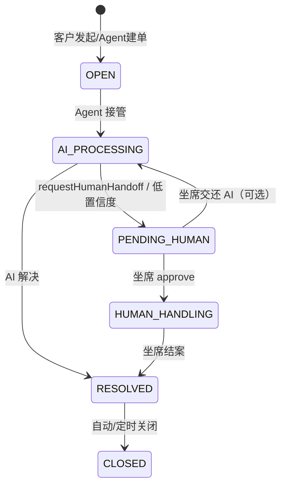

# Phase 6: 智能客服平台 - Research

**Researched:** 2026-07-06
**Domain:** Spring AI Alibaba 1.1.2.2 智能客服中台（RoutingAgent + Supervisor + FAQ 混合检索 + 工单 HITL + 运营看板）
**Confidence:** HIGH（Agent/RAG/可观测模式已在 Demo + Phase 4/5 验证）；MEDIUM（Handoffs 语义映射、model_profile CRUD、Grafana compose 叠加为设计推导）

## Summary

Phase 6 是 **greenfield** 企业项目三 `smart-cs-platform`（端口 **19300**，包根 `com.flywhl.saa.smartcs`），无既有骨架。应复用 Phase 4（`knowledge-qa-platform`）的 PostgreSQL + Milvus + Redis 记忆 + JWT + Prompt/Nacos + 运营看板模式，以及 Phase 5（`office-agent-assistant`）的 Agent 编排与审批域状态机思路，再叠加 Demo **41/42/37/26/25/45** 中已验证的 API 真写法。

**Agent 栈映射（SAA 1.1.2.2 JAR 真源，非教程伪 API）：**

| 蓝图术语 | 实现类 / 模式 | 参考 |
|---------|--------------|------|
| RoutingAgent | `LlmRoutingAgent.builder().model().systemPrompt().subAgents()` | `41-multi-agent-demo/MultiAgentConfig` |
| Supervisor | `ReactAgent` 总控 + `AgentTool.create(subAgent)` | `42-supervisor-demo/OfficeSupervisorConfig` |
| Handoffs（控制权转移） | 子 Agent `@Tool escalateToHuman` + 工单状态 `PENDING_HUMAN` + `HumanInTheLoopHook` 恢复 | `37-agent-hitl-demo` + 业务状态机（教程 §15.8 语义，**无** `HandoffsAgent` 类） |
| 并行子智能体 | `ParallelAgent` + `.mergeOutputKey()` | `41-multi-agent-demo` parallelSearch |

**FAQ 三件套：** Redis Stack 语义缓存（`25-redis-vector-demo`，threshold 建议 0.95）→ Milvus Modular RAG（`knowledge-qa-platform/rag/*`）→ ES 全文 + RRF 混合（`26-es-hybrid-demo/HybridSearchService`）。三者串联为 `FaqAnswerService`：缓存命中秒回，未命中走 hybrid 检索 + RAG，成功后回写缓存。

**工单 + 人工接管：** PostgreSQL 工单域模型 + `ticket_event` 审计轨迹；Agent 侧用 `HumanInTheLoopHook.approvalOn(...)`（**禁止** `interruptBefore`）；会话恢复用 `RunnableConfig.threadId` + `addHumanFeedback().resume()`（`37-agent-hitl-demo/HitlController`）。

**运营：** Micrometer `gen_ai.usage.*` + starter `CostRecorder`（`45-observability-demo`）+ `DashboardStatsService` 聚合模式（`knowledge-qa-platform`）；Grafana/Prometheus 建议在本项目 `docker-compose.override.yml` 增加可选 `monitor` profile（基座 `docker/docker-compose.yml` **无** Grafana，需项目叠加）。

**Primary recommendation:** 按六波交付（地基 → config/三库 → FAQ/RAG → Agent 编排 → 会话/工单/HITL → admin/看板/测试）；Agent 一律 JAR 真 API；双 Redis（6379 会话 + 6380 Stack 语义缓存）；DDL 一次设计齐全避免 Phase 4 式返工。

<phase_requirements>
## Phase Requirements

| ID | Description | Research Support |
|----|-------------|------------------|
| REQ-phase-6-smart-cs | smart-cs-platform（19300）：FAQ 秒答、多智能体、工单、人工接管、运营看板；Routing+Supervisor+Handoffs；Milvus+Redis 语义缓存+ES；HITL；Micrometer/Prometheus/Grafana；Nacos；PG+Milvus+Redis+ES | 本 RESEARCH 全节 + 六波拆解 + Analog 映射表 |
</phase_requirements>

## Architectural Responsibility Map

| Capability | Primary Tier | Secondary Tier | Rationale |
|------------|-------------|----------------|-----------|
| 会话网关 SSE | API / Backend | Redis | `ChatController` 返回 `text/event-stream`；`MessageChatMemoryAdvisor` 管 conversationId |
| 意图路由 RoutingAgent | API / Backend | — | `CsOrchestratorService` 调用 `LlmRoutingAgent.invoke` |
| 多 Agent 协作 Supervisor | API / Backend | — | `ReactAgent` + `AgentTool.create` 调度订单/售后/技术子 Agent |
| Handoffs / 人工升级 | API / Backend | PostgreSQL | `@Tool` 触发工单 `PENDING_HUMAN`；HITL 恢复同一 threadId |
| FAQ 语义缓存 | API / Backend | Redis Stack (6380) | `VectorStore` similaritySearch + TTL metadata |
| Milvus RAG | API / Backend | Milvus | `RetrievalAugmentationAdvisor` + collection `scs_faq` |
| ES 混合检索 | API / Backend | Elasticsearch | 应用层 RRF（Spring AI 1.1.2 无内置 Hybrid API） |
| 工单 CRUD / 状态机 | API / Backend | PostgreSQL | `TicketService` 校验合法转移；`ticket_event` 留痕 |
| 模型/Prompt 后台 | API / Backend | PostgreSQL + Nacos | `model_profile` CRUD + `PromptPublishService` 推 Nacos |
| 运营看板 | API / Backend | PostgreSQL + Micrometer | 聚合 `cs_message`、反馈、工单、token 成本 |
| Prometheus/Grafana | CDN / Static（可选 compose） | API Actuator | `/actuator/prometheus` 抓取；Grafana 只读展示 |

## Project Constraints (from CLAUDE.md / saa-conventions)

- 包根 `com.flywhl.saa.smartcs`，`@author flywhl`；端口 **19300**
- 父 POM 双 BOM；子模块零版本号；**不**挂父 POM `<modules>`（独立 `mvn -f projects/smart-cs-platform/pom.xml`）
- 复用 `saa-learning-common` + `saa-learning-starter`（审计/路由/成本）
- 禁用：`PromptChatMemoryAdvisor`、`CallAroundAdvisor`/`AdvisedRequest`、`FunctionCallback`、可变 Options setter
- 密钥仅环境变量；Embedding 统一 `text-embedding-v3` **dimensions=1024**
- Redis 向量/语义缓存必须用 `redis/redis-stack-server`（**非** core `redis:7.4-alpine`）
- 测试：Testcontainers + `@EnabledIfEnvironmentVariable(AI_DASHSCOPE_API_KEY)`
- HANDOFF §7 质量门禁：真实编译、curl、version-audit、spring-ai-2-readiness、零 TODO

## Standard Stack

### Core

| Library | Version | Purpose | Why Standard |
|---------|---------|---------|--------------|
| `saa-learning-common` | 1.0.0-SNAPSHOT | Result/异常 | 三项目统一协议 |
| `saa-learning-starter` | 1.0.0-SNAPSHOT | AuditLoggingAdvisor、FallbackModelRouter、CostRecorder | Phase 4/5 已用 |
| `spring-ai-alibaba-starter-dashscope` | SAA 1.1.2.2 BOM | Chat + Embedding | ADR-003 |
| `spring-ai-starter-model-deepseek` | Spring AI 1.1.2 | 备用 ChatModel | starter 降级路由 |
| `spring-ai-alibaba-agent-framework` | SAA 1.1.2.2 | ReactAgent / FlowAgent / HITL | Demo 35~42 真源 |
| `spring-ai-rag` | Spring AI 1.1.2 | RetrievalAugmentationAdvisor | Phase 4 已验证 |
| `spring-ai-starter-vector-store-milvus` | Spring AI 1.1.2 | FAQ 向量库 | `24-milvus-demo` |
| `spring-ai-starter-vector-store-elasticsearch` | Spring AI 1.1.2 | ES 向量 + 全文通道 | `26-es-hybrid-demo` |
| `spring-ai-alibaba-starter-nacos-prompt` | SAA 1.1.2.2 | Prompt 热更新消费 | `08-prompt-nacos-demo` |
| `spring-boot-starter-oauth2-resource-server` | Boot 3.5.16 | JWT | Phase 4 Security 模式 |
| `knife4j-openapi3-jakarta-spring-boot-starter` | 4.5.0 | OpenAPI | ADR-006 |

### Supporting

| Library | Version | Purpose | When to Use |
|---------|---------|---------|-------------|
| `com.alibaba.nacos:nacos-client` | SAA 传递 | `ConfigService.publishConfig` | Prompt/模型配置推送 |
| `org.testcontainers:postgresql` | Boot BOM | IT 业务库 | Wave 6 |
| `org.testcontainers:elasticsearch` | Boot BOM | IT ES hybrid | Wave 6（可选，或 Mock RestClient） |
| `org.testcontainers:junit-jupiter` | Boot BOM | Testcontainers 基座 | Wave 6 |
| Redis Stack 容器 | `redis/redis-stack-server` | 语义缓存 VectorStore | override 6380 端口 |

### Alternatives Considered

| Instead of | Could Use | Tradeoff |
|------------|-----------|----------|
| 应用层 RRF 混合检索 | 仅 Milvus | REQ 明确要求 ES 全文混合；26-demo 已证 1.1.2 无 ES Hybrid API |
| `SupervisorAgent`（教程） | `ReactAgent` + `AgentTool.create` | JAR **无** SupervisorAgent 类 [VERIFIED: 03-RESEARCH.md / 42-demo] |
| 单 Redis | 6379 记忆 + 6380 Stack 缓存 | 普通 Redis 无法跑 RediSearch 向量索引 [CITED: CLAUDE.md] |
| jjwt | Nimbus JWT（Boot OAuth2） | Phase 4 已锁定 |

**Installation（Maven 依赖由父 BOM 管理，无 npm 包）：**
```bash
mvn -f projects/smart-cs-platform/pom.xml dependency:tree | head
```

## Package Legitimacy Audit

> Java/Maven 阶段：slopcheck 面向 npm，不适用。以下坐标由父 POM 双 BOM 管理 [VERIFIED: 父 pom.xml + Phase 4 pom 对照]。

| Package | Registry | Age | Downloads | Source Repo | slopcheck | Disposition |
|---------|----------|-----|-----------|-------------|-----------|-------------|
| `com.alibaba.cloud.ai:spring-ai-alibaba-agent-framework` | Maven Central | 稳定 | 企业级 | github.com/alibaba/spring-ai-alibaba | N/A | Approved（BOM 管理） |
| `org.springframework.ai:spring-ai-starter-vector-store-elasticsearch` | Maven Central | 稳定 | 高 | github.com/spring-projects/spring-ai | N/A | Approved |
| `redis/redis-stack-server` | Docker Hub | 稳定 | 高 | redis.io | N/A | Approved |

**Packages removed due to slopcheck [SLOP]:** none（未对 Maven 执行 slopcheck）
**Packages flagged as suspicious [SUS]:** none

## Recommended Project Structure & Wave Breakdown

### 目录骨架（SSOT: `projects/README.md`）

```
projects/smart-cs-platform/
├── pom.xml
├── README.md
├── docker-compose.override.yml    # smartcs profile + redis-stack + 可选 prometheus/grafana
├── db/schema.sql + data.sql
├── http/api.http + postman collection
├── scripts/uat-smart-cs.sh
└── src/main/java/com/flywhl/saa/smartcs/
    ├── SmartCsApplication.java
    ├── config/          # Security, OpenAPI, Milvus, ES, Redis×2, Nacos, AiClient, Observability
    ├── controller/      # Auth, Chat(SSE), Ticket, HumanHandoff
    ├── service/         # Auth, Chat, Ticket, FaqAnswer, CsOrchestrator
    ├── agent/           # CsAgentConfig: LlmRoutingAgent, Supervisor, sub-agents, HITL
    ├── tool/            # OrderTool, TicketTools, HandoffTools (@Tool + 权限)
    ├── rag/             # FaqEtlPipeline, RagPipelineFactory, HybridSearchService, SemanticCacheAdvisor
    ├── prompt/          # PromptTemplateProvider, PromptPublishService
    ├── admin/           # ModelAdmin, PromptAdmin, Dashboard, Audit, FaqAdmin
    ├── model/           # entity / dto / vo
    ├── mapper/          # MapStruct
    └── repository/      # JPA
```

### 六波 Plan 切分（供 gsd-planner）

| Wave | 范围 | 门禁 | 主要 Analog |
|------|------|------|-------------|
| **0 地基** | pom、README、db/*、compose override、http/*、`ScsProperties`、全 Entity/Repository/DTO | `mvn compile` | Phase 4 `04-01-PLAN` |
| **1 config** | Security JWT、Milvus、ES、Redis 记忆、Redis Stack 缓存、Nacos、OpenAPI、`AiClientConfig` | `mvn compile` | `knowledge-qa-platform/config/*` |
| **2 FAQ/RAG** | ETL 种子 FAQ、`HybridSearchService`、`SemanticCacheService`、`FaqAnswerService` | curl FAQ 命中/未命中 | `26-es-hybrid` + `25-redis-vector` + `kqa/rag/*` |
| **3 Agent** | `CsAgentConfig`：Routing + Supervisor + Parallel + Ticket Agent + HITL hooks | curl `/api/chat` 路由分支 | `41` + `42` + `37` + `office/ApprovalAgentConfig` |
| **4 会话/工单** | SSE 网关、`TicketService` 状态机、人工接管 API、`HumanHandoffController` | curl 工单创建 + HITL start/approve | `37-hitl` + `kqa/QaController` SSE |
| **5 admin/ops** | model_profile CRUD、Prompt CRUD+Nacos、Dashboard、Prometheus 文档 | `/api/admin/dashboard/stats` | `kqa/admin/*` + `45-observability` |
| **6 测试/UAT** | 单测 + Testcontainers IT + `uat-smart-cs.sh` + HANDOFF §7 | `mvn test` + UAT 脚本 | `kqa/support/*` + `office/support/*` |

## Architecture Patterns

### System Architecture Diagram

```mermaid
flowchart TB
    C[客户/坐席] -->|SSE /api/chat/stream| GW[会话网关]
    GW --> ROUTER[LlmRoutingAgent 意图路由]
    ROUTER -->|FAQ| FAQ[FAQ 链路]
    ROUTER -->|业务| SUP[Supervisor ReactAgent]
    ROUTER -->|工单| TKT[Ticket Agent + TicketTools]
    ROUTER -->|升级| HITL[HumanInTheLoopHook]

    FAQ --> CACHE[(Redis Stack 6380 语义缓存)]
    FAQ -->|miss| HYB[HybridSearch Milvus+ES RRF]
    HYB --> MV[(Milvus scs_faq)]
    HYB --> ES[(Elasticsearch)]
    HYB --> RAG[RetrievalAugmentationAdvisor]
    RAG --> CACHE

    SUP --> OA[订单 Agent]
    SUP --> AA[售后 Agent]
    SUP --> TA[技术 Agent]
    OA & AA & TA -->|AgentTool.create| SUP

    TKT --> PG[(PostgreSQL cs_ticket)]
    HITL --> PG
    GW --> MEM[(Redis 6379 ChatMemory)]

    OPS[运营 ADMIN] --> ADM[admin: 模型/Prompt/看板]
    ADM --> NA[(Nacos)]
    ADM --> PG
    PROM[Prometheus] -->|scrape| ACT[/actuator/prometheus]
    GRAF[Grafana] --> PROM
```

### Pattern 1: 顶层 LlmRoutingAgent（RoutingAgent）

**What:** 四类意图一次路由：FAQ / 业务 Supervisor / 工单 / 人工升级。
**When:** 每个客户消息进入编排层前。
**Example:**

```java
// Source: examples/41-multi-agent-demo/MultiAgentConfig.java [VERIFIED: repo]
LlmRoutingAgent.builder()
    .name("cs-intent-router")
    .description("客服意图路由：FAQ / 业务 / 工单 / 人工")
    .model(dashScopeChatModel)
    .systemPrompt("""
        根据用户问题选择唯一子智能体：
        - faq-agent：标准 FAQ、政策、流程类可检索问题
        - business-supervisor：订单/物流/售后/技术复杂问题
        - ticket-agent：明确要求建单、查单、催单
        - human-escalation-agent：用户要求人工、投诉升级
        """)
    .subAgents(List.of(faqAgent, businessSupervisor, ticketAgent, humanEscalationAgent))
    .hooks(ModelCallLimitHook.builder().runLimit(6).build())
    .build();
```

**调用：** `flowAgent.invoke(query, RunnableConfig.builder().threadId(conversationId).build())` → `FlowStateExtractor.extractText`（`41-multi-agent-demo`）。

### Pattern 2: Supervisor（ReactAgent + AgentTool）

**What:** 业务复杂问题由总控调度专职子 Agent。
**When:** Routing 选中 `business-supervisor` 分支。

```java
// Source: examples/42-supervisor-demo/OfficeSupervisorConfig.java [VERIFIED: repo]
ReactAgent.builder()
    .name("business-supervisor")
    .model(dashScopeChatModel)
    .tools(
        AgentTool.create(orderAgent),
        AgentTool.create(afterSalesAgent),
        AgentTool.create(techSupportAgent))
    .systemPrompt("根据需求调用 order/aftersales/tech 助手，汇总回复。")
    .build();
```

**禁止：** `SupervisorAgent`、`AgentTool.from(agent, desc)` [VERIFIED: 42-demo README]。

### Pattern 3: Handoffs（控制权转移 + 工单状态机）

**What:** 教程 Handoffs 强调「当前处理者交出控制权」[CITED: `docs/tutorial/15-MultiAgent.md` §15.8]。SAA 1.1.2.2 **无** `HandoffsAgent` 类；推荐 **业务状态机 + Tool** 实现：

1. 子 Agent 挂载 `@Tool requestHumanHandoff(reason)` → 创建/更新 `cs_ticket` 为 `PENDING_HUMAN`，写 `ticket_event`
2. 会话 threadId 绑定工单；坐席 `POST /api/handoff/approve` 走 HITL 恢复（`37-agent-hitl-demo`）
3. `ParallelAgent` 用于 FAQ 前并行拉取「知识库 + 历史工单摘要」（`41-multi-agent-demo` parallelSearch）

**Ticket 状态机（建议锁定）：**



### Pattern 4: FAQ 语义缓存 + 混合检索 + RAG

**链路顺序：**

1. `SemanticCacheService.lookup(query)` — Redis Stack，`similarityThreshold=0.95`，校验 `expiresAt` [VERIFIED: `25-redis-vector-demo`]
2. `HybridSearchService.hybridSearch` — Milvus vector + ES match + RRF k=60 [VERIFIED: `26-es-hybrid-demo`]
3. `RetrievalAugmentationAdvisor` 生成答案 [VERIFIED: `knowledge-qa-platform/rag/RagPipelineFactory`]
4. `SemanticCacheService.put(query, answer, ttl)` 回写

**双 VectorStore Bean：** `milvusVectorStore`（collection `scs_faq`）+ `elasticsearchVectorStore`（index `scs-faq`）；语义缓存独立 `redisStackVectorStore`（metadata `type=semantic-cache`）。

### Pattern 5: 运营可观测 + 成本

```yaml
# Source: examples/45-observability-demo/application.yml [VERIFIED: repo]
management:
  endpoints:
    web:
      exposure:
        include: health,prometheus,metrics
  metrics:
    export:
      prometheus:
        enabled: true
saa:
  learning:
    cost-tracking:
      enabled: true
      price-per-1k-input-tokens: 0.004
      price-per-1k-output-tokens: 0.012
```

`DashboardStatsService` 模式：优先 `gen_ai.client.token.usage` Micrometer counter，回退 `cs_message` token 列估算 [VERIFIED: `knowledge-qa-platform/admin/DashboardStatsService`]。

### Pattern 6: Prompt + 模型配置化

- **Prompt：** 复用 `PromptPublishService` 推送 `spring.ai.alibaba.configurable.prompt` [VERIFIED: `knowledge-qa-platform/prompt/PromptPublishService`]
- **模型 CRUD（本阶段新增）：** `model_profile` 表 + `ModelAdminService`；运行时 `ConfigurableModelRouter` 读 DB enabled 行，按 `scene`（FAQ/BUSINESS/TICKET）选 `ChatModel` Bean；变更可推 Nacos `scs.model.profiles` JSON（与 Prompt 同思路）[ASSUMED: 无仓库先例，需 planner 落表字段]

### Anti-Patterns to Avoid

- **粘贴教程 `SupervisorAgent` / `AgentTool.from`：** 编译失败 [VERIFIED: Phase 3 RESEARCH]
- **用 core Redis 6379 做语义缓存 VectorStore：** RediSearch 不可用 [CITED: CLAUDE.md]
- **期望 ES 内置 Hybrid API：** 1.1.2 仅 `similaritySearch` [VERIFIED: 26-demo README]
- **HITL 用自增 threadId：** 必须 UUID，与 37-demo 一致 [VERIFIED: 37-demo]
- **工单状态由 LLM 自由文本决定：** 必须在 `TicketService` 校验枚举转移

## Don't Hand-Roll

| Problem | Don't Build | Use Instead | Why |
|---------|-------------|-------------|-----|
| JWT 签发/校验 | 自研 jjwt | Spring Security 6.5 Nimbus | Phase 4 已验证 |
| 熔断降级路由 | 自写重试循环 | starter `FallbackModelRouter` | 无锁 AtomicReference 状态机 |
| Token 成本采集 | 解析响应字符串 | starter `CostTrackingObservationHandler` | `gen_ai.usage.*` 标准指标 |
| ES+向量混合 | 单一 similaritySearch | `HybridSearchService` RRF | 专有名词全文召回 |
| FAQ 精确重复答 | 每次调 LLM | Redis Stack 语义缓存 Advisor | 教程 §20.7 + 25-demo |
| Agent 编排 | 手写 if/else 意图 | LlmRoutingAgent + AgentTool | Demo 41/42 真 API |
| 人工审批暂停 | 自研线程阻塞 | `HumanInTheLoopHook` + `InterruptionMetadata` | Graph 原生 interrupt |

## DB Schema Design（PostgreSQL `scs_platform`）

> JPA `ddl-auto=none`；`db/schema.sql` 为 SSOT。向量在 Milvus/ES，PG 存元数据与工单。

| 表 | 用途 | 关键字段 |
|----|------|----------|
| `sys_user` | 客户/坐席/管理员 | `role`: CUSTOMER / AGENT / ADMIN |
| `faq_article` | FAQ 文档元数据 | `title`, `category`, `status` INDEXED/FAILED |
| `faq_chunk` | Chunk 溯源 | `milvus_pk`, `es_doc_id`, `text_preview` |
| `cs_conversation` | 会话 | `conversation_id`(UUID), `customer_id`, `assigned_agent_id` |
| `cs_message` | 消息归档 | `role`, `route_agent`, `input_tokens`, `output_tokens`, `cache_hit` |
| `cs_ticket` | 工单 | `ticket_no`, `status`, `priority`, `conversation_id`, `summary` |
| `cs_ticket_event` | 状态机审计 | `from_status`, `to_status`, `actor`, `reason` |
| `prompt_template` | Prompt 版本 | 同 Phase 4 `prompt_template` |
| `model_profile` | 模型配置 CRUD | `profile_key`, `provider`, `model_name`, `scene`, `priority`, `enabled`, `options_json` |
| `audit_log` | 审计 | 同 Phase 4 |
| `cs_feedback` | 满意度 | `message_id`, `rating` |

**演示数据：** 2 客户 + 1 坐席 + 1 admin；10+ FAQ 种子（含可缓存高频问）；2 条历史工单。

## docker-compose.override.yml Profiles

**启动命令（仓库根）：**

```bash
docker compose -f docker/docker-compose.yml \
  -f projects/smart-cs-platform/docker-compose.override.yml \
  --profile core --profile vector --profile search --profile cloud --profile smartcs up -d
```

| Profile | 来源 | 服务 |
|---------|------|------|
| `core` | 基座 | Redis:6379、PostgreSQL |
| `vector` | 基座 | Milvus + etcd |
| `search` | 基座 | Elasticsearch:9200 |
| `cloud` | 基座 | Nacos:8848 |
| `smartcs` | 本项目 override | `scs-db-init`（建库 `scs_platform` + schema/data）、`scs-redis-stack`（6380）、可选 `scs-prometheus` + `scs-grafana` |

**`smartcs` override 必含：**

- `scs-db-init`：镜像 `pgvector/pgvector:pg16`，模式同 `kqa-db-init` [VERIFIED: `knowledge-qa-platform/docker-compose.override.yml`]
- `scs-redis-stack`：`redis/redis-stack-server`，端口 **6380:6379**（避免与 core 6379 冲突）[VERIFIED: `25-redis-vector-demo`]
- **可选** `monitor` profile：Prometheus + Grafana（教学用；基座无此服务 [VERIFIED: grep docker/]）

**Milvus 冷启动：** 30~60s，应用启动前等 healthy [CITED: CLAUDE.md]。

## Code Examples

### HITL start / approve

```java
// Source: examples/37-agent-hitl-demo/HitlController.java [VERIFIED: repo]
RunnableConfig config = RunnableConfig.builder().threadId(threadId).build();
Optional<NodeOutput> output = agent.invokeAndGetOutput(query, config);
if (output.get() instanceof InterruptionMetadata interruption) {
    pendingByThread.put(threadId, interruption);
    // status PENDING_HUMAN + 返回 pendingTools
}
// approve:
RunnableConfig resume = RunnableConfig.builder()
    .threadId(threadId)
    .addHumanFeedback(approvedFeedback)
    .resume()
    .build();
agent.invokeAndGetOutput(Map.of(), resume);
```

### 语义缓存 lookup

```java
// Source: examples/25-redis-vector-demo/RedisVectorController.java [VERIFIED: repo]
vectorStore.similaritySearch(SearchRequest.builder()
    .query(q)
    .topK(3)
    .similarityThreshold(0.95)
    .filterExpression(b.eq("type", "semantic-cache").build())
    .build());
// 校验 metadata.expiresAt
```

### Prompt 发布 Nacos

```java
// Source: knowledge-qa-platform/prompt/PromptPublishService.java [VERIFIED: repo]
configService.publishConfig("spring.ai.alibaba.configurable.prompt", "DEFAULT_GROUP", json, "json");
```

## Reference Analog Files（Planner 复制清单）

| 能力 | 首选 Analog 路径 |
|------|------------------|
| 项目 pom 依赖集 | `projects/knowledge-qa-platform/pom.xml`（+ agent-framework + elasticsearch） |
| JWT Security | `projects/knowledge-qa-platform/.../config/SecurityConfig.java` |
| Redis ChatMemory | `projects/knowledge-qa-platform/.../config/RedisChatMemoryRepository.java` |
| Modular RAG | `projects/knowledge-qa-platform/.../rag/RagPipelineFactory.java` |
| ES Hybrid | `examples/26-es-hybrid-demo/.../HybridSearchService.java` |
| 语义缓存 | `examples/25-redis-vector-demo/.../RedisVectorController.java`（抽 service） |
| LlmRoutingAgent | `examples/41-multi-agent-demo/.../MultiAgentConfig.java` |
| Supervisor | `examples/42-supervisor-demo/.../OfficeSupervisorConfig.java` |
| Parallel 子 Agent | `examples/41-multi-agent-demo/.../MultiAgentConfig.java` parallelSearch |
| HITL | `examples/37-agent-hitl-demo/.../HitlController.java` + `HitlAgentConfig.java` |
| 审批 Routing 组合 | `projects/office-agent-assistant/.../agent/ApprovalAgentConfig.java` |
| SSE 流式 | `projects/knowledge-qa-platform/.../controller/QaController.java` |
| Dashboard 统计 | `projects/knowledge-qa-platform/.../admin/DashboardStatsService.java` |
| Prompt Nacos | `projects/knowledge-qa-platform/.../prompt/PromptPublishService.java` |
| Testcontainers 基座 | `projects/knowledge-qa-platform/.../support/KqaPostgresRedisITBase.java` |
| Agent IT Mock | `projects/office-agent-assistant/.../AuthIntegrationTest.java`（@MockBean Agent） |
| compose init | `projects/knowledge-qa-platform/docker-compose.override.yml` |
| Observability yml | `examples/45-observability-demo/src/main/resources/application.yml` |

## Common Pitfalls

### Pitfall 1: 教程 Agent API 不可编译

**What goes wrong:** 使用 `SupervisorAgent`、`AgentTool.from`、`LlmRoutingAgent.routes(Map)` 找不到符号。
**Why:** 教程 §15 为教学简化，JAR 1.1.2.2 已更名 [VERIFIED: Phase 3 03-RESEARCH]。
**How to avoid:** 只抄 41/42 源码；plan 加 grep 门禁。
**Warning signs:** IDE 报 `SupervisorAgent` 不存在。

### Pitfall 2: 单 Redis 扛两种负载

**What goes wrong:** 6379 普通 Redis 上建向量索引失败。
**Why:** 缺 RedisJSON/RediSearch [CITED: CLAUDE.md]。
**How to avoid:** override 独立 `scs-redis-stack:6380`；`application.yml` 分 `spring.data.redis` 与 `scs.cache.redis`。
**Warning signs:** `FT.CREATE` / RediSearch 命令错误。

### Pitfall 3: Milvus/ES 未就绪即跑 IT

**What goes wrong:** 集成测试 flaky。
**Why:** Milvus 冷启动 30~60s。
**How to avoid:** IT 默认 Mock VectorStore（office 模式）；真机 IT `@EnabledIfEnvironmentVariable` + DockerAvailableCondition。
**Warning signs:** `Connection refused :19530` / `:9200`。

### Pitfall 4: HITL threadId 不一致

**What goes wrong:** approve 找不到 pending 会话。
**Why:** start 与 approve 用了不同 threadId。
**How to avoid:** 全链路 UUID；工单表存 `conversation_id` 外键。
**Warning signs:** `NOT_FOUND 无待审批会话`。

### Pitfall 5: 语义缓存阈值过低

**What goes wrong:** 相似但不同意图返回错误 FAQ。
**Why:** 成本优化侵蚀准确性 [CITED: 教程 §20.7]。
**How to avoid:** 默认 `0.95`；可配置 `scs.cache.similarity-threshold`。
**Warning signs:** 用户反馈「答非所问」且 `cache_hit=true`。

## State of the Art

| Old Approach | Current Approach | When Changed | Impact |
|--------------|------------------|--------------|--------|
| `SupervisorAgent` | `ReactAgent` + `AgentTool.create` | SAA 1.1.2.x | 42-demo 锁定 |
| `AgentTool.from` | `AgentTool.create` | 1.1.2.2 JAR | 禁止 from |
| `interruptBefore` | `HumanInTheLoopHook.approvalOn` | 1.1.2.x | 37-demo |
| `PromptChatMemoryAdvisor` | `MessageChatMemoryAdvisor` | Spring AI 1.1 | 全仓库 |
| ES 内置 Hybrid | 应用层 RRF | Spring AI 1.1.2 | 26-demo |

**Deprecated/outdated:**

- 教程 `SupervisorAgent`、`Skill.of`、`.maxIterations` — 不得进入 Phase 6 源码

## Assumptions Log

| # | Claim | Section | Risk if Wrong |
|---|-------|---------|---------------|
| A1 | Handoffs 用 Tool+工单状态机实现，无独立 HandoffsAgent | Pattern 3 | 若官方后续提供 Handoffs API，可替换编排层 |
| A2 | `model_profile` 表 + DB 驱动路由为本阶段模型管理方案 | Pattern 6 | Phase 4/5 无先例，需 UAT 确认 CRUD 契约 |
| A3 | Grafana/Prometheus 放 smart-cs override 可选 profile | docker | 若用户只要 Actuator 端点，可删减 compose 服务 |
| A4 | FAQ collection/index 名 `scs_faq` / `scs-faq` | Standard Stack | 与 Milvus/ES 初始化配置需一致 |
| A5 | 角色模型 CUSTOMER/AGENT/ADMIN 三分 | DB Schema | 若需渠道方 API Key 鉴权，Phase 7 扩展 |

## Open Questions

1. **model_profile 是否推 Nacos 还是仅 DB 轮询？**
   - What we know: REQ 要求 Nacos 热更新 + 模型配置化 [CITED: projects/README.md]
   - What's unclear: Phase 4 仅 Prompt 推 Nacos，模型走 yml + FallbackModelRouter
   - Recommendation: Prompt 必推 Nacos；model_profile 发布时同步推 `scs.model.profiles` JSON，运行时 `NacosConfigService` 监听刷新（与 Prompt 同模式）

2. **Handoffs 是否需要 ParallelAgent 与 Supervisor 同时出现在 FAQ 路径？**
   - What we know: 蓝图写「并行子智能体」[CITED: projects/README.md]
   - Recommendation: FAQ Agent 内部用 ParallelAgent（知识库+工单历史）；业务路径用 Supervisor；避免顶层嵌套过深

3. **Grafana 是否必须容器化？**
   - What we know: REQ 写 Micrometer + Prometheus + Grafana
   - Recommendation: compose 可选 profile + README 提供本地 Grafana datasource 配置；最低验收 Actuator `/actuator/prometheus` 可抓取

## Environment Availability

| Dependency | Required By | Available | Version | Fallback |
|------------|------------|-----------|---------|----------|
| Java 21 | 编译运行 | ✓ | 21.0.2 | — |
| Maven | 构建 | ✓ | 3.9.14 | — |
| Docker | Testcontainers / infra | ✓ | 29.4.0 | IT 跳过（DockerAvailableCondition） |
| Elasticsearch | ES hybrid | ✓（探测到集群） | 8.17.x（compose） | Mock RestClient 单测 |
| Nacos | Prompt/配置 | ✗（本机未运行） | 3.2.2（compose） | `spring.ai.nacos.prompt.template.enabled=false` 测试 |
| Redis Stack 6380 | 语义缓存 | ✗（需 smartcs profile） | latest | FAQ 跳过缓存层 |
| Milvus | FAQ 向量 | ✗（需 vector profile） | 2.5.12 | Mock VectorStore IT |
| AI_DASHSCOPE_API_KEY | 模型 IT | 环境相关 | — | `@EnabledIfEnvironmentVariable` 跳过 |

**Missing dependencies with no fallback:**

- 全链路 UAT：需 `bash scripts/infra.sh up core vector search cloud` + smartcs profile + API Key

**Missing dependencies with fallback:**

- 无 Docker：单元测试 + MockBean Agent 仍可绿（office/kqa 模式）

## Validation Architecture

### Test Framework

| Property | Value |
|----------|-------|
| Framework | JUnit 5 + Spring Boot Test 3.5.16 |
| Config file | `src/test/resources/application-test.yml` / `application-it.yml` |
| Quick run command | `mvn -f projects/smart-cs-platform/pom.xml test` |
| Full suite command | `mvn -f projects/smart-cs-platform/pom.xml verify` |

### Phase Requirements → Test Map

| Req ID | Behavior | Test Type | Automated Command | File Exists? |
|--------|----------|-----------|-------------------|-------------|
| REQ-phase-6-smart-cs | JWT 登录 | integration | `mvn -f projects/smart-cs-platform/pom.xml -Dtest=AuthIntegrationTest test` | ❌ Wave 6 |
| REQ-phase-6-smart-cs | 语义缓存命中逻辑 | unit | `mvn ... -Dtest=SemanticCacheServiceTest test` | ❌ Wave 6 |
| REQ-phase-6-smart-cs | ES RRF 融合 | unit | `mvn ... -Dtest=HybridSearchServiceTest test` | ❌ Wave 6 |
| REQ-phase-6-smart-cs | 工单状态机转移 | unit | `mvn ... -Dtest=TicketServiceTest test` | ❌ Wave 6 |
| REQ-phase-6-smart-cs | Agent 编排 | integration (mock) | `mvn ... -Dtest=ChatIntegrationTest test` | ❌ Wave 6 |
| REQ-phase-6-smart-cs | 真机模型调用 | integration | `mvn ... -Dtest=ModelIntegrationTest test`（需 API Key） | ❌ Wave 6 |
| REQ-phase-6-smart-cs | HANDOFF §7 UAT | smoke script | `bash projects/smart-cs-platform/scripts/uat-smart-cs.sh` | ❌ Wave 6 |

### Sampling Rate

- **Per task commit:** `mvn -f projects/smart-cs-platform/pom.xml test -q`
- **Per wave merge:** `mvn -f projects/smart-cs-platform/pom.xml clean verify`
- **Phase gate:** UAT 脚本全绿 + `bash scripts/version-audit.sh` + `bash scripts/spring-ai-2-readiness.sh .`

### Wave 0 Gaps

- [ ] `projects/smart-cs-platform/pom.xml` — 工程不存在
- [ ] `db/schema.sql` + `data.sql` — 工单/FAQ/model_profile 表
- [ ] `docker-compose.override.yml` — smartcs + redis-stack
- [ ] `support/ScsPostgresRedisITBase.java` — Testcontainers 基座
- [ ] `support/DockerAvailableCondition.java` — 复用 kqa/office 模式
- [ ] `scripts/uat-smart-cs.sh` — curl 验收脚本

## Security Domain

### Applicable ASVS Categories

| ASVS Category | Applies | Standard Control |
|---------------|---------|------------------|
| V2 Authentication | yes | JWT Resource Server + BCrypt/`{noop}` 演示隔离 |
| V3 Session Management | yes | Redis ChatMemory TTL + conversationId UUID |
| V4 Access Control | yes | CUSTOMER/AGENT/ADMIN RBAC；`ToolSecuritySupport` 校验 ToolContext |
| V5 Input Validation | yes | Jakarta Validation on DTO；工单状态枚举校验 |
| V6 Cryptography | yes | Nimbus JWT；密钥环境变量；禁止硬编码 |

### Known Threat Patterns for Stack

| Pattern | STRIDE | Standard Mitigation |
|---------|--------|---------------------|
| Prompt 注入 | Tampering | 系统 Prompt 边界 + 工具入参校验（office SqlQueryTool 模式） |
| Tool 越权调用 | Elevation | `ToolContext` 注入 userId/role，模型不可伪造 |
| SSRF（若 HTTP Tool） | Spoofing | 主机白名单 `allowed-hosts` |
| 工单状态篡改 | Tampering | 服务端状态机；禁止客户端直写 status |
| HITL 会话劫持 | Spoofing | UUID threadId + 坐席 JWT + 工单绑定 |

## Sources

### Primary (HIGH confidence)

- `examples/41-multi-agent-demo/` — LlmRoutingAgent、ParallelAgent 真 API
- `examples/42-supervisor-demo/` — AgentTool.create Supervisor 模式
- `examples/37-agent-hitl-demo/` — HumanInTheLoopHook、interrupt/resume
- `examples/26-es-hybrid-demo/` — RRF 混合检索
- `examples/25-redis-vector-demo/` — 语义缓存
- `examples/45-observability-demo/` — Prometheus/Micrometer
- `projects/knowledge-qa-platform/` — Phase 4 RAG/Security/Dashboard/Prompt
- `projects/office-agent-assistant/` — Phase 5 Agent 编排与 IT 模式
- `projects/README.md` — 项目三蓝图 SSOT
- `HANDOFF-TO-CLAUDE-CODE.md` §7 — 质量门禁

### Secondary (MEDIUM confidence)

- `docs/tutorial/15-MultiAgent.md` §15.7~15.8 — Handoffs 语义（实现需映射到 Tool+状态机）
- `docs/tutorial/20-企业实践.md` §20.7 — 语义缓存阈值建议
- `.planning/phases/03-48-demo/03-RESEARCH.md` — 废弃 API 映射表

### Tertiary (LOW confidence — 待执行验证)

- Grafana compose 叠加具体镜像版本（建议 pin `grafana/grafana` + `prom/prometheus` LTS）
- `model_profile` Nacos Data ID 命名（建议 `scs.model.profiles`）

## Metadata

**Confidence breakdown:**

- Standard stack: **HIGH** — Demo + Phase 4/5 已跑通同类依赖
- Architecture: **HIGH** — Agent/RAG/HITL 有逐文件 analog；Handoffs 为语义映射 MEDIUM
- Pitfalls: **HIGH** — Phase 3 已踩遍教程/JAR 偏差

**Research date:** 2026-07-06
**Valid until:** 2026-08-05（Agent API 稳定）；2026-07-13（若 SAA 补丁发布需复核）
