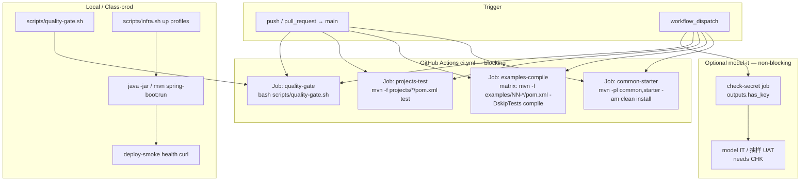

# Phase 7: 生产化 - Research

**Researched:** 2026-07-17
**Domain:** GitHub Actions CI/CD · Maven monorepo 质量门禁 · Docker Compose 类生产部署
**Confidence:** HIGH

## Summary

本阶段是教学仓库的生产化收口：仓库尚无 `.github/`（已确认），需从零落地 GitHub Actions；本地与 CI 共用统一入口 `scripts/quality-gate.sh`，包装既有 `version-audit.sh` / `spring-ai-2-readiness.sh` 并补齐 HANDOFF §7 扫描（废弃 API / 硬编码密钥 / TODO）；部署路径锁定 Docker Compose + `infra.sh` profiles，不为教学仓引入 K8s。examples（48）与 projects（3）均不在父 POM `<modules>` 内，CI 必须用 `mvn -f path/pom.xml`，不可假设 reactor 已挂载。

默认 CI 必须在无 `AI_DASHSCOPE_API_KEY` 时全绿：common+starter `clean install`、examples 编译矩阵、projects `test`（Testcontainers 经既有 `DockerAvailableCondition` 在无 Docker 时跳过；GitHub-hosted `ubuntu-latest` 自带 Docker，IT 会实际跑中间件容器）。模型真机 IT/UAT 为 optional，且 **不得** 在 job 级 `if:` 直接引用 `secrets.*`（官方限制）——CONTEXT D-03 字面写法需在实现时改为 check-secret job 或 step 级 env。

既有脚本有两处门禁硬化缺口：`version-audit.sh` 在 BOM 缺失时仅 echo 不 `exit 1`；`spring-ai-2-readiness.sh` 只计数永不失败。`quality-gate.sh` 必须补强 exit code 语义与 §7 扫描，否则「门禁全绿」名不副实。

**Primary recommendation:** 新建 `.github/workflows/ci.yml`（blocking：common/starter + examples compile matrix + projects test + quality-gate）+ 可选 `model-it.yml`（workflow_dispatch / secret-gated）；新增 `scripts/quality-gate.sh` 为本地与 CI 唯一质量入口；文档化 Compose 部署与 UAT 债务索引；不修 Phase 6 Critical 代码。

<user_constraints>
## User Constraints (from CONTEXT.md)

### Locked Decisions
- **D-01:** 使用 **GitHub Actions**（仓库尚无 `.github/workflows`，本阶段新建）
- **D-02:** 触发：`push`/`pull_request` 到默认分支；`workflow_dispatch` 手动全量
- **D-03:** 密钥：默认 job **不依赖** `AI_DASHSCOPE_API_KEY`；带 Key 的模型 IT/UAT 作为 **optional / manual** job
- **D-04:** 必跑：`common` + `starter` 的 `clean install`（含单测）
- **D-05:** examples：以 **编译矩阵** 为主（`mvn -f examples/NN-*/pom.xml -DskipTests compile`），不在默认 CI 跑全量 48 个 `spring-boot:run`
- **D-06:** projects：三个企业项目各自 `mvn -f projects/*/pom.xml test`
- **D-07:** 新增统一入口脚本（如 `scripts/quality-gate.sh`），串联：真实编译抽样 + `version-audit.sh` + `spring-ai-2-readiness.sh` + 废弃 API/硬编码密钥/TODO 扫描（对齐 HANDOFF §7）
- **D-08:** 复用既有脚本，不重写：`version-audit.sh`、`spring-ai-2-readiness.sh`、`uat-phase3.sh`、`uat-knowledge-qa.sh`、`projects/*/scripts/uat-*.sh`
- **D-09:** CI 中 quality-gate 失败 → workflow fail（blocking）；模型真机路径保持 non-blocking optional
- **D-10:** **Docker Compose 部署路径**；文档化 `scripts/infra.sh` profiles + 三项目 override；提供「一键起中间件 + 起应用」的 deploy/smoke 说明与脚本骨架
- **D-11:** 不引入完整 K8s/Helm；若需容器镜像，仅 Dockerfile + 本地 build 说明即可
- **D-12:** 在 `docs/` 或根 README 增补 Phase 7 生产化章节
- **D-13:** Phase 4/5/6 人工 UAT 债务保留在各自文档；本阶段提供 **汇总索引**，不强制在 CI 内跑通真机 UAT
- **D-14:** `06-REVIEW.md` Critical **不在本阶段强制修代码**，记入 backlog / STATE Pending

### Claude's Discretion
- Workflow YAML 拆分（单文件 vs ci.yml + release.yml）、缓存策略（Maven cache）、examples 编译并行度、Dockerfile 是否三项目各一份 — 由 planner/executor 按仓库惯例决定
- 调优文档深度（JVM/连接池/向量维度）保持「教学够用」即可

### Deferred Ideas (OUT OF SCOPE)
- 完整 K8s/Helm/云托管发布
- Spring AI 2.0 / Boot 4 迁移专题
- 强制在 CI 跑通全部 48 Demo 真机 curl
- Phase 6 Critical 代码修复（建议 `/gsd-code-review 6 --fix`）
</user_constraints>

<phase_requirements>
## Phase Requirements

| ID | Description | Research Support |
|----|-------------|------------------|
| REQ-phase-7-production | 统一测试、CI/CD、部署、调优与排障；质量门禁可在每阶段收口执行（编译、curl、version-audit、spring-ai-2-readiness、无废弃 API/硬编码密钥/TODO） | Standard Stack（GHA + quality-gate.sh）；Architecture Patterns（CI 矩阵 / Compose 部署）；Validation Architecture（门禁→测试映射）；Pitfalls（secret if、脚本 exit code） |
</phase_requirements>

## Project Constraints (from saa-conventions / CLAUDE.md)

> 仓库无 `.cursor/rules/`；强制约定来自 `.claude/skills/saa-conventions/SKILL.md` 与 `CLAUDE.md`。

| Directive | Implication for Phase 7 |
|-----------|-------------------------|
| 版本锁定：Java 21 · Boot 3.5.16 · SAA 1.1.2.2 · Spring AI 1.1.2；双 BOM | CI `setup-java` 固定 21；version-audit 必须 blocking |
| 密钥仅环境变量，严禁提交 | CI 默认无 Key；扫描硬编码 `sk-`；永不 echo secret |
| 模型 IT：`@EnabledIfEnvironmentVariable(AI_DASHSCOPE_API_KEY)` | 无 Key 时 IT 自动跳过，默认 job 可绿 |
| Testcontainers 测中间件 | projects IT 已有 `DockerAvailableCondition`；有 Docker 则跑 |
| 零 TODO / 禁用废弃 API | quality-gate 扫描必须 fail-on-match |
| 复用 common/starter，不造轮子 | CI 必先 install common+starter |
| Demo 端口 180NN；项目 19100/19200/19300 | 部署/排障文档写明端口冲突 |
| 图示 Mermaid | 生产化文档中的架构图用 Mermaid |

## Architectural Responsibility Map

| Capability | Primary Tier | Secondary Tier | Rationale |
|------------|-------------|----------------|-----------|
| CI 编排（触发/矩阵/门禁） | CDN / Static（GitHub Actions runner） | — | 流水线在托管 runner 上执行，不进应用进程 |
| common/starter 构建与单测 | API / Backend（Maven 模块） | CI runner | 业务库与 starter 属后端工件 |
| examples 编译矩阵 | API / Backend | CI runner | 各 Demo 独立 Spring Boot 应用，仅 compile |
| projects 单测 / Testcontainers IT | API / Backend | Database / Storage（容器） | IT 拉起 PG/Redis/ES 等临时容器 |
| quality-gate 扫描脚本 | API / Backend（仓库脚本） | CI runner | bash 对源码与依赖树做静态/半静态检查 |
| 中间件与类生产部署 | Database / Storage（Compose） | API / Backend（jar） | `infra.sh` + override 起中间件，`java -jar` 起应用 |
| 模型真机 IT / UAT curl | API / Backend | Browser / Client（curl） | 需真实 DashScope；optional，不进默认门禁 |
| 调优/排障文档 | CDN / Static（docs） | — | 教学文档，无运行时逻辑 |
| Phase 4–6 UAT 债务索引 | CDN / Static（docs/.planning） | — | 可发现性，不执行真机 |

## Standard Stack

### Core

| Library / Tool | Version | Purpose | Why Standard |
|----------------|---------|---------|--------------|
| GitHub Actions | hosted `ubuntu-latest` | CI 编排 | [VERIFIED: 仓库无 workflows；CONTEXT D-01] |
| `actions/checkout` | v4 或文档当前 major（docs 示例已见 v6） | 检出代码 | [CITED: docs.github.com/actions] |
| `actions/setup-java` | v4+，`distribution: temurin`，`java-version: '21'`，`cache: maven` | JDK + Maven 缓存 | [CITED: github.com/actions/setup-java] |
| Apache Maven | 3.9.x（本地已 3.9.14） | 构建 | [VERIFIED: `mvn -version`] |
| JDK | 21（Temurin） | 编译运行 | [VERIFIED: CLAUDE.md / `java -version`] |
| Docker Compose | v2+（本地 Compose v5.1.2） | 中间件与部署 | [VERIFIED: `infra.sh` + `docker compose`] |
| Bash | 系统 bash | quality-gate / deploy 脚本 | 与既有 `scripts/*.sh` 一致 |

### Supporting

| Tool | Version | Purpose | When to Use |
|------|---------|---------|-------------|
| `scripts/version-audit.sh` | 仓库内 | 依赖树版本唯一 + 禁 2.x | quality-gate 必调；需硬化 exit |
| `scripts/spring-ai-2-readiness.sh` | 仓库内 | 2.0 破坏点计数 | quality-gate 必调；设阈值或基线 |
| `scripts/infra.sh` | 仓库内 | profiles: core/vector/mq/search/cloud | 部署文档与 smoke |
| `DockerAvailableCondition` | 三项目已有 | 无 Docker 跳过 IT | 保持现状，勿改语义 |
| JUnit 5 + AssertJ + Testcontainers | Boot BOM | 项目测试 | 已在 projects pom |

### Alternatives Considered

| Instead of | Could Use | Tradeoff |
|------------|-----------|----------|
| GitHub Actions | GitLab CI / Jenkins | CONTEXT 已锁定 GHA；教学读者更常见 GHA |
| Compose 部署 | K8s/Helm | D-11 明确过重，deferred |
| examples 全量 `spring-boot:run`+curl | 编译矩阵 | D-05：耗时与 Key 过大 |
| job `if: secrets.X != ''` | check-secret job / step env | **官方禁止 secrets 进 job-level if** — 见 Pitfalls |

**Installation（本阶段无新 Maven/npm 依赖）:**

```bash
# 无新包安装。仅新增仓库内文件：
#   .github/workflows/ci.yml
#   .github/workflows/model-it.yml   # optional
#   scripts/quality-gate.sh
#   scripts/deploy-smoke.sh         # skeleton，discretion
#   docs/... 生产化章节
```

**Version verification:** JDK 21 / Maven 3.9.14 / Docker 29.4 / Compose v5.1.2 已在本机探测；父 POM 锁定 Boot 3.5.16 / SAA 1.1.2.2 / Spring AI 1.1.2。[VERIFIED: local probe + pom.xml]

## Package Legitimacy Audit

> 本阶段 **不安装** npm/PyPI/crates 新包。仅引用 GitHub Actions marketplace actions（YAML `uses:`）。

| Package | Registry | Age | Downloads | Source Repo | slopcheck | Disposition |
|---------|----------|-----|-----------|-------------|-----------|-------------|
| actions/checkout | GitHub Marketplace | 多年 | N/A（官方） | github.com/actions/checkout | N/A（非 npm） | Approved — pin major |
| actions/setup-java | GitHub Marketplace | 多年 | N/A（官方） | github.com/actions/setup-java | N/A（非 npm） | Approved — pin major + temurin 21 |

**Packages removed due to slopcheck [SLOP] verdict:** none（未引入第三方库）
**Packages flagged as suspicious [SUS]:** none

*slopcheck 对 Actions 不适用；未新增语言包依赖。*

## Architecture Patterns

### System Architecture Diagram



### Recommended Project Structure

```
.github/workflows/
├── ci.yml                 # 默认 blocking：common/starter + examples matrix + projects + quality-gate
└── model-it.yml           # optional：workflow_dispatch + secret check（discretion：可合并为 ci.yml 末 job）

scripts/
├── quality-gate.sh        # NEW — 统一门禁入口（本地=CI）
├── version-audit.sh       # 复用；建议 quality-gate 内补 BOM 缺失 exit 1
├── spring-ai-2-readiness.sh  # 复用；quality-gate 设阈值
├── deploy-smoke.sh        # NEW skeleton（discretion）
├── infra.sh               # 复用
└── uat-*.sh               # 复用，不进默认 CI

docs/
└── 00-overview/ 或 docs/ops/   # Phase 7 生产化：CI / 门禁 / 部署 / 排障 / UAT 索引
```

### Pattern 1: Maven Monorepo CI（父 reactor 不含 examples/projects）

**What:** common/starter 走 `-pl -am`；examples/projects 走 `-f` 独立 pom。  
**When to use:** 始终。父 `pom.xml` 仅 `<module>common</module>` + `<module>starter</module>`。[VERIFIED: pom.xml]

**Example:**

```yaml
# Source: 对齐 CONTEXT D-04~D-06 + docs.github.com Maven guide
- uses: actions/setup-java@v4
  with:
    distribution: temurin
    java-version: '21'
    cache: maven
    # monorepo：缓存键覆盖根与子 pom
    cache-dependency-path: |
      pom.xml
      common/pom.xml
      starter/pom.xml
      examples/*/pom.xml
      projects/*/pom.xml

- name: Install common + starter
  run: mvn -B -pl common,starter -am clean install

- name: Compile example
  run: mvn -B -f examples/${{ matrix.demo }}/pom.xml -DskipTests compile
```

### Pattern 2: Optional 模型 Job（secret 安全门控）

**What:** 用独立 check job 输出 boolean，再 `needs` + `if`；或 step 级 `env` + `if: env.KEY != ''`。  
**When to use:** 任何依赖 `AI_DASHSCOPE_API_KEY` 的 optional 路径。[CITED: docs.github.com secrets — *Secrets cannot be directly referenced in `if:` conditionals*]

```yaml
# Source: docs.github.com + 社区标准 workaround
jobs:
  check-dashscope-secret:
    runs-on: ubuntu-latest
    outputs:
      defined: ${{ steps.c.outputs.defined }}
    steps:
      - id: c
        run: |
          if [ -n "${{ secrets.AI_DASHSCOPE_API_KEY }}" ]; then
            echo "defined=true" >> "$GITHUB_OUTPUT"
          else
            echo "defined=false" >> "$GITHUB_OUTPUT"
          fi

  model-it:
    needs: check-dashscope-secret
    if: needs.check-dashscope-secret.outputs.defined == 'true'
    runs-on: ubuntu-latest
    steps:
      - uses: actions/checkout@v4
      - uses: actions/setup-java@v4
        with:
          distribution: temurin
          java-version: '21'
          cache: maven
      - run: mvn -B -pl common,starter -am clean install
      - env:
          AI_DASHSCOPE_API_KEY: ${{ secrets.AI_DASHSCOPE_API_KEY }}
        run: mvn -B -f projects/smart-cs-platform/pom.xml test
```

### Pattern 3: quality-gate.sh 统一入口

**What:** 单脚本串联编译抽样 + 既有审计 + §7 扫描，失败即非零退出。  
**When to use:** 本地收口与 CI `quality-gate` job。

```bash
#!/usr/bin/env bash
# 推荐骨架（实现时补全）
set -euo pipefail
ROOT="$(cd "$(dirname "${BASH_SOURCE[0]}")/.." && pwd)"
cd "$ROOT"

mvn -B -pl common,starter -am clean install
# 抽样编译（discretion：固定若干 Demo 或随机 N 个）
mvn -B -f examples/01-quickstart-demo/pom.xml -DskipTests compile

bash scripts/version-audit.sh
# 硬化：BOM 缺失则 exit 1（若上游脚本未改，在此二次检查）
grep -q "spring-ai-alibaba-bom" pom.xml
grep -q "spring-ai-alibaba-extensions-bom" pom.xml

bash scripts/spring-ai-2-readiness.sh .
# 阈值：例如 .withXxx 文件数不得超过基线（记入脚本常量）

# §7 扫描 — 命中则 fail（排除 setup-env.example.sh / docs 教学片段按需）
! grep -rE 'PromptChatMemoryAdvisor|CallAroundAdvisor|AdvisedRequest|AdvisedResponse|FunctionCallback' \
  --include='*.java' common starter examples projects || exit 1
! grep -rE 'TODO|FIXME|请自行补充' --include='*.java' common starter examples projects || exit 1
# 硬编码密钥：排除 example 模板
! grep -rE 'sk-[a-zA-Z0-9]{16,}' --include='*.{java,yml,yaml,properties,md,sh}' . \
  --exclude-dir=.git --exclude='setup-env.example.sh' || exit 1

echo "quality-gate OK"
```

### Pattern 4: Compose 类生产部署

**What:** 文档 + 可选 `deploy-smoke.sh`：`infra.sh` / 双 compose 文件 + health curl。  
**When to use:** 三企业项目本地演示与「部署路径」验收。[VERIFIED: 各 project README]

```bash
# Source: projects/*/README.md
docker compose -f docker/docker-compose.yml \
  -f projects/knowledge-qa-platform/docker-compose.override.yml \
  --profile core --profile vector --profile cloud up -d
# 等 healthy（Milvus 30~60s）后：
mvn -f projects/knowledge-qa-platform/pom.xml -DskipTests package
java -jar projects/knowledge-qa-platform/target/*.jar &
curl -sf http://localhost:19100/actuator/health
```

### Anti-Patterns to Avoid

- **job-level `if: secrets.AI_DASHSCOPE_API_KEY != ''`：** 官方不支持，workflow 可能直接解析失败或静默错误。[CITED: docs.github.com]
- **`mvn -pl examples/...`：** examples 不在 reactor，会失败；必须 `-f`。[VERIFIED: pom.xml modules]
- **默认 CI 跑 `uat-phase3.sh`：** 48 次 spring-boot:run + Key，违反 D-05/D-13。
- **把 Phase 6 Critical 修进本阶段：** D-14 明确不阻塞。
- **手写 K8s manifests「顺便」：** deferred。
- **在 quality-gate 里 `set +e` 吞掉 version-audit 失败：** D-09 blocking。

## Don't Hand-Roll

| Problem | Don't Build | Use Instead | Why |
|---------|-------------|-------------|-----|
| Maven 依赖缓存 | 自写 tar ~/.m2 | `setup-java` `cache: maven` | 官方缓存键与失效策略已成熟 |
| 无 Key 跳过模型测 | 自定义 CI 开关脚本 | `@EnabledIfEnvironmentVariable` | 代码层已统一，无 Key 即跳过 |
| 无 Docker 跳过 IT | 改 pom 删 IT | `DockerAvailableCondition` | 三项目已实现 |
| 中间件编排 | 新写 docker 脚本 | `scripts/infra.sh` + override | profiles 已覆盖 |
| 版本审计 / 2.0 扫描 | 重写审计工具 | 包装既有两脚本 | D-08 |
| 密钥注入应用 | 写入 yml | `AI_DASHSCOPE_API_KEY` env / GHA secrets | 仓库铁律 |
| 全量 Demo UAT | CI 内循环 run | 本地 `uat-phase3.sh` + 索引 | 成本过高 |

**Key insight:** 本阶段价值在「把已有可跑脚本与测试约定接到可重复 CI」，而非发明新基础设施。

## Common Pitfalls

### Pitfall 1: Secrets 不能用于 job-level `if`
**What goes wrong:** CONTEXT 示例写法在 GHA 中非法或无效。  
**Why it happens:** GitHub 出于安全不在 job `if` 暴露 secrets 上下文。[CITED: docs.github.com]  
**How to avoid:** check-secret job → outputs；或 step `env` + `if: env.X != ''`。  
**Warning signs:** workflow 报 `Unrecognized named-value: 'secrets'`。

### Pitfall 2: version-audit / readiness 假绿
**What goes wrong:** BOM 缺失仍 exit 0；readiness 只打印数字。  
**Why it happens:** 脚本原为教学 Demo，非严格 CI gate。[VERIFIED: 读 scripts 源码]  
**How to avoid:** `quality-gate.sh` 二次断言 BOM；readiness 设硬阈值或与基线文件 diff。  
**Warning signs:** CI 绿但父 POM 被误删 extensions-bom。

### Pitfall 3: examples 用错 Maven 坐标
**What goes wrong:** `-pl 01-quickstart-demo` 找不到模块。  
**Why it happens:** 父 modules 未挂载 examples。[VERIFIED: pom.xml]  
**How to avoid:** 一律 `mvn -f examples/<dir>/pom.xml`。  
**Warning signs:** `Could not find the selected project`。

### Pitfall 4: 矩阵超时 / 依赖下载重复
**What goes wrong:** 48 路并行全部冷下载，排队或超时。  
**Why it happens:** 未共享 Maven cache / max-parallel 过大。  
**How to avoid:** `cache: maven` + `cache-dependency-path`；`strategy.max-parallel: 4~8`；先跑 common-starter job 再 matrix（artifacts 可选，discretion）。  
**Warning signs:** job 卡在 Downloading。

### Pitfall 5: 密钥扫描误杀 example 模板
**What goes wrong:** `setup-env.example.sh` 含 `sk-your-...` 导致门禁失败。  
**Why it happens:** 模板故意写占位。[VERIFIED: scripts/setup-env.example.sh]  
**How to avoid:** exclude 名单；或要求占位不含真实 `sk-` 模式（已是假值，可用更严正则要求长度/熵）。  
**Warning signs:** 仅 example 文件触发。

### Pitfall 6: Milvus 冷启动导致 deploy-smoke 失败
**What goes wrong:** health 检查过早失败。  
**Why it happens:** etcd+MinIO 依赖，30~60s。[VERIFIED: HANDOFF §8 / CLAUDE.md]  
**How to avoid:** smoke 脚本 wait-for-healthy / sleep+retry。  
**Warning signs:** 应用连不上 Milvus。

### Pitfall 7: GitHub-hosted 上 Testcontainers 与「无 Docker 跳过」预期混淆
**What goes wrong:** 本地无 Docker 绿，CI 有 Docker 后 IT 失败暴露真实 bug。  
**Why it happens:** `ubuntu-latest` 默认有 Docker，条件为 enabled。[ASSUMED: GHA runner Docker 可用 — 官方常见；应用层已用 DockerClientFactory]  
**How to avoid:** 本地有 Docker 时先跑 projects test；CI 失败优先修 IT 而非关闭 Docker。  
**Warning signs:** 仅 CI 红、本地绿且本地未起 Docker。

## Code Examples

### Examples 矩阵生成（discretion）

```yaml
# 可用 static list 或动态；48 项在 GHA matrix 上限内
strategy:
  fail-fast: false
  max-parallel: 6
  matrix:
    demo:
      - 01-quickstart-demo
      - 02-autoconfig-demo
      # ... 其余 46 个目录名与 examples/README.md 对齐
```

动态发现（减少维护）：

```bash
# 在 job 中生成 matrix JSON（需先 checkout）
ls -d examples/[0-9]*-*/ | xargs -n1 basename | jq -R -s -c 'split("\n")|map(select(length>0))'
```

### §7 废弃 API 扫描列表（与 CLAUDE.md 对齐）

```
PromptChatMemoryAdvisor
CallAroundAdvisor|AdvisedRequest|AdvisedResponse
FunctionCallback
```

可变 Options setter：可复用 `spring-ai-2-readiness.sh` 的 `.withXxx(` 扫描，或额外扫明显的 `setTemperature(` 等（注意误报）。

## State of the Art

| Old Approach | Current Approach | When Changed | Impact |
|--------------|------------------|--------------|--------|
| 无 CI，靠人工 HANDOFF §7 checklist | GHA + quality-gate.sh 可重复执行 | Phase 7 | 任何阶段收口可验证 |
| job `if: secrets.*`（旧博客） | check-secret / step env | GHA 安全模型长期限制 | 实现必须避开 CONTEXT 字面 if |
| 全量 Demo 真机进 CI | 编译矩阵 + 本地 UAT | CONTEXT D-05 | CI 时长与成本可控 |
| K8s 教学部署 | Compose + infra.sh | CONTEXT D-10/D-11 | 降低学习者门槛 |

**Deprecated/outdated:**
- 在 CI 强制 DashScope：与 D-03 冲突，且违背 `@EnabledIfEnvironmentVariable` 设计。
- 完整 K8s 作为本仓「生产化」定义：已 deferred。

## Assumptions Log

| # | Claim | Section | Risk if Wrong |
|---|-------|---------|---------------|
| A1 | GitHub-hosted `ubuntu-latest` 默认 Docker 可用，projects Testcontainers IT 会在 CI 实际执行 | Pitfall 7 / Env | CI 突然变红；需加 `services:` 或关 IT |
| A2 | `actions/checkout@v4` + `setup-java@v4` 足够；不必追 docs 示例中的 v5/v6 | Standard Stack | 需按实现时 marketplace 最新 major 微调 pin |
| A3 | spring-ai-2-readiness 数值「低位」可用固定阈值（如 `.withXxx` 文件数 ≤ N）判定 | quality-gate | 阈值过严导致假红；应先跑基线再锁 N |
| A4 | Phase 5 无 `.planning/phases/05-*` 目录，UAT 索引以 `projects/office-agent-assistant/scripts/uat-office-agent.sh` + README 为准 | Open Questions | 索引可能漏链；需人工补链或标注缺失 |
| A5 | 三项目无需本阶段新增 Dockerfile 即可满足 D-10（文档 + compose 足够）；Dockerfile 为可选 | Discretion | 若验收要求「镜像构建路径」，需补 1～3 个 Dockerfile |

## Open Questions

1. **spring-ai-2-readiness 失败阈值取多少？**
   - What we know: 脚本只计数，无 exit 语义。[VERIFIED]
   - What's unclear: 当前仓基线数字未在本 research 跑全量采样锁定。
   - Recommendation: Wave 0 先跑一遍记录基线，写入 `quality-gate.sh` 常量；仅「超过基线」失败。

2. **examples 矩阵：静态 48 项 vs 动态 ls？**
   - What we know: 清单 SSOT 在 `examples/README.md`；目录 48 个已确认。[VERIFIED]
   - What's unclear: 维护成本偏好。
   - Recommendation: 动态 `ls examples/[0-9]*` 生成 matrix（少漂移）；或静态列表与 README 同步检查。

3. **Phase 5 UAT 文档落点？**
   - What we know: `.planning/phases/` 无 `05-*`；存在 `projects/office-agent-assistant/scripts/uat-office-agent.sh`。[VERIFIED]
   - What's unclear: 是否有归档 HUMAN-UAT。
   - Recommendation: UAT 索引表注明「Phase 5：脚本路径；planning UAT 文档缺失则链 README §测试」。

4. **projects CI 是否依赖 Docker 必绿？**
   - What we know: 有 Docker 则跑 Testcontainers。[VERIFIED: DockerAvailableCondition]
   - What's unclear: 当前 IT 在干净 CI 是否 100% 绿（未在本 research 实跑）。
   - Recommendation: 实现后第一波以 CI 实跑为准；红则修测试，不关 Docker。

## Environment Availability

| Dependency | Required By | Available | Version | Fallback |
|------------|------------|-----------|---------|----------|
| JDK 21 | 构建 | ✓ | 21.0.2 | — |
| Maven 3.9+ | 构建 | ✓ | 3.9.14 | — |
| Docker | infra / Testcontainers / deploy | ✓ | 29.4.0 | IT 跳过（本地）；CI 通常有 Docker |
| Docker Compose | infra.sh / 部署 | ✓ | v5.1.2 | — |
| GitHub Actions | CI | ✓（平台） | hosted | — |
| `.github/workflows` | CI | ✗ 尚未存在 | — | 本阶段新建 |
| `scripts/quality-gate.sh` | 门禁 | ✗ 尚未存在 | — | 本阶段新建 |
| `AI_DASHSCOPE_API_KEY` | optional 模型 IT | 本地按需 | — | 默认 CI 不依赖 |
| mvnw | 可重复构建 | ✗ 无 wrapper | — | 用 setup-java 预装 Maven（够用） |
| ctx7 / Context7 MCP | 文档查询 | ✗ | — | 已用官方 docs + WebSearch |
| knowledge graph | 交叉引用 | ✗ 无 graph.json | — | 跳过 |

**Missing dependencies with no fallback:**
- 无阻塞本地研发项；CI 需在 GitHub 仓库启用 Actions（平台侧，非本机）。

**Missing dependencies with fallback:**
- Maven Wrapper → setup-java 自带 Maven
- quality-gate.sh / workflows → 本阶段交付

## Validation Architecture

> `workflow.nyquist_validation: true`（config.json）

### Test Framework

| Property | Value |
|----------|-------|
| Framework | JUnit 5（Spring Boot Test）+ Testcontainers + AssertJ |
| Config file | 各模块 pom；无根级 surefire 聚合 |
| Quick run command | `mvn -pl common,starter -am test` |
| Full suite command | `mvn -pl common,starter -am clean install && for p in projects/*/pom.xml; do mvn -f \"$p\" test; done` |
| Gate command | `bash scripts/quality-gate.sh`（交付后） |

### Phase Requirements → Test Map

| Req ID | Behavior | Test Type | Automated Command | File Exists? |
|--------|----------|-----------|-------------------|-------------|
| REQ-phase-7-production | common+starter 可构建且单测绿 | unit/integration | `mvn -B -pl common,starter -am clean install` | ✅ 既有测试 |
| REQ-phase-7-production | examples 可编译 | compile smoke | `mvn -B -f examples/01-quickstart-demo/pom.xml -DskipTests compile`（矩阵扩展） | ✅ 48 pom |
| REQ-phase-7-production | projects test（无 Key 绿） | unit + conditional IT | `mvn -B -f projects/knowledge-qa-platform/pom.xml test`（×3） | ✅ |
| REQ-phase-7-production | version-audit 全绿 | script gate | `bash scripts/version-audit.sh`（经 quality-gate 硬化） | ✅ 脚本；❌ 硬化逻辑待加 |
| REQ-phase-7-production | spring-ai-2-readiness 低位 | script gate | `bash scripts/spring-ai-2-readiness.sh .` + 阈值 | ✅ 脚本；❌ 阈值待加 |
| REQ-phase-7-production | 无废弃 API / 无硬编码密钥 / 无 TODO | script scan | `quality-gate.sh` 内 grep | ❌ Wave 0 |
| REQ-phase-7-production | CI 可重复执行 | GHA workflow | push 触发 ci.yml | ❌ Wave 0 |
| REQ-phase-7-production | Compose 部署路径文档化 | manual/smoke | `deploy-smoke` 或文档步骤 | ⚠️ README 有片段；缺统一索引 |
| REQ-phase-7-production | curl 验证 | manual UAT | `uat-*.sh`（不进默认 CI） | ✅ 脚本；索引 ❌ |

### Sampling Rate

- **Per task commit:** `bash scripts/quality-gate.sh`（交付后）或至少 `mvn -pl common,starter -am test`
- **Per wave merge:** 完整 ci.yml 等价命令（含 examples 抽样 compile + projects test）
- **Phase gate:** CI 绿 + quality-gate 绿 + 生产化文档可读 + UAT 索引存在；真机 UAT 不强制

### Wave 0 Gaps

- [ ] `scripts/quality-gate.sh` — 统一门禁（含 §7 扫描 + 脚本硬化）
- [ ] `.github/workflows/ci.yml` — blocking CI
- [ ] `.github/workflows/model-it.yml`（或 ci 内 optional job）— secret-gated
- [ ] readiness 基线常量 / 文件 — 供阈值断言
- [ ] `docs/` 生产化章节 + UAT 债务索引
- [ ] （可选）`scripts/deploy-smoke.sh` 骨架
- [ ] （可选）三项目或共用 Dockerfile

## Security Domain

### Applicable ASVS Categories

| ASVS Category | Applies | Standard Control |
|---------------|---------|-----------------|
| V2 Authentication | no（本阶段不改认证代码） | — |
| V3 Session Management | no | — |
| V4 Access Control | partial | 不修 P6 Critical；门禁扫描不替代授权修复 |
| V5 Input Validation | yes（脚本/路径） | bash 引号、固定目录扫描，避免任意路径注入 |
| V6 Cryptography | no | — |
| V7 Error Handling / Logging | yes | CI 日志禁止打印 `AI_DASHSCOPE_API_KEY`；GHA secrets 自动 mask |
| V8 Data Protection | yes | 密钥仅 secrets/env；扫描硬编码；`.gitignore` 已排除 `setup-env.local.sh` |
| V10 Malicious Code | yes | 不引入未知 action；pin 官方 `actions/*` |
| V14 Configuration | yes | 无 Key 默认 CI；Compose 演示口令仅文档声明须替换 |

### Known Threat Patterns for CI + teaching monorepo

| Pattern | STRIDE | Standard Mitigation |
|---------|--------|---------------------|
| 密钥写入仓库 / 日志 | Information Disclosure | secrets + 扫描 `sk-`；永不 `echo` key |
| 供应链：恶意 Action | Tampering | 仅 `actions/checkout`、`actions/setup-java`；pin major |
| PR 自 fork 窃取 secrets | Information Disclosure | 官方：fork PR 不传 secrets；optional job 本就无密钥依赖 |
| 废弃 API 回归 | Elevation / 技术债 | quality-gate grep 禁用 API 列表 |
| TODO/伪代码进入主线 | Tampering（质量） | quality-gate 禁 TODO |
| 演示默认口令当生产 | Spoofing | 部署文档强制「替换演示口令」 |

## Sources

### Primary (HIGH confidence)

- [VERIFIED] `.planning/phases/07-production/07-CONTEXT.md` — 锁定决策 D-01~D-14
- [VERIFIED] `pom.xml` — modules 仅 common/starter；版本锁定
- [VERIFIED] `scripts/version-audit.sh` / `spring-ai-2-readiness.sh` / `infra.sh` — 行为与缺口
- [VERIFIED] 无 `.github/` 目录 — `ls` / glob
- [VERIFIED] `DockerAvailableCondition.java` — 无 Docker 跳过 IT
- [VERIFIED] `projects/*/README.md` — Compose 叠加部署命令
- [VERIFIED] `HANDOFF-TO-CLAUDE-CODE.md` §7 — 门禁清单
- [VERIFIED] `.claude/skills/saa-conventions/SKILL.md` — 工程约定
- [CITED] https://docs.github.com/en/actions/how-tos/writing-workflows/choosing-what-your-workflow-does/using-secrets-in-github-actions — secrets 不可用于 job `if`
- [CITED] https://github.com/actions/setup-java — `cache: maven`、`cache-dependency-path`
- [CITED] https://docs.github.com/actions/guides/building-and-testing-java-with-maven — Java/Maven CI 模板

### Secondary (MEDIUM confidence)

- [CITED] Stack Overflow / runner issues — check-secret job 模式（与官方「不可用 secrets in if」一致）
- [VERIFIED] 本地环境探测 — JDK/Maven/Docker/Compose 版本
- [ASSUMED] GHA `ubuntu-latest` Docker 可用性（业界默认；未在本次对空仓库实跑 workflow）

### Tertiary (LOW confidence)

- readiness 数值基线阈值 — 需 Wave 0 实测后锁定

## Metadata

**Confidence breakdown:**
- Standard stack: HIGH — GHA + 既有脚本 + 父 POM 约束均已核实
- Architecture: HIGH — monorepo `-f` 模式与 Compose 路径来自仓库实证
- Pitfalls: HIGH — secrets-if 与脚本假绿有官方/源码双重证据；阈值数字为 MEDIUM/ASSUMED

**Research date:** 2026-07-17  
**Valid until:** 2026-08-17（GHA action major 可能升级；锁决策不变）
