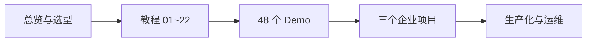

# spring-ai-alibaba-learning

Spring AI Alibaba **企业级实战教程** + 完整可运行源码 + 三个真实企业项目。

面向已具备 Spring Boot / Spring Cloud / Docker / LLM / RAG / Agent 经验的高级开发者，基于 **2026 年当前最新稳定生态** 构建。

> **里程碑状态（2026-07-18）**：`v1.0 Full Delivery` 已归档交付——Phase 1～7 全部完成（22 章教程 · 48 Demo · 3 企业项目 · 生产化基座）。下一里程碑用 `/gsd-new-milestone` 开启。

| 组件 | 版本 |
|---|---|
| JDK | 21 |
| Spring Boot | **3.5.16** |
| Spring AI | **1.1.2**（1.1 线，可按 CVE 升至 1.1.8） |
| Spring AI Alibaba | **1.1.2.2**（Agent Framework + Graph） |
| SAA Extensions | **1.1.2.2**（DashScope 等，与主线同版本） |
| 模型 | DashScope（百炼）主通道 + DeepSeek 直连副通道（全云端 API） |
| 中间件 | Redis Stack · PostgreSQL(pgvector) · MySQL · MinIO · Milvus · Kafka · RabbitMQ · ES · Nacos（OrbStack Docker Compose） |

版本选型依据见 [docs/00-overview/02-版本调研报告.md](docs/00-overview/02-版本调研报告.md)。  
**两个 BOM 必须同时导入**：`spring-ai-alibaba-bom` + `spring-ai-alibaba-extensions-bom`（父 POM 已配置）。  
Spring AI 2.0 已 GA，但 **SAA 尚无对齐版** → 当前锁死 Boot 3.5.x，勿升 Boot 4 / Spring AI 2.0。

---

## 快速开始

```bash
# 1. 克隆
git clone <your-repo-url> && cd spring-ai-alibaba-learning

# 2. 配置模型 API Key（模板复制后填入真实 Key，该文件不入库）
cp scripts/setup-env.example.sh scripts/setup-env.local.sh
# 编辑 scripts/setup-env.local.sh
source scripts/setup-env.local.sh

# 3. 环境自检（JDK 21 / Maven / OrbStack / API Key / 端口）
bash scripts/env-check.sh

# 4. 启动核心中间件（Redis / PG / MySQL / MinIO）
bash scripts/infra.sh up core

# 5. 构建公共底座（common + starter）
mvn -pl common,starter -am clean install
```

跑 RAG / 向量相关内容时追加：`bash scripts/infra.sh up core vector`。  
质量门禁（本地 / CI 共用）：`bash scripts/quality-gate.sh`。  
生产化与运维：[docs/00-overview/05-生产化与运维.md](docs/00-overview/05-生产化与运维.md)。

---

## 仓库结构

```
docs/       教程本体（00-overview 总览 + tutorial 01~22 章教材级教程）
common/     公共模块：统一 Result / 错误码 / 异常 / 全局异常处理器
starter/    统一 AI Starter（装配 / 审计 Advisor / 模型路由降级 / 成本采集）
examples/   48 个独立可运行 Demo（每个含 README / .http / curl）
projects/   三个企业级完整项目（知识库问答 / AI 办公助手 / 智能客服平台）
scripts/    环境自检 · API Key 模板 · 中间件 · quality-gate · UAT · 部署冒烟
docker/     统一 docker-compose（profile：core / vector / mq / search / cloud）
images/     文档截图与静态资源
```

父 POM 挂载 `common` + `starter`；`examples/*`、`projects/*` 为独立可运行应用（各自 `pom.xml` 以本仓库为 parent）。

---

## 学习大纲（推荐路径）

按「概念 → 可运行 Demo → 企业项目」递进，不必一次读完 22 章。



### 第一步：建立全局心智模型（约 0.5 天）

| 顺序 | 文档 | 用途 |
|---|---|---|
| 1 | [学习路线总览](docs/00-overview/01-学习路线.md) | LangGraph → SAA 概念映射、章节/Demo/项目覆盖矩阵、节奏建议 |
| 2 | [版本调研报告](docs/00-overview/02-版本调研报告.md) | 为何锁 1.1.2.2 / Boot 3.5.16，勿误升 2.0 |
| 3 | [总体架构与目录规划](docs/00-overview/03-总体架构与目录规划.md) | 模块依赖、端口约定、编码/测试规范 |
| 4 | [技术选型 ADR](docs/00-overview/04-技术选型ADR.md) | ADR-001～006 决策摘要 |
| 5 | [教程目录](docs/README.md) | 22 章索引与章节骨架 |

### 第二步：按能力层读教程 + 跑 Demo（核心）

| 能力层 | 教程章节 | 配套 Demo（`examples/`） | 建议 |
|---|---|---|---|
| 模型层 | 01～05、16、17 | `01`～`08`、`20`～`21`、`44` | 先跑通 `01-quickstart-demo` 验证 Key |
| 增强层 | 06、08 | `09`～`10`、`16`～`19` | 掌握 Advisor 链与 conversationId |
| 知识层 | 09～11 | `22`～`30` | 需 `infra.sh up core vector`；Milvus 冷启动 30～60s |
| 能力层 | 07、12 | `11`～`15`、`31`～`34` | Tool / MCP；配对工程注意 Client 端口 +100 |
| 智能体层 | 13～15 | `35`～`43` | ReactAgent → Graph → Multi-Agent / A2A |
| 工程层 | 18～22 | `45`～`48` + [starter](starter/README.md) | 可观测、路由降级、升级与 2.0 前瞻 |

完整 Demo 清单与端口约定：[examples/README.md](examples/README.md)。  
每章实现规格（源码位置 / curl / 预期输出）以对应 `docs/tutorial/NN-*.md` 为准。

### 第三步：三个企业项目（综合实战）

建议顺序：RAG 主线 → Tool/MCP 主线 → Multi-Agent 主线。

| 项目 | 目录 | 端口 | 主线能力 |
|---|---|---|---|
| AI 企业知识库问答平台 | [projects/knowledge-qa-platform](projects/knowledge-qa-platform) | 19100 | RAG + Citation + SSE + 多模型路由 |
| 企业 AI Agent 办公助手 | [projects/office-agent-assistant](projects/office-agent-assistant) | 19200 | ReactAgent + Tool 族 + MCP + 审批编排 |
| 智能客服 Agent 平台 | [projects/smart-cs-platform](projects/smart-cs-platform) | 19300 | Routing/Supervisor + FAQ/RAG + HITL + 成本看板 |

蓝图与技术映射：[projects/README.md](projects/README.md)。

### 第四步：生产化与质量门禁

| 文档 / 脚本 | 说明 |
|---|---|
| [生产化与运维](docs/00-overview/05-生产化与运维.md) | CI、Compose 部署、排障与教学级调优 |
| [UAT 债务索引](docs/00-overview/06-UAT债务索引.md) | Phase 3～6 UAT / HUMAN-UAT 与脚本入口 |
| `bash scripts/quality-gate.sh` | 本地 / CI 共用质量门禁 |
| `bash scripts/version-audit.sh` | BOM 对齐自检 |
| `bash scripts/spring-ai-2-readiness.sh .` | Spring AI 2.0 破坏点扫描 |

---

## 交付阶段（v1.0）

| Phase | 内容 | 状态 |
|---|---|---|
| 1 | 学习路线 · 版本调研 · 总体架构 · 技术选型 · 父工程与 common · 中间件基座 | ✅ |
| 2 | docs/tutorial 01～22 章 · starter 模块 · 全量 QA | ✅ |
| 3 | 48 个独立 Demo 工程 | ✅（UAT 48/48） |
| 4 | 企业项目一：AI 企业知识库问答平台 | ✅ |
| 5 | 企业项目二：企业 AI Agent 办公助手 | ✅ |
| 6 | 企业项目三：智能客服 Agent 平台 | ✅ |
| 7 | 统一测试 · CI/CD · 部署 · 调优 · 排障 · 总览 | ✅ |

归档与审计：[.planning/ROADMAP.md](.planning/ROADMAP.md) · [.planning/milestones/v1.0-MILESTONE-AUDIT.md](.planning/milestones/v1.0-MILESTONE-AUDIT.md)。

### Phase 2 章节索引

| 章 | 标题 | 状态 |
|---|---|---|
| 01 | 为什么需要 Spring AI Alibaba | ✅ |
| 02 | 整体架构 | ✅ |
| 03 | AutoConfiguration | ✅ |
| 04 | ChatClient | ✅ |
| 05 | Prompt 工程与 Nacos 热更新 | ✅ |
| 06 | Advisor 链 | ✅ |
| 07 | Tool Calling 全景 | ✅ |
| 08 | Memory 会话记忆 | ✅ |
| 09 | RAG 检索增强生成全链路 | ✅ |
| 10 | Embedding 向量化 | ✅ |
| 11 | VectorStore 向量存储 | ✅ |
| 12 | MCP 模型上下文协议 | ✅ |
| 13 | Agent 智能体开发 | ✅ |
| 14 | Workflow 图编排运行时 | ✅ |
| 15 | MultiAgent 多智能体协作 | ✅ |
| 16 | StructuredOutput 结构化输出 | ✅ |
| 17 | Streaming 流式输出 | ✅ |
| 18 | Observability 可观测体系 | ✅ |
| 19 | BestPractice 统一企业实践（starter 模块落地） | ✅ |
| 20 | 企业实践（路由/治理/成本/安全） | ✅ |
| 21 | 版本升级指南 1.0.x→1.1.2.2 | ✅ |
| 22 | Spring AI 2.0 现状与迁移前瞻 | ✅ |

---

## 工程约定（摘要）

- 包根 `com.flywhl.saa`，作者标识 `@author flywhl`
- Demo 端口：`examples/NN-xxx` → `180NN`；Server/Client 配对时 Client = Server + 100
- 图示一律 Mermaid；源码零 TODO、零伪代码；`mvn spring-boot:run` 直接可跑
- API Key 仅环境变量注入（`AI_DASHSCOPE_API_KEY` / `DEEPSEEK_API_KEY`），严禁提交
- 复用 `saa-learning-common` 与 `saa-learning-starter`，不重复实现异常处理 / 审计 / 路由 / 成本采集
- 禁用已废弃 API：`PromptChatMemoryAdvisor` → `MessageChatMemoryAdvisor`；`CallAroundAdvisor` → `CallAdvisor`；`FunctionCallback` → `@Tool`；可变 Options setter → Builder

完整约定见 [.claude/skills/saa-conventions/SKILL.md](.claude/skills/saa-conventions/SKILL.md)。

---

## 常用命令速查

```bash
source scripts/setup-env.local.sh && bash scripts/env-check.sh
bash scripts/infra.sh up core vector          # 起中间件
mvn -pl common,starter -am clean install      # 编译公共底座
mvn -pl starter test                          # starter 单测
bash scripts/version-audit.sh                 # BOM 对齐
bash scripts/spring-ai-2-readiness.sh .       # 2.0 破坏点扫描
bash scripts/quality-gate.sh                  # 质量门禁
bash scripts/uat-phase3.sh                    # Phase 3 Demo UAT（按需）
```

跑单个 Demo 示例：

```bash
cd examples/01-quickstart-demo
mvn spring-boot:run    # 端口 18001
```
