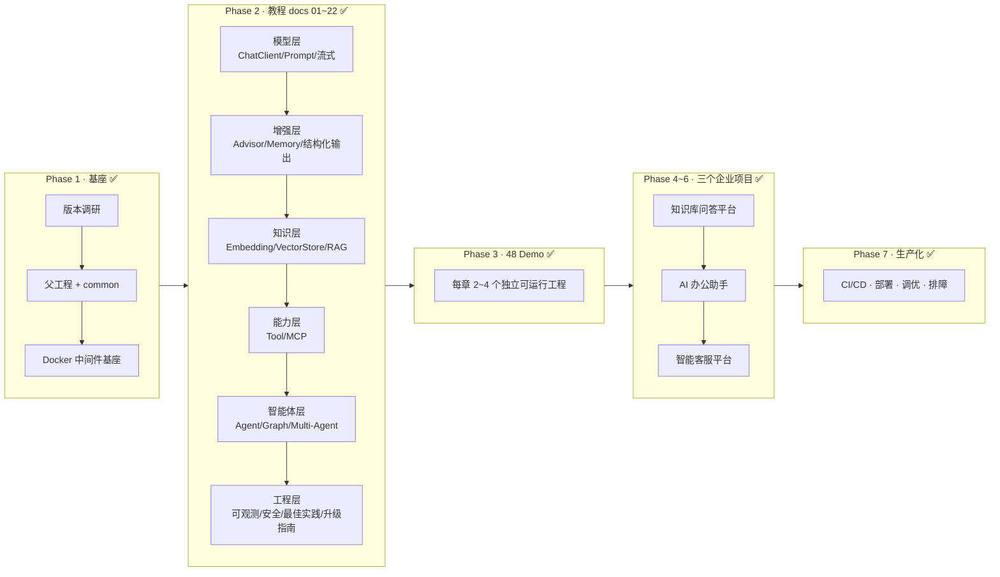

# 学习路线总览

> 面向对象：已具备 Spring Boot / Spring Cloud / Docker / LangGraph / FastAPI / RAG / MCP / LLM 实践经验的高级开发者，且几个月前接触过 Spring AI Alibaba 早期（1.0.x 时代）Demo。
>
> 目标：在 **SAA 1.1.2.2 + Spring AI 1.1.x + Boot 3.5.16** 体系下，达到独立设计、开发、部署企业级 AI 应用的水平。
>
> **交付状态（2026-07-18）**：✅ **v1.0 Full Delivery**——下图七个 Phase 均已落地；仓库入口与学习大纲见根 [`README.md`](../../README.md)。

---

## 1. 总路线图

---

## 2. 已有经验 → SAA 概念映射（快速迁移心智模型）

你已有 LangGraph / Python Agent 栈经验，下表是最短迁移路径：

| 你已掌握的概念 | SAA 1.1.x 对应物 | 关键差异 |
|---|---|---|
| LangGraph `StateGraph` / Node / Edge | `spring-ai-alibaba-graph-core`（StateGraph、并行条件边、AllOf/AnyOf 聚合） | Java 强类型 State；Checkpoint 持久化走 Spring 生态（Redis/JDBC） |
| LangGraph `create_react_agent` | Agent Framework `ReactAgent` | 内置 Hooks、Agent Skills（渐进式披露）、Human-in-the-Loop |
| LangGraph Supervisor / Swarm 模式 | 内置 `SequentialAgent` / `ParallelAgent` / `RoutingAgent` / `LoopAgent` / Supervisor / Handoffs | 官方内置为一等公民，无需手搓编排 |
| LangChain Runnable 拦截 / callbacks | Spring AI **Advisor 链**（环绕 ChatClient 调用） | 责任链 + 顺序号，Memory/RAG/日志均是 Advisor |
| mem0 / 会话记忆 | Spring AI `ChatMemory` + MemoryAdvisor（InMemory/Redis/JDBC 仓库） | 1.x 新 API 要求显式 conversationId（旧 PromptChatMemoryAdvisor 已弃用） |
| FastAPI SSE 流式 | `ChatClient.stream()` → `Flux<String>` + Spring SSE / WebFlux | Reactor 背压模型 |
| Python MCP SDK | Spring AI MCP Client/Server Starter + SAA Nacos MCP Registry | 分布式注册发现是 SAA 企业级差异化能力 |
| LangSmith / Langfuse | Micrometer + `starter-graph-observation` + ARMS/Langfuse 接入 | 指标/追踪原生走 Spring 可观测体系 |
| pgvector / Milvus (Python SDK) | Spring AI `VectorStore` 统一抽象 | 换库只改依赖与配置，检索 API 不变 |

**结论**：你的学习重心不在"概念"，而在 **Java 侧 API 形态、Advisor 链模型、SAA Agent Framework 的内置模式、Nacos 系企业能力** 四件事上。

---

## 3. docs 教程章节（Phase 2 已交付，共 22 章）

| # | 文档 | 核心内容 | 配套 Demo（Phase 3 已交付） |
|---|---|---|---|
| 01 | 为什么需要SpringAIAlibaba | 定位、与 Spring AI/LangChain4j/LangGraph 选型对比、1.0→1.1 演进 | — |
| 02 | 整体架构 | Agent Framework / Graph / Extensions / Admin 分层，模块地图 | — |
| 03 | AutoConfiguration | 自动装配原理、条件装配、属性绑定、源码分析 | `autoconfig-demo` |
| 04 | ChatClient | ChatClient/ChatModel/Message/Role/ChatOptions/Retry/Usage | `chat-demo` |
| 05 | Prompt | PromptTemplate、Few-shot/CoT/ReAct、Prompt 版本化与 Nacos 热更新 | `prompt-demo`、`prompt-nacos-demo` |
| 06 | Advisor | Advisor 链原理、内置 Advisor、自定义 Advisor、顺序控制 | `advisor-demo` |
| 07 | ToolCalling | Tool 定义/注册/ToolContext/动态与异步 Tool/权限与安全/returnDirect | `tool-demo`、`tool-security-demo` |
| 08 | Memory | ChatMemory 新 API、InMemory/Redis/JDBC、窗口与摘要、长短期记忆 | `memory-demo`、`redis-memory-demo` |
| 09 | RAG | Naive→Advanced→Hybrid，ETL Pipeline、Chunk/Splitter/Retriever/Rerank/Citation/评测 | `rag-demo`、`hybrid-rag-demo` |
| 10 | Embedding | EmbeddingModel/Options、text-embedding-v4、成本与基准 | `embedding-demo` |
| 11 | VectorStore | Milvus/PGVector/Redis/ES 统一抽象、Metadata Filter、Hybrid Search | `milvus-demo`、`pgvector-demo` |
| 12 | MCP | Client/Server/Streamable HTTP、Nacos MCP Registry、认证与权限 | `mcp-client-demo`、`mcp-server-demo`、`mcp-nacos-demo` |
| 13 | Agent | ReactAgent、Planning/Reflection/Self-Correction、Agent Skills | `agent-demo`、`agent-skills-demo` |
| 14 | Workflow | Graph 核心：State/Node/Edge/并行/中断/补偿/Checkpoint | `workflow-demo`、`graph-parallel-demo` |
| 15 | MultiAgent | Sequential/Parallel/Routing/Loop/Supervisor/Handoffs、A2A | `multi-agent-demo`、`a2a-nacos-demo` |
| 16 | StructuredOutput | Bean/Record/JSON Schema/泛型嵌套/Validation/容错解析 | `structured-output-demo`、`json-schema-demo` |
| 17 | Streaming | stream API、SSE、流式 + Tool、流式 + 结构化、前端对接 | `stream-demo` |
| 18 | Observability | Micrometer/Tracing/Token 与成本看板/Prometheus/Grafana | `observability-demo` |
| 19 | BestPractice | 统一 Starter、异常、日志、配置、测试（Testcontainers）、CI/CD | `starter` 模块落地 |
| 20 | 企业实践 | 多模型路由/降级/容灾、Prompt 治理、成本优化、安全体系 | `routing-demo`、`fallback-demo` |
| 21 | 版本升级指南 | 1.0.x → 1.1.2.2 全量升级手册（独立成篇） | — |
| 22 | Spring AI 2.0 前瞻 | Boot 4 / Jackson 3 / 破坏性变更与迁移准备 | — |

每章统一结构：学习目标 → 前置知识 → 核心概念 → 架构/流程 Mermaid 图 → API 深入解析 → 可运行 Demo（源码位置 + 运行结果）→ 关键源码解读 → 企业实践 → 性能与安全建议 → 常见踩坑 → FAQ → 本章总结 → 延伸阅读 → 下一章预告。

---

## 4. 三个企业项目与知识点覆盖矩阵（Phase 4~6）

| 能力 | 项目一：知识库问答 | 项目二：AI 办公助手 | 项目三：智能客服平台 |
|---|---|---|---|
| ChatClient / Streaming | ✅ SSE 问答 | ✅ 多轮对话 | ✅ 高并发流式 |
| RAG / Citation | ✅ 核心（Milvus + 引用溯源） | ○ 制度检索 | ✅ FAQ + 知识库 |
| Memory | ✅ Redis | ✅ Redis + JDBC 长期记忆 | ✅ 会话隔离 |
| Tool Calling | ✅ 检索/管理工具 | ✅ SQL/HTTP/Excel/Calendar | ✅ 工单/查询工具 |
| MCP | ○ | ✅ 企业工具走 MCP | ✅ Nacos MCP Registry |
| Multi-Agent | — | ○ 审批助手编排 | ✅ 核心（Routing + Supervisor + 人工接管） |
| 多模型路由/降级 | ✅ DashScope ↔ DeepSeek | ✅ | ✅ + 成本统计 |
| 后台管理 | ✅ 知识/Prompt/权限 | ✅ 用户/Prompt | ✅ 模型/Prompt/Dashboard |
| 可观测 | ✅ | ✅ | ✅ 成本看板 |

---

## 5. 建议学习节奏（按你的背景压缩）

```mermaid
gantt
    dateFormat  X
    axisFormat  第%s周
    section 快速通道
    模型层与 Advisor（01~06,16,17） :a1, 0, 1
    Tool 与 MCP（07,12）            :a2, after a1, 1
    RAG 三章（09,10,11）            :a3, after a2, 1
    Agent/Graph/MultiAgent（13~15） :a4, after a3, 2
    工程化（18~22 + starter）       :a5, after a4, 1
    section 综合实战
    三个企业项目                     :b1, after a5, 4
```

- 有 LangGraph 经验 → 13~15 章可与 09~11 并行推进；
- 每章务必跑通配套 Demo 再进入下一章（所有 Demo `mvn spring-boot:run` 即可运行）；
- 三个企业项目建议按顺序做：项目一打通 RAG 主线 → 项目二打通 Tool/MCP 主线 → 项目三打通 Multi-Agent 主线。
