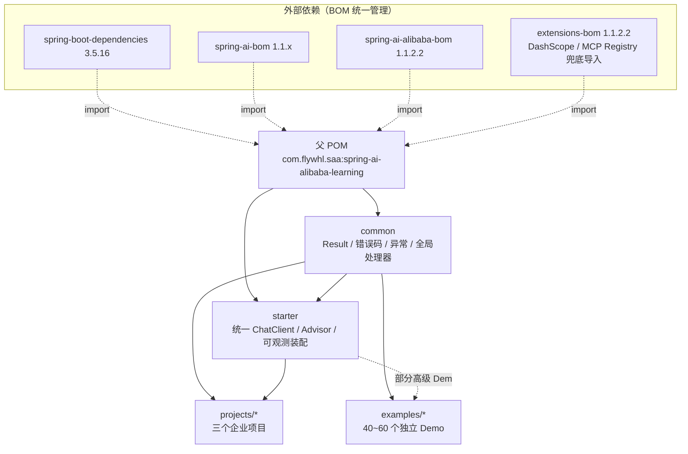
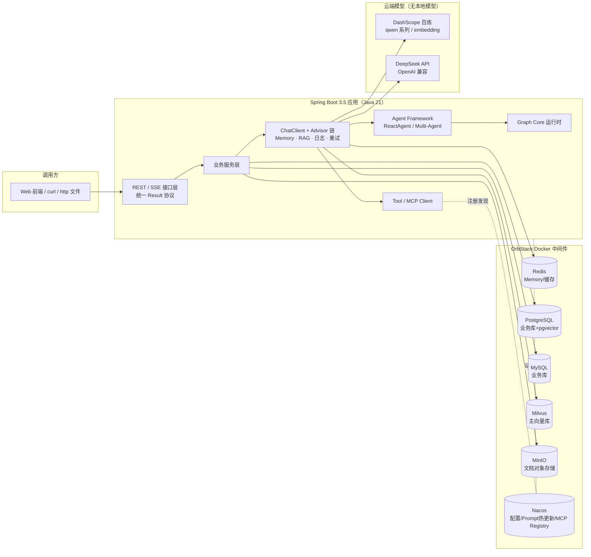

# 项目总体架构与目录规划

> 本文档定义仓库的目录结构、模块关系、统一规范与 SSOT 策略，是后续所有 Phase 的结构性约束。任何阶段的新增内容不得与本文档冲突；确需调整时先修订本文档。

---

## 1. 仓库目录结构（SSOT）

```
spring-ai-alibaba-learning/
├── pom.xml                     # 父 POM：唯一的版本管理入口（BOM + 插件 + 编译参数）
├── README.md                   # 仓库门户：快速开始 + 导航
├── .gitignore / .editorconfig  # 统一工程卫生与编码风格基线
├── docs/                       # 教程本体
│   ├── 00-overview/            # Phase 1：路线、版本调研、架构、选型 ADR
│   └── tutorial/               # Phase 2：01~22 章教材级教程
├── common/                     # 公共模块：统一 Result / 错误码 / 异常 / 全局处理器
├── starter/                    # 统一 AI Starter（Phase 2 第 19 章随企业实践落地）
├── examples/                   # Phase 3：40~60 个独立可运行 Demo 工程
├── projects/                   # Phase 4~6：三个企业级完整项目
│   ├── knowledge-qa-platform/  # 项目一：AI 企业知识库问答平台
│   ├── office-agent-assistant/ # 项目二：企业 AI Agent 办公助手
│   └── smart-cs-platform/      # 项目三：智能客服 Agent 平台
├── scripts/                    # 环境自检、API Key 模板、中间件生命周期脚本
├── docker/                     # 统一 docker-compose（profile 分组）
└── images/                     # 文档截图与静态资源
```

**模块挂载策略**：`common` 常驻父 POM `<modules>`；`starter` 于第 19 章实现后挂载；`examples/*` 与 `projects/*` 均为**独立 Spring Boot 应用**，以 `<parent>` 指向本父 POM 继承版本管理，但按阶段逐个挂入 `<modules>`（保证任一时刻 `mvn clean install` 全绿）。

---

## 2. 模块依赖架构



依赖方向规则：**只允许自上而下**（projects/examples → starter → common），严禁反向依赖与横向依赖（Demo 之间、项目之间互不依赖）。

---

## 3. 运行时总体架构（企业项目共用形态）



---

## 4. SSOT（单一事实来源）落地清单

| 事项 | 唯一来源 | 复用方式 |
|---|---|---|
| 依赖与插件版本 | 父 `pom.xml` properties + dependencyManagement | 子模块零版本号 |
| 版本选型依据 | `docs/00-overview/02-版本调研报告.md` | 各章"版本差异"小节引用 |
| Result / 错误码 / 异常 | `common` 模块 | 全部工程依赖，禁止重复定义 |
| AI 统一装配（ChatClient/Advisor/可观测） | `starter` 模块（第 19 章落地） | 企业项目直接引 starter |
| 中间件编排 | `docker/docker-compose.yml`（profile 分组） | Demo/项目 README 只写 profile 组合命令 |
| API Key 注入 | 环境变量 `AI_DASHSCOPE_API_KEY` / `DEEPSEEK_API_KEY` | `scripts/setup-env.example.sh` 模板 |
| 章节结构模板 | `docs/README.md` 中的章节骨架 | 22 章统一 |
| Demo README 模板 | `examples/README.md` §3 | 40~60 个 Demo 统一 |

---

## 5. 统一编码与接口规范

### 5.1 命名与包结构

- GroupId：`com.flywhl.saa`；根包：`com.flywhl.saa.<module>`；
- 应用工程分层包：`controller / service / config / model(dto·vo·entity) / tool / agent / rag / mapper`；
- Maven 模块命名：`saa-learning-common`、`saa-learning-starter`、Demo 用 `<主题>-demo`、项目用业务语义命名；
- 类命名：接口不加 `I` 前缀；DTO 后缀 `Request/Response`，视图 `VO`，持久化 `Entity/PO`；MapStruct 转换器后缀 `Converter`。

### 5.2 接口协议

- 同步接口一律返回 `Result<T>`（`code=0` 成功；错误码分段见 `ResultCode` Javadoc）；
- 分页统一 `Result<PageResult<T>>`；
- 流式接口统一 `text/event-stream`，事件类型约定：`message`（增量文本）、`meta`（usage/citation 等元信息）、`error`（payload 复用 `Result` 结构）、`done`；
- 所有接口提供 OpenAPI 注解，Knife4j 文档路径统一 `/doc.html`。

### 5.3 配置与日志

- 配置文件统一 `application.yml`（禁 properties），敏感项一律 `${ENV_VAR}` 占位；
- 端口分配：examples 从 `18000` 起按 Demo 编号递增（`18001`、`18002`…），projects 使用 `19100/19200/19300` 段，避免与中间件冲突；
- 日志统一 SLF4J + Logback，业务日志中文、框架日志默认；关键 AI 调用打印 model、tokens、耗时（第 18 章统一到指标体系）。

### 5.4 测试

- 单元测试 JUnit 5 + AssertJ；涉及中间件的集成测试用 Testcontainers（版本由 Boot BOM 管理）；
- 涉及真实模型调用的测试标注 `@EnabledIfEnvironmentVariable(named = "AI_DASHSCOPE_API_KEY", ...)`，保证无 Key 环境下 `mvn clean install` 仍全绿。

---

## 6. Git 与版本管理约定

- 分支模型：`main`（可运行基线）+ `phase/*`（阶段开发）；
- Commit 规范：`<type>(<scope>): <subject>`，type ∈ feat/fix/docs/refactor/test/chore，scope 用模块名（如 `feat(examples/rag-demo): 支持混合检索`）；
- 每完成一个 Phase 打 tag：`phase-1`、`phase-2` …，保证任意 tag 检出后 `docker compose up` + `mvn clean install` 可复现。
