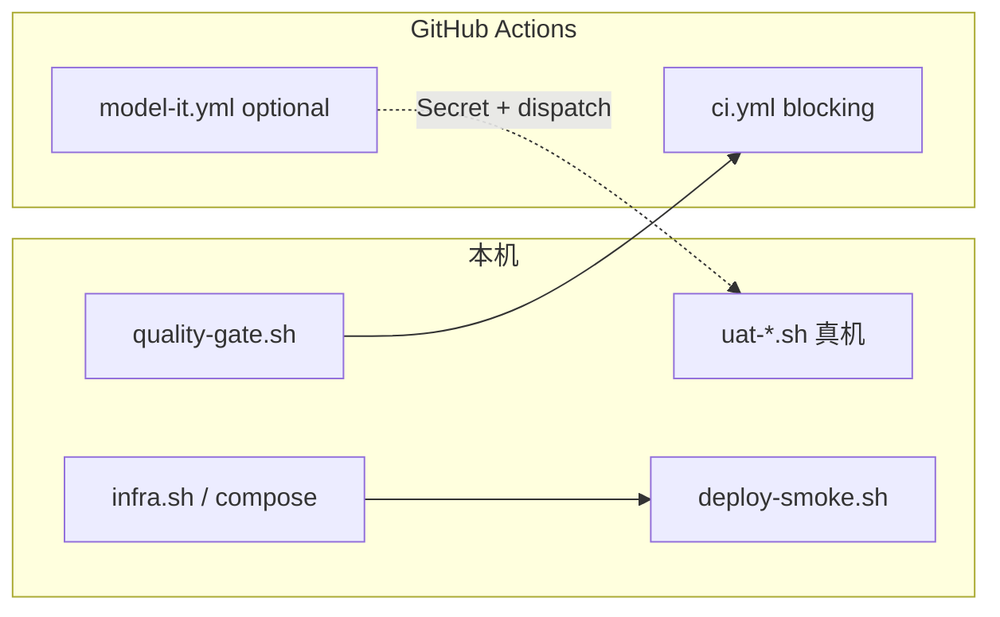

# 05 — 生产化与运维

> Phase 7 收口文档（D-10 / D-11 / D-12）。教学仓目标是「一键可验证」，不是云上 K8s 生产集群。

## 1. 目标与非目标

| 做 | 不做 |
|---|---|
| GitHub Actions blocking CI + optional 模型 IT | 完整 K8s / Helm / 云托管发布 |
| `quality-gate.sh` 本地与 CI 统一门禁 | 默认 CI 跑全量 48 Demo `spring-boot:run` |
| Compose + `infra.sh` + 项目 override 部署路径 | Spring Boot 4 / Spring AI 2.0 升级（deferred） |
| 排障与教学级调优提示 | 把演示口令当生产密钥 |



## 2. CI 说明

仓库已提供两套工作流（详见源文件，勿在文档里复制整份 YAML）：

| Workflow | 路径 | 触发 | 依赖 Key？ | 作用 |
|---|---|---|---|---|
| **CI**（blocking） | [`.github/workflows/ci.yml`](../../.github/workflows/ci.yml) | `push` / `pull_request` → `main`，以及 `workflow_dispatch` | **否** | `common`+`starter` install、examples 编译矩阵、三项目 `test`、`quality-gate.sh` |
| **Model IT**（optional） | [`.github/workflows/model-it.yml`](../../.github/workflows/model-it.yml) | 仅 `workflow_dispatch` | 需 Repository Secret `AI_DASHSCOPE_API_KEY` | 有 Key 时跑 `projects/smart-cs-platform` 模型 IT；无 Key 则 check job 输出 `defined=false`，整体仍成功 |

要点：

- 默认 CI **永不**依赖 `AI_DASHSCOPE_API_KEY`（D-03 / D-09）。
- optional 模型 IT 须在 GitHub → Settings → Secrets 配置 Key 后，手动 **Run workflow**。
- examples / projects 一律 `mvn -f path/pom.xml`（不在父 reactor 时禁止 `-pl` 模块名）。

## 3. 质量门禁

本地与 CI 的**唯一 blocking 入口**：

```bash
bash scripts/quality-gate.sh
```

对齐 [HANDOFF §7](../../HANDOFF-TO-CLAUDE-CODE.md) 清单：真实编译抽样、`version-audit.sh`、双 BOM 断言、`spring-ai-2-readiness.sh`（带基线）、废弃 API / 硬编码密钥 / TODO 扫描。

真机 curl / UAT **不进默认 CI**（D-05 / D-08 / D-13），走既有脚本：

| 范围 | 脚本 |
|---|---|
| Phase 3 Demo 抽样 | `scripts/uat-phase3.sh` |
| 知识库问答 | `scripts/uat-knowledge-qa.sh` |
| 办公助手 | `projects/office-agent-assistant/scripts/uat-office-agent.sh` |
| 智能客服 | `projects/smart-cs-platform/scripts/uat-smart-cs.sh` |

### 3.1 UAT 债务

真机 curl / 人工 UAT **不进默认 CI**。可发现入口：[06-UAT债务索引.md](06-UAT债务索引.md)（D-13）。Phase 级 `*-HUMAN-UAT.md` / `*-UAT.md` 仍为债务 SSOT；本索引不改写既有结论。

## 4. 部署步骤（Compose，非 K8s）

### 4.1 密钥与环境

```bash
cp scripts/setup-env.example.sh scripts/setup-env.local.sh   # 模板，勿提交真实 Key
# 编辑 local 文件填入 Key 后：
source scripts/setup-env.local.sh
bash scripts/env-check.sh
```

密钥**仅**经环境变量注入（`AI_DASHSCOPE_API_KEY` 等）。切勿写入 `application.yml` 或提交到 Git。

> **安全：** 各企业项目 README 中的演示账号（如 `admin` / `admin123`）仅限本机演示，**上线前必须替换**；生产密码一律 BCrypt，禁止 `{noop}`。

### 4.2 中间件 profiles

统一编排在 [`docker/docker-compose.yml`](../../docker/docker-compose.yml)，由 [`scripts/infra.sh`](../../scripts/infra.sh) 封装常用组合：

| Profile | 典型内容 |
|---|---|
| `core` | Redis / PostgreSQL / MySQL / MinIO 等基座 |
| `vector` | Milvus（+ etcd / MinIO 依赖）；冷启动约 **30~60s** |
| `mq` | Kafka / RabbitMQ |
| `search` | Elasticsearch |
| `cloud` | Nacos 等 |

```bash
bash scripts/infra.sh up core
bash scripts/infra.sh up core vector    # RAG / 向量场景
bash scripts/infra.sh ps
bash scripts/infra.sh down
```

### 4.3 三企业项目（override 叠加）

端口 SSOT：[`projects/README.md`](../../projects/README.md) — **19100 / 19200 / 19300**（勿与 Demo `180NN` 冲突）。

```bash
# 知识库问答 · 19100
docker compose -f docker/docker-compose.yml \
  -f projects/knowledge-qa-platform/docker-compose.override.yml \
  --profile core --profile vector --profile cloud --profile kqa up -d

# 办公助手 · 19200
docker compose -f docker/docker-compose.yml \
  -f projects/office-agent-assistant/docker-compose.override.yml \
  --profile core --profile office up -d

# 智能客服 · 19300
docker compose -f docker/docker-compose.yml \
  -f projects/smart-cs-platform/docker-compose.override.yml \
  --profile core --profile vector --profile search --profile cloud --profile smartcs up -d
```

等 `docker compose ps` 全部 healthy 后再起应用（尤其含 Milvus 时）。

```bash
mvn -pl common,starter -am clean install -DskipTests
mvn -f projects/<proj>/pom.xml spring-boot:run
# 或 package 后：
# java -jar projects/<proj>/target/<artifact>*.jar
curl -sf http://localhost:19100/actuator/health   # kqa
curl -sf http://localhost:19200/actuator/health   # office
curl -sf http://localhost:19300/actuator/health   # smartcs
```

### 4.4 一键 smoke 骨架

```bash
bash scripts/deploy-smoke.sh kqa              # 或 office / smartcs
bash scripts/deploy-smoke.sh kqa --skip-infra # 中间件已 up
bash scripts/deploy-smoke.sh kqa --no-start   # 只 package，不后台起 jar
```

脚本复用上述 compose override，内含 wait/retry（可用 `DEPLOY_SMOKE_WAIT_SEC` 拉长等待），再 `curl` `/actuator/health`。

### 4.5 可选：容器镜像

本阶段**不强制**三份 Dockerfile（D-10/D-11：文档 + Compose 足够）。若需镜像：

```bash
# 可选：Spring Boot 构建镜像（需本机 Docker）
mvn -f projects/<proj>/pom.xml -DskipTests spring-boot:build-image
# 或自行手写 Dockerfile 多阶段构建 —— 非本仓库硬性交付物
```

## 5. 常见排障

| 现象 | 排查 |
|---|---|
| Milvus / 向量相关 IT 或应用启动失败 | 冷启动 30~60s；`docker compose ps` 等 healthy；增大 `DEPLOY_SMOKE_WAIT_SEC` |
| Redis 向量 / JSON 特性报错 | 需 `redis/redis-stack-server`（如 smartcs `scs-redis-stack` 6380），普通 redis 不够 |
| 模型调用 401 / 空 Key | `source` setup-env 后 `bash scripts/env-check.sh`；确认未把 Key 写进 yml |
| 端口占用 | 企业项目 19100/19200/19300；Demo 为 `180NN`；`lsof -i :<port>` |
| 本地 IT 跳过、CI 有 Docker 才跑 | Testcontainers 条件跳过属预期；无 Key 时 `@EnabledIfEnvironmentVariable` 跳过模型测 |
| `mvn -pl examples/...` 找不到模块 | examples/projects 不在父 modules → 用 `mvn -f path/pom.xml` |

## 6. 调优（教学够用）

- **JVM：** 本机演示默认堆即可；压测时再调 `-Xms`/`-Xmx`，勿一上来堆几 GB。
- **连接池：** 中间件连接数跟 Docker 资源匹配；多 Demo 并行时注意 PG/MySQL 连接打满。
- **向量维度：** Embedding 统一 DashScope `text-embedding-v4`，`dimensions=1024`（与仓库约定一致）；勿混用维度导致检索失败。
- **成本：** 真机 UAT / model-it 会消耗 Token；日常用 mock / 无 Key 跳过路径。

## 7. 相关入口

- 质量门禁：`bash scripts/quality-gate.sh`
- CI：[`.github/workflows/ci.yml`](../../.github/workflows/ci.yml) · [`.github/workflows/model-it.yml`](../../.github/workflows/model-it.yml)
- UAT 债务索引：[06-UAT债务索引.md](06-UAT债务索引.md)
- 中间件：`bash scripts/infra.sh up core`
- 部署 smoke：`bash scripts/deploy-smoke.sh <kqa|office|smartcs>`
- 企业项目蓝图：[projects/README.md](../../projects/README.md)
- 版本锁定：根 [CLAUDE.md](../../CLAUDE.md) / [02-版本调研报告.md](02-版本调研报告.md)
