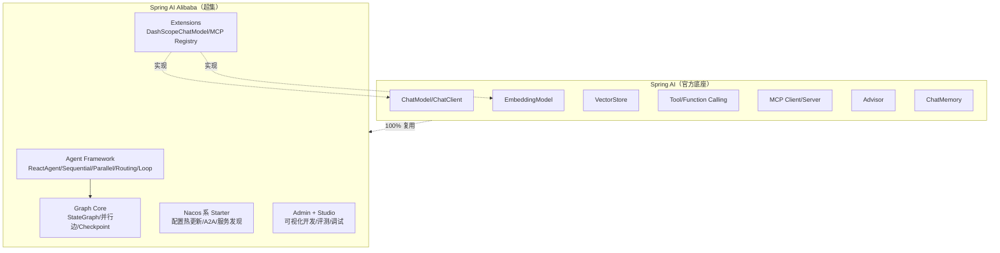
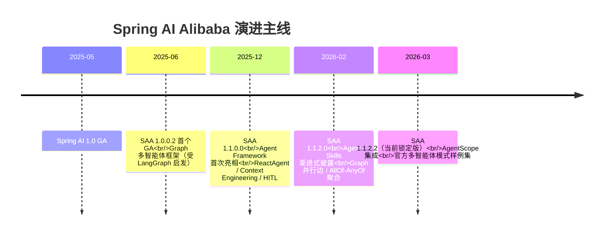
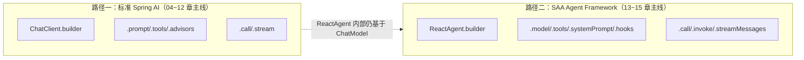

# 第 01 章：为什么需要 Spring AI Alibaba

## 学习目标

- 能够准确说出 Spring AI 与 Spring AI Alibaba（以下简称 SAA）的关系与边界，不再把两者混为一谈；
- 能够在 SAA、纯 Spring AI、LangChain4j 三者之间，针对具体业务场景做出有依据的技术选型；
- 理解 SAA 从 1.0.x 到 1.1.2.2 的演进主线，明确"几个月前的早期 Demo 经验"哪些还成立、哪些已过期；
- 跑通一个最小可运行的 SAA 应用，验证本地环境（JDK 21 / DashScope Key）配置无误，为后续 21 章打好地基。

## 前置知识

- 熟悉 Spring Boot 3.x 自动装配、Starter 机制；
- 了解至少一种 LLM 应用开发框架的核心概念（你已有 LangGraph / FastAPI / MCP 经验，这是巨大优势）；
- 无需提前了解 Spring AI，本章会讲清楚它和 SAA 的分工。

## 核心概念

### 1.1 一句话讲清楚两者关系

**Spring AI** 是 Spring 官方维护的 AI 应用开发框架，定位是"Java 世界的 LangChain 底座"：它定义了 `ChatModel`、`ChatClient`、`EmbeddingModel`、`VectorStore`、`Tool`、`Advisor`、`ChatMemory`、MCP 客户端/服务端等**标准抽象**，并为 20 余种模型厂商、20 余种向量库提供了 Starter 实现。

**Spring AI Alibaba** 不是另起炉灶的框架，而是 **构建在 Spring AI 之上的超集**：它 100% 复用 Spring AI 的底层抽象（你学的 ChatClient/Advisor/Tool/MCP 知识全部有效），并在此基础上补齐了 Spring AI 官方不做的三类能力：

1. **智能体与多智能体编排**（Agent Framework + Graph）——对标你熟悉的 LangGraph；
2. **阿里云生态深度集成**（DashScope 百炼模型、Nacos 配置/注册/MCP Registry、ARMS 可观测）；
3. **平台化工具链**（Admin 可视化开发与评测、Studio 调试 UI）。



一句话记忆：**"会 Spring AI 就已经会了 SAA 的 60%，SAA 教你的是另外那 40%——智能体编排与企业云原生落地"**。

### 1.2 为什么 Java 生态需要这样一层超集

你在 Python 侧的经验是：LangChain 提供底座，LangGraph 提供编排，两者社区独立演进、版本对齐有摩擦。Java 生态选择了不同的路：Spring AI 专注做好底座（这是 Spring 官方的强项——标准化抽象与生态集成），而编排、企业特性这类"离生产场景更近、需要快速迭代"的部分，交给深耕阿里内部大规模落地经验的 SAA 团队来做，两者用 BOM 版本对齐机制保持同步（详见 `docs/00-overview/02-版本调研报告.md`）。这不是竞争关系，而是分层协作——这也是为什么本教程前半部分（04~12 章）同时也是一份合格的 Spring AI 教程。

### 1.3 三个框架的选型对比

| 维度 | 纯 Spring AI 1.1.x | **Spring AI Alibaba 1.1.2.2** | LangChain4j |
|---|---|---|---|
| 底层抽象完整度 | ✅ 原生、最权威 | ✅ 完全继承 | ✅ 自成体系，与 Spring AI 不互通 |
| 多智能体/工作流编排 | ✗ 无官方方案 | ✅ Agent Framework + Graph，官方内置 Sequential/Parallel/Routing/Loop/Supervisor/Handoffs 六种模式 | △ 依赖社区扩展，无官方共识范式 |
| 国产模型与百炼集成 | △ 需自行适配 OpenAI 兼容层 | ✅ DashScope 官方一等公民，覆盖对话/向量/多模态/语音 | △ 需社区适配 |
| 企业云原生（配置热更新/分布式注册/A2A） | ✗ | ✅ Nacos 系差异化能力 | ✗ |
| 平台化（可视化开发/评测） | ✗ | ✅ Admin/Studio | ✗ |
| 生态迁移成本 | — | ✅ 与纯 Spring AI 代码零冲突，随时可"退化"为只用底座 | ✗ 迁移成本高，API 体系完全不同 |
| 社区活跃度（2026-07） | 高（Spring 官方） | 高（10k+ Star，阿里内部大规模生产验证） | 中 |

**结论**：对于企业级 Java AI 应用，尤其是需要多智能体编排 + 国内模型 + 云原生落地的场景，SAA 是目前唯一同时满足"官方级底座 + 生产级编排 + 中国生态"三个条件的选择。这也是本教程的选型依据（完整决策记录见 `docs/00-overview/04-技术选型ADR.md` 的 ADR-001）。

### 1.4 从"几个月前的早期 Demo"到 1.1.2.2：你需要重建的心智模型

你提到几个月前学习过 SAA 的早期 Demo，大概率停留在 1.0.x 时代。1.0 → 1.1 不是小版本迭代，而是一次**结构性重组**，具体差异见第 21 章《版本升级指南》，这里先建立整体认知：



关键心智升级点：

1. **模块从"单体"变为"分层"**：1.0.x 时代你可能直接用 `spring-ai-alibaba-graph-core` 手搓一切；1.1.x 起官方强烈建议优先用 **Agent Framework** 的内置模式（`ReactAgent`、`SequentialAgent`、`ParallelAgent`、`LlmRoutingAgent`），只有内置模式无法满足时才下沉到 Graph API 自己编排节点——这与你在 LangGraph 里"先试 `create_react_agent`，不够用再手写 `StateGraph`"的直觉完全一致。
2. **DashScope 独立发版**：模型接入实现搬到了 `spring-ai-extensions` 仓库，版本号与 SAA 主线略有差异但同步发布（1.1.2.2 起已统一由 `spring-ai-alibaba-bom` 管理，不必再单独关注）。
3. **企业能力从"文档提及"变为"内置一等公民"**：Nacos 动态配置、A2A、MCP Registry 在 1.1.x 里有专门的 Spring Boot Starter，而不再是"自己拼装"。

## API 深入解析：两条并行的入口

SAA 1.1.x 给你两条 API 路径，理解这个分野对后续所有章节至关重要：



- **路径一**（ChatClient）：适合"一次问答 / 简单增强"场景，是 04~12 章的主线，写法与官方 Spring AI 文档完全一致；
- **路径二**（ReactAgent）：适合"需要多轮推理-行动循环、工具调用、记忆、人工确认"的智能体场景，是 13~15 章的主线，底层仍然依赖 `ChatModel`。

两条路径共享同一套 `ChatModel`/`Tool`/`ChatMemory` 基础设施，这也是为什么本教程把 ChatClient（04 章）安排在 Agent（13 章）之前——先打好共享地基。

## 可运行 Demo：验证环境的最小应用

对应仓库位置：`examples/01-quickstart-demo`（Phase 3 交付为独立工程；以下代码可直接复制到本地按同样目录结构运行，用于本章验证环境）。

### 目录结构

```
quickstart-demo/
├── pom.xml
└── src/main/
    ├── java/com/flywhl/saa/quickstart/
    │   ├── QuickstartApplication.java
    │   └── ChatController.java
    └── resources/
        └── application.yml
```

### pom.xml

```xml
<?xml version="1.0" encoding="UTF-8"?>
<project xmlns="http://maven.apache.org/POM/4.0.0"
         xmlns:xsi="http://www.w3.org/2001/XMLSchema-instance"
         xsi:schemaLocation="http://maven.apache.org/POM/4.0.0 https://maven.apache.org/xsd/maven-4.0.0.xsd">
    <modelVersion>4.0.0</modelVersion>

    <parent>
        <groupId>com.flywhl.saa</groupId>
        <artifactId>spring-ai-alibaba-learning</artifactId>
        <version>1.0.0-SNAPSHOT</version>
        <relativePath>../../pom.xml</relativePath>
    </parent>

    <artifactId>quickstart-demo</artifactId>
    <packaging>jar</packaging>
    <name>01 · Quickstart Demo</name>

    <dependencies>
        <dependency>
            <groupId>org.springframework.boot</groupId>
            <artifactId>spring-boot-starter-web</artifactId>
        </dependency>
        <!-- SAA DashScope Starter：版本由父 POM 导入的 spring-ai-alibaba-bom + spring-ai-alibaba-extensions-bom 共同管理，此处无需写版本号 -->
        <dependency>
            <groupId>com.alibaba.cloud.ai</groupId>
            <artifactId>spring-ai-alibaba-starter-dashscope</artifactId>
        </dependency>
    </dependencies>

    <build>
        <finalName>quickstart-demo</finalName>
        <plugins>
            <plugin>
                <groupId>org.springframework.boot</groupId>
                <artifactId>spring-boot-maven-plugin</artifactId>
            </plugin>
        </plugins>
    </build>
</project>
```

### application.yml

```yaml
server:
  port: 18001

spring:
  application:
    name: quickstart-demo
  ai:
    dashscope:
      api-key: ${AI_DASHSCOPE_API_KEY}
      chat:
        options:
          model: qwen-plus
          temperature: 0.7

logging:
  level:
    com.alibaba.cloud.ai: INFO
```

> `AI_DASHSCOPE_API_KEY` 是 SAA 官方约定的标准环境变量名，配合 `scripts/setup-env.local.sh` 加载。

### QuickstartApplication.java

```java
package com.flywhl.saa.quickstart;

import org.springframework.boot.SpringApplication;
import org.springframework.boot.autoconfigure.SpringBootApplication;

/**
 * 最小可运行 SAA 应用：验证 JDK 21 / DashScope Key / 网络配置是否正确。
 *
 * @author flywhl
 */
@SpringBootApplication
public class QuickstartApplication {

    public static void main(String[] args) {
        SpringApplication.run(QuickstartApplication.class, args);
    }
}
```

### ChatController.java

```java
package com.flywhl.saa.quickstart;

import org.springframework.ai.chat.client.ChatClient;
import org.springframework.web.bind.annotation.GetMapping;
import org.springframework.web.bind.annotation.RequestParam;
import org.springframework.web.bind.annotation.RestController;

/**
 * 最小问答接口：通过 ChatClient 调用 DashScope，验证端到端链路。
 *
 * @author flywhl
 */
@RestController
public class ChatController {

    private final ChatClient chatClient;

    public ChatController(ChatClient.Builder chatClientBuilder) {
        // ChatClient.Builder 由 spring-ai-alibaba-starter-dashscope 自动装配注入，
        // 这正是第 03 章 AutoConfiguration 要深入剖析的机制
        this.chatClient = chatClientBuilder.build();
    }

    @GetMapping("/chat")
    public String chat(@RequestParam(defaultValue = "用一句话介绍你自己") String message) {
        return chatClient.prompt()
                .user(message)
                .call()
                .content();
    }
}
```

### 运行

```bash
cd examples/01-quickstart-demo
source ../../scripts/setup-env.local.sh   # 加载 AI_DASHSCOPE_API_KEY
mvn spring-boot:run
```

### 验证

```bash
curl "http://localhost:18001/chat?message=你好，介绍一下你自己"
```

### 预期输出

```text
你好！我是通义千问，阿里云研发的超大规模语言模型...
```

看到这段文字，说明你的 JDK 21、Maven 父子模块继承、DashScope Key、网络出网全部配置正确——后续 21 章的所有 Demo 都建立在这个已验证的地基之上。

## 关键源码解读

这里只做初步定位，完整源码分析在第 03 章展开。你需要知道：`ChatClient.Builder` 是怎么"凭空"注入进 `ChatController` 构造器的？

答案在 `spring-ai-alibaba-starter-dashscope` 的自动装配类里：Starter 内的 `DashScopeAutoConfiguration`（位于 `com.alibaba.cloud.ai.dashscope.chat` 包）读取 `spring.ai.dashscope.*` 配置，构造 `DashScopeApi` → `DashScopeChatModel`（实现 Spring AI 的 `ChatModel` 接口）→ 再由 Spring AI 核心的 `ChatClientAutoConfiguration` 基于这个 `ChatModel` 生成 `ChatClient.Builder` Bean。这是一条标准的"厂商实现 `ChatModel` 接口 + Spring AI 通用装配 `ChatClient`"链路，也是 SAA 作为 Spring AI 生态一员的典型体现。

## 企业实践建议

- **不要跳过"标准 Spring AI"这一层直接学 Agent**：即便你的目标是做多智能体系统，ChatClient/Advisor/Tool 这层的扎实理解决定了你 Debug Agent 问题的效率——Agent 出错 90% 的情况根因在底层模型调用配置；
- **版本对齐要成为团队纪律**：把"父 POM 统一 BOM 版本"作为团队规范写进 Code Review Checklist，避免出现"某个微服务用了 1.0.x 的 API 写法"这种技术债；
- **新项目起步就用 1.1.2.2**：不要因为"网上教程还是 1.0.x 的多"而选择旧版本，1.0.x 已经是事实上的历史版本，选型应面向未来 12 个月。

## 性能优化建议

本章 Demo 层面尚无性能话题，但可以先建立一个认知：ChatClient 每次 `.build()` 都会创建新的 Advisor 链实例，生产代码应该像上面的 Demo 一样在构造函数中**只 build 一次**，作为单例复用，而不是在每个请求方法内重复 `.build()`——这是后续 04/06 章会反复强调的高频踩坑点。

## 安全建议

- API Key 通过环境变量注入（如本章 Demo），**绝不**写入 `application.yml` 的默认值或提交到 Git；
- 生产环境建议将 Key 托管在 Vault / KMS，通过 Spring Cloud Config 或 Nacos 动态注入（第 20 章展开）。

## 常见踩坑

| 现象 | 原因 | 解决 |
|---|---|---|
| 启动报 `Could not resolve placeholder 'AI_DASHSCOPE_API_KEY'` | 环境变量未加载 | `source scripts/setup-env.local.sh` 后再启动，或用 IDE 的 Run Configuration 注入环境变量 |
| `ChatClient.Builder` 注入失败，提示找不到 Bean | 只引入了 `spring-ai-bom`，没引入具体模型的 Starter（如 `spring-ai-alibaba-starter-dashscope`） | Spring AI 的自动装配是"按 Starter 触发"的条件装配，必须显式引入模型实现 Starter |
| 调用报 401 | Key 无效或百炼账号未开通对应模型 | 登录 [百炼控制台](https://bailian.console.aliyun.com) 检查 Key 状态与模型开通情况 |
| Maven 找不到 `spring-ai-alibaba-bom` | 未使用父 POM 或本地仓库未同步 | 确认 `<parent>` 指向仓库根 `pom.xml`，执行 `mvn -U clean install` 强制刷新 |

## 版本差异

| 项 | 1.0.x（早期 Demo 常见写法） | 1.1.2.2（本教程写法） |
|---|---|---|
| 编排入口 | 直接用 `spring-ai-alibaba-graph-core` 手写 `StateGraph` | 优先用 `spring-ai-alibaba-agent-framework` 的 `ReactAgent`/内置多智能体模式 |
| DashScope 依赖 | `spring-ai-alibaba-starter-dashscope` 随主 BOM 一起但版本经常滞后 | 版本由 `spring-ai-alibaba-extensions-bom` 统一管理，与主 BOM 同时导入即可，无需单独声明版本号 |
| Memory | 依赖 `spring-ai-alibaba-starter-memory` 早期实现 | 采用 Agent Framework 的 `MemorySaver`/`Checkpointer` 体系，语义更清晰 |
| 企业集成 | 需自行拼装 Nacos 客户端 | `spring-boot-starters` 提供官方 A2A/动态配置 Starter |

## 为什么这样设计

有人会问：为什么不像 LangChain4j 一样自成体系，而要"寄生"在 Spring AI 之上？这背后是一个务实的工程判断——**标准化的底层抽象天然应该由框架官方来维护**（模型厂商适配、版本兼容、安全补丁这些"苦活"需要长期投入），而**编排范式与企业特性天然应该贴近真实生产场景快速迭代**（阿里内部数百个 Agent 应用的实践反馈，是任何独立开源框架短期内积累不来的）。这种分工使得 SAA 团队可以把精力完全聚焦在"如何让 Agent 在生产环境跑得稳"这个问题上，而不必重新发明 ChatModel 抽象。

## FAQ

**Q：学 SAA 是不是要先精通 Spring AI？**
不需要"精通"，但建议边学边用——本教程 04~12 章会覆盖你需要的全部 Spring AI 核心知识，学完这几章你对纯 Spring AI 的掌握程度已经超过大多数只用 SAA 的开发者。

**Q：SAA 支持 OpenAI/Anthropic 等海外模型吗？**
支持。SAA 完全兼容 Spring AI 的模型抽象，引入对应官方 Starter（如 `spring-ai-starter-model-openai`）即可，与 DashScope 可以在同一应用中共存（第 04 章会演示多模型并存）。

**Q：Graph Core 和 Agent Framework 到底该用哪个？**
默认用 Agent Framework 的内置模式；只有当业务流程复杂到内置模式无法表达（比如需要自定义的状态机分支、跨多个 Agent 的复杂状态合并）时才直接用 Graph API。这个判断标准在第 14/15 章会用真实案例讲清楚。

**Q：1.1.2.1 为什么不能用？**
官方在 Release 页明确标注 1.1.2.1 存在缺陷并建议直接使用 1.1.2.2，本仓库据此锁定 1.1.2.2（详见版本调研报告 §2.1）。

## 本章总结

Spring AI Alibaba 不是与 Spring AI 竞争的框架，而是它的生产级超集：底层抽象（ChatClient/Advisor/Tool/MCP）完全复用 Spring AI，差异化价值在于 Agent Framework + Graph 的多智能体编排能力，以及 Nacos 系的企业云原生集成。当前锁定版本 1.1.2.2 相对你几个月前接触的 1.0.x 是一次结构性升级——编排范式从"手写 Graph"转向"内置 Agent 模式优先"。本章跑通的最小 Demo，验证了后续 21 章赖以运行的环境基座。

## 延伸阅读

- 官方架构图与项目结构：<https://github.com/alibaba/spring-ai-alibaba>
- 官方 ReactAgent 快速开始：<https://java2ai.com/docs/quick-start>
- 版本说明：<https://java2ai.com/docs/versions>
- 本仓库版本调研报告：`docs/00-overview/02-版本调研报告.md`

## 下一章预告

第 02 章将展开 SAA 的整体架构：Agent Framework、Graph Core、Extensions、Admin/Studio 各模块的职责边界与依赖关系，并深入自动装配的触发链路，为第 03 章的源码级分析做铺垫。

## 思考题

1. 如果团队现有系统已经用纯 Spring AI 写了 ChatClient + 自定义 Advisor，迁移到 SAA 需要重写这部分代码吗？为什么？
2. 你在 LangGraph 中用过 Supervisor 模式吗？如果用过，试着预判 SAA 的 `LlmRoutingAgent`/Supervisor 内置模式会与它有哪些相似和不同（第 15 章会验证你的预判）。
3. 为什么本教程把"环境验证 Demo"放在第 01 章而不是等到第 04 章 ChatClient 详解时才给？这种教学顺序设计背后的考虑是什么？
