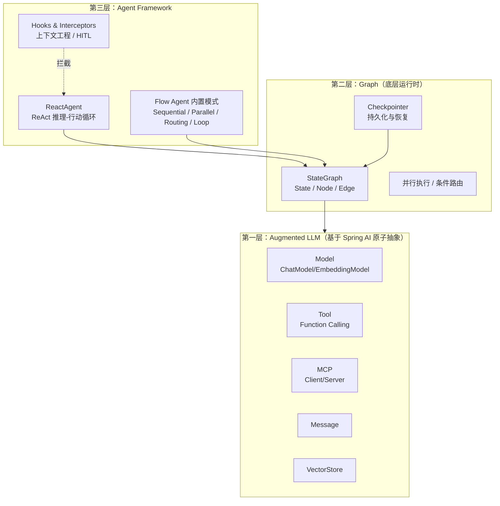
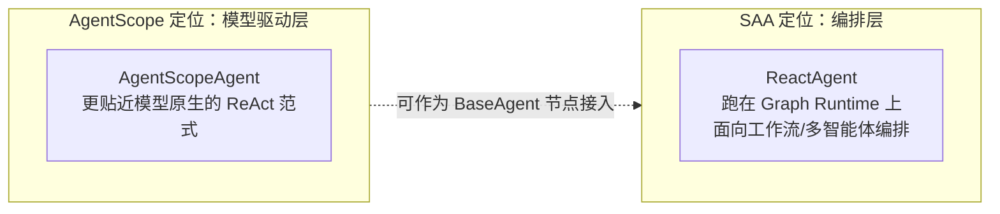
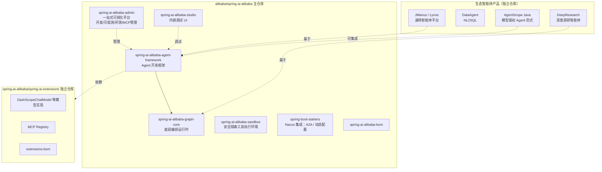
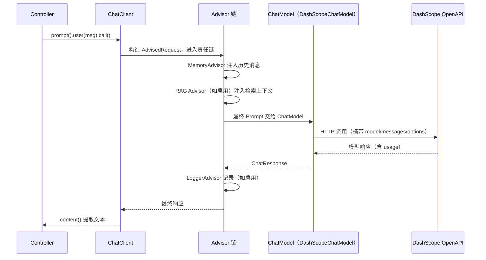
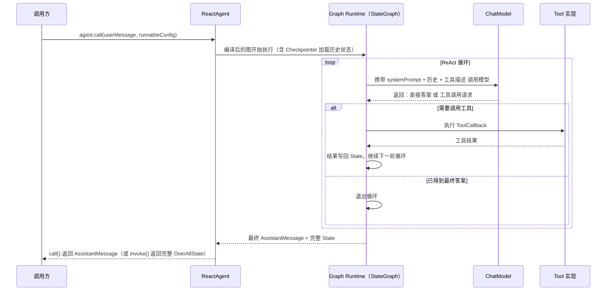
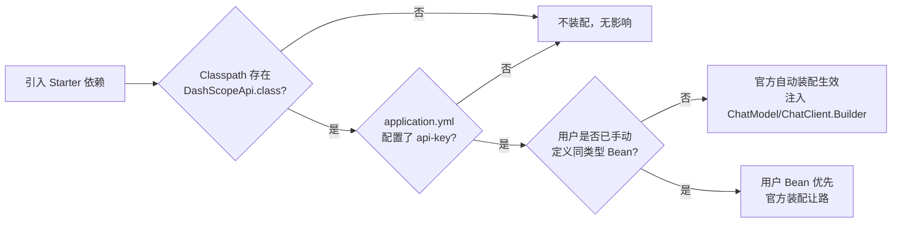

# 第 02 章：整体架构

## 学习目标

- 能画出 SAA 的三层架构图（Agent Framework / Graph / Augmented LLM），并说清每层的职责边界；
- 理解官方模块地图：agent-framework、graph-core、extensions、admin、studio、sandbox、spring-boot-starters 各自解决什么问题；
- 理解一次 ChatClient 调用与一次 ReactAgent 调用在框架内部分别经过哪些组件（为第 03 章自动装配源码分析打基础）；
- 了解 SAA 与 AgentScope、JManus/Lynxe、DataAgent、DeepResearch 等生态项目的关系，避免选型混乱。

## 前置知识

- 已完成第 01 章，理解 Spring AI 与 SAA 的分层关系；
- 了解 Spring Boot 自动装配的基本概念（`@Conditional*`、`spring.factories`/`AutoConfiguration.imports`）。

## 核心概念

### 2.1 官方三层架构

SAA 官方文档明确给出了三层架构定义，这是理解整个框架最重要的一张图：



三层各自的职责非常清晰，用一句话概括：

- **Augmented LLM 层**：回答"如何和一次模型调用打交道"（模型、工具、消息、向量、MCP）——这层就是标准 Spring AI；
- **Graph 层**：回答"如何把多次调用编排成一个有状态的流程"（图、状态、检查点、并行）——这是 SAA 对标 LangGraph 的核心；
- **Agent Framework 层**：回答"如何用最少代码构建一个能推理-行动的智能体"（ReactAgent 及内置多智能体模式）——这是面向业务开发者的高层封装，底层跑在 Graph Runtime 之上。

### 2.2 一个重要的战略信号：ReactAgent 与 AgentScope 的分工

官方文档在架构页有一段容易被忽略但很关键的说明：**SAA 的 `ReactAgent` 实际运行在 Graph Runtime 之上，其设计目标侧重工作流与多智能体编排**；如果需要更"模型原生驱动"的 ReactAgent 范式，官方建议使用新发布的 **AgentScope**（`spring-ai-alibaba-starter-agentscope`，1.1.2.2 起可用）。SAA 的 ReactAgent 会继续维护（缺陷修复与安全补丁），但团队重心转向"Spring AI 集成与多智能体协同"。



对你的实际影响：本教程第 13~15 章以 SAA 原生 `ReactAgent` + Flow Agent 模式为主线（这是当前生产验证最充分、文档最完整的路径），并在第 13 章附一节介绍 AgentScope 集成方式作为扩展阅读——这样你既掌握了主流生产范式，也了解了框架演进方向，不会在两年后发现自己学的是"过时分支"。

### 2.3 官方模块地图



| 模块 | 一句话定位 | 你会在第几章用到 |
|---|---|---|
| `spring-ai-alibaba-agent-framework` | Agent 开发框架，ReactAgent + 内置多智能体模式 | 13、15 |
| `spring-ai-alibaba-graph-core` | 底层图编排运行时 | 14 |
| `spring-ai-alibaba-admin` | 可视化开发/可观测/评测/MCP 管理平台，支持 Dify DSL 迁移 | 18（选读） |
| `spring-ai-alibaba-studio` | 内嵌调试 UI | 13（选读） |
| `spring-ai-alibaba-sandbox` | 工具安全隔离执行环境 | 07 |
| `spring-boot-starters`（Nacos 系） | A2A、动态配置、MCP Registry 的 Spring Boot Starter | 05、12、15、20 |
| `spring-ai-alibaba-starter-dashscope`（extensions 仓库） | DashScope 模型实现，1.1.2.2 起版本收编入主 BOM | 04、10 |
| `spring-ai-alibaba-starter-agentscope` | AgentScope 集成，1.1.2.2 新增 | 13（选读） |

## 原理与架构：两条调用链路的完整生命周期

### 2.4 路径一：ChatClient 调用生命周期



这条链路你在第 01 章的 Demo 中已经实际跑通过一次；第 06 章会把 Advisor 链的责任链模式、顺序控制、自定义 Advisor 讲透。

### 2.5 路径二：ReactAgent 调用生命周期



对比两条链路，你会发现一个关键差异：**ChatClient 是"一问一答"的线性责任链**，而 **ReactAgent 是"循环执行"的状态机**——这正是 Agent 与普通 LLM 调用的本质区别，也是为什么 Agent 需要 Checkpointer（持久化每一轮的状态，支持中断恢复）而简单 ChatClient 调用不需要。

## API 深入解析：装配触发的入口条件

不用等到第 03 章，这里先建立一个关键认知框架：SAA 的所有自动装配都遵循 Spring Boot 标准的"**条件装配**"模式，触发条件通常是三类：

1. **Classpath 存在性**：`@ConditionalOnClass(DashScopeApi.class)` —— 只有引入了 `spring-ai-alibaba-starter-dashscope` 依赖，相关装配才会激活；
2. **属性开关**：`@ConditionalOnProperty(prefix = "spring.ai.dashscope", name = "api-key")` —— 必须配置了 Key；
3. **Bean 缺失兜底**：`@ConditionalOnMissingBean` —— 用户自定义了同类型 Bean 时，官方自动装配让路。



这个模式对你排查"为什么 Bean 没有被注入"这类问题极其有用——按图上的顺序自上而下排查，90% 的装配问题都能定位。第 03 章会用 `--debug` 启动参数把这个链路"打印"出来给你看。

## 可运行 Demo：用工具"看见"架构

本节不新建业务 Demo，而是用两个命令把第 01 章的 `quickstart-demo` "透视"一遍，直观验证本章讲的模块依赖关系。

### 步骤一：查看真实依赖树

```bash
cd examples/01-quickstart-demo
mvn dependency:tree -Dincludes=com.alibaba.cloud.ai
```

### 预期输出（节选）

```text
[INFO] com.flywhl.saa:quickstart-demo:jar:1.0.0-SNAPSHOT
[INFO] \- com.alibaba.cloud.ai:spring-ai-alibaba-starter-dashscope:jar:1.1.2.2:compile
[INFO]    \- com.alibaba.cloud.ai:spring-ai-alibaba-autoconfigure-dashscope:jar:1.1.2.2:compile
[INFO]       \- com.alibaba.cloud.ai:spring-ai-alibaba-core:jar:1.1.2.2:compile
```

看到 `spring-ai-alibaba-autoconfigure-dashscope` 和 `spring-ai-alibaba-core` 这两个间接依赖了吗？它们正是本章图中"Augmented LLM 层"落到代码里的真实模块——`core` 提供 DashScope API 客户端的通用能力，`autoconfigure` 提供本章 2.6 节讲的条件装配类。

### 步骤二：查看装配条件评估报告

```bash
mvn spring-boot:run -Dspring-boot.run.arguments="--debug"
```

### 预期输出（节选）

```text
=========================
CONDITIONS EVALUATION REPORT
=========================

Positive matches:
-----------------
   DashScopeChatAutoConfiguration matched:
      - @ConditionalOnClass found required class 'com.alibaba.cloud.ai.dashscope.api.DashScopeApi' (OnClassCondition)
      - @ConditionalOnProperty (spring.ai.dashscope.api-key) matched (OnPropertyCondition)
```

这份报告是 Spring Boot 内置能力（`--debug` 参数触发），它会打印**每一个**自动装配类的匹配/不匹配原因，是排查装配问题的第一手资料——建议你把这个命令收藏，后面几乎每一章遇到"为什么这个 Bean 没生效"都会先跑一次这个命令。

## 关键源码解读

从依赖树可以看到，官方按照"三段式"拆分模块，这不是随意为之，而是刻意的架构设计：

- `*-core`：纯粹的领域逻辑（如 DashScope API 客户端封装），不依赖 Spring Boot，可以脱离 Spring 环境单独使用；
- `*-autoconfigure`：Spring Boot 自动装配类，依赖 `*-core`，负责"把普通 Java 对象包装成 Spring Bean"；
- `*-starter`：面向使用者的空 POM，只做依赖聚合（传递 `*-autoconfigure` 和常用配套依赖），这也是为什么你的 `pom.xml` 只需要引入一个 `spring-ai-alibaba-starter-dashscope` 就够了。

这个"core / autoconfigure / starter"三段式是 Spring Boot 生态的标准最佳实践（Spring Boot 官方 Starter 也是这么拆的），第 19 章我们设计仓库自己的 `starter` 模块时会照此结构实现。

## 企业实践建议

- **画出你系统的"分层归属图"**：新功能开发前，先判断这段代码属于哪一层（Augmented LLM / Graph / Agent Framework），能极大减少"过度设计"或"简单问题复杂化"的问题——比如一个纯 FAQ 问答不需要 Agent，一个 ChatClient + RAG Advisor 就够了；
- **关注官方生态但不过早绑定**：AgentScope 集成刚在 1.1.2.2 加入，建议先在非核心链路试点，核心业务链路仍以 ReactAgent 为主，等生态成熟再评估迁移；
- **团队内建立"装配条件评估报告"的排障习惯**：把 `--debug` 报告读取纳入新人 Onboarding 文档。

## 性能优化建议

- Graph Runtime 的 Checkpointer 持久化是有成本的（每一轮状态都要序列化写入），生产环境评估 Checkpointer 后端时要把这个写入频率纳入容量规划（第 08/14 章展开）；
- Admin/Studio 属于开发调试工具，不应该在生产环境常驻部署，按需启停。

## 安全建议

- Sandbox 模块（`spring-ai-alibaba-sandbox`）提供了"安全隔离工具执行环境"，如果你的 Agent 需要执行代码、访问文件系统等高风险工具，应该优先评估接入 Sandbox 而不是直接暴露宿主环境（第 07 章展开）；
- Admin/Studio 的调试端口不应暴露公网，这是第 20 章企业安全实践的一部分。

## 常见踩坑

| 现象 | 原因 | 解决 |
|---|---|---|
| 引入 `graph-core` 后编译报类冲突 | 同时引入了 `agent-framework`（它已经传递依赖了 graph-core）和手动声明的 `graph-core` 造成版本不一致 | 只声明 `agent-framework`，除非明确只用底层 Graph API 且不需要 Agent 封装 |
| `--debug` 报告太长看不过来 | 全量条件评估报告包含所有 Spring Boot 内置装配类 | 用 `grep -A 5 DashScope` 之类命令过滤只看你关心的模块 |
| 以为 Admin 是必需组件 | 混淆了"框架核心"与"平台化工具" | Admin/Studio 是可选的可视化工具，不影响 Agent Framework/Graph 的独立使用 |

## 版本差异

| 项 | 1.0.x | 1.1.2.2 |
|---|---|---|
| 架构分层表述 | 官方文档以 "Graph 多智能体框架" 为核心叙事 | 明确三层架构（Agent Framework / Graph / Augmented LLM），且新增 AgentScope 作为第四方模型驱动范式的接入点 |
| ReactAgent 定位 | 未系统化 | 官方明确其"跑在 Graph Runtime 上，侧重编排"的定位，并与 AgentScope 做了差异化说明 |
| 模块拆分 | 相对集中 | Admin/Studio/Sandbox 独立成模块，`spring-boot-starters` 专门收纳 Nacos 集成 |

## 为什么这样设计

三层架构的好处在于**关注点分离带来的独立演进能力**：Augmented LLM 层跟着 Spring AI 官方节奏走（稳定、标准化），Graph 层作为 SAA 自己的核心资产持续打磨性能与可靠性，Agent Framework 层则可以快速响应业务范式变化（比如快速跟进 Agent Skills、Hooks 这类新兴最佳实践）而不用担心影响底层稳定性。这与你在 LangGraph 生态里观察到的"LangChain 底座稳定、LangGraph 编排层快速迭代"的分工逻辑是一致的工程哲学。

## FAQ

**Q：我该直接学 Graph API 还是 Agent Framework？**
官方设计原则很明确：默认用 Agent Framework 的 `ReactAgent` 与内置多智能体模式，只有当业务复杂到内置模式无法表达（需要超高可靠性、大量自定义逻辑、精确的延迟控制）时才下沉到 Graph API。本教程第 13 章从 Agent Framework 入手，第 14 章再深入 Graph，顺序即是官方推荐的学习路径。

**Q：Admin 和 Studio 是必须部署的吗？**
不是。它们是可选的可视化开发/调试/评测工具，纯代码开发路径完全不依赖它们。

**Q：AgentScope 会取代 ReactAgent 吗？**
从官方表述看，两者是互补关系而非替代：ReactAgent 定位"图编排范式下的智能体"，AgentScope 定位"更贴近模型原生的 ReAct 范式"，AgentScope 甚至可以作为节点接入 SAA Graph 编排（1.1.2.2 新增的 `AgentScopeAgent`）。建议保持关注，暂不影响主线学习路径。

## 本章总结

SAA 的三层架构——Agent Framework（面向业务的高层封装）、Graph（底层编排运行时）、Augmented LLM（基于 Spring AI 原子抽象）——是理解整个框架的核心地图。你通过依赖树命令与装配条件评估报告，把架构图和真实代码对应了起来；也了解了 ReactAgent 与新生的 AgentScope 之间微妙但重要的定位差异。这些认知将在第 03 章（自动装配源码分析）和第 13~15 章（Agent/Graph/多智能体）反复用到。

## 延伸阅读

- 官方架构概览（含官方架构图）：<https://java2ai.com/docs/overview>
- AgentScope Java 项目：<https://github.com/agentscope-ai/agentscope-java>
- Spring Boot 自动装配官方文档：<https://docs.spring.io/spring-boot/reference/features/developing-auto-configuration.html>

## 下一章预告

第 03 章将彻底打开"自动装配"这个黑盒：从 `AutoConfiguration.imports` 文件出发，逐行阅读 `DashScopeChatAutoConfiguration` 源码，讲清楚属性绑定（`@ConfigurationProperties`）、条件装配注解族的组合使用，并演示如何编写符合规范的自定义自动装配类——这是第 19 章仓库自建 Starter 的直接前置知识。

## 思考题

1. 如果要实现一个"多模型智能路由"能力（第 20 章正课内容），你会把这个能力放在 Agent Framework 层、Graph 层还是 Augmented LLM 层？为什么？
2. `spring-ai-alibaba-sandbox` 提供的"安全隔离工具执行"，如果用你熟悉的容器化思路（OrbStack/Docker）来类比，你觉得它可能是怎么实现的？（第 07 章会揭晓）
3. 三层架构中，哪一层的变更对上层业务代码的影响面最大？这对你设计自己团队的 AI 中台分层有什么启发？
