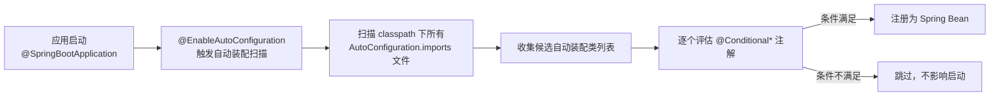
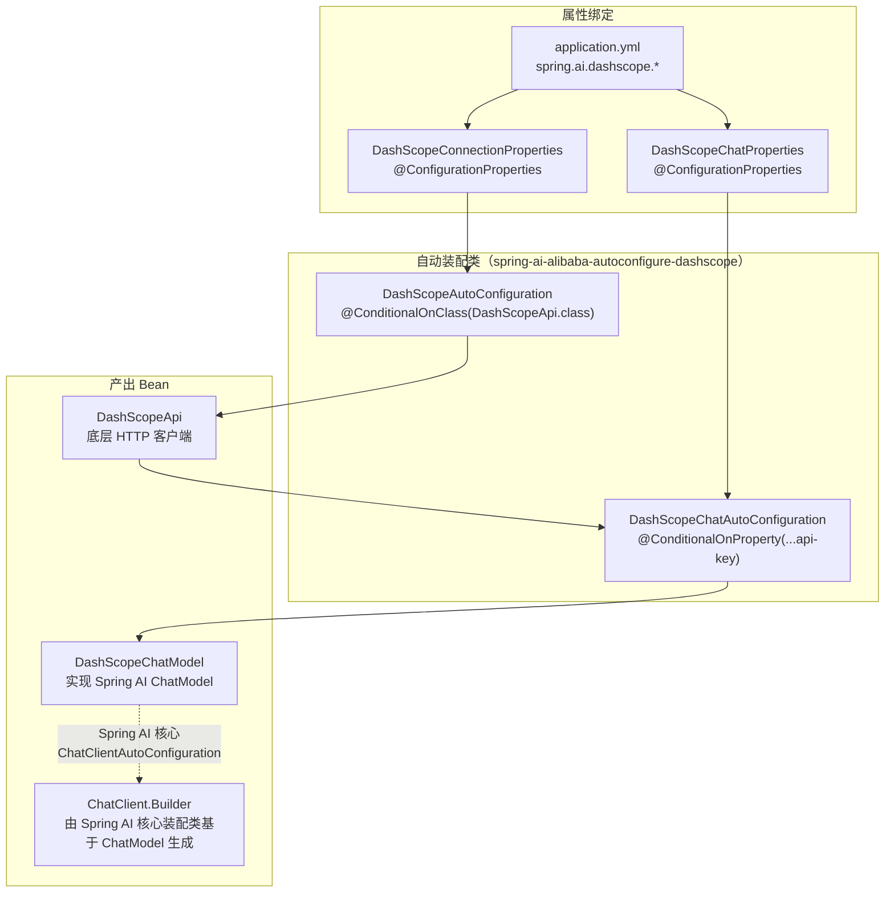
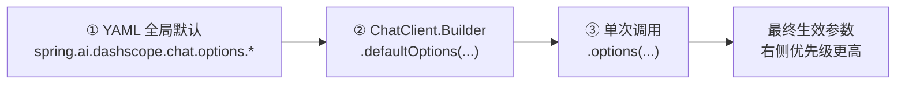

# 第 03 章：AutoConfiguration 自动装配深入解析

## 学习目标

- 彻底理解 Spring Boot 3.x 的自动装配触发机制（`AutoConfiguration.imports` 取代旧版 `spring.factories`）；
- 能够读懂 `spring-ai-alibaba-autoconfigure-dashscope` 的装配链路，说清 `DashScopeApi` → `DashScopeChatModel` → `ChatClient.Builder` 三级 Bean 是如何逐级构造出来的；
- 掌握 `@ConfigurationProperties` 属性绑定与三级配置覆盖（YAML 全局 → Builder 默认 → 单次调用级）的优先级规则；
- 能独立编写一个符合 Spring Boot 官方规范的自定义自动装配类，作为第 19 章统一 Starter 的直接铺垫。

## 前置知识

- 完成第 01、02 章，理解 SAA 分层架构与 core/autoconfigure/starter 三段式模块拆分；
- 了解 Java 注解、Spring 依赖注入基础。

## 核心概念

### 3.1 从 `spring.factories` 到 `AutoConfiguration.imports`

Spring Boot 2.7 之前，自动装配类通过 `META-INF/spring.factories` 文件声明；Spring Boot 2.7 起（3.x 延续）改为更轻量的 `META-INF/spring/org.springframework.boot.autoconfigure.AutoConfiguration.imports` 文件——一行一个全限定类名，没有 Key-Value 结构，加载性能更好。SAA 的所有官方 Starter 均采用新格式。



### 3.2 DashScope 自动装配的完整链路

以第 01 章 Demo 依赖的 `spring-ai-alibaba-starter-dashscope` 为例，其内部装配链路（模块名基于 core/autoconfigure/starter 三段式，详见第 02 章）：



关键点：**DashScope 自己的自动装配只负责产出 `ChatModel`**；`ChatModel` → `ChatClient.Builder` 这一步是 Spring AI 核心（而非 SAA）的自动装配完成的——这正是"厂商实现接口、框架统一装配"的分层设计（第 02 章已埋下伏笔）。

## API 深入解析

### 3.3 条件装配注解族

| 注解 | 判断依据 | 典型用途 |
|---|---|---|
| `@ConditionalOnClass` | classpath 是否存在指定类 | 依赖是否被引入 |
| `@ConditionalOnMissingClass` | classpath 是否**不**存在指定类 | 排除冲突场景 |
| `@ConditionalOnProperty` | 配置属性是否存在/等于指定值 | 功能开关，如 `spring.ai.dashscope.api-key` |
| `@ConditionalOnMissingBean` | 容器中是否**已存在**指定类型 Bean | 让用户自定义 Bean 优先于官方默认实现 |
| `@ConditionalOnBean` | 容器中是否**已存在**依赖的 Bean | 装配顺序依赖（如"有 ChatModel 才装配 ChatClient.Builder"） |
| `@AutoConfigureAfter` / `@AutoConfigureBefore` | 控制装配类之间的相对顺序 | 保证 DashScope 装配先于依赖它的下游装配 |

### 3.4 三级配置覆盖机制

SAA/Spring AI 的 Options 采用"层层覆盖"设计，理解这个顺序能解决绝大多数"为什么我配的参数没生效"的问题：



对应到代码：

```java
// ① YAML 全局默认（application.yml）
// spring.ai.dashscope.chat.options.model: qwen-plus
// spring.ai.dashscope.chat.options.temperature: 0.7

// ② Builder 级默认：应用启动时固定，覆盖 YAML
ChatClient chatClient = chatClientBuilder
        .defaultOptions(DashScopeChatOptions.builder()
                .withModel("qwen-max")
                .withTemperature(0.3)
                .build())
        .build();

// ③ 调用级：本次请求专属，覆盖 Builder 默认
String result = chatClient.prompt()
        .user("写一段严谨的技术总结")
        .options(DashScopeChatOptions.builder()
                .withTemperature(0.1)   // 只覆盖 temperature，其余沿用 Builder 默认
                .build())
        .call()
        .content();
```

这个"读取顺序"在 `DashScopeChatModel` 源码的 options 合并逻辑中实现（第 04 章会展开 `ChatOptions` 完整用法）。

## 可运行 Demo：编写一个自定义自动装配模块

对应仓库位置：`examples/02-autoconfig-demo`。本 Demo 不调用任何模型，纯粹演示"如何编写一个规范的 Spring Boot 自动装配模块"——这是第 19 章仓库自建 `starter` 模块的直接原型。

### 目录结构

```
autoconfig-demo/
├── pom.xml
└── src/main/
    ├── java/com/flywhl/saa/autoconfig/
    │   ├── AutoconfigDemoApplication.java
    │   ├── GreetingProperties.java
    │   ├── GreetingService.java
    │   ├── GreetingAutoConfiguration.java
    │   └── DemoController.java
    └── resources/
        ├── application.yml
        └── META-INF/spring/
            └── org.springframework.boot.autoconfigure.AutoConfiguration.imports
```

### GreetingProperties.java —— 属性绑定

```java
package com.flywhl.saa.autoconfig;

import org.springframework.boot.context.properties.ConfigurationProperties;

/**
 * 演示 {@code @ConfigurationProperties} 属性绑定，
 * 对应 DashScope 装配链路中 {@code DashScopeChatProperties} 的简化版原型。
 *
 * @param prefix   问候语前缀，默认 "Hello"
 * @param locale   语言环境，默认 "zh-CN"
 * @param enabled  功能开关，默认 true
 * @author flywhl
 */
@ConfigurationProperties(prefix = "saa.demo.greeting")
public record GreetingProperties(String prefix, String locale, boolean enabled) {

    public GreetingProperties {
        if (prefix == null || prefix.isBlank()) {
            prefix = "Hello";
        }
        if (locale == null || locale.isBlank()) {
            locale = "zh-CN";
        }
    }
}
```

### GreetingService.java —— 待装配的业务组件

```java
package com.flywhl.saa.autoconfig;

/**
 * 待自动装配的业务组件，对应链路中 {@code DashScopeChatModel} 的简化版原型。
 *
 * @author flywhl
 */
public class GreetingService {

    private final GreetingProperties properties;

    public GreetingService(GreetingProperties properties) {
        this.properties = properties;
    }

    public String greet(String name) {
        return "%s, %s! (locale=%s)".formatted(properties.prefix(), name, properties.locale());
    }
}
```

### GreetingAutoConfiguration.java —— 自动装配类本体

```java
package com.flywhl.saa.autoconfig;

import org.springframework.boot.autoconfigure.condition.ConditionalOnMissingBean;
import org.springframework.boot.autoconfigure.condition.ConditionalOnProperty;
import org.springframework.boot.context.properties.EnableConfigurationProperties;
import org.springframework.context.annotation.Bean;
import org.springframework.context.annotation.Configuration;

/**
 * 自定义自动装配类，完整复现 DashScope 装配链路的三个关键要素：
 * <ol>
 *   <li>{@link EnableConfigurationProperties} 启用属性绑定；</li>
 *   <li>{@link ConditionalOnProperty} 功能开关（对应 DashScope 的 api-key 判断）；</li>
 *   <li>{@link ConditionalOnMissingBean} 用户自定义优先（对应 ChatModel 的兜底策略）。</li>
 * </ol>
 *
 * @author flywhl
 */
@Configuration(proxyBeanMethods = false)
@EnableConfigurationProperties(GreetingProperties.class)
@ConditionalOnProperty(prefix = "saa.demo.greeting", name = "enabled", havingValue = "true", matchIfMissing = true)
public class GreetingAutoConfiguration {

    @Bean
    @ConditionalOnMissingBean
    public GreetingService greetingService(GreetingProperties properties) {
        return new GreetingService(properties);
    }
}
```

### META-INF/spring/org.springframework.boot.autoconfigure.AutoConfiguration.imports

```text
com.flywhl.saa.autoconfig.GreetingAutoConfiguration
```

> 这个文件是整个机制的"钩子"：Spring Boot 启动时会扫描 classpath 下所有同名文件，把里面列出的类加入自动装配候选列表——这一行配置，就是本 Demo 与官方 `spring-ai-alibaba-starter-dashscope` 在机制上完全等价的地方。

### DemoController.java

```java
package com.flywhl.saa.autoconfig;

import org.springframework.web.bind.annotation.GetMapping;
import org.springframework.web.bind.annotation.RequestParam;
import org.springframework.web.bind.annotation.RestController;

/**
 * @author flywhl
 */
@RestController
public class DemoController {

    private final GreetingService greetingService;

    public DemoController(GreetingService greetingService) {
        this.greetingService = greetingService;
    }

    @GetMapping("/greet")
    public String greet(@RequestParam(defaultValue = "flywhl") String name) {
        return greetingService.greet(name);
    }
}
```

### application.yml

```yaml
server:
  port: 18002

saa:
  demo:
    greeting:
      prefix: "你好"
      locale: "zh-CN"
      enabled: true
```

### 运行与验证

```bash
cd examples/02-autoconfig-demo
mvn spring-boot:run
curl "http://localhost:18002/greet?name=flywhl"
```

### 预期输出

```text
你好, flywhl! (locale=zh-CN)
```

### 验证条件装配生效（对照第 02 章命令）

```bash
mvn spring-boot:run -Dspring-boot.run.arguments="--debug" 2>&1 | grep -A 3 "GreetingAutoConfiguration"
```

预期能看到：

```text
GreetingAutoConfiguration matched:
   - @ConditionalOnProperty (saa.demo.greeting.enabled=true) matched (OnPropertyCondition)
```

### 反向验证：把开关关掉看装配是否让路

将 `application.yml` 中 `enabled: false`，重启后再次 `curl /greet`——应用能正常启动（不会因为 Bean 缺失而报错，因为 Controller 依赖注入会失败并在启动期报错，这是刻意设计的教学点）：

```text
Parameter 0 of constructor in com.flywhl.saa.autoconfig.DemoController required a bean of type 'com.flywhl.saa.autoconfig.GreetingService' that could not be found.
```

这个报错信息本身就是排查装配问题的黄金线索——**"required a bean of type X that could not be found"** 几乎总是意味着某个条件装配没有满足，回到 `--debug` 报告里查负面匹配（Negative matches）即可定位。

## 关键源码解读

### 3.5 `@ConfigurationProperties` 为什么推荐用 record

Java 21 record 天然不可变、自带构造器校验（如本 Demo 中对 `prefix`/`locale` 的默认值兜底），比传统 POJO + `@Setter` 更符合配置对象"读多写少、装配后不应再变"的语义。SAA 1.1.x 内部大量属性类已迁移为 record（与 Spring AI 1.1 全面转向 Builder/不可变 Options 的趋势一致，见版本调研报告 §4.3）。

### 3.6 `proxyBeanMethods = false` 的意义

`@Configuration(proxyBeanMethods = false)` 关闭 CGLIB 代理，因为本例中 `GreetingAutoConfiguration` 内部没有 `@Bean` 方法互相调用的场景（不需要保证同一 Bean 方法被多次调用时返回同一实例），关闭代理能减少启动期字节码增强开销——官方所有自动装配类都遵循这个实践，你的自定义装配类也应如此，除非确有方法间调用需求。

## 企业实践建议

- **团队内部组件也应该"Starter 化"**：任何被多个微服务复用的基础设施（如统一日志埋点、统一鉴权拦截），都应该按本章模式封装成内部 Starter，而不是复制粘贴代码——这是第 19 章仓库 `starter` 模块的设计初衷；
- **属性类必须有合理默认值**：本 Demo 中 record 的紧凑构造器（compact constructor）演示了如何在绑定阶段就完成校验与兜底，避免把这类判断散落在业务代码各处；
- **装配类命名要体现意图**：`XxxAutoConfiguration` 是社区共识的命名规范，不要自创风格，便于团队新人按名猜功能。

## 性能优化建议

- 自动装配的评估是有启动期开销的，模块数量越多、条件注解越复杂，`--debug` 报告的评估耗时越长。生产环境建议只引入实际用到的 Starter，不要"预防性"引入未使用的模块；
- `@ConditionalOnMissingBean` 的判断需要遍历容器已注册 Bean 的类型信息，在超大型应用（数千 Bean）中，这类条件的密集使用会拉长启动时间，可通过 `-Dspring.backgroundpreinitializer.ignore` 等启动参数結合实际情况调优（一般应用无需关注）。

## 安全建议

- 属性绑定要对敏感字段（如未来可能出现的密钥类配置）做脱敏日志处理，避免 `--debug` 报告或 Actuator `/env` 端点意外泄露；
- `ConditionalOnProperty` 的功能开关本身也是一种攻击面控制手段——生产环境未使用的功能应显式关闭而非依赖"没人调用"的侥幸。

## 常见踩坑

| 现象 | 原因 | 解决 |
|---|---|---|
| 自定义自动装配类完全不生效 | `AutoConfiguration.imports` 文件路径写错（必须是 `META-INF/spring/org.springframework.boot.autoconfigure.AutoConfiguration.imports`，Boot 3 起不再兼容旧的 `spring.factories`） | 严格核对路径与文件名，注意没有 `.txt` 等额外后缀 |
| `@ConfigurationProperties` 绑定不到值 | 忘记 `@EnableConfigurationProperties` 或对应类未加 `@Component`/未被扫描 | 在自动装配类上显式 `@EnableConfigurationProperties(XxxProperties.class)` |
| 属性类用 record 后 IDE 提示"无法生成 Setter" | record 本身就是不可变的，这是预期行为 | 改用 Builder 模式或直接构造新 record 实例来"修改"配置 |
| 两个 Starter 都想装配同名 Bean，出现 `NoUniqueBeanDefinitionException` | 都没有正确使用 `@ConditionalOnMissingBean` 互相谦让 | 检查两边装配类的条件注解，必要时用 `@Qualifier` 或 `@Primary` 显式指定 |

## 版本差异

| 项 | Spring Boot 2.x 早期 | Spring Boot 3.x（本教程） |
|---|---|---|
| 装配声明文件 | `META-INF/spring.factories`（Key-Value，含多种扩展点混杂） | `META-INF/spring/org.springframework.boot.autoconfigure.AutoConfiguration.imports`（专用、纯类名列表） |
| 属性类推荐写法 | POJO + Lombok `@Data` | record（不可变、构造器校验），SAA 1.1.x 与 Spring AI 1.1.x 均已转向此风格 |
| DashScope Options 配置 | 部分历史版本存在可变 setter | 1.1.x 起统一 Builder 模式（`.withXxx()`），2.0 milestone 中已彻底移除 setter |

## 为什么这样设计

条件装配的核心价值在于"**按需生效、互不冲突**"：一个大型企业应用可能同时引入十几个 Starter，如果没有条件装配机制，任何两个 Starter 只要碰巧定义了同名/同类型 Bean 就会启动失败。`@ConditionalOnMissingBean` 这种"后来者谦让"的设计，使得官方默认实现与用户自定义实现可以优雅共存——用户只需要按照约定定义自己的 Bean，官方自动装配就会自动让路，这是 Spring Boot 生态"约定优于配置"哲学的具体体现，也是为什么你几乎不需要写任何 XML 或手动 `new` 对象就能用上 DashScope 模型的根本原因。

## FAQ

**Q：`--debug` 报告里的 "AutoConfiguration excluded" 是什么意思？**
表示这个自动装配类被显式排除了（通常通过 `@SpringBootApplication(exclude = XxxAutoConfiguration.class)` 或 `spring.autoconfigure.exclude` 配置），不参与本次条件评估，与"条件不满足被跳过"是两种不同状态。

**Q：我可以在同一个模块里定义多个自动装配类吗？**
可以，且这是常见做法——比如 DashScope Starter 内部就拆分了 `DashScopeAutoConfiguration`（基础 API 客户端）和 `DashScopeChatAutoConfiguration`（Chat 模型），通过 `@AutoConfigureAfter` 控制先后顺序，职责单一更利于维护。

**Q：`@ConfigurationProperties` 和 `@Value` 应该用哪个？**
批量、结构化的配置（如本章 `GreetingProperties` 这种有前缀、多字段的场景）用 `@ConfigurationProperties`；单个、零散的配置读取可以用 `@Value`，但企业项目建议统一收敛到 `@ConfigurationProperties`，便于 IDE 自动补全（配合 `spring-boot-configuration-processor`）与集中管理。

## 本章总结

本章打开了自动装配这个"黑盒"：从 `AutoConfiguration.imports` 文件的加载机制，到条件装配注解族的组合判断逻辑，再到 DashScope 装配链路里 `DashScopeApi → DashScopeChatModel → ChatClient.Builder` 三级 Bean 的构造过程。通过手写一个结构完全对等的 `autoconfig-demo`，你现在应该能够独立诊断"为什么某个 Bean 没有被注入"这类问题，也具备了编写团队内部 Starter 的能力——这是第 19 章的直接基础。

## 延伸阅读

- Spring Boot 官方自动装配开发指南：<https://docs.spring.io/spring-boot/reference/features/developing-auto-configuration.html>
- Spring Boot Condition 注解官方参考：<https://docs.spring.io/spring-boot/reference/features/developing-auto-configuration.html#features.developing-auto-configuration.condition-annotations>

## 下一章预告

第 04 章正式进入 Spring AI 核心 API：`ChatClient`、`ChatModel`、`Message`、`Role`、`ChatOptions`、`Usage`、重试策略，并演示 DashScope 与 DeepSeek 双模型并存的多模型配置方式——这是本章"三级配置覆盖机制"在真实业务场景下的完整应用。

## 思考题

1. 如果要让你的自定义 Starter 同时支持"用户没配置任何东西时给出合理默认行为"和"用户可以精确覆盖任意单个参数"，你会如何设计属性类的默认值策略？
2. `@ConditionalOnMissingBean` 存在一个隐藏的顺序依赖问题：如果两个自动装配类互相"谦让"（都写了 `@ConditionalOnMissingBean`），且互相之间没有 `@AutoConfigureAfter` 声明顺序，会发生什么？
3. 结合本章两张架构图，尝试描述 `spring-ai-alibaba-starter-agentscope`（第 02 章提到的 1.1.2.2 新模块）大概率会包含哪几个自动装配类、分别负责什么？
