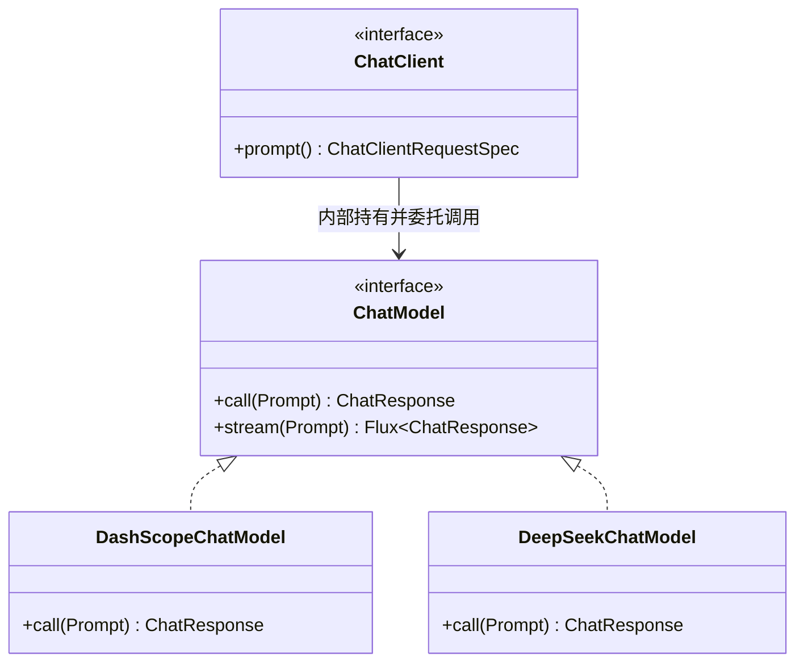
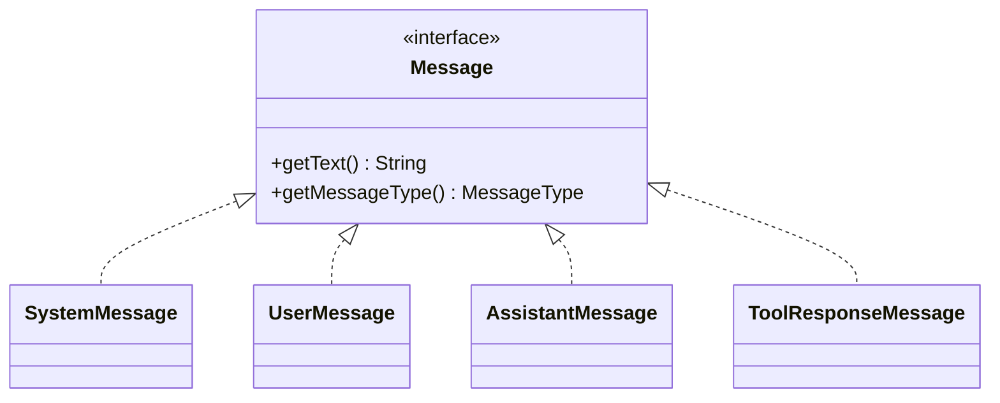
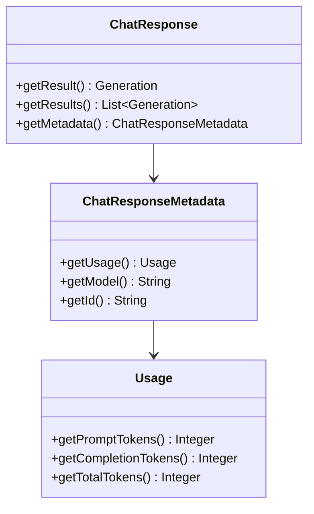

# 第 04 章：ChatClient 全 API 详解

## 学习目标

- 系统掌握 `ChatClient` 的 Fluent API：`prompt()/system()/user()/tools()/advisors()/options()/call()/stream()`；
- 理解 `Message`/`Role`/`ChatOptions`/`Usage` 四个核心数据模型，能读懂一次调用的完整请求与响应结构；
- 掌握 `spring.ai.retry.*` 重试机制配置与自定义 `RetryTemplate`；
- 能在同一应用中让 DashScope 与 DeepSeek 两个 `ChatModel` **正确共存**并显式路由到指定模型——这是第 20 章多模型路由的直接基础。

## 前置知识

- 完成第 01~03 章，理解 ChatClient 调用生命周期与自动装配机制；
- 了解第 03 章讲的三级配置覆盖顺序（YAML → Builder 默认 → 调用级）。

## 核心概念

### 4.1 ChatModel 与 ChatClient 的分工

`ChatModel` 是**厂商无关的底层调用接口**（`call(Prompt)` / `stream(Prompt)`），`ChatClient` 是**建立在 ChatModel 之上的高层 Fluent API**，额外提供 Advisor 链、默认 System Prompt、默认 Tools 等能力。日常业务代码应该优先用 `ChatClient`，只有在需要精确控制底层请求（如自定义 `Prompt` 对象）时才直接用 `ChatModel`。



### 4.2 Message 与 Role 模型



| Role（`MessageType`） | 对应类 | 用途 |
|---|---|---|
| `SYSTEM` | `SystemMessage` | 系统指令，定义角色/边界/输出格式 |
| `USER` | `UserMessage` | 用户输入，可携带多模态内容（图片/文件） |
| `ASSISTANT` | `AssistantMessage` | 模型输出，可能携带工具调用请求 |
| `TOOL` | `ToolResponseMessage` | 工具执行结果回传给模型（第 07 章详解） |

一次多轮对话本质上就是这四类 `Message` 按时间顺序排成的列表——这与你在 LangChain/LangGraph 里熟悉的消息模型完全一致，只是 Java 侧用了强类型的类而不是 dict。

### 4.3 ChatOptions 与三级覆盖（承接第 03 章）

`ChatOptions` 是模型调用参数的统一抽象（`model`/`temperature`/`maxTokens`/`topP` 等），每个厂商有自己的实现类（`DashScopeChatOptions`/`DeepSeekChatOptions`/`OpenAiChatOptions`），但都遵循同一套 Builder 模式与三级覆盖规则。

> **一个值得记住的踩坑点**：不同厂商 Options 的 Builder 方法命名存在细微差异——DashScope 的 `DashScopeChatOptions` 目前仍保留 `.withModel()/.withTemperature()` 这种历史命名；而原生 Spring AI 1.1.x 的 `DeepSeekChatOptions`/`OpenAiChatOptions` 已经统一为无 `with` 前缀的 `.model()/.temperature()` 风格（这是 Spring AI 2.0 彻底移除可变 setter、全面转向不可变 Builder 这一趋势在 1.1.x 的提前体现，见版本调研报告 §4.3）。**写代码时以 IDE 自动补全为准，不要跨厂商生搬硬套方法名。**

### 4.4 Usage：Token 用量与成本核算的数据来源



`Usage` 是第 18 章成本看板的数据源头——每次调用后读取 `chatResponse.getMetadata().getUsage()`，即可拿到本次请求消耗的 prompt/completion/total tokens。

## API 深入解析

### 4.5 ChatClient.Builder 全览

```java
ChatClient chatClient = chatClientBuilder
        .defaultSystem("你是一个专业的技术助手，回答需严谨、有依据")   // 默认系统提示
        .defaultOptions(DashScopeChatOptions.builder()               // 默认调用参数
                .withModel("qwen-plus")
                .withTemperature(0.7)
                .build())
        .defaultAdvisors(new SimpleLoggerAdvisor())                  // 默认 Advisor 链（第 06 章详解）
        .build();
```

### 4.6 一次调用的完整 Fluent 链

```java
ChatResponse response = chatClient.prompt()
        .system("本次请求临时覆盖系统提示")     // 可选：覆盖 defaultSystem
        .user(u -> u.text("帮我分析这段日志：{log}").param("log", logContent))  // 支持模板参数
        .options(DashScopeChatOptions.builder().withTemperature(0.1).build())  // 调用级覆盖
        .call()
        .chatResponse();                        // 拿到完整 ChatResponse（含 Usage/Metadata）

String text = response.getResult().getOutput().getText();
Integer totalTokens = response.getMetadata().getUsage().getTotalTokens();
```

### 4.7 三种响应提取方式

| 方法 | 返回类型 | 使用场景 |
|---|---|---|
| `.call().content()` | `String` | 只关心文本内容，最常用 |
| `.call().chatResponse()` | `ChatResponse` | 需要 Usage/Metadata/完整 Generation |
| `.call().entity(MyRecord.class)` | `MyRecord` | 结构化输出（第 16 章详解） |
| `.stream().content()` | `Flux<String>` | 流式文本增量（第 17 章详解） |

### 4.8 重试机制

```yaml
spring:
  ai:
    retry:
      max-attempts: 3
      backoff:
        initial-interval: 1000ms
        multiplier: 2.0
        max-interval: 10000ms
    dashscope:
      api-key: ${AI_DASHSCOPE_API_KEY}
```

`spring.ai.retry.*` 是**跨厂商通用**的属性前缀（DashScope/DeepSeek/OpenAI 等均遵循这套配置），底层基于 Spring Retry 的 `RetryTemplate` 实现指数退避。需要更精细控制（比如只对限流错误重试，语义错误不重试）时，可以自定义 `RetryTemplate` Bean 覆盖官方默认实现——按第 03 章讲的 `@ConditionalOnMissingBean` 规则，你的 Bean 会自动优先生效。

## 可运行 Demo：多模型并存与显式路由

对应仓库位置：`examples/03-multi-model-demo`。演示 DashScope 与 DeepSeek 官方 Starter 在同一应用中共存，并通过两个独立的 `ChatClient` Bean 显式路由——这是第 20 章"多模型路由/降级"的雏形。

### 目录结构

```
multi-model-demo/
├── pom.xml
└── src/main/
    ├── java/com/flywhl/saa/multimodel/
    │   ├── MultiModelApplication.java
    │   ├── ChatClientConfig.java
    │   └── MultiModelController.java
    └── resources/
        └── application.yml
```

### pom.xml（关键依赖片段）

```xml
<dependencies>
    <dependency>
        <groupId>org.springframework.boot</groupId>
        <artifactId>spring-boot-starter-web</artifactId>
    </dependency>
    <!-- 通道一：DashScope（百炼） -->
    <dependency>
        <groupId>com.alibaba.cloud.ai</groupId>
        <artifactId>spring-ai-alibaba-starter-dashscope</artifactId>
    </dependency>
    <!-- 通道二：DeepSeek 官方直连 -->
    <dependency>
        <groupId>org.springframework.ai</groupId>
        <artifactId>spring-ai-starter-model-deepseek</artifactId>
    </dependency>
</dependencies>
```

### application.yml

```yaml
server:
  port: 18003

spring:
  application:
    name: multi-model-demo
  ai:
    retry:
      max-attempts: 3
      backoff:
        initial-interval: 1000ms
        multiplier: 2.0
    dashscope:
      api-key: ${AI_DASHSCOPE_API_KEY}
      chat:
        options:
          model: qwen-plus
          temperature: 0.7
    deepseek:
      api-key: ${DEEPSEEK_API_KEY}
      chat:
        options:
          model: deepseek-chat
          temperature: 0.7
```

### ChatClientConfig.java —— 关键：两个 ChatModel 如何不冲突地共存

```java
package com.flywhl.saa.multimodel;

import org.springframework.ai.chat.client.ChatClient;
import org.springframework.ai.chat.client.advisor.SimpleLoggerAdvisor;
import org.springframework.ai.chat.model.ChatModel;
import org.springframework.context.annotation.Bean;
import org.springframework.context.annotation.Configuration;

/**
 * 当 classpath 同时存在 DashScope 与 DeepSeek 两个 Starter 时，
 * Spring 容器中会同时出现两个 {@link ChatModel} 实现 Bean，
 * 官方自动装配的 {@code ChatClient.Builder} 无法判断该基于哪一个构建——
 * 因此显式声明两个具名 {@link ChatClient} Bean，替代对自动装配 Builder 的依赖。
 *
 * @author flywhl
 */
@Configuration(proxyBeanMethods = false)
public class ChatClientConfig {

    /**
     * DashScope 通道：中文语境 / 日常问答场景默认首选。
     */
    @Bean
    public ChatClient dashScopeChatClient(ChatModel dashScopeChatModel) {
        return ChatClient.builder(dashScopeChatModel)
                .defaultSystem("你是通义千问驱动的助手，回答简洁准确")
                .defaultAdvisors(new SimpleLoggerAdvisor())
                .build();
    }

    /**
     * DeepSeek 通道：推理/代码类任务的备选与对比通道。
     */
    @Bean
    public ChatClient deepSeekChatClient(ChatModel deepSeekChatModel) {
        return ChatClient.builder(deepSeekChatModel)
                .defaultSystem("你是 DeepSeek 驱动的助手，回答简洁准确")
                .defaultAdvisors(new SimpleLoggerAdvisor())
                .build();
    }
}
```

> **关键点**：`ChatModel dashScopeChatModel` / `ChatModel deepSeekChatModel` 两个参数名分别匹配 Spring 容器中两个 `ChatModel` Bean 的**默认 Bean 名**（DashScope 官方装配注册名为 `dashScopeChatModel`，DeepSeek 官方装配注册名为 `deepSeekChatModel`）——Spring 依赖注入在存在多个同类型 Bean 时，会按**参数名匹配 Bean 名**这一规则自动消歧，无需额外写 `@Qualifier`。这是排查"多 Bean 冲突"问题时最容易被忽略的一条規则。

### MultiModelController.java

```java
package com.flywhl.saa.multimodel;

import org.springframework.ai.chat.client.ChatClient;
import org.springframework.web.bind.annotation.GetMapping;
import org.springframework.web.bind.annotation.RequestParam;
import org.springframework.web.bind.annotation.RestController;

/**
 * @author flywhl
 */
@RestController
public class MultiModelController {

    private final ChatClient dashScopeChatClient;
    private final ChatClient deepSeekChatClient;

    public MultiModelController(ChatClient dashScopeChatClient, ChatClient deepSeekChatClient) {
        this.dashScopeChatClient = dashScopeChatClient;
        this.deepSeekChatClient = deepSeekChatClient;
    }

    @GetMapping("/chat/dashscope")
    public String chatViaDashScope(@RequestParam String message) {
        return dashScopeChatClient.prompt().user(message).call().content();
    }

    @GetMapping("/chat/deepseek")
    public String chatViaDeepSeek(@RequestParam String message) {
        return deepSeekChatClient.prompt().user(message).call().content();
    }

    /** 演示 Usage 读取：返回文本 + 本次消耗 token 数 */
    @GetMapping("/chat/usage")
    public String chatWithUsage(@RequestParam String message) {
        var response = dashScopeChatClient.prompt().user(message).call().chatResponse();
        var usage = response.getMetadata().getUsage();
        return "回答：%s\n\n[token 用量] prompt=%d, completion=%d, total=%d".formatted(
                response.getResult().getOutput().getText(),
                usage.getPromptTokens(), usage.getCompletionTokens(), usage.getTotalTokens());
    }
}
```

### 运行与验证

```bash
cd examples/03-multi-model-demo
source ../../scripts/setup-env.local.sh   # 需同时加载 AI_DASHSCOPE_API_KEY 与 DEEPSEEK_API_KEY
mvn spring-boot:run
```

```bash
curl "http://localhost:18003/chat/dashscope?message=用一句话解释什么是自动装配"
curl "http://localhost:18003/chat/deepseek?message=用一句话解释什么是自动装配"
curl "http://localhost:18003/chat/usage?message=你好"
```

### 预期输出（节选）

```text
$ curl ".../chat/usage?message=你好"
回答：你好！有什么我可以帮你的吗？

[token 用量] prompt=12, completion=8, total=20
```

## 关键源码解读

`ChatClient.builder(ChatModel)` 这个静态工厂方法，是绕开"自动装配 Builder 只能对应单个 ChatModel"限制的标准做法——官方自动装配产出的 `ChatClient.Builder` 本质上也是调用了这同一个工厂方法，只是把 `ChatModel` 参数替换成了"classpath 上唯一可用的那个"。理解了这一点，你就明白了：**`ChatClient.Builder` 不是什么特殊魔法，只是"已经预置好 ChatModel 的工厂"**，多模型场景下自己动手构造完全是官方支持的正规写法，不是workaround。

## 企业实践建议

- **具名 ChatClient Bean 优于运行时字符串路由**：本章 Demo 用两个明确命名的 Bean（`dashScopeChatClient`/`deepSeekChatClient`），比用一个字符串参数"model=xxx"在运行时反射选择更利于类型安全和 IDE 支持，第 20 章的 `ModelRouter` 会在此基础上加一层策略选择，而不是推翻重来；
- **Usage 要在业务日志里落盘**：即使暂时不做成本看板，也建议从第一天起把每次调用的 `Usage` 记录到日志或数据库，为后续成本分析积累数据；
- **重试策略要区分错误类型**：限流（429）值得重试，参数错误（400）重试没有意义反而浪费配额，生产环境建议自定义 `RetryTemplate` 明确区分（第 20 章展开容灾策略时会给出完整实现）。

## 性能优化建议

- `ChatClient` 的 `.build()` 有一定构造开销（组装 Advisor 链），**务必作为单例 Bean 复用**，不要在请求方法内重复 `.build()`（第 01 章已提示，这里再次强调因为是最高频踩坑）；
- 多模型场景下，两个 `ChatClient` Bean 各自独立，互不影响对方的连接池/重试状态，不用担心"配置串台"。

## 安全建议

- `DEEPSEEK_API_KEY` 与 `AI_DASHSCOPE_API_KEY` 应该是两个独立管理的密钥，权限最小化原则下不要共用一个密钥管理策略；
- 生产环境的 Usage 日志如果包含 Prompt 原文，注意脱敏（可能包含用户隐私输入），第 20 章安全体系会给出脱敏 Advisor 实现。

## 常见踩坑

| 现象 | 原因 | 解决 |
|---|---|---|
| 引入两个模型 Starter 后启动报 `NoUniqueBeanDefinitionException` | 试图继续用自动装配的 `ChatClient.Builder`（它假设只有一个 `ChatModel`） | 改用本章模式，显式声明具名 `ChatClient` Bean，构造函数参数名对应 Bean 名 |
| `DashScopeChatOptions` 和 `DeepSeekChatOptions` 方法名对不上（`.withModel()` vs `.model()`） | 两个厂商 Options 类的 Builder 命名风格不统一（§4.3 已说明） | 以 IDE 自动补全为准，不要凭记忆跨厂商复制代码 |
| `Usage` 读出来是 `null` | 部分厂商的流式（`stream()`）响应可能不是每个 chunk 都带 Usage，通常只在最后一个 chunk 携带 | 流式场景应在 `.doOnComplete()` 或最后一条消息里读取 Usage，非流式 `.call()` 一般不受此影响 |
| 重试配置不生效 | `spring.ai.retry.*` 配错了层级（容易误写成 `spring.ai.dashscope.retry.*`） | 重试前缀是全局统一的 `spring.ai.retry`，不属于任何具体厂商命名空间 |

## 版本差异

| 项 | 早期（1.0.x 前后） | 1.1.x（本教程） |
|---|---|---|
| Options 构造 | 各厂商风格不统一，偶见可变 setter | 全面转向不可变 Builder；DeepSeek/OpenAI 等原生模块已用无 `with` 前缀新写法，DashScope 扩展模块暂仍用 `withXxx()` |
| 多模型共存 | 文档较少涉及，容易踩 Bean 冲突坑 | 官方 Fluent API 明确支持 `ChatClient.builder(ChatModel)` 静态工厂，多模型是一等公民场景 |
| Memory Advisor | `PromptChatMemoryAdvisor`（已弃用） | `MessageChatMemoryAdvisor` + 显式 `ChatMemory`/`conversationId`（第 08 章详解） |

## 为什么这样设计

`ChatModel` 与 `ChatClient` 的分层，本质上是"稳定的底层协议"与"易用的上层门面"的经典设计模式（Facade Pattern）。这个设计的好处在多模型场景下体现得淋漓尽致：你完全不需要关心 `DashScopeChatModel` 和 `DeepSeekChatModel` 内部如何拼装 HTTP 请求、如何解析不同厂商各异的响应格式——它们都被统一成同一个 `ChatModel` 接口，上层 `ChatClient` 代码可以做到"一次编写，随时切换供应商"，这正是 Spring AI 作为"标准化抽象层"存在的核心价值，也是你未来做模型降级/容灾（第 20 章）时不需要重写业务逻辑的根本原因。

## FAQ

**Q：`.call()` 和 `.stream()` 可以在同一个 `ChatClient` 上混用吗？**
可以，它们是同一个请求构造链（`system()/user()/options()`...）末端的两种不同终结操作，不冲突，取决于你当次请求要不要流式响应。

**Q：如果只有一个模型 Starter，还需要手动声明 ChatClient Bean 吗？**
不需要——单模型场景下第 01 章那种"直接注入 `ChatClient.Builder` 再 `.build()`"的写法完全够用，本章的显式声明只在多模型共存时才是必要模式。

**Q：Usage 里的 token 计数和百炼控制台账单是否完全一致？**
基本一致，但具体计费规则（是否包含 System Prompt、工具描述等）以模型厂商官方计费文档为准，`Usage` 只是 API 返回的统计口径，建议按官方标准做二次核对而非直接假设两者完全等价。

## 本章总结

本章系统梳理了 `ChatClient` 的完整 Fluent API、`Message`/`Role`/`ChatOptions`/`Usage` 四大数据模型，并通过一个"DashScope + DeepSeek 双模型共存"的 Demo，展示了如何用具名 Bean + 参数名匹配的方式优雅解决多 `ChatModel` 场景下的装配冲突问题。这个模式将在第 20 章"多模型路由与降级"中被直接复用和扩展。

## 延伸阅读

- Spring AI ChatClient 官方参考：<https://docs.spring.io/spring-ai/reference/api/chatclient.html>
- DeepSeek Chat 官方参考：<https://docs.spring.io/spring-ai/reference/api/chat/deepseek-chat.html>
- Spring AI Retry 机制说明（各厂商页面末尾均有该章节）：<https://docs.spring.io/spring-ai/reference/api/chat/openai-chat.html#retry>

## 下一章预告

第 05 章进入 Prompt 工程：`PromptTemplate` 模板语法、Few-shot/CoT/ReAct 等经典模式在 SAA 中的写法、Prompt 的版本化管理，以及基于 Nacos 的 Prompt 热更新——把本章"System Prompt 硬编码在代码里"的写法升级为生产级可运维方案。

## 思考题

1. 如果未来要接入第三个模型（比如 OpenAI 兼容网关），你会如何扩展 `ChatClientConfig`？是继续加 Bean，还是考虑更通用的工厂模式？
2. 本章 Demo 里 `Usage` 是在 Controller 层手动读取和拼接的，如果要让"每次调用自动记录 Usage 到日志"变成横切关注点而不侵入每个 Controller 方法，你会用什么机制实现？（提示：第 06 章 Advisor）
3. `spring.ai.retry.max-attempts=3` 对一个"根据用户问题实时生成 SQL 并执行"的高风险操作是否合适？请结合幂等性思考。
