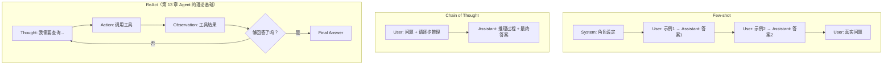
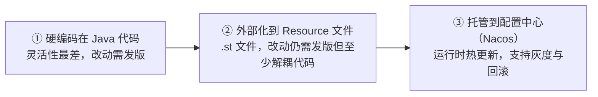

# 第 05 章：Prompt 工程与动态管理

## 学习目标

- 掌握 `PromptTemplate` 的模板语法（StringTemplate 引擎）与自定义分隔符；
- 能用 Java 写出 Few-shot、CoT、ReAct 三种经典 Prompt 模式；
- 掌握 Prompt 的版本化管理策略，理解为什么"硬编码在代码里"在生产环境是技术债；
- 基于 Nacos 实现 Prompt 热更新——修改 Prompt 不用重新发布应用。

## 前置知识

- 完成第 01~04 章，熟悉 `ChatClient`/`Message`/`Role`。

## 核心概念

### 5.1 PromptTemplate 与 StringTemplate 引擎

Spring AI 的 `PromptTemplate` 默认基于 **StringTemplate（ST4）** 引擎渲染模板，变量用 `{}` 包裹（这与你熟悉的 Python f-string/Jinja2 语法不同，注意不要混淆）：

```java
PromptTemplate template = PromptTemplate.builder()
        .template("请分析以下{domain}领域的日志，给出根因猜测：\n{log}")
        .build();

String rendered = template.render(Map.of(
        "domain", "车联网 OTA",
        "log", logContent));
```

如果 Prompt 内容本身包含 JSON（花括号冲突），可以自定义分隔符：

```java
PromptTemplate template = PromptTemplate.builder()
        .renderer(StTemplateRenderer.builder()
                .startDelimiterToken('<')
                .endDelimiterToken('>')
                .build())
        .template("请按如下 JSON 结构输出：{\"result\": <result_placeholder>}")
        .build();
```

`ChatClient` 的 `.system()/.user()` 内部就是用 `PromptTemplate` 处理变量替换的，这也是为什么第 04 章 `u.text("...{log}").param("log", logContent)` 这种写法能生效的原因。

### 5.2 三种经典 Prompt 模式的 Java 实现



**Few-shot**（用消息列表构造示例对话）：

```java
List<Message> fewShotMessages = List.of(
        new SystemMessage("你是故障码翻译助手，将 DTC 故障码翻译为中文描述"),
        new UserMessage("P0300"),
        new AssistantMessage("随机/多缸失火"),
        new UserMessage("P0171"),
        new AssistantMessage("系统偏稀（1号库）"),
        new UserMessage("P0420")   // 真实待翻译问题
);
String result = chatClient.prompt(new Prompt(fewShotMessages)).call().content();
```

**CoT**（通过 System Prompt 引导逐步推理，注意生产环境通常只需要最终结论，可用第 16 章结构化输出把"思考过程"和"最终答案"拆成独立字段）：

```java
String cotSystem = """
        你是资深故障诊断专家。请按以下步骤思考后再给出结论：
        1. 列出可能原因（至少3个）
        2. 逐一分析每个原因的可能性
        3. 给出最终诊断结论
        """;
String result = chatClient.prompt()
        .system(cotSystem)
        .user("车辆频繁出现 P0420 故障码，可能是什么原因？")
        .call()
        .content();
```

**ReAct**：完整的推理-行动循环需要工具调用与状态机支持，手写 ReAct 是第 07 章（Tool）之后、第 13 章（Agent）之前一个很好的"承上启下"练习，本章先理解其 Prompt 结构，第 13 章会用 `ReactAgent` 直接获得开箱即用的实现，无需手写循环。

### 5.3 Prompt 版本化管理的三个层级



企业级应用应该以第③级为目标：产品/运营同学调整 Prompt 措辞不应该依赖研发发版流程。

## API 深入解析：Nacos Prompt 热更新

### 5.4 依赖引入

```xml
<dependency>
    <groupId>com.alibaba.cloud.ai</groupId>
    <artifactId>spring-ai-alibaba-starter-nacos-prompt</artifactId>
</dependency>
```

### 5.5 核心 API：ConfigurablePromptTemplateFactory

```java
@Service
public class DiagnosisPromptService {

    private final ConfigurablePromptTemplateFactory promptTemplateFactory;

    public DiagnosisPromptService(ConfigurablePromptTemplateFactory promptTemplateFactory) {
        this.promptTemplateFactory = promptTemplateFactory;
    }

    public String renderDiagnosisPrompt(String dtcCode) {
        // 优先从 Nacos 拉取名为 "dtc-diagnosis" 的模板；未配置时用代码内默认值兜底
        ConfigurablePromptTemplate template = promptTemplateFactory.getTemplate("dtc-diagnosis");
        if (template == null) {
            template = promptTemplateFactory.create(
                    "dtc-diagnosis",
                    "请分析故障码 {code} 的可能原因",
                    Map.of("code", "P0000"));
        }
        return template.render(Map.of("code", dtcCode));
    }
}
```

### 5.6 Nacos 端配置约定

| 项 | 值 |
|---|---|
| Data ID | `spring.ai.alibaba.configurable.prompt`（固定，不可自定义） |
| Group | `DEFAULT_GROUP` |
| 配置格式 | JSON 数组，每个元素是一个具名模板 |

```json
[
  {
    "name": "dtc-diagnosis",
    "template": "你是资深车辆故障诊断专家。请分析故障码 {code} 的可能原因，按严重程度排序列出前三项，并给出建议的排查步骤。"
  },
  {
    "name": "greeting",
    "template": "你好，我是{assistant_name}，很高兴为你服务。"
  }
]
```

在 Nacos 控制台修改这个配置项并发布后，`promptTemplateFactory.getTemplate("dtc-diagnosis")` 在**下一次调用时就会拿到新内容**，应用无需重启——这就是"热更新"的含义。

## 可运行 Demo：Prompt 模板 + Nacos 热更新

对应仓库位置：`examples/06-prompt-demo`（模板与模式）与 `examples/08-prompt-nacos-demo`（Nacos 热更新）。这里给出后者的核心代码，前者是纯 `PromptTemplate` 用法练习，读者可参照 §5.2 代码自行组装为 Controller。

### 前置条件

```bash
bash scripts/infra.sh up cloud   # 启动 Nacos
```

### application.yml

```yaml
server:
  port: 18008

spring:
  application:
    name: prompt-nacos-demo
  ai:
    dashscope:
      api-key: ${AI_DASHSCOPE_API_KEY}
  cloud:
    nacos:
      server-addr: 127.0.0.1:8848
      username: nacos
      password: nacos
```

### PromptNacosController.java

```java
package com.flywhl.saa.promptnacos;

import com.alibaba.cloud.ai.autoconfigure.configurableprompt.ConfigurablePromptTemplate;
import com.alibaba.cloud.ai.autoconfigure.configurableprompt.ConfigurablePromptTemplateFactory;
import org.springframework.ai.chat.client.ChatClient;
import org.springframework.web.bind.annotation.GetMapping;
import org.springframework.web.bind.annotation.RequestParam;
import org.springframework.web.bind.annotation.RestController;

import java.util.Map;

/**
 * 演示 Nacos 动态 Prompt：修改 Nacos 上 dataId=spring.ai.alibaba.configurable.prompt
 * 的配置后，无需重启应用即可看到 Prompt 内容变化。
 *
 * @author flywhl
 */
@RestController
public class PromptNacosController {

    private final ChatClient chatClient;
    private final ConfigurablePromptTemplateFactory promptTemplateFactory;

    public PromptNacosController(ChatClient.Builder chatClientBuilder,
                                  ConfigurablePromptTemplateFactory promptTemplateFactory) {
        this.chatClient = chatClientBuilder.build();
        this.promptTemplateFactory = promptTemplateFactory;
    }

    @GetMapping("/diagnosis")
    public String diagnose(@RequestParam String code) {
        ConfigurablePromptTemplate template = promptTemplateFactory.getTemplate("dtc-diagnosis");
        if (template == null) {
            template = promptTemplateFactory.create(
                    "dtc-diagnosis",
                    "请分析故障码 {code} 的可能原因",
                    Map.of("code", "P0000"));
        }
        String prompt = template.render(Map.of("code", code));
        return chatClient.prompt().user(prompt).call().content();
    }
}
```

### 运行与验证

```bash
cd examples/08-prompt-nacos-demo
mvn spring-boot:run
curl "http://localhost:18008/diagnosis?code=P0420"
```

第一次调用时 Nacos 尚无配置，走代码内默认模板。接着登录 Nacos 控制台（<http://localhost:8080>，或旧版 <http://localhost:8848/nacos>），新建配置：Data ID 填 `spring.ai.alibaba.configurable.prompt`，Group 填 `DEFAULT_GROUP`，内容按 §5.6 的 JSON 数组格式填入更详细的诊断模板，点击发布。**不重启应用**，再次执行同样的 curl 命令：

```bash
curl "http://localhost:18008/diagnosis?code=P0420"
```

### 预期变化

第二次响应会明显更详细、更结构化——因为 Prompt 内容已经从"简单模板"切换成了 Nacos 上刚发布的"专家级诊断模板"，全程应用零重启零发版。

## 关键源码解读

`ConfigurablePromptTemplateFactory` 内部本质上是一个 Nacos `Listener`：启动时订阅 `spring.ai.alibaba.configurable.prompt` 这个 Data ID，配置变更时 Nacos 服务端主动推送给客户端，工厂类解析 JSON 数组并更新内存中的模板缓存。`getTemplate(name)` 读的就是这份内存缓存，这也是为什么"发布后立即生效"而不需要轮询——这是典型的配置中心"推送 + 本地缓存"模式，与 Spring Cloud Config 的"拉取"模式形成对比，后者通常需要额外的 `/actuator/refresh` 触发。

## 企业实践建议

- **给每个 Prompt 模板起有业务语义的名字**（如 `dtc-diagnosis` 而非 `template1`），Nacos 控制台管理几十个模板时可读性至关重要；
- **默认值兜底是强制要求，不是可选项**：本章 Demo 中 `if (template == null)` 的兜底逻辑必须保留——Nacos 服务不可用或配置被误删时，应用应该降级到内置默认 Prompt 而不是直接报错；
- **重大 Prompt 变更要走灰度**：可以在 Nacos 配置里加一个 `version` 字段，结合第 20 章的路由能力对不同用户群体下发不同版本 Prompt，观察效果后再全量。

## 性能优化建议

- `PromptTemplate.render()` 本身的渲染开销可忽略不计，性能瓶颈永远在模型调用本身；
- Few-shot 示例数量直接影响 Prompt token 数进而影响成本和延迟，建议通过实测找到"最少示例数达到可接受效果"的平衡点，而不是"示例越多越好"。

## 安全建议

- Nacos 上的 Prompt 内容属于业务资产，应该配置访问权限（Nacos 命名空间隔离 + RAM 权限），避免任意人员可修改生产 Prompt；
- Prompt 模板中如果拼接用户输入（如 `{log}` 直接来自用户上传内容），要警惕 Prompt 注入攻击——第 20 章安全体系会展开输入侧防护。

## 常见踩坑

| 现象 | 原因 | 解决 |
|---|---|---|
| 模板渲染报错，提示找不到变量 | StringTemplate 语法要求所有 `{xxx}` 占位符必须在 `render()` 的 Map 中提供对应 key | 检查模板与 Map 参数是否一一对应，或使用 §5.1 自定义分隔符规避与 JSON 花括号的冲突 |
| Nacos 上改了配置但应用没反应 | Data ID/Group 填错，或本地 `spring.cloud.nacos.*` 配置指向了错误的 Nacos 实例 | 严格核对 §5.6 表格中的固定值 |
| 中文 Prompt 在某些客户端显示乱码 | HTTP 响应未显式设置 UTF-8 编码 | Controller 方法内显式 `response.setCharacterEncoding("UTF-8")`，或统一在 WebMvcConfigurer 里配置 |

## 版本差异

| 项 | 早期写法 | 本教程写法 |
|---|---|---|
| 模板引擎 | 部分教程直接用 `new PromptTemplate(text, Map)` 一步构造 | 推荐 `PromptTemplate.builder().template(...).build()` + `.render(Map)` 两步分离，職責更清晰，也便于配合自定义 `TemplateRenderer` |
| Prompt 管理 | 硬编码或 `.st` 资源文件 | Nacos 动态托管，运行时热更新 |

## 为什么这样设计

把 Prompt 当作"配置"而不是"代码"来管理，背后是一个重要的工程认知：**Prompt 的迭代速度远快于代码**——同一个功能的 Prompt 可能一周内被产品/算法同学调整十几次以优化效果，如果每次都要走代码评审 + 发布流程，会严重拖慢迭代节奏。Nacos 动态 Prompt 把"内容迭代"和"代码迭代"两条节奏彻底解耦，这与你在 LLM 应用工程中一定深有体会的"Prompt 工程本质上是一种持续调优的实验过程"这一认知是一致的。

## FAQ

**Q：Nacos 上的 JSON 数组可以有多少个模板？**
官方未设置硬性数量限制，但受限于 Nacos 单条配置的内容大小限制（默认约 10MB，足够绝大多数场景），建议按业务模块拆分成多个逻辑分组，通过 `name` 命名规范（如 `module.templateName`）管理，而非无限堆叠在一个数组里。

**Q：Few-shot 示例应该放在 System Message 还是模拟成多轮 User/Assistant 对话？**
两种都可行，但模拟多轮对话（本章 §5.2 的写法）通常效果更好，因为它更贴近模型训练时见过的真实对话数据分布；纯文本堆砌在 System Message 里的示例，部分模型的遵循度会打折扣。

**Q：CoT 的"思考过程"要不要展示给最终用户？**
取决于产品设计。如果只需要结论，建议结合第 16 章的结构化输出把 `reasoning` 和 `answer` 拆成独立字段，后端只返回 `answer`；如果产品希望展示推理过程增强可信度（类似 DeepSeek-R1 的思维链展示），则两者都返回。

## 本章总结

本章把 Prompt 从"写在代码里的字符串"升级为"可运维、可版本化、可热更新的生产资产"：`PromptTemplate` 解决了变量渲染问题，Few-shot/CoT/ReAct 三种模式覆盖了常见的 Prompt 设计范式，Nacos 动态 Prompt 则彻底解决了"改 Prompt 要发版"这个企业级痛点。第 09 章 RAG 与第 20 章企业实践都会直接复用本章的 Prompt 管理方案。

## 延伸阅读

- Spring AI Prompt 官方参考：<https://docs.spring.io/spring-ai/reference/api/prompt.html>
- Nacos 动态 Prompt 最佳实践：<https://java2ai.com/en/blog/spring-ai-dynamic-prompt-nacos/>

## 下一章预告

第 06 章进入 Advisor 链：内置 Advisor 全景（Memory/RAG/Logger/SafeGuard）、执行顺序的"栈"语义、如何编写自定义 Advisor——把本章"Prompt 内容治理"与"调用行为治理"两条线正式打通。

## 思考题

1. 如果 Nacos 服务临时不可用，本章 Demo 的降级逻辑是"用代码内置默认模板"，这个默认模板应该多详细？过于简陋和过于复杂各有什么风险？
2. Few-shot 与 Fine-tuning 都能让模型"学会"某类任务的输出风格，什么情况下你会选择增加 Few-shot 示例，什么情况下你会考虑做微调（结合你正在做的 mlx-lm 微调经验思考）？
3. 如果要支持"不同租户使用不同 Prompt 版本"，你会如何扩展本章的 Nacos 模板命名与查找逻辑？
