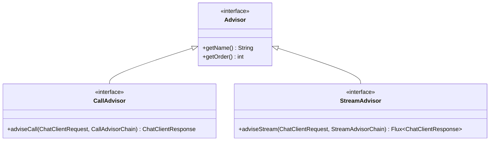
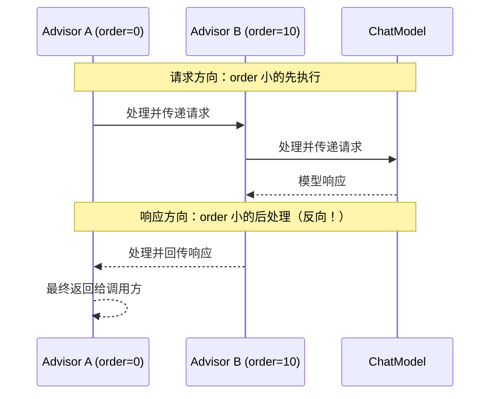

# 第 06 章：Advisor 链深入

## 学习目标

- 理解 Advisor 的责任链（拦截器）设计模式，能画出请求/响应双向流经 Advisor 链的完整路径；
- 掌握 `getOrder()` 的"栈"语义——为什么顺序号小的 Advisor 最先处理请求、最后处理响应；
- 熟悉官方内置 Advisor 全景：`MessageChatMemoryAdvisor`、`QuestionAnswerAdvisor`、`RetrievalAugmentationAdvisor`、`SafeGuardAdvisor`、`SimpleLoggerAdvisor`；
- 能独立实现一个生产可用的自定义 Advisor（本章以"审计日志 + 敏感词脱敏"为例）。

## 前置知识

- 完成第 01~05 章；
- 了解责任链模式（Chain of Responsibility）的基本思想——如果你在 LangChain 用过 `Runnable` 的 `.pipe()` 组合或 LangGraph 的中间件式 Hook，这里的心智模型是相通的。

## 核心概念

### 6.1 Advisor 是什么：一句话理解

Advisor 是包裹在"真正的模型调用"外层的**责任链拦截器**：每个 Advisor 可以在请求发出前修改它（注入历史消息、检索上下文、安全过滤），也可以在响应返回后修改它（记录日志、拼接引用、二次校验）。第 02 章时序图里"MemoryAdvisor 注入历史消息 → RAG Advisor 注入检索上下文"这条链路，本章要把它的实现机制讲透。

### 6.2 核心接口（1.1.x 命名，注意与旧版区分）



> **版本提示**：1.0.x 时代的教程/博客里常见的 `CallAroundAdvisor`/`AdvisedRequest`/`AdvisedResponse` 命名，在 1.1.x 已重命名为 `CallAdvisor`/`ChatClientRequest`/`ChatClientResponse`（`StreamAroundAdvisor` → `StreamAdvisor`）。语义完全一致，只是改了名字更贴合直觉。网上搜到旧命名的代码示例，按这张对照表心理翻译一下即可，不影响理解。

### 6.3 执行顺序的"栈"语义（最容易被误解的一点）



**关键规则**：Advisor 链的行为像一个"栈"——`getOrder()` 值小的 Advisor 最先看到请求，但也最后看到响应。这意味着：如果你想让某个 Advisor "最先处理请求、也最先处理响应"，这在单个 Advisor 内做不到，官方文档给出的方案是**拆成两个 Advisor**，一个负责请求方向（小 order），一个负责响应方向（大 order），通过共享的 Advisor Context 传递状态。

官方还提供了一个重要常量：`Advisor.DEFAULT_CHAT_MEMORY_PRECEDENCE_ORDER`，专门为 Memory 相关 Advisor 预留了顺序区间，并在此基础上向用户开放了 1000 个槽位用于插入自定义高优先级 Advisor——这是官方对"顺序规划"给出的官方建议区间，第 06.6 节会用到。

### 6.4 内置 Advisor 全景

| Advisor | 职责 | 典型 order |
|---|---|---|
| `SimpleLoggerAdvisor` | 记录请求/响应日志，观测性基础 | 0（默认，示例值） |
| `MessageChatMemoryAdvisor` | 从 `ChatMemory` 读取历史消息注入请求（第 08 章详解） | 按 `DEFAULT_CHAT_MEMORY_PRECEDENCE_ORDER` |
| `VectorStoreChatMemoryAdvisor` | 基于向量库实现的长期记忆检索 | 同上区间 |
| `QuestionAnswerAdvisor` | 基于 `VectorStore` 实现的开箱即用 RAG（第 09 章详解） | 视链路位置而定 |
| `RetrievalAugmentationAdvisor` | 更灵活的自定义 RAG 流程（可插拔 `DocumentRetriever`/`QueryAugmenter`） | 视链路位置而定 |
| `SafeGuardAdvisor` | 基于敏感词列表拦截不当内容 | 通常靠前，尽早拦截 |
| `ToolCallAdvisor` | 处理工具调用循环（第 07 章详解） | 框架内部管理 |
| `StructuredOutputValidationAdvisor` | 结构化输出校验（第 16 章详解） | 视需求而定 |
| ~~`PromptChatMemoryAdvisor`~~ | 已弃用，历史实现（把历史消息塞进 System Prompt 而非消息列表） | 不建议使用 |

## API 深入解析

### 6.5 注册 Advisor：Builder 级 vs 调用级

```java
// Builder 级：所有请求都生效（推荐大多数场景）
ChatClient chatClient = chatClientBuilder
        .defaultAdvisors(
                new SimpleLoggerAdvisor(),
                MessageChatMemoryAdvisor.builder(chatMemory).build(),
                QuestionAnswerAdvisor.builder(vectorStore).build())
        .build();

// 调用级：只对本次请求生效，且可以传递运行时参数
String response = chatClient.prompt()
        .advisors(a -> a.param(ChatMemory.CONVERSATION_ID, "user-678"))
        .user("我们之前聊到哪了？")
        .call()
        .content();
```

官方建议：**能在 Builder 级注册的 Advisor 尽量在 Builder 级注册**（第 04 章强调过的"只 build 一次"原则在这里同样适用），调用级 `.advisors()` 主要用于传递运行时参数（如会话 ID），而不是频繁增删 Advisor 本身。

### 6.6 编写自定义 Advisor：审计 + 脱敏

以企业级最常见的需求为例——所有 AI 调用都要记录审计日志，且用户输入中的手机号需要脱敏后才能进入日志（但不影响送给模型的原文）：

```java
package com.flywhl.saa.advisordemo;

import org.springframework.ai.chat.client.ChatClientRequest;
import org.springframework.ai.chat.client.ChatClientResponse;
import org.springframework.ai.chat.client.advisor.api.CallAdvisor;
import org.springframework.ai.chat.client.advisor.api.CallAdvisorChain;
import org.springframework.ai.chat.client.advisor.api.StreamAdvisor;
import org.springframework.ai.chat.client.advisor.api.StreamAdvisorChain;
import org.springframework.core.Ordered;
import org.slf4j.Logger;
import org.slf4j.LoggerFactory;
import reactor.core.publisher.Flux;

import java.util.regex.Pattern;

/**
 * 审计 Advisor：记录脱敏后的请求摘要与响应耗时，
 * 是第 20 章企业安全体系"统一审计日志"能力的最小实现原型。
 *
 * @author flywhl
 */
public class AuditLoggingAdvisor implements CallAdvisor, StreamAdvisor {

    private static final Logger AUDIT_LOG = LoggerFactory.getLogger("AUDIT");
    private static final Pattern PHONE_PATTERN = Pattern.compile("1[3-9]\\d{9}");

    @Override
    public String getName() {
        return "AuditLoggingAdvisor";
    }

    @Override
    public int getOrder() {
        // 尽量靠前：请求方向最先记录原始意图，响应方向最后记录最终结果
        return Ordered.HIGHEST_PRECEDENCE + 100;
    }

    @Override
    public ChatClientResponse adviseCall(ChatClientRequest request, CallAdvisorChain chain) {
        long start = System.currentTimeMillis();
        logRequest(request);
        ChatClientResponse response = chain.nextCall(request);
        logResponse(response, System.currentTimeMillis() - start);
        return response;
    }

    @Override
    public Flux<ChatClientResponse> adviseStream(ChatClientRequest request, StreamAdvisorChain chain) {
        long start = System.currentTimeMillis();
        logRequest(request);
        return chain.nextStream(request)
                .doOnComplete(() -> AUDIT_LOG.info("[audit] stream completed, cost={}ms", System.currentTimeMillis() - start));
    }

    private void logRequest(ChatClientRequest request) {
        String masked = mask(request.prompt().getUserMessage().getText());
        AUDIT_LOG.info("[audit] request user_text={}", masked);
    }

    private void logResponse(ChatClientResponse response, long costMs) {
        AUDIT_LOG.info("[audit] response cost={}ms", costMs);
    }

    private String mask(String text) {
        if (text == null) {
            return null;
        }
        return PHONE_PATTERN.matcher(text).replaceAll(m -> {
            String phone = m.group();
            return phone.substring(0, 3) + "****" + phone.substring(7);
        });
    }
}
```

注意：`mask()` 只用于**日志记录**，`chain.nextCall(request)` 传递给下游（最终到模型）的仍然是 `request` 原始对象——脱敏不应该影响模型看到的真实内容，这是审计日志和业务数据的边界，务必分清楚。

## 可运行 Demo：Advisor 链顺序可视化

对应仓库位置：`examples/09-advisor-demo`（内置 Advisor 组合）与 `examples/10-custom-advisor-demo`（自定义审计 Advisor）。这里给出后者的最小可运行封装。

### AdvisorDemoController.java

```java
package com.flywhl.saa.advisordemo;

import org.springframework.ai.chat.client.ChatClient;
import org.springframework.ai.chat.client.advisor.SimpleLoggerAdvisor;
import org.springframework.web.bind.annotation.GetMapping;
import org.springframework.web.bind.annotation.RequestParam;
import org.springframework.web.bind.annotation.RestController;

/**
 * @author flywhl
 */
@RestController
public class AdvisorDemoController {

    private final ChatClient chatClient;

    public AdvisorDemoController(ChatClient.Builder chatClientBuilder) {
        this.chatClient = chatClientBuilder
                .defaultAdvisors(
                        new AuditLoggingAdvisor(),      // order = HIGHEST_PRECEDENCE + 100，最先记录
                        new SimpleLoggerAdvisor())       // order = 0，比审计 Advisor 后执行请求、先执行响应
                .build();
    }

    @GetMapping("/ask")
    public String ask(@RequestParam String question) {
        return chatClient.prompt().user(question).call().content();
    }
}
```

### application.yml

```yaml
server:
  port: 18010

spring:
  ai:
    dashscope:
      api-key: ${AI_DASHSCOPE_API_KEY}

logging:
  level:
    AUDIT: INFO
    org.springframework.ai.chat.client.advisor: DEBUG
```

### 运行与验证

```bash
cd examples/10-custom-advisor-demo
mvn spring-boot:run
curl "http://localhost:18010/ask?question=我的手机号是13812345678，麻烦查一下我的订单状态"
```

### 预期日志输出（体现"栈"顺序 + 脱敏效果）

```text
[audit] request user_text=我的手机号是138****5678，麻烦查一下我的订单状态
DEBUG ... SimpleLoggerAdvisor : request: ChatClientRequest[...原始未脱敏文本...]
DEBUG ... SimpleLoggerAdvisor : response: ChatClientResponse[...]
[audit] response cost=812ms
```

留意日志顺序：`AuditLoggingAdvisor` 的请求日志最先打印（order 更小，先处理请求），`SimpleLoggerAdvisor` 的请求日志其次；而响应阶段顺序反过来——`SimpleLoggerAdvisor` 先打印响应日志，`AuditLoggingAdvisor` 最后打印——这正是 §6.3 讲的"栈"语义在真实日志里的体现，也验证了脱敏只影响审计日志、不影响送模型的原始请求（`SimpleLoggerAdvisor` 打出来的 request 里手机号是明文）。

## 关键源码解读

`CallAdvisorChain.nextCall(request)` 是整条链路能够"继续往下走"的关键——每个 Advisor 拿到的 `chain` 参数本质上是"剩余待执行的 Advisor 队列 + 最终的 ChatModel 调用"包装出来的一个可调用对象。调用 `chain.nextCall(request)` 就是把控制权交给下一个节点；如果你的 Advisor 决定**不调用** `chain.nextCall(...)`，而是直接构造并返回一个 `ChatClientResponse`，就实现了"拦截并短路整条链路"——这正是 `SafeGuardAdvisor` 拦截敏感词请求时的实现方式：命中敏感词直接返回拒绝响应，请求根本不会到达模型，这样做既安全又省钱（不消耗模型调用配额）。

## 企业实践建议

- **审计 Advisor 应该是几乎所有生产应用的标配**，且建议放在顺序链的最外层（order 最小/最大均可，但要保证"完整覆盖"其余 Advisor 的处理过程）；
- **安全类 Advisor（SafeGuard）应该尽量靠前**，让它有机会在请求消耗模型配额之前就拦截，这是"安全前置"原则在 Advisor 顺序设计上的直接体现；
- **不要把业务逻辑塞进 Advisor**：Advisor 应该只处理横切关注点（日志、安全、记忆、检索增强），具体业务判断留在 Service 层，否则会让调用链变得难以理解和测试。

## 性能优化建议

- Advisor 链每增加一层都有微小的调用开销，但相比模型调用的网络延迟（通常几百毫秒到几秒）可以忽略不计，不必为了"性能"过度精简 Advisor 数量；
- 流式场景下的 Advisor（`adviseStream`）要格外小心不要引入阻塞操作（如同步 IO），否则会破坏 Reactor 的非阻塞特性，拖慢首字节返回时间（第 17 章会展开）。

## 安全建议

- `SafeGuardAdvisor` 的敏感词列表只是最基础的防护手段，生产环境建议结合更完善的内容安全服务（如阿里云内容安全）作为独立 Advisor 接入；
- 审计日志本身也是敏感数据，需要有独立的访问权限控制和留存策略，不能和普通应用日志混在一起无差别访问。

## 常见踩坑

| 现象 | 原因 | 解决 |
|---|---|---|
| 自定义 Advisor 没有生效 | 只在某个局部 `.advisors()` 调用级注册，而不是 `.defaultAdvisors()`，导致其他接口路径没用上 | 明确该 Advisor 是否应该对所有请求生效，是则放到 Builder 级 |
| 两个 Advisor 顺序号相同，实际执行顺序"随缘" | 官方文档明确说明"相同 order 值的执行顺序不保证" | 务必给每个自定义 Advisor 分配明确、不冲突的 order 值 |
| 流式场景下 Advisor 里的日志记录不完整 | 直接在 `adviseStream` 里同步记录，但此时响应还没完全产出 | 用 `.doOnComplete()`/`.doOnNext()` 等 Reactor 操作符在正确的时机记录 |
| 自定义 Advisor 修改了请求却没生效 | 忘记把修改后的新请求对象传给 `chain.nextCall(...)`，仍传了原始 `request` | 确保数据流转链路完整：`before` 阶段产出的新对象要传递下去 |

## 版本差异

| 项 | 1.0.x | 1.1.x（本教程） |
|---|---|---|
| 接口命名 | `CallAroundAdvisor`/`StreamAroundAdvisor`/`AdvisedRequest`/`AdvisedResponse` | `CallAdvisor`/`StreamAdvisor`/`ChatClientRequest`/`ChatClientResponse` |
| Context 可变性 | Context Map 是可变的，随链路传递修改 | Context 作为 Record 一部分，不可变，修改需通过 `updateContext` 生成新实例 |
| Memory Advisor | `PromptChatMemoryAdvisor`（塞进 System Prompt） | `MessageChatMemoryAdvisor`（作为独立消息注入，模型区分度更高，已是官方推荐路径） |

## 为什么这样设计

责任链模式在这里的价值在于**关注点分离与可组合性**：日志、安全、记忆、检索增强，这些能力天然是"横切"的——几乎每个 AI 应用都需要，但又各自独立、可以按需插拔。如果没有 Advisor 这层抽象，你会在每个 Controller/Service 方法里重复写"先查记忆、再查向量库、调用前脱敏检查、调用后记日志"这类样板代码。Advisor 把这些逻辑收敛成可复用、可测试、可独立开关的组件，这正是 Spring 生态"AOP 思想"在 AI 应用场景下的自然延伸——如果你熟悉 Spring 的 `@Aspect`，Advisor 本质上就是"专门为 ChatClient 调用链设计的轻量级 AOP"。

## FAQ

**Q：Advisor 和 Spring AOP 的 `@Aspect` 是同一回事吗？**
思想上是同源的（都是"环绕通知"模式），但实现机制不同：Advisor 是 Spring AI 框架内定义的专用接口，直接作用于 `ChatClient` 调用链，不依赖 Spring AOP 的字节码增强机制，性能开销更可控，配置也更直观（通过 `.defaultAdvisors()` 注册，不需要切点表达式）。

**Q：`RetrievalAugmentationAdvisor` 和 `QuestionAnswerAdvisor` 该用哪个？**
`QuestionAnswerAdvisor` 是"开箱即用"版本，只需传入 `VectorStore` 即可跑通基础 RAG；`RetrievalAugmentationAdvisor` 提供更细粒度的插拔点（自定义 `DocumentRetriever`/`QueryAugmenter`），适合需要自定义检索策略（如混合检索、查询改写）的场景。第 09 章会详细对比。

**Q：可以在运行时动态增减 Advisor 吗？**
Builder 级的 Advisor 列表在 `.build()` 之后就固定了；如果需要"某些用户走 A 链路，某些用户走 B 链路"，推荐做法是构造多个不同配置的 `ChatClient` Bean（类似第 04 章多模型 Demo 的思路），而不是试图动态修改已构建对象的 Advisor 列表。

## 本章总结

Advisor 链是 ChatClient 可扩展性的核心机制：责任链模式让日志、安全、记忆、检索增强这些横切关注点可以独立开发、独立测试、按需组合。你需要牢记"栈"语义——order 小的 Advisor 请求先处理、响应后处理——这是排查 Advisor 执行顺序问题的唯一依据。本章实现的审计 + 脱敏 Advisor，将在第 20 章企业安全体系中被直接扩展为完整的合规审计方案。

## 延伸阅读

- Spring AI Advisors 官方参考：<https://docs.spring.io/spring-ai/reference/api/advisors.html>
- Spring AI 官方博客《Supercharging Your AI Applications with Spring AI Advisors》：<https://spring.io/blog/2024/10/02/supercharging-your-ai-applications-with-spring-ai-advisors/>

## 下一章预告

第 07 章进入 Tool Calling：`@Tool` 注解、`ToolContext`、动态/异步工具注册、HTTP/数据库工具封装、`returnDirect` 短路机制，以及工具调用的权限与安全边界——这是构建能"行动"而不只是"对话"的 AI 应用的核心能力，也是第 13 章 Agent 的直接前置知识。

## 思考题

1. 如果要实现"某些高风险操作（如删除数据）需要人工确认后才真正执行"，你会用 Advisor 机制还是工具层（第 07 章）机制实现拦截？两者的拦截时机有什么本质区别？
2. `SafeGuardAdvisor` 命中敏感词后直接短路返回，不调用 `chain.nextCall()`——如果这是一个流式接口，你觉得 `adviseStream` 应该如何优雅地返回一个"拒绝响应"而不是真正的流？
3. 本章审计 Advisor 的 order 设为 `Ordered.HIGHEST_PRECEDENCE + 100`，如果之后需要新增一个"限流 Advisor"，你觉得它应该比审计 Advisor 的 order 更小还是更大？为什么？
