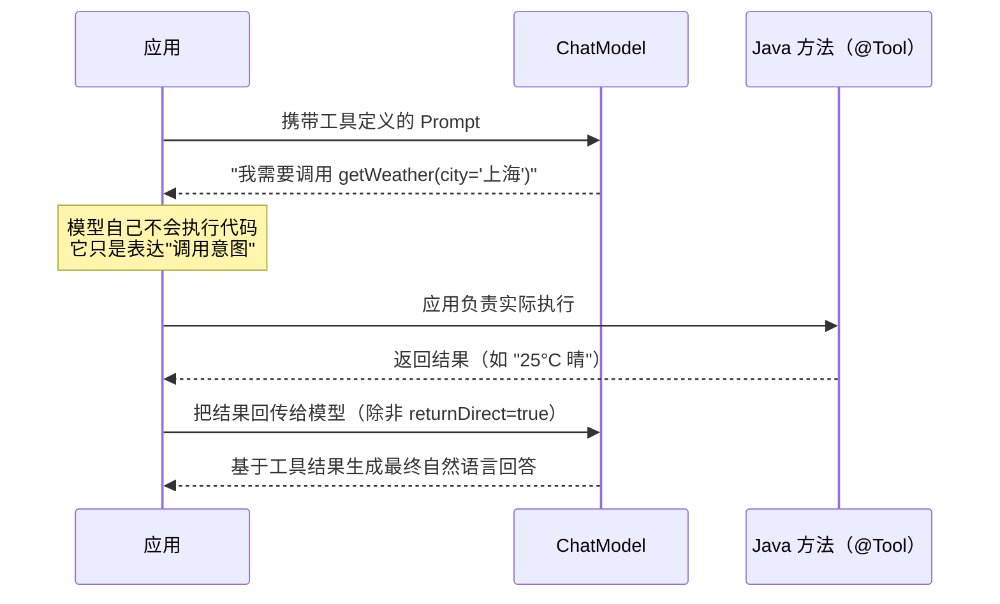
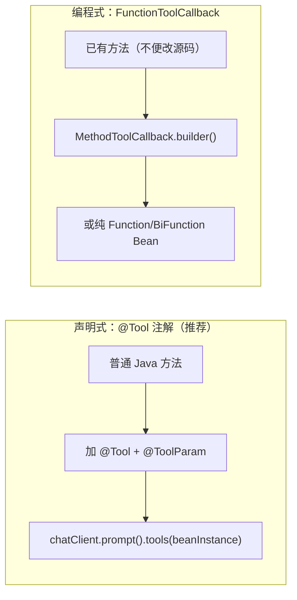

# 第 07 章：Tool Calling 全景

## 学习目标

- 掌握 `@Tool`/`@ToolParam` 声明式工具定义，理解其与 `FunctionToolCallback` 编程式定义的适用场景差异；
- 理解 `ToolContext` 如何传递用户身份等附加信息，而不需要模型"猜测"这些参数；
- 掌握 `returnDirect` 短路机制的适用场景与限制；
- 能封装 HTTP 工具、数据库工具，并理解工具调用的权限边界与安全防护思路。

## 前置知识

- 完成第 01~06 章；
- 了解 Function Calling 的基本概念（模型返回"我要调用哪个工具、传什么参数"，而不是直接执行）。

## 核心概念

### 7.1 Tool Calling 的本质：模型不能"动手"，只能"提需求"



这个链路默认是**框架内部自动完成**的（`ToolCallingManager` 负责识别模型的工具调用意图、执行对应 Java 方法、把结果回传），你只需要声明工具，不需要手写这个循环——这是 Spring AI 相对底层 HTTP API 调用的核心价值之一。

### 7.2 两种工具定义方式



**声明式**（日常首选，可读性最好）：

```java
@Component
public class WeatherTools {

    @Tool(description = "查询指定城市的实时天气")
    public WeatherResult getWeather(
            @ToolParam(description = "城市名称，如：上海") String city) {
        // 调用真实天气 API...
        return new WeatherResult(city, 25.0, "晴");
    }
}
```

```java
String response = chatClient.prompt()
        .tools(new WeatherTools())     // 调用级传入
        .user("上海今天天气怎么样？")
        .call()
        .content();
```

也可以在 Builder 级注册为默认工具（对所有请求生效）：

```java
ChatClient chatClient = chatClientBuilder
        .defaultTools(new WeatherTools())
        .build();
```

**编程式**（不方便修改源码，或工具定义需要动态生成时使用）：

```java
ToolCallback weatherToolCallback = FunctionToolCallback
        .builder("getWeather", (WeatherRequest request) -> weatherService.query(request.city()))
        .description("查询指定城市的实时天气")
        .inputType(WeatherRequest.class)
        .build();
```

### 7.3 工具命名与描述的工程意义

`name` 未提供时默认取方法名，`description` 未提供时默认取方法名字符串——**这在生产环境几乎总是不够的**。模型完全依赖 `description` 来判断"这个工具是否适合处理当前用户意图"，含糊的描述会导致模型该用工具时不用、不该用时乱用。这与你写 API 文档、写 Git commit message 的道理是相通的：写给"读者"（这里的读者是模型）看得懂的描述，而不是写给自己看的备注。

> 命名建议：官方文档特别提示——为了跨模型兼容性，工具名只用字母数字、下划线、连字符和点，避免空格或特殊字符（某些模型如 OpenAI 系列对此更敏感）。

### 7.4 ToolContext：向工具传递"模型不该猜的信息"

有些参数不应该由模型决定（比如当前登录用户 ID），这类信息通过 `ToolContext` 传递，模型完全不感知它的存在：

```java
@Tool(description = "查询当前用户的订单列表")
public List<Order> getMyOrders(ToolContext toolContext) {
    String userId = (String) toolContext.getContext().get("userId");
    return orderService.findByUserId(userId);
}
```

调用时把上下文塞进去：

```java
String response = chatClient.prompt()
        .toolContext(Map.of("userId", currentUserId()))
        .user("帮我查一下我的订单")
        .call()
        .content();
```

这是一个重要的安全边界：**永远不要让模型自己"声称"一个用户 ID 作为工具参数**——那样等于允许任何用户通过话术让模型"以为"自己是别人。`ToolContext` 由应用代码在服务端注入，模型无法伪造，这是工具调用安全设计的第一原则。

### 7.5 returnDirect：跳过模型二次处理

```java
@Tool(description = "根据订单号查询物流轨迹原始数据", returnDirect = true)
public LogisticsTrace getLogisticsTrace(@ToolParam(description = "订单号") String orderId) {
    return logisticsService.queryTrace(orderId);
}
```

`returnDirect = true` 时，工具执行结果**不会**被送回模型做二次加工，而是直接作为最终响应返回给调用方。适用场景：

- 结果本身已经是结构化数据，不需要模型转述（如返回一个可视化用的 JSON）；
- 需要节省一次模型调用（降低延迟和成本）；
- 结果包含模型不应该"转述加工"的原始数据（如精确的财务数字，防止模型转述时产生幻觉性误差）。

**限制**：如果一次响应中模型同时请求了多个工具调用，**必须所有工具都设置 `returnDirect=true`** 才会直接返回，否则结果仍会送回模型（官方文档明确说明的边界条件，容易被忽视）。

## API 深入解析：HTTP 工具与数据库工具封装

### 7.6 HTTP 工具

```java
@Component
public class StockPriceTools {

    private final RestClient restClient;

    public StockPriceTools(RestClient.Builder builder) {
        this.restClient = builder.baseUrl("https://api.example.com").build();
    }

    @Tool(description = "查询指定股票代码的最新价格")
    public StockPrice getLatestPrice(@ToolParam(description = "股票代码，如 AAPL") String symbol) {
        return restClient.get()
                .uri("/quote?symbol={symbol}", symbol)
                .retrieve()
                .body(StockPrice.class);
    }
}
```

### 7.7 数据库工具（结合 Spring Data）

```java
@Component
public class VehicleDiagnosisTools {

    private final DtcRepository dtcRepository;

    public VehicleDiagnosisTools(DtcRepository dtcRepository) {
        this.dtcRepository = dtcRepository;
    }

    @Tool(description = "根据故障码查询车辆诊断知识库中的标准解释")
    public DtcInfo lookupDtc(@ToolParam(description = "OBD-II 故障码，如 P0420") String code) {
        return dtcRepository.findByCode(code)
                .orElseThrow(() -> new BizException(CommonResultCode.NOT_FOUND, "未收录该故障码：" + code));
    }
}
```

数据库工具最大的风险是 **SQL 注入与越权查询**——务必使用参数化查询（Spring Data 的方法命名查询/`@Query` 天然参数化），**严禁**把用户输入直接拼接进原生 SQL 交给模型"自由发挥"（第 20 章会展开一个反例："让模型直接生成 SQL 并执行"这种设计模式的风险与正确做法）。

## 可运行 Demo：工具安全与权限控制

对应仓库位置：`examples/11-tool-demo`（基础工具）与 `examples/15-tool-security-demo`（权限控制）。这里给出后者的核心实现：一个"删除操作需要显式权限校验，且高风险操作 `returnDirect` 返回确认信息而非直接执行"的模式。

### ToolSecurityDemoApplication 关键代码

```java
package com.flywhl.saa.toolsecurity;

import org.springframework.ai.chat.model.ToolContext;
import org.springframework.ai.tool.annotation.Tool;
import org.springframework.ai.tool.annotation.ToolParam;
import org.springframework.stereotype.Component;

/**
 * 演示工具调用的权限边界：查询类工具默认放开，
 * 变更类工具强制要求 ToolContext 携带的角色为 ADMIN，否则拒绝执行。
 *
 * @author flywhl
 */
@Component
public class KnowledgeAdminTools {

    @Tool(description = "查询知识库文档数量")
    public int countDocuments() {
        return 128; // 示例返回值
    }

    @Tool(description = "删除指定 ID 的知识库文档，仅管理员可执行", returnDirect = true)
    public String deleteDocument(@ToolParam(description = "文档 ID") String docId, ToolContext toolContext) {
        String role = (String) toolContext.getContext().getOrDefault("role", "USER");
        if (!"ADMIN".equals(role)) {
            // 不抛异常中断整个链路，而是把"权限不足"作为工具结果返回，
            // 由模型用自然语言告知用户——用户体验更友好
            return "权限不足：删除操作仅管理员可执行，当前角色为 " + role;
        }
        // 真实删除逻辑（示例中省略数据库操作）
        return "文档 " + docId + " 已删除";
    }
}
```

### ToolSecurityController.java

```java
package com.flywhl.saa.toolsecurity;

import org.springframework.ai.chat.client.ChatClient;
import org.springframework.web.bind.annotation.GetMapping;
import org.springframework.web.bind.annotation.RequestParam;
import org.springframework.web.bind.annotation.RestController;

import java.util.Map;

/**
 * @author flywhl
 */
@RestController
public class ToolSecurityController {

    private final ChatClient chatClient;

    public ToolSecurityController(ChatClient.Builder chatClientBuilder, KnowledgeAdminTools tools) {
        this.chatClient = chatClientBuilder.defaultTools(tools).build();
    }

    @GetMapping("/admin/ask")
    public String ask(@RequestParam String question,
                       @RequestParam(defaultValue = "USER") String role) {
        return chatClient.prompt()
                .toolContext(Map.of("role", role))
                .user(question)
                .call()
                .content();
    }
}
```

### 运行与验证

```bash
cd examples/15-tool-security-demo
mvn spring-boot:run
```

```bash
# 普通用户尝试删除文档 —— 应被拒绝
curl "http://localhost:18015/admin/ask?question=删除ID为doc-001的文档&role=USER"

# 管理员执行同样操作 —— 应成功
curl "http://localhost:18015/admin/ask?question=删除ID为doc-001的文档&role=ADMIN"
```

### 预期输出

```text
$ curl ".../admin/ask?question=删除ID为doc-001的文档&role=USER"
权限不足：删除操作仅管理员可执行，当前角色为 USER

$ curl ".../admin/ask?question=删除ID为doc-001的文档&role=ADMIN"
文档 doc-001 已删除
```

## 关键源码解读

`@ToolParam` 未标注的参数默认视为**必填**（`required` 默认为 `true`）——这一点容易在参数较多的工具方法上踩坑：如果某个参数应该是可选的，必须显式 `@ToolParam(required = false)`，否则模型每次都会被要求提供该参数，即使业务上它经常缺省。工具的 JSON Schema 是框架基于方法签名 + 注解**自动生成**的（`JsonSchemaGenerator.generateForMethodInput`），这也是为什么方法参数命名要有意义——Schema 里的字段名默认取自 Java 参数名（需要编译时保留参数名信息，即 `-parameters` 编译选项，本仓库父 POM 已在第 01 章统一开启）。

## 企业实践建议

- **工具描述要包含"什么时候不该用"**：不只是"这个工具能做什么"，好的描述还应该暗示边界（如"仅用于查询已完成订单，进行中订单请使用另一工具"），能显著降低模型误用工具的概率；
- **高风险操作优先走"确认后执行"两阶段模式**：本章 Demo 的"角色校验后返回拒绝文案"是简化版，生产环境对真正的删除/资金操作，建议结合第 13 章的 Human-in-the-Loop 机制，让工具先返回"待确认"状态，由前端展示确认对话框，用户确认后再触发第二次调用真正执行；
- **工具粒度要适中**：过细的工具（每个字段一个工具）会让模型规划路径变复杂，过粗的工具（一个工具做十件事）会让参数 Schema 难以理解，经验法则是"一个工具对应一个清晰的业务动作"。

## 性能优化建议

- 工具执行是同步阻塞的（除非显式实现异步工具），如果工具内部调用了慢查询或外部 API，会直接拖慢整个 ChatClient 调用的响应时间，必要时应该在工具方法内部设置合理超时；
- 一次请求中模型可能连续多轮调用工具（ReAct 循环），每一轮都是一次完整的模型往返，工具数量和描述长度都会计入每次请求的 Prompt token 开销——工具集不宜无限扩张，考虑按场景动态传入而非全局注册全部工具（第 13 章 Agent Skills 的"渐进式披露"思想正是为了解决这个问题）。

## 安全建议

- **绝不信任模型传来的身份类参数**（§7.4 已强调），一切身份信息通过 `ToolContext` 由服务端注入；
- **数据库工具必须走参数化查询**，杜绝 SQL 拼接；
- **工具执行需要审计**：结合第 06 章的 Advisor 思路，考虑为高风险工具单独包一层执行日志记录（谁在什么时间通过什么请求触发了哪个工具，携带什么参数）；
- 需要执行代码、访问文件系统等极高风险能力的工具，应评估接入第 02 章提到的 `spring-ai-alibaba-sandbox` 隔离执行环境，而不是让工具直接在应用主进程内执行不受信任的操作。

## 常见踩坑

| 现象 | 原因 | 解决 |
|---|---|---|
| 模型从不调用某个工具 | `description` 过于简单或与其他工具描述雷同，模型无法区分 | 补充详细描述，明确适用场景与参数含义 |
| 模型总是"编造"一个不存在的用户 ID 传给工具 | 把身份信息设计成了普通工具参数而非 `ToolContext` | 改用 `ToolContext` 传递身份信息，工具方法签名里不再暴露该参数给模型 |
| `returnDirect=true` 没有生效，结果还是被模型转述了 | 同一次响应中还有其他 `returnDirect=false` 的工具被一并调用 | 检查本次请求实际触发的全部工具，确保全部标记为 `returnDirect=true` |
| 编译后工具参数名变成 `arg0`/`arg1`，Schema 字段名丢失语义 | Maven 编译未开启 `-parameters` 选项 | 本仓库父 POM 已统一配置 `<parameters>true</parameters>`（第 01 章），自建工程需同样配置 |

## 版本差异

| 项 | 早期（Spring AI 1.0.0-M6 之前） | 本教程写法 |
|---|---|---|
| 核心抽象 | `FunctionCallback`（已弃用） | `ToolCallback`，与"Tool"这一行业标准术语对齐 |
| 声明方式 | 需要手写 `FunctionCallback` 实现类 | `@Tool` 声明式注解为首选路径 |

## 为什么这样设计

"模型只表达意图、应用负责执行"这个设计，本质上是一种**权限最小化**的安全架构：LLM 运行在不受信任的边界内（它的输出可能被 Prompt 注入操纵），如果模型可以直接执行代码或数据库操作，任何能够影响 Prompt 的输入（包括恶意用户输入、被污染的检索文档）都可能演变成任意代码执行漏洞。通过"意图声明 → 应用校验 → 应用执行"这个中间层，你的业务代码始终掌握着最终决定权——`ToolContext` 的身份注入、`returnDirect` 的执行边界控制、以及本章反复强调的权限校验，都是这个安全架构在不同层面的具体体现。

## FAQ

**Q：一个工具方法可以返回 `void` 吗？**
可以，官方文档明确支持返回值为 `void` 的工具（用于纯粹的"执行动作但不需要返回数据"场景，如发送通知）。

**Q：工具方法可以是 `private` 的吗？**
可以，`@Tool` 注解支持任意可见性修饰符（`public`/`protected`/包级私有/`private`），框架通过反射调用，不受 Java 访问控制限制。

**Q：一次 ChatClient 调用可以同时传入几十个工具吗？**
技术上可以，但强烈不建议——工具数量越多，模型选择正确工具的准确率通常越低，且每次请求的 Prompt token 开销线性增长。第 13 章 Agent Skills 的渐进式披露正是为了解决"工具集庞大但每次只需要暴露少量相关工具"这个问题。

## 本章总结

本章讲清楚了 Tool Calling 的完整机制：模型只负责"表达调用意图"，应用负责"实际执行并对结果负责"。`@Tool`/`@ToolParam` 是声明式定义的首选路径，`ToolContext` 解决了"不该由模型猜测的身份类参数"如何安全传递的问题，`returnDirect` 提供了跳过模型二次转述的性能优化手段。你实现的权限校验 Demo，展示了工具层如何成为 AI 应用安全边界的第一道防线——这个思路将在第 13 章 Agent 的工具编排与第 20 章企业安全体系中被进一步扩展。

## 延伸阅读

- Spring AI Tool Calling 官方参考：<https://docs.spring.io/spring-ai/reference/api/tools.html>

## 下一章预告

第 08 章进入 Memory：`ChatMemory`/`ChatMemoryRepository` 抽象、`MessageWindowChatMemory` 的整轮次驱逐策略、Redis/JDBC 持久化记忆、长期记忆与摘要压缩策略——解决"模型天生无状态，如何让应用感觉'记得住'"这个核心工程问题。

## 思考题

1. 如果一个工具需要调用另一个内部微服务，而该微服务本身也有独立的鉴权体系，你会如何设计 `ToolContext` 与微服务鉴权 Token 的传递关系？
2. 本章"删除操作返回拒绝文案而非抛异常"的设计，相比"直接抛出 `BizException` 由第 06 章的 `GlobalExceptionHandler` 统一处理"，各有什么优劣？什么场景该选哪种？
3. 结合你的 vehicle-diag-platform 项目经验，故障诊断场景中，你觉得哪些操作适合设计成 `returnDirect=true` 的工具，哪些必须让模型二次加工？
