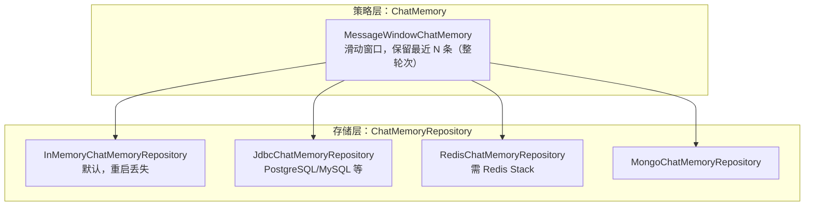
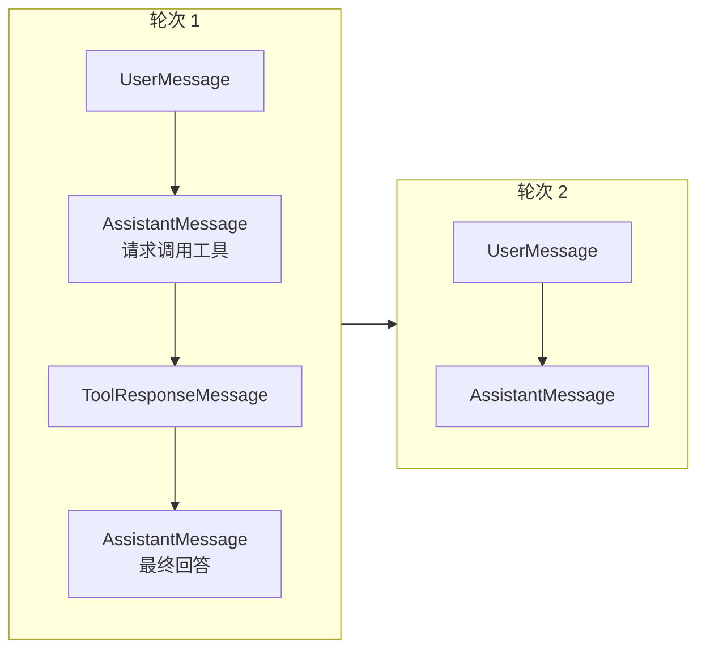

# 第 08 章：Memory 会话记忆

## 学习目标

- 理解 `ChatMemory` 与 `ChatMemoryRepository` 的职责分离：策略 vs 存储；
- 掌握 `MessageWindowChatMemory` 的**整轮次驱逐**策略，理解它为什么比"简单裁剪最早 N 条"更适合工具调用场景；
- 能配置 Redis、JDBC 两种持久化记忆后端，理解各自的适用场景与已知限制；
- 理解长期记忆（跨会话）与短期记忆（单会话内）的边界，掌握摘要压缩的实现思路。

## 前置知识

- 完成第 01~07 章，尤其是第 06 章 Advisor 链——Memory 是通过 Advisor 注入的。

## 核心概念

### 8.1 两层抽象：策略与存储分离



`ChatMemory` 决定"记住什么、忘记什么"（策略），`ChatMemoryRepository` 决定"存在哪里"（存储）。两者组合使用：

```java
ChatMemory chatMemory = MessageWindowChatMemory.builder()
        .chatMemoryRepository(chatMemoryRepository)   // 换存储后端只改这一行
        .maxMessages(20)
        .build();
```

这个分层设计的好处在第 04 章你已经很熟悉——和 `ChatModel` 统一多厂商模型抽象是同一种设计哲学：**策略代码与具体存储实现解耦，换存储后端不用改业务代码**。

### 8.2 MessageWindowChatMemory 的整轮次驱逐（1.1.x 的重要细化）

一个容易被忽视但很重要的细节：`MessageWindowChatMemory` 淘汰旧消息时，**不会在工具调用的中间截断**。"轮次"（turn）定义为：从一条 `UserMessage` 开始，包含其后所有的助手回复、工具调用、工具响应，直到下一条 `UserMessage` 为止。



如果按原始位置裁剪恰好落在轮次 1 的 `A1`（工具调用请求）中间，`MessageWindowChatMemory` 会自动把裁剪点前移到下一个 `UserMessage` 边界——这意味着 **`maxMessages` 是一个上限而非精确值**，实际保留的消息数可能略少于设定值。这个设计避免了"记忆里只剩工具调用请求、丢失了对应的工具响应"这种破坏对话完整性的情况，如果你手写过窗口裁剪逻辑就会明白这个边界处理有多重要。

另外，`SystemMessage` 有特殊待遇：新的 `SystemMessage` 加入时会清除之前所有的 `SystemMessage`；驱逐发生时，`SystemMessage` 会被优先保留而不是被驱逐——保证 System Prompt 不会因为对话过长而意外丢失。

### 8.3 会话隔离：conversationId

Memory 默认按 `conversationId` 隔离不同会话（不同用户/不同对话线程互不干扰）：

```java
String response = chatClient.prompt()
        .advisors(a -> a.param(ChatMemory.CONVERSATION_ID, userId))  // 用用户 ID 作为会话标识
        .user(userMessage)
        .call()
        .content();
```

不显式传递时框架会使用默认会话 ID——这在单用户 Demo 场景没问题，但**生产多用户应用必须显式传递**，否则会出现"用户 A 看到用户 B 的对话历史"这种严重的数据隔离问题。

## API 深入解析

### 8.4 三种存储后端配置

**InMemory（默认，仅用于开发/测试）**：

```java
ChatMemory chatMemory = MessageWindowChatMemory.builder()
        .chatMemoryRepository(new InMemoryChatMemoryRepository())
        .maxMessages(20)
        .build();
```

**JDBC（生产推荐，团队已有 PostgreSQL/MySQL 基础设施时首选）**：

```xml
<dependency>
    <groupId>org.springframework.ai</groupId>
    <artifactId>spring-ai-starter-model-chat-memory-repository-jdbc</artifactId>
</dependency>
```

```yaml
spring:
  ai:
    chat:
      memory:
        repository:
          jdbc:
            initialize-schema: always   # 自动建表 SPRING_AI_CHAT_MEMORY
```

```java
@Bean
@ConditionalOnMissingBean(ChatMemory.class)
public ChatMemory chatMemory(JdbcChatMemoryRepository repository) {
    return MessageWindowChatMemory.builder()
            .chatMemoryRepository(repository)
            .maxMessages(50)
            .build();
}
```

**Redis（低延迟场景，注意版本要求）**：

> ⚠️ **重要提示**：`RedisChatMemoryRepository` 依赖 **Redis Stack**（需要 RedisJSON + RediSearch/Redis Query Engine 模块），而**不是**普通 Redis。本仓库 `docker/docker-compose.yml` 的 `redis` 服务当前使用标准 `redis:7.4-alpine` 镜像，**不满足这个要求**。如果要跑通 `redis-memory-demo`，需要在该 Demo 自己的 `docker-compose.override.yml` 里额外声明一个 `redis/redis-stack-server` 镜像的服务（Phase 3 交付该 Demo 时会补充），不要直接复用 `core` profile 里的 `redis` 服务。这是一个官方文档容易被忽略、但实操中会直接导致启动失败的真实差异点。

```java
RedisClient jedisClient = RedisClient.builder().hostAndPort("localhost", 6379).build();
ChatMemoryRepository chatMemoryRepository = RedisChatMemoryRepository.builder()
        .jedisClient(jedisClient)
        .indexName("saa-chat-index")
        .keyPrefix("saa-chat:")
        .timeToLive(Duration.ofHours(24))   // 支持 TTL，会话记忆自动过期
        .build();
ChatMemory chatMemory = MessageWindowChatMemory.builder()
        .chatMemoryRepository(chatMemoryRepository)
        .maxMessages(20)
        .build();
```

### 8.5 三种存储后端对比

| 后端 | 适用场景 | 优势 | 限制 |
|---|---|---|---|
| InMemory | 本地开发、单元测试 | 零配置 | 重启丢失，多实例部署不共享 |
| JDBC | 已有关系库基础设施的团队（如你现在的 PG/MySQL） | 与业务库统一运维、事务能力强 | 相比 Redis 延迟稍高 |
| Redis（Stack） | 高并发、低延迟、需要 TTL 自动过期 | 性能最优，原生支持按内容/类型/时间范围高级查询 | 依赖 Redis Stack 而非普通 Redis，运维成本略高 |

## 可运行 Demo：会话隔离与持久化验证

对应仓库位置：`examples/16-memory-demo`（InMemory 窗口记忆）与 `examples/17-redis-memory-demo`（Redis 持久化）。这里给出 JDBC 版本（`examples/18-jdbc-memory-demo`）作为生产推荐路径的完整实现。

### 前置条件

```bash
bash scripts/infra.sh up core   # 启动 PostgreSQL
```

### application.yml

```yaml
server:
  port: 18018

spring:
  application:
    name: jdbc-memory-demo
  datasource:
    url: jdbc:postgresql://localhost:5432/saa_learning
    username: saa
    password: saa123456
  ai:
    dashscope:
      api-key: ${AI_DASHSCOPE_API_KEY}
    chat:
      memory:
        repository:
          jdbc:
            initialize-schema: always
```

### MemoryConfig.java

```java
package com.flywhl.saa.jdbcmemory;

import org.springframework.ai.chat.client.ChatClient;
import org.springframework.ai.chat.client.advisor.MessageChatMemoryAdvisor;
import org.springframework.ai.chat.memory.ChatMemory;
import org.springframework.ai.chat.memory.MessageWindowChatMemory;
import org.springframework.ai.chat.memory.repository.jdbc.JdbcChatMemoryRepository;
import org.springframework.context.annotation.Bean;
import org.springframework.context.annotation.Configuration;

/**
 * @author flywhl
 */
@Configuration(proxyBeanMethods = false)
public class MemoryConfig {

    @Bean
    public ChatMemory chatMemory(JdbcChatMemoryRepository repository) {
        return MessageWindowChatMemory.builder()
                .chatMemoryRepository(repository)
                .maxMessages(50)
                .build();
    }

    @Bean
    public ChatClient chatClient(ChatClient.Builder builder, ChatMemory chatMemory) {
        return builder
                .defaultAdvisors(MessageChatMemoryAdvisor.builder(chatMemory).build())
                .build();
    }
}
```

### MemoryController.java

```java
package com.flywhl.saa.jdbcmemory;

import org.springframework.ai.chat.client.ChatClient;
import org.springframework.ai.chat.memory.ChatMemory;
import org.springframework.web.bind.annotation.GetMapping;
import org.springframework.web.bind.annotation.RequestParam;
import org.springframework.web.bind.annotation.RestController;

/**
 * @author flywhl
 */
@RestController
public class MemoryController {

    private final ChatClient chatClient;

    public MemoryController(ChatClient chatClient) {
        this.chatClient = chatClient;
    }

    @GetMapping("/chat")
    public String chat(@RequestParam String message, @RequestParam String userId) {
        return chatClient.prompt()
                .advisors(a -> a.param(ChatMemory.CONVERSATION_ID, userId))
                .user(message)
                .call()
                .content();
    }
}
```

### 运行与验证：会话隔离

```bash
cd examples/18-jdbc-memory-demo
mvn spring-boot:run
```

```bash
# 用户 alice 告诉助手她的名字
curl "http://localhost:18018/chat?message=我叫Alice，请记住&userId=alice"
# 用户 alice 追问 —— 应该记得
curl "http://localhost:18018/chat?message=我叫什么名字？&userId=alice"
# 用户 bob 追问同样问题 —— 不应该知道（会话隔离）
curl "http://localhost:18018/chat?message=我叫什么名字？&userId=bob"
```

### 预期输出

```text
$ curl ".../chat?message=我叫什么名字？&userId=alice"
你叫 Alice。

$ curl ".../chat?message=我叫什么名字？&userId=bob"
抱歉，我不知道你的名字，你可以告诉我吗？
```

### 验证持久化：重启应用后记忆仍在

```bash
# Ctrl+C 停止应用，重新 mvn spring-boot:run 后再次请求
curl "http://localhost:18018/chat?message=我叫什么名字？&userId=alice"
# 应仍然记得 "Alice" —— 因为记忆存在 PostgreSQL 而非进程内存
```

### 数据库验证（可选）

```bash
psql -h localhost -U saa -d saa_learning -c "SELECT conversation_id, type, content FROM spring_ai_chat_memory ORDER BY \"timestamp\" LIMIT 10;"
```

## 关键源码解读

`MessageChatMemoryAdvisor` 在**请求阶段**从 `ChatMemory` 读取指定 `conversationId` 的历史消息，拼接到本次请求的消息列表前面；在**响应阶段**把这次的 `UserMessage` 和新产生的 `AssistantMessage` 写回 `ChatMemory`——这是一个典型的"请求前读、响应后写"模式，与第 06 章 Advisor 的双向拦截机制完全吻合。理解了这一点，你就能理解为什么 Memory Advisor 的 order 需要审慎设计：如果 Memory Advisor 在 RAG Advisor **之后**才读取历史（order 更大），历史消息就无法影响 RAG 的检索 Query 构造；反之如果在其之前，检索时就能参考对话历史做查询改写。第 09 章会展开这个组合场景。

## 企业实践建议

- **生产环境的会话窗口大小要结合模型上下文窗口与成本双重考量**：窗口越大对话连贯性越好，但每次请求的 Prompt token 越多，成本和延迟同步上升，建议从 20~50 条起步并结合实际场景 A/B 测试；
- **conversationId 的设计要考虑多端场景**：同一用户在 Web 和 App 上的对话是否应该共享记忆？这是产品设计决策，不是技术限制，`conversationId` 的取值策略（用户 ID / 用户 ID+设备 / 用户 ID+会话窗口）需要提前想清楚；
- **JDBC 后端是本教程的默认推荐**，因为你的团队（以及本仓库三个企业项目）已经有 PostgreSQL/MySQL 基础设施，复用现有运维能力优于引入 Redis Stack 这类新组件——除非有明确的低延迟/高并发压测数据支撑切换的必要性。

## 性能优化建议

- 每次请求都要读取历史消息，`maxMessages` 越大，读取开销越大（尤其是 JDBC 后端涉及数据库 IO），可以结合应用层缓存（如 Caffeine 短 TTL 缓存最近读取结果）降低高频对话场景下的数据库压力；
- Redis 后端的 TTL 特性可以很自然地实现"会话自动过期清理"，避免记忆表无限增长；JDBC 后端需要额外设计定期清理策略（如定时任务清理 N 天前的历史记录）。

## 安全建议

- 会话记忆里可能包含用户的敏感信息（第 06 章审计 Advisor 里提到的手机号等），存储层要有相应的加密与访问控制（数据库层面的字段加密或存储层加密）；
- `conversationId` 不应该是可预测的自增 ID（避免被枚举越权访问他人对话），建议使用 UUID 或与用户身份强绑定且经过服务端校验的标识。

## 常见踩坑

| 现象 | 原因 | 解决 |
|---|---|---|
| 不同用户看到彼此的对话历史 | 没有显式设置 `ChatMemory.CONVERSATION_ID`，所有请求共用默认会话 | 务必在多用户场景显式传递会话隔离标识 |
| Redis 记忆 Demo 启动报错，提示模块缺失 | 使用了普通 Redis 镜像而非 Redis Stack（§8.4 已强调） | 单独部署 `redis/redis-stack-server` 镜像 |
| 对话进行到一半，之前设定的 System Prompt "消失"了 | 误以为 `SystemMessage` 也会被普通轮次驱逐规则处理 | 官方设计是 `SystemMessage` 被优先保留，如果真的消失，检查是否有代码逻辑重复插入了新的 `SystemMessage` 把旧的顶替掉 |
| JDBC 记忆表启动时没有自动创建 | `initialize-schema` 配置漏配或环境是生产环境（大小写敏感等） | 检查 `spring.ai.chat.memory.repository.jdbc.initialize-schema=always` 配置是否生效，生产环境建议改为手动管理 DDL |

## 版本差异

| 项 | 早期（1.0.x 前后） | 本教程写法 |
|---|---|---|
| Memory Advisor | `PromptChatMemoryAdvisor`（历史拼进 System Prompt 纯文本） | `MessageChatMemoryAdvisor`（历史作为独立结构化消息注入，模型区分度更好，是当前官方推荐路径） |
| 窗口驱逐策略 | 早期实现更接近简单裁剪 | 1.1.x 的 `MessageWindowChatMemory` 增加了"整轮次"边界感知，避免破坏工具调用完整性 |

## 为什么这样设计

Memory 的分层设计（策略/存储分离）与 Spring AI 全局的抽象哲学一以贯之：**任何"业务逻辑"与"具体实现"都应该能独立演化**。你今天用 JDBC 存储记忆，未来某天因为并发量暴涨切到 Redis，业务代码（`MessageChatMemoryAdvisor` 的用法、`conversationId` 的传递方式）完全不用改，只需要换一个 `ChatMemoryRepository` 实现——这正是第 04 章"Facade 模式"思想在 Memory 领域的再一次应用。而"整轮次驱逐"这个细节设计，则体现了框架团队对真实生产场景的深刻理解：一个天真的窗口裁剪实现，在有工具调用参与的多轮对话里几乎必然会产生"孤儿工具调用"这种数据完整性问题，1.1.x 的这个改进正是从大量生产反馈中提炼出来的。

## FAQ

**Q：短期记忆（窗口）和长期记忆（跨会话）在 Spring AI 里分别对应什么？**
本章讲的 `ChatMemory`/`MessageWindowChatMemory` 是"短期记忆"（单会话内的滑动窗口）。"长期记忆"（跨会话、跨时间的知识沉淀，如"记住用户偏好"）通常不通过 `ChatMemory` 实现，而是走向量化存储 + 检索的路径（类似 RAG，第 09 章展开），或者结合摘要机制把旧对话压缩成结构化知识存入独立存储。

**Q：摘要压缩（Summary Memory）怎么实现？**
思路是：当对话轮次超过某个阈值时，触发一次"总结"调用（用模型把前 N 轮对话压缩成一段摘要文本），用这段摘要替换原始的历史消息，既保留了关键信息又大幅降低了 token 占用。Spring AI 目前没有内置的开箱即用摘要 Advisor，需要自定义 Advisor（结合第 06 章所学）在 Memory 读取后、请求发出前插入摘要压缩逻辑——这是一个很好的自定义 Advisor 综合练习。

**Q：多个 Advisor 都需要用到会话历史（比如 Memory + 自定义的"用户画像"Advisor），会不会重复查询？**
如果设计得当，可以通过 Advisor Context（第 06 章提到的共享状态机制）让先执行的 Advisor 把查询结果写入 Context，后续 Advisor 直接复用，避免重复查询。

## 本章总结

本章把"让无状态的 LLM 感觉像有状态的对话伙伴"这件事拆解为策略（`ChatMemory`，决定记什么忘什么）与存储（`ChatMemoryRepository`，决定存哪里）两层正交的抽象。`MessageWindowChatMemory` 的整轮次驱逐策略体现了框架对工具调用场景的精心考量，`conversationId` 是多用户会话隔离的生命线。你已经跑通了 JDBC 持久化记忆，验证了会话隔离与重启后数据不丢失——这是几乎所有对话式 AI 应用的必备能力，也是第 09 章 RAG（结合历史做检索改写）与三个企业项目共同依赖的基础设施。

## 延伸阅读

- Spring AI Chat Memory 官方参考：<https://docs.spring.io/spring-ai/reference/api/chat-memory.html>

## 下一章预告

第 09 章进入 RAG：从 Naive RAG 到 Advanced/Hybrid RAG，ETL Pipeline（文档解析/切分/向量化）、检索增强 Advisor、Rerank、Citation 溯源与效果评测——这是知识库问答类应用（第 04 部分企业项目一的核心）的完整技术链路。

## 思考题

1. 如果一个对话场景需要"记住用户三个月前提到的偏好"，但滑动窗口最多只保留最近 50 条消息，你会如何设计一个同时兼顾短期上下文连贯性和长期偏好记忆的架构？
2. 本章强调 Redis 记忆需要 Redis Stack 而非普通 Redis，如果团队的运维标准就是只允许部署"纯净版"开源 Redis（不允许 Redis Stack 这类打包了额外模块的发行版），你会如何设计一个基于普通 Redis（如 Sorted Set/List 结构）的自定义 `ChatMemoryRepository`？
3. 结合你正在做的 Synapse 个人 Agent 平台（用了 mem0 + pgvector），对比本章 Spring AI 原生 Memory 方案，两者在"短期窗口记忆"和"长期语义记忆"的设计理念上有什么异同？
