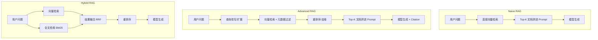
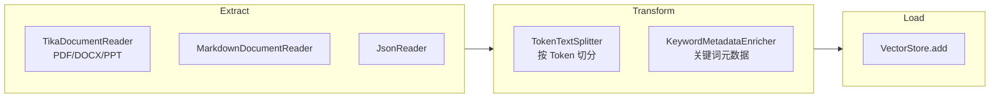
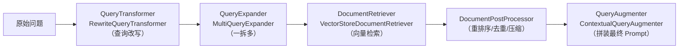

# 第 09 章：RAG 检索增强生成全链路

## 学习目标

- 掌握 ETL Pipeline 三段式抽象：`DocumentReader → DocumentTransformer → VectorStore`；
- 理解 Naive RAG（`QuestionAnswerAdvisor`）与 Modular RAG（`RetrievalAugmentationAdvisor`）的适用边界；
- 掌握查询改写（`RewriteQueryTransformer`）、多查询扩展（`MultiQueryExpander`）、重排序（`DocumentPostProcessor`）等 Advanced RAG 技术；
- 实现带 Citation 溯源的问答接口，理解 RAG 效果评测的基本思路。

## 前置知识

- 完成第 01~08 章，尤其是第 06 章 Advisor 与第 08 章 Memory（Advanced RAG 常与对话历史结合做查询改写）。

## 核心概念

### 9.1 RAG 演进三阶段



Spring AI 官方将这套体系称为 **Modular RAG 架构**（参考论文 *Modular RAG: Transforming RAG Systems into LEGO-like Reconfigurable Frameworks*），核心思想是把 RAG 拆成可插拔的模块（查询转换、检索、后处理、查询增强），而不是一个不可拆分的黑盒流程。

### 9.2 ETL Pipeline：知识入库的标准流程



```java
@Component
class KnowledgeIngestionPipeline {

    private final VectorStore vectorStore;

    KnowledgeIngestionPipeline(VectorStore vectorStore) {
        this.vectorStore = vectorStore;
    }

    void ingest(Resource file) {
        // Extract：用 Tika 解析 PDF/Word 等多种格式
        TikaDocumentReader reader = new TikaDocumentReader(file);
        List<Document> documents = reader.read();

        // Transform：按 Token 切分，避免超出模型上下文窗口
        TokenTextSplitter splitter = new TokenTextSplitter(800, 350, 5, 10000, true);
        List<Document> chunks = splitter.split(documents);

        // Load：写入向量库（内部自动调用 EmbeddingModel 生成向量）
        vectorStore.add(chunks);
    }
}
```

`TokenTextSplitter` 的构造参数（`defaultChunkSize, minChunkSizeChars, minChunkLengthToEmbed, maxNumChunks, keepSeparator`）值得记住其中两个的含义：**它不是简单粗暴按字符数截断**，而是先在 `minChunkSizeChars` 之后寻找句号/问号/换行等自然断点再截断，尽量保证语义完整——这是很多手写切分逻辑容易忽视的细节。

### 9.3 Naive RAG：QuestionAnswerAdvisor

最快的上手路径——一行 Advisor 搞定基础问答：

```java
ChatClient chatClient = chatClientBuilder
        .defaultAdvisors(QuestionAnswerAdvisor.builder(vectorStore).build())
        .build();

String answer = chatClient.prompt().user(question).call().content();
```

适合快速原型验证，但生产环境通常需要更多控制（查询改写、过滤、重排序、空上下文兜底），这就是 `RetrievalAugmentationAdvisor` 出场的时机。

### 9.4 Advanced RAG：RetrievalAugmentationAdvisor 全家桶



**查询改写**（把口语化/模糊问题改写成更适合检索的表述）：

```java
Advisor ragAdvisor = RetrievalAugmentationAdvisor.builder()
        .queryTransformers(RewriteQueryTransformer.builder()
                .chatClientBuilder(chatClientBuilder.build().mutate())
                .build())
        .documentRetriever(VectorStoreDocumentRetriever.builder()
                .vectorStore(vectorStore)
                .similarityThreshold(0.5)
                .topK(20)
                .build())
        .build();
```

**多查询扩展**（一个问题拆成多个角度并行检索，提升召回率，但会增加一次模型调用延迟）：

```java
Advisor ragAdvisor = RetrievalAugmentationAdvisor.builder()
        .queryExpander(MultiQueryExpander.builder()
                .chatClientBuilder(chatClientBuilder.build().mutate())
                .includeOriginal(true)
                .numberOfQueries(3)
                .build())
        .documentRetriever(VectorStoreDocumentRetriever.builder()
                .vectorStore(vectorStore)
                .similarityThreshold(0.5)
                .topK(20)
                .build())
        .build();
```

**元数据过滤 + 动态过滤表达式**：

```java
DocumentRetriever retriever = VectorStoreDocumentRetriever.builder()
        .vectorStore(vectorStore)
        .similarityThreshold(0.73)
        .topK(5)
        .filterExpression(new FilterExpressionBuilder().eq("department", "vehicle-diag").build())
        .build();
```

也可以在调用级动态传入过滤条件（无需重新构造 Advisor）：

```java
chatClient.prompt()
        .advisors(retrievalAugmentationAdvisor)
        .advisors(a -> a.param(VectorStoreDocumentRetriever.FILTER_EXPRESSION, "type == 'Spring'"))
        .user(question)
        .call()
        .content();
```

**空上下文兜底**（默认情况下检索不到任何相关文档时，`RetrievalAugmentationAdvisor` 会指示模型不作答，避免幻觉——这是一个刻意的安全默认值）：

```java
Advisor ragAdvisor = RetrievalAugmentationAdvisor.builder()
        .documentRetriever(VectorStoreDocumentRetriever.builder()
                .similarityThreshold(0.50).vectorStore(vectorStore).build())
        .queryAugmenter(ContextualQueryAugmenter.builder()
                .allowEmptyContext(true)   // 允许在无检索结果时退化为通用回答
                .build())
        .build();
```

> **版本提示**：官方文档目前仍将 `RetrievalAugmentationAdvisor` 标注为 experimental（实验性）特性，API 在未来版本存在调整可能，生产环境使用前建议锁定具体 Spring AI 补丁版本并做好回归测试。

### 9.5 Citation 溯源

RAG 答案的可信度很大程度上取决于"能不能告诉用户答案来自哪份文档"。实现思路：利用 `Document` 的 `metadata`（如 `source`、`page`）在生成阶段要求模型标注引用来源，或在应用层根据实际检索到的 `Document` 列表单独拼接"参考来源"区块（更可控，不依赖模型自觉标注）：

```java
List<Document> retrieved = retriever.retrieve(new Query(question));
String answer = chatClient.prompt().user(question).call().content();

List<String> citations = retrieved.stream()
        .map(doc -> "《%s》第%s页".formatted(
                doc.getMetadata().get("source"),
                doc.getMetadata().getOrDefault("page", "?")))
        .distinct()
        .toList();
```

**应用层拼接优于依赖模型自觉标注**——模型标注引用容易出现"张冠李戴"（幻觉性引用），而应用层基于真实检索结果的拼接是 100% 准确的，只是需要在设计上把"生成的答案"和"证据来源列表"分离展示。

## 可运行 Demo：Hybrid RAG + Citation

对应仓库位置：`examples/27-rag-demo`（Naive RAG）、`examples/28-advanced-rag-demo`（查询改写+重排序）、`examples/29-hybrid-rag-demo`（本节完整实现）。

### 前置条件

```bash
bash scripts/infra.sh up core vector   # PostgreSQL + Milvus + MinIO
```

### application.yml

```yaml
server:
  port: 18029

spring:
  application:
    name: hybrid-rag-demo
  ai:
    dashscope:
      api-key: ${AI_DASHSCOPE_API_KEY}
      embedding:
        options:
          model: text-embedding-v4
          dimensions: 1024
    vectorstore:
      milvus:
        client:
          host: localhost
          port: 19530
        database-name: default
        collection-name: saa_knowledge
        embedding-dimension: 1024
        index-type: IVF_FLAT
        metric-type: COSINE
```

### RagController.java

```java
package com.flywhl.saa.hybridrag;

import org.springframework.ai.chat.client.ChatClient;
import org.springframework.ai.chat.client.advisor.RetrievalAugmentationAdvisor;
import org.springframework.ai.rag.Query;
import org.springframework.ai.rag.retrieval.search.VectorStoreDocumentRetriever;
import org.springframework.ai.document.Document;
import org.springframework.ai.vectorstore.VectorStore;
import org.springframework.web.bind.annotation.GetMapping;
import org.springframework.web.bind.annotation.RequestParam;
import org.springframework.web.bind.annotation.RestController;

import java.util.List;
import java.util.Map;

/**
 * @author flywhl
 */
@RestController
public class RagController {

    private final ChatClient chatClient;
    private final VectorStoreDocumentRetriever retriever;

    public RagController(ChatClient.Builder chatClientBuilder, VectorStore vectorStore) {
        this.retriever = VectorStoreDocumentRetriever.builder()
                .vectorStore(vectorStore)
                .similarityThreshold(0.6)
                .topK(5)
                .build();

        var ragAdvisor = RetrievalAugmentationAdvisor.builder()
                .documentRetriever(retriever)
                .build();

        this.chatClient = chatClientBuilder.defaultAdvisors(ragAdvisor).build();
    }

    @GetMapping("/ask")
    public Map<String, Object> ask(@RequestParam String question) {
        List<Document> evidences = retriever.retrieve(new Query(question));
        String answer = chatClient.prompt().user(question).call().content();

        List<String> citations = evidences.stream()
                .map(doc -> String.valueOf(doc.getMetadata().getOrDefault("source", "未知来源")))
                .distinct()
                .toList();

        return Map.of("answer", answer, "citations", citations, "evidenceCount", evidences.size());
    }
}
```

### 运行与验证

```bash
cd examples/29-hybrid-rag-demo
mvn spring-boot:run
curl "http://localhost:18029/ask?question=OTA升级失败一般是什么原因？"
```

### 预期输出

```json
{
  "answer": "OTA 升级失败常见原因包括：网络中断导致包体传输不完整、签名校验失败、存储空间不足...",
  "citations": ["OTA故障排查手册.pdf", "车联网平台运维规范.docx"],
  "evidenceCount": 4
}
```

## 关键源码解读

`similarityThreshold` 与 `topK` 是检索质量的两个关键旋钮：`topK` 控制"最多召回几条"，`similarityThreshold` 控制"相似度低于多少就不要了"——两者组合使用（先按阈值过滤，再截断到 `topK`）比单独使用任何一个都更稳健：只设 `topK` 可能召回一堆不相关内容"凑数"，只设阈值可能在知识库稀疏区域召回 0 条（此时就要靠 §9.4 的空上下文兜底策略）。

## 企业实践建议

- **Chunk 大小要结合下游任务调优**：诊断类问答适合较小 chunk（更精准定位）、摘要类任务适合较大 chunk（保留更多上下文），没有放之四海而皆准的默认值，建议做离线评测对比；
- **Citation 必须走应用层拼接**：本章已强调，这是避免"幻觉引用"损害用户信任的关键设计决策；
- **查询改写/多查询扩展会增加延迟和成本**（每次都多一次模型调用），只在检索质量确实不理想（如用户输入过于口语化）时启用，不要无脑全量开启。

## 性能优化建议

- ETL 入库是离线批处理任务，不要放在请求路径上同步执行，应该做成独立的管理端接口或定时任务；
- 向量检索本身的延迟通常在几十毫秒级（Milvus 索引类型选型影响较大，第 11 章展开），远小于模型生成耗时，检索环节一般不是性能瓶颈，除非知识库规模达到千万级；
- 频繁重复的相同问题可以在检索结果或最终答案层面加缓存（Redis），这是第 15 章智能客服平台"语义缓存"设计的基础。

## 安全建议

- 知识库内容本身可能是攻击面——如果允许用户上传文档入库，需要防范"文档投毒"（在文档中嵌入试图操纵模型行为的隐藏指令），检索到的文档内容进入 Prompt 前应视为不可信输入；
- 涉及权限分级的知识库（如不同部门文档权限不同），必须在检索阶段就做好 `filterExpression` 权限过滤，而不是"先检索全部、再靠模型自觉不回答无权限内容"——后者不可靠。

## 常见踩坑

| 现象 | 原因 | 解决 |
|---|---|---|
| 检索结果总是空的 | `similarityThreshold` 设置过高，或 Embedding 模型与建库时使用的不一致 | 先把阈值调到 0 排查是否是模型不一致问题，确认后再逐步调高阈值找到合适值 |
| RAG 回答"驴唇不对马嘴" | Chunk 切分导致语义被截断在句子中间 | 检查 `TokenTextSplitter` 参数，确保断点在合理的标点/段落边界 |
| 同一份文档反复入库导致重复 | 没有做入库前的去重/更新判断 | 用文档指纹（如内容 hash）作为 `Document` 的 `id`，`VectorStore.add` 时用相同 id 会覆盖而非重复插入（具体行为取决于向量库实现，需查阅第 11 章对应小节） |
| 多查询扩展让延迟明显变长 | 每个扩展查询都要单独跑一次检索 | 评估是否真的需要，或改为异步并行执行多个检索请求 |

## 版本差异

| 项 | 早期 | 本教程写法 |
|---|---|---|
| RAG 实现方式 | 主要靠 `QuestionAnswerAdvisor` 单一路径 | `RetrievalAugmentationAdvisor` 提供 Modular RAG 全套可插拔组件（仍标注 experimental） |
| 空上下文处理 | 容易被忽视，默认行为因版本而异 | 官方默认"不允许空上下文时作答"，需显式 `allowEmptyContext(true)` 才降级 |

## 为什么这样设计

Modular RAG 架构把"检索增强"这个看似单一的功能拆成 `QueryTransformer/QueryExpander/DocumentRetriever/DocumentPostProcessor/QueryAugmenter` 五个可以独立替换的组件，背后的工程判断是：**没有一种 RAG 流程能适配所有场景**——有的场景需要查询改写、有的不需要；有的需要重排序、有的检索结果已经足够精准。与其提供一个"大而全但不灵活"的黑盒 Advisor，不如提供"乐高积木"式的组件，让开发者按需组装。这与本教程反复强调的"Spring AI 抽象层设计哲学"（可插拔、关注点分离）一脉相承。

## FAQ

**Q：`QuestionAnswerAdvisor` 会被 `RetrievalAugmentationAdvisor` 取代吗？**
目前两者并存，前者作为"简单场景开箱即用"选项保留，后者面向需要精细控制的场景。选择哪个取决于你的实际复杂度需求，不存在绝对的"新的就是好的"。

**Q：GraphRAG 在 Spring AI Alibaba 里能实现吗？**
用户原提示词中提到的"Graph RAG（Spring AI Alibaba 可实现范围）"——目前没有官方开箱即用的 GraphRAG 实现，但可以基于 `DocumentPostProcessor` 自定义扩展点，结合外部知识图谱（如构建实体关系图并在检索后做图遍历增强）来实现，这属于高级定制场景，超出本章标准 API 覆盖范围，有兴趣可作为延伸练习。

**Q：Chunk 重叠（overlap）在 Spring AI 里怎么设置？**
官方文档明确指出 `TokenTextSplitter` 目前**不支持**传统意义上的"重叠切分"（不同于很多其他框架的 chunk overlap 参数），如果业务上确实需要重叠效果，需要自定义 `TextSplitter` 子类实现。

## 本章总结

本章走完了从"文档"到"可信答案"的完整链路：ETL Pipeline 负责把原始文档转化为向量库中的可检索单元，Naive RAG（`QuestionAnswerAdvisor`）提供了最快的上手路径，Modular RAG（`RetrievalAugmentationAdvisor`）的查询改写/扩展/重排序/空上下文兜底组件为生产级场景提供了精细控制能力，应用层 Citation 拼接则保证了答案可信度。这是企业项目一"AI 知识库问答平台"的技术主干，第 10、11 章会分别深入 Embedding 与 VectorStore 这两个 RAG 链路中被"一笔带过"的关键依赖。

## 延伸阅读

- Spring AI RAG 官方参考：<https://docs.spring.io/spring-ai/reference/api/retrieval-augmented-generation.html>
- Spring AI ETL Pipeline 官方参考：<https://docs.spring.io/spring-ai/reference/api/etl-pipeline.html>
- Modular RAG 论文：arXiv:2407.21059

## 下一章预告

第 10 章聚焦 Embedding：`EmbeddingModel` API、DashScope `text-embedding-v3/v4` 的自定义维度能力、Query/Document 两种文本类型的区别、批量向量化的成本与基准测试方法——这是本章 RAG 链路"检索"环节背后的核心依赖。

## 思考题

1. 本章"空上下文兜底"默认是关闭的（检索不到就拒绝作答），这个默认值对企业知识库问答场景是保守还是激进？什么业务场景你会选择打开它？
2. 如果你要给车辆诊断知识库设计 Chunk 切分策略，你觉得应该按"故障码"切、按"章节"切，还是按固定 Token 数切？为什么？
3. 结合你正在做的 ClickHouse + Milvus 教程经验，如果检索延迟成为瓶颈，你会优先从 Chunk 数量、索引类型还是 `topK` 参数入手优化？
