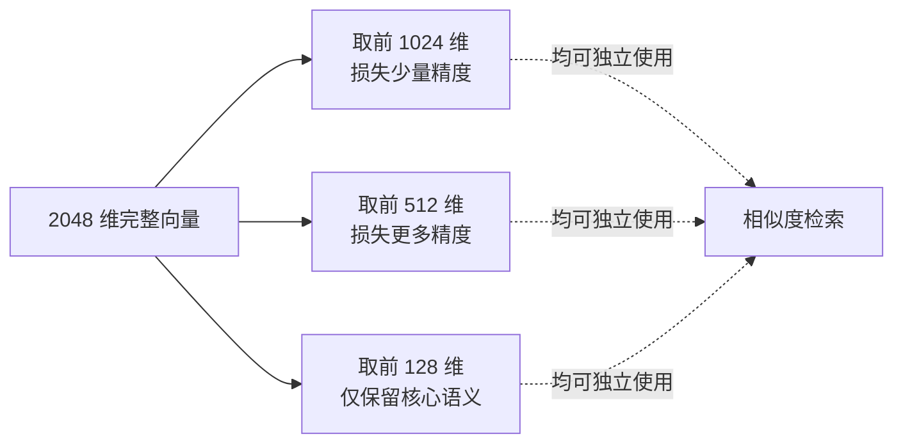

# 第 10 章：Embedding 向量化

## 学习目标

- 掌握 `EmbeddingModel` API 与 `EmbeddingOptions` 的使用方式；
- 理解 DashScope `text-embedding-v3/v4` 的自定义维度能力（Matryoshka 表示学习）与 Query/Document 双文本类型机制；
- 能设计向量维度选型策略，理解维度、精度、存储成本之间的权衡；
- 掌握批量向量化的成本核算方法与基准测试思路。

## 前置知识

- 完成第 01~09 章，尤其是第 09 章 RAG（Embedding 是 RAG 检索环节的直接依赖）。

## 核心概念

### 10.1 EmbeddingModel：文本到向量的统一接口

```java
public interface EmbeddingModel extends Model<EmbeddingRequest, EmbeddingResponse> {
    EmbeddingResponse call(EmbeddingRequest request);
    float[] embed(String text);   // 便捷方法
}
```

与 `ChatModel` 同源的设计哲学：不同厂商的 Embedding 实现（DashScope/OpenAI/智谱等）都归一到这一个接口，业务代码不感知具体是哪家的向量模型。

### 10.2 DashScope Embedding 模型选型

| 模型 | 维度 | 上下文限制 | 特点 |
|---|---|---|---|
| `text-embedding-v2` | 固定 1536 | — | 早期版本，不支持自定义维度 |
| `text-embedding-v3` | 可选 1024（默认）/768/512/256/128/64 | 8,192 token | 支持自定义维度，50+ 语言 |
| `text-embedding-v4` | 可选 2048/1536/1024（默认）/768/512/256/128/64 | 8,192 token，单批最多 10 条 | 基于 Qwen3-Embedding，当前旗舰，中英双语 MTEB/CMTEB 榜单领先 |

**推荐默认值**：`text-embedding-v4` + 1024 维——官方与社区一致认为这是"性能与成本的最佳平衡点"，适用于绝大多数语义检索任务。高精度场景（法律、医疗等对召回率要求极高的领域）可考虑 1536/2048 维；资源受限场景（边缘设备、极致成本敏感）可降至 256/512 维，但需要做召回率回归测试。

### 10.3 维度的本质：Matryoshka 表示学习

`text-embedding-v3/v4` 支持自定义维度并非简单截断向量，而是基于 **Matryoshka Representation Learning（MRL）** 训练——向量的前 N 维本身就承载了完整语义信息的"低精度版本"，维度越高保留的语义细节越多。这解释了为什么"降维"不会导致语义信息断崖式丢失，而是渐进式的精度损失。



### 10.4 Query 与 Document 双文本类型

DashScope Embedding 支持区分"查询文本"（通常短）与"文档文本"（通常长，默认类型），针对两种场景做了专门优化，能提升检索质量：

```java
DashScopeEmbeddingOptions queryOptions = DashScopeEmbeddingOptions.builder()
        .model("text-embedding-v4")
        .textType(DashScopeModel.EmbeddingTextType.QUERY.getValue())
        .dimensions(1024)
        .build();

DashScopeEmbeddingOptions documentOptions = DashScopeEmbeddingOptions.builder()
        .model("text-embedding-v4")
        .textType(DashScopeModel.EmbeddingTextType.DOCUMENT.getValue())   // 默认值
        .dimensions(1024)
        .build();
```

**入库时用 `DOCUMENT` 类型，检索时用 `QUERY` 类型**——两者向量空间对齐但各自做了非对称优化，混用不会报错但会损失部分检索精度，这是一个容易被忽视但值得记住的细节。

## API 深入解析

### 10.5 基础调用

```java
EmbeddingResponse response = embeddingModel.call(
        new EmbeddingRequest(List.of("Spring AI Alibaba 企业级实战教程"),
                DashScopeEmbeddingOptions.builder()
                        .model("text-embedding-v4")
                        .dimensions(1024)
                        .build()));

float[] vector = response.getResults().get(0).getOutput();
```

### 10.6 配置文件方式（全局默认）

```yaml
spring:
  ai:
    dashscope:
      api-key: ${AI_DASHSCOPE_API_KEY}
      embedding:
        options:
          model: text-embedding-v4
          dimensions: 1024
```

### 10.7 批量向量化与批次限制

`text-embedding-v4` 单次 API 调用**最多处理 10 条文本**，每条不超过 8,192 token——这是入库大批量文档时必须处理的硬限制：

```java
@Component
public class BatchEmbeddingService {

    private final EmbeddingModel embeddingModel;
    private static final int BATCH_SIZE = 10;

    public BatchEmbeddingService(EmbeddingModel embeddingModel) {
        this.embeddingModel = embeddingModel;
    }

    public List<float[]> embedAll(List<String> texts) {
        List<float[]> results = new ArrayList<>();
        for (List<String> batch : partition(texts, BATCH_SIZE)) {
            EmbeddingResponse response = embeddingModel.call(
                    new EmbeddingRequest(batch, DashScopeEmbeddingOptions.builder()
                            .model("text-embedding-v4").dimensions(1024).build()));
            response.getResults().forEach(r -> results.add(r.getOutput()));
        }
        return results;
    }

    private List<List<String>> partition(List<String> list, int size) {
        List<List<String>> partitions = new ArrayList<>();
        for (int i = 0; i < list.size(); i += size) {
            partitions.add(list.subList(i, Math.min(i + size, list.size())));
        }
        return partitions;
    }
}
```

> 实际上，`VectorStore.add(documents)` 内部已经通过 `BatchingStrategy`（如 `TokenCountBatchingStrategy`）自动处理了批次拆分与 token 计数，第 09 章 ETL Pipeline 的 `vectorStore.add()` 调用已经隐含了这个逻辑，日常业务代码通常不需要手写批次拆分——本节代码用于讲解原理，实际生产更推荐直接走 `VectorStore` 抽象。

## 可运行 Demo：维度与成本基准测试

对应仓库位置：`examples/22-embedding-demo`。演示不同维度对存储大小和检索耗时的影响。

### EmbeddingBenchmarkController.java

```java
package com.flywhl.saa.embedding;

import com.alibaba.cloud.ai.dashscope.embedding.DashScopeEmbeddingOptions;
import org.springframework.ai.embedding.EmbeddingModel;
import org.springframework.ai.embedding.EmbeddingRequest;
import org.springframework.web.bind.annotation.GetMapping;
import org.springframework.web.bind.annotation.RequestParam;
import org.springframework.web.bind.annotation.RestController;

import java.util.List;
import java.util.Map;

/**
 * @author flywhl
 */
@RestController
public class EmbeddingBenchmarkController {

    private final EmbeddingModel embeddingModel;

    public EmbeddingBenchmarkController(EmbeddingModel embeddingModel) {
        this.embeddingModel = embeddingModel;
    }

    @GetMapping("/embedding/benchmark")
    public Map<String, Object> benchmark(@RequestParam String text) {
        int[] dimensionsToTest = {64, 256, 1024, 2048};
        return Map.of("results", java.util.Arrays.stream(dimensionsToTest)
                .mapToObj(dim -> {
                    long start = System.currentTimeMillis();
                    var response = embeddingModel.call(new EmbeddingRequest(List.of(text),
                            DashScopeEmbeddingOptions.builder()
                                    .model("text-embedding-v4")
                                    .dimensions(dim)
                                    .build()));
                    long cost = System.currentTimeMillis() - start;
                    float[] vector = response.getResults().get(0).getOutput();
                    long storageBytes = (long) vector.length * 4; // float32 = 4 bytes/维
                    return Map.of(
                            "dimensions", dim,
                            "costMs", cost,
                            "storageBytesPerVector", storageBytes,
                            "estimatedTokenUsage", response.getMetadata().getUsage() != null
                                    ? response.getMetadata().getUsage().getTotalTokens() : -1);
                })
                .toList());
    }
}
```

### 运行与验证

```bash
cd examples/22-embedding-demo
mvn spring-boot:run
curl "http://localhost:18022/embedding/benchmark?text=车辆OTA升级失败常见原因分析"
```

### 预期输出（示例，实际延迟因网络而异）

```json
{
  "results": [
    {"dimensions": 64,   "costMs": 210, "storageBytesPerVector": 256,  "estimatedTokenUsage": 12},
    {"dimensions": 256,  "costMs": 195, "storageBytesPerVector": 1024, "estimatedTokenUsage": 12},
    {"dimensions": 1024, "costMs": 203, "storageBytesPerVector": 4096, "estimatedTokenUsage": 12},
    {"dimensions": 2048, "costMs": 211, "storageBytesPerVector": 8192, "estimatedTokenUsage": 12}
  ]
}
```

**关键观察**：不同维度的**调用延迟基本一致**（瓶颈在网络往返而非计算），但**存储成本线性增长**——这说明维度选型的核心考量是存储与检索计算成本，而不是 API 调用延迟。百万级向量库场景下，1024 维相比 256 维要多消耗 4 倍存储，这个差异在 Milvus/PGVector 索引构建时会直接体现在内存占用上。

## 关键源码解读

`EmbeddingResponse` 的 `getMetadata().getUsage()` 与 `ChatResponse` 遵循相同的 Usage 契约（第 04 章已介绍）——这是 Spring AI 抽象一致性的又一体现：无论是 Chat 还是 Embedding，成本核算的编程模型完全一致，你在第 04 章学到的 Usage 读取方式可以直接套用在这里，不需要重新学一套 API。

## 企业实践建议

- **Embedding 模型一旦选定，中途更换代价极高**：因为向量空间不兼容，换模型意味着全量知识库需要重新向量化，建议在项目早期就通过小规模基准测试确定模型和维度，避免后期"生产环境迁移"的高成本操作；
- **Query 和 Document 两种文本类型不要混淆使用**（§10.4），这是最容易被忽视但影响检索质量的细节，建议在代码里通过两个不同命名的 `EmbeddingOptions` Bean 强制区分，杜绝手滑用错；
- **批量入库任务要做限流和重试**：结合第 04 章的 `spring.ai.retry.*` 机制，大批量文档入库时网络抖动导致部分批次失败是常态，需要有幂等的重试与断点续传设计。

## 性能优化建议

- 入库是离线批处理，向量化本身的 QPS 瓶颈通常在 DashScope API 侧的限流阈值，而非应用侧计算——需要提前了解账号的限流配额（QPM/QPS），大批量入库任务应实现限流控制避免触发 429；
- 查询时的单次 Embedding 调用是同步阻塞的，如果 RAG 链路对延迟敏感，可以评估是否需要对高频查询做 Embedding 结果缓存（相同或高度相似的查询文本直接复用已计算的向量）。

## 安全建议

- 向量化的文本内容本身可能包含敏感信息，DashScope 作为云端 API 会接触到这些原文，涉及强隐私合规要求的场景需要评估数据出境/留存政策，必要时考虑私有化部署的 Embedding 模型（超出本教程"全云端 API"范围，但企业选型时应知晓此路径存在）；
- API Key 权限最小化：如果账号体系支持，Embedding 专用 Key 与 Chat 专用 Key 分离，便于精细化的用量监控和权限收敛。

## 常见踩坑

| 现象 | 原因 | 解决 |
|---|---|---|
| 向量维度不匹配报错 | 向量库建库时的 `embedding-dimension` 配置与实际调用的 `dimensions` 参数不一致 | 确保 `application.yml` 中向量库配置的维度与 Embedding Options 的维度严格一致（第 11 章展开） |
| 批量入库偶发失败 | 触发限流（429）或单批次超过 10 条 | 检查批次大小是否超限，结合重试机制处理限流场景 |
| 检索效果比预期差 | 入库用了 `DOCUMENT` 类型，检索时误用了同样的 `DOCUMENT` 类型（而非 `QUERY`） | 严格区分两种文本类型的使用场景 |

## 版本差异

| 项 | text-embedding-v2 时代 | text-embedding-v3/v4（本教程） |
|---|---|---|
| 维度 | 固定 1536，不可调整 | 支持自定义维度（Matryoshka），可按场景权衡精度与成本 |
| 文本类型区分 | 无 Query/Document 区分 | 支持双文本类型优化 |
| 批次大小 | 视版本而定 | v4 单批最多 10 条，8,192 token/条 |

## 为什么这样设计

自定义维度能力（Matryoshka）背后是一个务实的产品设计：不同企业的 RAG 场景对"精度"和"成本"的敏感度天差地别——法律合规问答系统可能愿意为 1% 的召回率提升付出 4 倍存储成本，而一个内部 FAQ 机器人可能更在意"能不能用最低成本跑起来"。与其强制所有场景使用同一固定维度，不如把这个权衡的决定权交给开发者，这与本教程反复强调的"可配置、可插拔"设计哲学一致。Query/Document 双文本类型的设计则反映了一个检索领域的经验事实：短查询和长文档在语义空间中的分布特性不同，针对性优化能带来实打实的检索质量提升。

## FAQ

**Q：可以在同一个向量库里混用不同维度的向量吗？**
不可以。向量库的索引结构（如 HNSW）要求同一个 collection/table 内所有向量维度一致，混用会导致维度不匹配错误。如果需要切换维度，必须新建 collection 并做全量重新入库。

**Q：Embedding 的成本怎么估算？**
DashScope 按 token 计费（与 Chat 模型类似但通常单价更低），`Usage.getTotalTokens()` 是估算成本的直接依据，本章 Demo 的 `estimatedTokenUsage` 字段展示了如何在业务代码中采集这个指标，为第 18 章的成本看板打基础。

**Q：如何评估不同维度对实际检索效果（而非仅存储成本）的影响？**
需要构建一个小型评测集（问题-标准答案文档对），在不同维度下运行检索并计算召回率（Recall@K）/ 精确率等指标——这属于第 09 章提到的"RAG 效果评测"范畴，是比本章基准测试更进一步的离线评估工作。

## 本章总结

本章聚焦 RAG 链路中容易被"一笔带过"但至关重要的 Embedding 环节：`EmbeddingModel` 延续了与 `ChatModel` 一致的抽象设计，`text-embedding-v4` 基于 Matryoshka 表示学习提供的自定义维度能力，让开发者能在精度与成本之间做出符合业务实际的权衡；Query/Document 双文本类型优化则是容易被忽视但影响检索质量的关键细节。这些认知将直接服务于第 11 章 VectorStore 的选型与配置。

## 延伸阅读

- Spring AI Embeddings 官方参考：<https://docs.spring.io/spring-ai/reference/api/embeddings.html>
- 阿里云百炼向量化文档：<https://help.aliyun.com/zh/model-studio/embedding>
- Spring AI Alibaba DashScope Embeddings 集成文档：<https://java2ai.com/integration/rag/embeddings/dashscope-embeddings/>

## 下一章预告

第 11 章深入 VectorStore：Milvus/PGVector/Redis/Elasticsearch 四种向量库的统一 `VectorStore` 抽象、Metadata Filter 表达式、Hybrid Search 混合检索，以及索引类型选型（HNSW/IVF_FLAT）对性能的影响。

## 思考题

1. 如果你的知识库场景是"车辆故障码"这类短文本为主的结构化知识，你会倾向选择更高维度追求精度，还是更低维度追求成本？为什么？
2. 本章 Demo 展示了不同维度下调用延迟基本一致，这意味着从"响应速度"角度选择低维度收益不大，那么低维度的真正收益点在哪里？
3. 结合你正在做的 ClickHouse + Milvus 教程经验，百万级向量的场景下，你觉得 1024 维和 256 维在索引构建时间和内存占用上大致会有多大差异？
