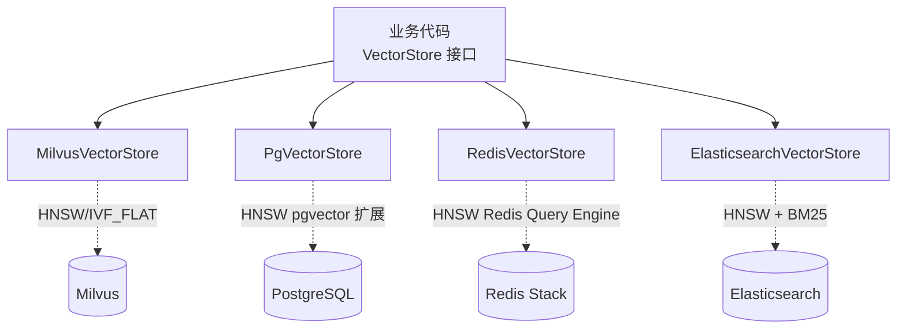
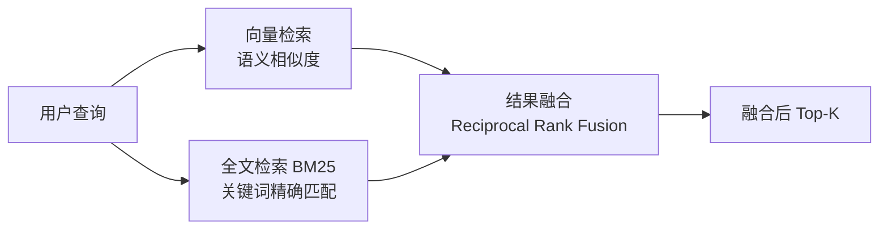

# 第 11 章：VectorStore 向量存储

## 学习目标

- 掌握 `VectorStore` 统一抽象，理解"换库只改配置"的可移植性设计；
- 能配置 Milvus（本仓库主力）、PGVector（轻量首选）、Redis（低延迟）、Elasticsearch（混合检索）四种后端；
- 掌握 Metadata Filter 表达式的通用写法与索引类型（HNSW/IVF_FLAT）选型；
- 理解 Hybrid Search（向量 + 全文）的融合思路。

## 前置知识

- 完成第 01~10 章，尤其是第 09 章 RAG 与第 10 章 Embedding。

## 核心概念

### 11.1 VectorStore 统一接口

```java
public interface VectorStore extends DocumentWriter {
    void add(List<Document> documents);
    void delete(List<String> idList);
    List<Document> similaritySearch(SearchRequest request);
}
```

四种后端实现同一个接口，业务代码（第 09 章的 `RetrievalAugmentationAdvisor`/`VectorStoreDocumentRetriever`）完全不感知底层是 Milvus 还是 PGVector——这是本教程反复出现的"Facade 模式"在向量存储领域的应用（与 `ChatModel`/`EmbeddingModel` 同源）。



### 11.2 四种后端选型对比（承接 ADR-004）

| 后端 | 依赖 | 适用场景 | 本仓库定位 |
|---|---|---|---|
| Milvus | `spring-ai-starter-vector-store-milvus` | 大规模、生产级、Hybrid Search | 企业项目一（知识库）主力，教学首选 |
| PGVector | 无需额外中间件，PostgreSQL + pgvector 扩展 | 中小规模，业务库与向量库合一，运维最简 | 企业项目二（办公助手）首选 |
| Redis | `spring-ai-starter-vector-store-redis`（需 Redis **Stack**） | 低延迟、需 TTL 自动过期（语义缓存） | 企业项目三（客服）缓存层 |
| Elasticsearch | `spring-ai-starter-vector-store-elasticsearch` | 已有 ES 基础设施，需要成熟的全文检索能力 | 混合检索教学、企业项目三客服全文检索 |

## API 深入解析

### 11.3 Milvus 配置（本仓库主力）

```yaml
spring:
  ai:
    vectorstore:
      milvus:
        client:
          host: localhost
          port: 19530
          username: root
          password: milvus
        database-name: default
        collection-name: saa_knowledge
        embedding-dimension: 1024
        index-type: IVF_FLAT
        metric-type: COSINE
        initialize-schema: true
```

```java
@Bean
public VectorStore vectorStore(MilvusServiceClient milvusClient, EmbeddingModel embeddingModel) {
    return MilvusVectorStore.builder(milvusClient, embeddingModel)
            .collectionName("saa_knowledge")
            .databaseName("default")
            .indexType(IndexType.IVF_FLAT)
            .metricType(MetricType.COSINE)
            .initializeSchema(true)
            .build();
}
```

### 11.4 PGVector 配置

```yaml
spring:
  datasource:
    url: jdbc:postgresql://localhost:5432/saa_learning
    username: saa
    password: saa123456
  ai:
    vectorstore:
      pgvector:
        index-type: HNSW
        distance-type: COSINE_DISTANCE
        dimensions: 1024
        initialize-schema: true
        max-document-batch-size: 10000
```

### 11.5 索引类型选型：HNSW vs IVF_FLAT

| 索引类型 | 原理 | 优势 | 劣势 | 适用规模 |
|---|---|---|---|---|
| **HNSW**（默认，PGVector/Redis） | 分层图导航 | 查询速度快、召回率高 | 索引构建慢、内存占用大 | 中小规模（百万级以内） |
| **IVF_FLAT**（Milvus 常用默认） | 倒排文件 + 聚类 | 索引构建快、内存效率较优 | 需要调 `nprobe` 平衡召回率与速度 | 大规模（千万级以上） |

本仓库的知识库问答项目（企业项目一）预期数据规模不大，实际选型时 HNSW 通常也是 Milvus 的合理选择；这里默认 `IVF_FLAT` 是为了在教程中覆盖两种索引原理，实操中建议根据真实数据规模做基准测试后再定。

### 11.6 Metadata Filter：通用过滤表达式

Spring AI 提供了**可移植的过滤表达式 DSL**，同一套写法在不同向量库间自动转换成对应的原生查询语法：

```java
FilterExpressionBuilder b = new FilterExpressionBuilder();

// 单条件
vectorStore.similaritySearch(SearchRequest.builder()
        .query("OTA升级失败")
        .topK(5)
        .filterExpression(b.eq("department", "vehicle-diag").build())
        .build());

// 组合条件
vectorStore.similaritySearch(SearchRequest.builder()
        .query("OTA升级失败")
        .topK(5)
        .filterExpression(b.and(
                b.in("author", "john", "jill"),
                b.eq("article_type", "blog")
        ).build())
        .build());
```

也支持文本形式的过滤表达式（更接近 SQL WHERE 语法，便于动态拼接）：

```java
vectorStore.similaritySearch(SearchRequest.builder()
        .query("OTA升级失败")
        .filterExpression("author in ['john', 'jill'] && article_type == 'blog'")
        .build());
```

Milvus 还额外支持原生表达式（`nativeExpression`）在通用 DSL 无法表达特定语法时兜底：

```java
MilvusSearchRequest request = MilvusSearchRequest.milvusBuilder()
        .query("sample query")
        .topK(5)
        .nativeExpression("metadata[\"age\"] > 30")   // 若同时设置 filterExpression 则被忽略
        .searchParamsJson("{\"nprobe\":128}")          // IVF_FLAT 专属调优参数
        .build();
```

### 11.7 Hybrid Search 思路：向量 + 全文的融合



纯向量检索擅长"语义相近但用词不同"的场景（如"车辆无法启动" ≈ "点火失败"），但对精确的专有名词/编号（如故障码 "P0420"）召回率反而可能不如关键词检索。Hybrid Search 通过 **RRF（Reciprocal Rank Fusion）** 等算法融合两路结果，取长补短。Elasticsearch 原生同时支持向量近邻检索与 BM25 全文检索，是实现 Hybrid Search 最自然的后端；Milvus 2.5+ 也提供了原生的多路检索融合能力。

## 可运行 Demo：三库横向对比

对应仓库位置：`examples/23-pgvector-demo`、`examples/24-milvus-demo`、`examples/26-es-hybrid-demo`。这里给出一个"同一套业务代码、通过 Profile 切换后端"的对比设计，直观体现 `VectorStore` 抽象的可移植性。

### application.yml（通过 Spring Profile 切换）

```yaml
spring:
  application:
    name: vectorstore-compare-demo
  ai:
    dashscope:
      api-key: ${AI_DASHSCOPE_API_KEY}

---
spring:
  config:
    activate:
      on-profile: pgvector
  datasource:
    url: jdbc:postgresql://localhost:5432/saa_learning
    username: saa
    password: saa123456
  ai:
    vectorstore:
      pgvector:
        dimensions: 1024
        initialize-schema: true

---
spring:
  config:
    activate:
      on-profile: milvus
  ai:
    vectorstore:
      milvus:
        client:
          host: localhost
          port: 19530
        collection-name: saa_compare
        embedding-dimension: 1024
        initialize-schema: true
```

### VectorStoreCompareController.java

```java
package com.flywhl.saa.vectorcompare;

import org.springframework.ai.document.Document;
import org.springframework.ai.vectorstore.SearchRequest;
import org.springframework.ai.vectorstore.VectorStore;
import org.springframework.web.bind.annotation.*;

import java.util.List;
import java.util.Map;

/**
 * 同一套代码通过 Spring Profile 切换 PGVector / Milvus 后端，
 * 验证 VectorStore 抽象的可移植性——业务代码零改动。
 *
 * @author flywhl
 */
@RestController
public class VectorStoreCompareController {

    private final VectorStore vectorStore;

    public VectorStoreCompareController(VectorStore vectorStore) {
        this.vectorStore = vectorStore;
    }

    @PostMapping("/vs/ingest")
    public String ingest(@RequestBody List<String> texts) {
        List<Document> documents = texts.stream().map(Document::new).toList();
        vectorStore.add(documents);
        return "已入库 " + documents.size() + " 条文档";
    }

    @GetMapping("/vs/search")
    public Map<String, Object> search(@RequestParam String query, @RequestParam(defaultValue = "5") int topK) {
        long start = System.currentTimeMillis();
        List<Document> results = vectorStore.similaritySearch(
                SearchRequest.builder().query(query).topK(topK).build());
        long cost = System.currentTimeMillis() - start;
        return Map.of(
                "costMs", cost,
                "count", results.size(),
                "results", results.stream().map(Document::getText).toList());
    }
}
```

### 运行与对比

```bash
# 分别用两个 profile 启动同一份代码
bash scripts/infra.sh up core vector

cd examples/vectorstore-compare-demo
mvn spring-boot:run -Dspring-boot.run.profiles=pgvector
# 另开终端
mvn spring-boot:run -Dspring-boot.run.profiles=milvus -Dserver.port=18099
```

```bash
curl -X POST http://localhost:18023/vs/ingest -H "Content-Type: application/json" \
  -d '["OTA升级失败常见原因包括网络中断、签名校验失败、存储空间不足", "P0420故障码表示三元催化效率低于阈值"]'

curl "http://localhost:18023/vs/search?query=升级中断怎么办"
```

### 预期输出

```json
{
  "costMs": 45,
  "count": 1,
  "results": ["OTA升级失败常见原因包括网络中断、签名校验失败、存储空间不足"]
}
```

同样的请求打到 Milvus 后端的实例（18099 端口），代码逻辑完全一致，只是响应延迟和底层存储不同——这就是 `VectorStore` 抽象带来的实际收益。

## 关键源码解读

`initializeSchema=true` 是一个"开发便利、生产谨慎"的选项——它会在应用启动时自动建表/建 collection，本地开发非常方便，但生产环境通常建议关闭并走独立的 DDL/Schema 管理流程（类似数据库迁移工具 Flyway/Liquibase 的思路），避免应用启动权限过大或多实例并发建表引发的竞态问题。

## 企业实践建议

- **Metadata Filter 是权限隔离的关键手段**（第 09 章已提及）：多租户/多部门知识库场景，务必在检索阶段就通过 Filter 做权限收敛，而不是查询全部后在应用层过滤（后者既低效又存在权限泄露风险，因为返回给模型 Prompt 的内容在应用层过滤前已经"可见"）；
- **索引类型选型建议做实测**：不要凭空选择 HNSW 还是 IVF_FLAT，用真实数据规模跑一次索引构建时间和查询延迟的基准测试，第 10 章的基准测试思路可以直接迁移到这里；
- **生产环境关闭 `initializeSchema`**，Schema 变更走独立的、可审计的迁移流程。

## 性能优化建议

- 向量检索的 `topK` 不是越大越好，过大的 `topK` 会增加下游 Rerank/Prompt 拼装的负担，通常 5~20 是合理范围，具体依赖第 09 章讨论的场景需求；
- Milvus 的 `nprobe` 参数（IVF_FLAT 索引专属）直接影响召回率与查询延迟的平衡，默认值往往不是最优，生产环境建议针对实际数据分布调优；
- 大批量入库应该用 `VectorStore.add()` 的批处理能力（内置 `BatchingStrategy`），而不是逐条循环调用，第 10 章已提及。

## 安全建议

- 向量库的访问凭证（如本仓库 `docker-compose.yml` 中 Milvus/PostgreSQL 的账号密码）在生产环境必须通过密钥管理服务而非明文配置文件下发；
- Redis 向量存储若涉及敏感数据，注意 Redis 本身默认无强加密传输，生产部署需要额外的网络隔离或 TLS 配置。

## 常见踩坑

| 现象 | 原因 | 解决 |
|---|---|---|
| Milvus 连接超时 | Milvus 容器尚未完全就绪（依赖 etcd + MinIO 健康检查通过后才真正可用，冷启动可能需要 30~60 秒） | 参考 `docker/docker-compose.yml` 中 Milvus 服务的 `healthcheck`，等待 `service_healthy` 状态再启动应用 |
| PGVector 报维度不匹配 | `spring.ai.vectorstore.pgvector.dimensions` 与 Embedding 模型实际输出维度不一致 | 严格核对第 10 章 Embedding 配置的 `dimensions` 值 |
| Filter 表达式在某个后端报语法错误 | 极少数后端特定语法未被通用 DSL 覆盖 | 评估该后端是否提供原生表达式兜底方案（如 Milvus 的 `nativeExpression`） |
| Redis 向量检索启动报模块缺失 | 使用了普通 Redis 而非 Redis Stack（第 08 章已强调同类问题） | 部署 `redis/redis-stack-server` 镜像 |

## 版本差异

| 项 | 早期 | 本教程写法 |
|---|---|---|
| Filter 表达式 | 各后端语法差异较大，可移植性较弱 | 通用 `FilterExpressionBuilder` DSL 覆盖绝大多数场景，特殊语法各后端保留原生兜底扩展点 |
| Milvus 客户端 | 部分早期集成基于旧版 SDK | 官方 Starter 化，`spring-ai-starter-vector-store-milvus` 开箱即用 |

## 为什么这样设计

`VectorStore` 统一抽象的价值，在本章"同一套代码通过 Profile 切换后端"的 Demo 中体现得最直接：向量数据库是一个仍在快速演进、竞争激烈的技术领域（Milvus/Weaviate/Qdrant/pgvector 等百花齐放），没有人能保证今天选择的向量库五年后依然是最优解。把业务代码与具体向量库实现解耦，意味着未来的迁移成本被压缩到"改配置 + 全量重新入库"，而不是"重写检索相关的所有业务代码"——这是长期技术选型中风险管理的重要一环，也是 Spring 生态"面向接口编程"哲学在 AI 时代的自然延伸。

## FAQ

**Q：一个应用可以同时使用多个 VectorStore 吗？**
可以，与第 04 章多 `ChatModel` 共存的思路一致——显式声明多个具名 `VectorStore` Bean，按业务场景注入使用（例如项目三"智能客服平台"中 Milvus 存主知识库、Redis 存高频 FAQ 语义缓存）。

**Q：`similarityThreshold` 和 Filter Expression 可以一起用吗？**
可以，两者是正交的过滤维度——`similarityThreshold` 基于向量距离过滤，Filter Expression 基于结构化元数据过滤，实际生产中通常两者结合使用。

**Q：Hybrid Search 在 Spring AI 里是开箱即用的吗？**
截至本教程编写时，Spring AI 对 Hybrid Search 的支持因后端而异——Elasticsearch 后端可以通过其原生能力较自然地实现向量+全文融合查询，其他后端可能需要应用层自行实现"分别检索、结果融合"的逻辑（如本章 §11.7 提到的 RRF），这是一个仍在发展中的领域，建议关注官方文档更新。

## 本章总结

本章完整覆盖了 `VectorStore` 统一抽象在四种主流后端（Milvus/PGVector/Redis/Elasticsearch）上的配置方式，讲清了 HNSW 与 IVF_FLAT 两种索引类型的取舍逻辑，掌握了可移植的 Metadata Filter 表达式写法，并初步理解了 Hybrid Search 的融合思路。至此，第 09~11 章构成的 RAG 技术栈（检索增强、向量化、向量存储）已经完整闭环，足以支撑企业项目一"AI 知识库问答平台"的核心链路。

## 延伸阅读

- Spring AI Vector Databases 官方参考：<https://docs.spring.io/spring-ai/reference/api/vectordbs.html>
- Milvus 官方 Spring AI 集成文档：<https://docs.spring.io/spring-ai/reference/api/vectordbs/milvus.html>
- PGVector 官方 Spring AI 集成文档：<https://docs.spring.io/spring-ai/reference/api/vectordbs/pgvector.html>

## 下一章预告

第 12 章进入 MCP（Model Context Protocol）：Spring AI 官方 MCP Client/Server Starter、`@McpTool`/`@McpResource`/`@McpPrompt` 注解体系、Streamable HTTP 传输，以及 SAA 基于 Nacos 的 MCP Registry 分布式注册发现——这是连接"应用内工具"与"跨系统工具生态"的关键协议层。

## 思考题

1. 企业项目一的知识库问答平台预计知识库规模是"部门级"（几万到几十万条文档），结合本章的索引选型讨论，你会选择 HNSW 还是 IVF_FLAT？
2. 如果要给多租户 SaaS 化的知识库产品设计向量存储方案，你会选择"一个 collection 存所有租户数据 + Metadata Filter 隔离"还是"每个租户独立 collection"？两种方案各有什么优劣？
3. 结合你正在做的 ClickHouse + Milvus 教程经验，Hybrid Search 的"结果融合"环节，你觉得放在应用层实现还是推动向量库原生支持更合理？
