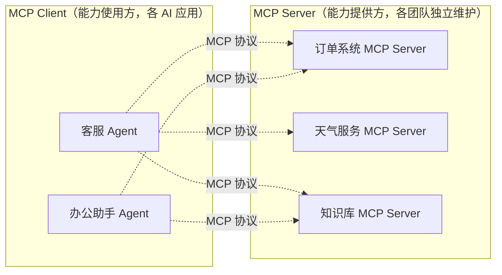
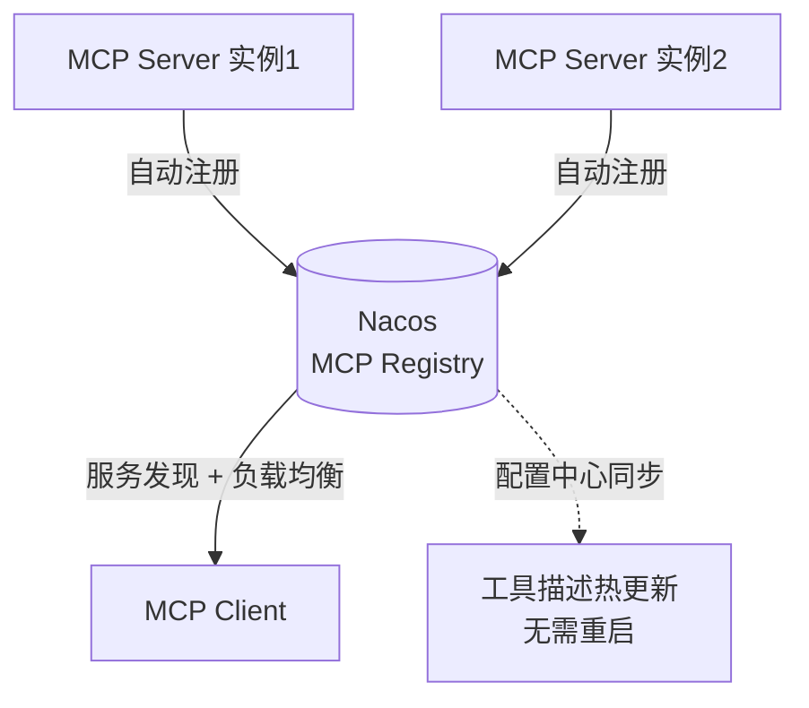

# 第 12 章：MCP 模型上下文协议

## 学习目标

- 理解 MCP（Model Context Protocol）解决的问题：让工具能力跨应用、跨进程、跨语言复用；
- 掌握 Spring AI MCP Server 端的 `@McpTool`/`@McpResource`/`@McpPrompt`/`@McpComplete` 注解体系；
- 掌握 MCP Client 端的自动装配与 `ToolCallbackProvider` 集成方式；
- 理解 SAA 基于 Nacos 的 MCP Registry：分布式注册发现、工具热更新、多 Server 聚合。

## 前置知识

- 完成第 01~11 章，尤其是第 07 章 Tool Calling——MCP 本质上是"跨进程的 Tool Calling"。

## 核心概念

### 12.1 MCP 解决什么问题

第 07 章的 `@Tool` 定义的工具**只能在当前应用进程内使用**。但企业现实是：多个团队各自维护不同的能力（天气查询、订单系统、知识库检索），如果每个 AI 应用都要重新实现一遍"调用订单系统"的工具代码，就是重复造轮子。MCP 定义了一套**标准协议**，让"工具提供方"（MCP Server）和"工具使用方"（MCP Client）可以独立开发、独立部署，通过协议对接：



这与你熟悉的 Python MCP SDK 生态思路完全一致——MCP 是跨语言协议，Java 侧的 MCP Server 完全可以被 Python/TypeScript 编写的 MCP Client 调用，反之亦然。

### 12.2 传输方式

| 传输方式 | 适用场景 |
|---|---|
| **Stdio** | 本地进程间通信（如 IDE 插件调用本地 MCP Server） |
| **Streamable HTTP** | 远程/跨网络场景（企业内网服务间调用），本教程主要场景 |
| SSE（旧版协议） | 部分早期实现仍在使用，逐步被 Streamable HTTP 取代 |

## API 深入解析：MCP Server

### 12.3 声明式工具注解体系

```java
@Service
public class WeatherService {

    public record WeatherResponse(double temperature, String condition) {}

    @McpTool(description = "查询指定经纬度的实时天气")
    public WeatherResponse getTemperature(
            @McpToolParam(description = "纬度", required = true) double latitude,
            @McpToolParam(description = "经度", required = true) double longitude) {
        // 调用真实天气 API...
        return new WeatherResponse(25.0, "晴");
    }

    @McpResource(uri = "config://{key}", name = "系统配置")
    public String getConfig(String key) {
        return configData.get(key);
    }
}
```

| 注解 | 对标能力 |
|---|---|
| `@McpTool` | 等价第 07 章的 `@Tool`，但暴露给跨进程的 MCP Client |
| `@McpResource` | 通过 URI 模板暴露只读资源（配置、文档等） |
| `@McpPrompt` | 暴露可复用的 Prompt 模板，供 Client 端发现和使用 |
| `@McpComplete` | 为 Prompt 参数提供自动补全建议 |

依赖引入：

```xml
<dependency>
    <groupId>org.springframework.ai</groupId>
    <artifactId>spring-ai-starter-mcp-server-webmvc</artifactId>
</dependency>
```

Spring Boot 自动装配会扫描所有带 `@McpTool` 等注解的 Bean 并自动注册——与第 03 章讲的自动装配机制一脉相承，你不需要手写任何注册代码。

### 12.4 传输上下文：区分不同调用方

```java
@McpTool
public String accessProtectedResource(McpSyncRequestContext requestContext) {
    McpTransportContext context = requestContext.transportContext();
    String authorization = (String) context.get("authorization");
    // 基于 authorization 做权限校验...
    return "Successfully accessed protected resource.";
}
```

默认情况下 `McpTransportContext` 是空的（保持 Server 端传输无关性）；如果需要获取 HTTP Header 等传输层信息（如鉴权 Token），需要显式配置 `TransportContextExtractor`：

```java
@Bean
public WebMvcStreamableServerTransportProvider transport() {
    return WebMvcStreamableServerTransportProvider.builder()
            .contextExtractor(serverRequest -> {
                String authorization = serverRequest.headers().firstHeader("Authorization");
                return McpTransportContext.create(Map.of("authorization", authorization));
            })
            .build();
}
```

这是 MCP Server 做鉴权的标准做法——第 07 章 `ToolContext` 的"永远不信任模型传参"原则在这里同样适用，`authorization` 必须来自传输层（HTTP Header），而不是模型的工具调用参数。

## API 深入解析：MCP Client

### 12.5 消费远程 MCP Server

```yaml
spring:
  ai:
    mcp:
      client:
        streamable-http:
          connections:
            order-service:
              url: http://order-mcp-server:8080/mcp
            weather-service:
              url: http://weather-mcp-server:8081/mcp
```

Spring AI 自动装配会为每个配置的连接创建 `McpSyncClient`，并提供 `ToolCallbackProvider` 自动聚合所有已连接 Server 的工具：

```java
@RestController
public class AgentController {

    private final ChatClient chatClient;

    public AgentController(ChatClient.Builder chatClientBuilder, List<McpSyncClient> mcpSyncClients) {
        this.chatClient = chatClientBuilder
                .defaultSystem("你是企业办公助手，可以查询订单和天气")
                .defaultTools(new SyncMcpToolCallbackProvider(mcpSyncClients))
                .build();
    }

    @PostMapping("/ask")
    public String ask(@RequestBody String question) {
        return chatClient.prompt().user(question).call().content();
    }
}
```

### 12.6 工具名冲突处理

多个 MCP Server 可能提供同名工具（如两个系统都有 `search` 工具），Spring AI MCP Client Starter 内置 `DefaultMcpToolNamePrefixGenerator` 自动加前缀去重（如 `alt_1_search`、`alt_2_search`），也可以自定义 `McpToolNamePrefixGenerator` 实现自己的命名策略。同样地，可以通过 `McpToolFilter` 接口按连接来源或工具属性筛选哪些工具真正暴露给模型（避免"工具集过大"的问题，呼应第 07 章的工具粒度建议）。

## API 深入解析：SAA Nacos MCP Registry

### 12.7 为什么需要注册中心

上面的 Client 配置方式要求**硬编码 MCP Server 的地址**——这在微服务动态伸缩、多实例部署的企业环境中是不现实的（服务地址会变、实例数量会变）。SAA 的 Nacos MCP Registry 解决了这个问题：MCP Server 启动后自动注册到 Nacos，Client 端通过服务名发现，而不是写死 IP:Port。



Nacos MCP Registry 提供的能力：

- **动态服务管理**：MCP Server 增删改查通过 Nacos 服务列表管理；
- **工具描述热更新**：工具的描述、参数定义支持运行时热更新，**无需重启服务**（与第 05 章 Nacos Prompt 热更新是同一设计哲学）；
- **工具动态开关**：运行时启用/禁用特定工具，无需重启；
- **全链路集成**：服务注册信息自动同步到 Nacos 配置中心与服务发现模块，天然适配 AI Agent 调用场景。

### 12.8 MCP Server 端自动注册

```xml
<dependency>
    <groupId>com.alibaba.cloud.ai</groupId>
    <artifactId>spring-ai-alibaba-starter-nacos-mcp-server</artifactId>
</dependency>
```

```yaml
spring:
  ai:
    alibaba:
      mcp:
        nacos:
          server-addr: 127.0.0.1:8848
          namespace: public
      mcp:
        server:
          name: order-service-mcp
          version: 1.0.0
```

应用启动后，`order-service-mcp` 会自动出现在 Nacos 的 MCP 服务列表中，无需手动注册。

### 12.9 MCP Client 端服务发现消费

```xml
<dependency>
    <groupId>com.alibaba.cloud.ai</groupId>
    <artifactId>spring-ai-alibaba-starter-nacos-mcp-client</artifactId>
</dependency>
```

```yaml
spring:
  ai:
    alibaba:
      mcp:
        nacos:
          server-addr: 127.0.0.1:8848
        nacos:
          client:
            service-names: order-service-mcp,weather-service-mcp   # 按服务名发现，而非硬编码地址
```

## 可运行 Demo：MCP Server + Nacos 注册

对应仓库位置：`examples/31-mcp-server-demo`（基础 Server）、`examples/32-mcp-client-demo`（Client 消费）、`examples/34-mcp-nacos-demo`（Nacos 注册发现，本节展示）。

### 前置条件

```bash
bash scripts/infra.sh up cloud   # 启动 Nacos
```

### MCP Server 端：application.yml

```yaml
server:
  port: 18034

spring:
  application:
    name: order-mcp-server
  ai:
    alibaba:
      mcp:
        nacos:
          server-addr: 127.0.0.1:8848
      mcp:
        server:
          name: order-service-mcp
          version: 1.0.0
```

### OrderTools.java

```java
package com.flywhl.saa.mcpnacos.server;

import org.springframework.ai.tool.annotation.McpTool;
import org.springframework.ai.tool.annotation.McpToolParam;
import org.springframework.stereotype.Service;

/**
 * @author flywhl
 */
@Service
public class OrderTools {

    @McpTool(description = "根据订单号查询订单状态")
    public String getOrderStatus(@McpToolParam(description = "订单号", required = true) String orderId) {
        return "订单 " + orderId + " 当前状态：配送中，预计明日送达";
    }
}
```

### 运行 Server

```bash
cd examples/34-mcp-nacos-demo/order-mcp-server
mvn spring-boot:run
```

登录 Nacos 控制台（<http://localhost:8080>），在 AI → MCP 服务列表中应能看到 `order-service-mcp` 已自动注册，包含 `getOrderStatus` 工具的完整描述。

### MCP Client 端：application.yml

```yaml
server:
  port: 18134   # 与 Server 端 18034 配对（同属 example 34，Client 端用 +100 偏移避免与 example 35 冲突）

spring:
  application:
    name: office-assistant-mcp-client
  ai:
    dashscope:
      api-key: ${AI_DASHSCOPE_API_KEY}
    alibaba:
      mcp:
        nacos:
          server-addr: 127.0.0.1:8848
        nacos:
          client:
            service-names: order-service-mcp
```

### AssistantController.java

```java
package com.flywhl.saa.mcpnacos.client;

import org.springframework.ai.chat.client.ChatClient;
import org.springframework.web.bind.annotation.GetMapping;
import org.springframework.web.bind.annotation.RequestParam;
import org.springframework.web.bind.annotation.RestController;

/**
 * @author flywhl
 */
@RestController
public class AssistantController {

    private final ChatClient chatClient;

    public AssistantController(ChatClient.Builder chatClientBuilder) {
        // 工具来自 Nacos 服务发现的 order-service-mcp，Client 完全不知道 Server 的真实网络地址
        this.chatClient = chatClientBuilder.build();
    }

    @GetMapping("/ask")
    public String ask(@RequestParam String question) {
        return chatClient.prompt().user(question).call().content();
    }
}
```

### 运行与验证

```bash
cd examples/34-mcp-nacos-demo/office-assistant-client
mvn spring-boot:run
curl "http://localhost:18134/ask?question=帮我查一下订单SO20260704001的状态"
```

### 预期输出

```text
订单 SO20260704001 当前状态：配送中，预计明日送达
```

Client 应用的代码和配置里**从未出现过 Server 的 IP 或端口**——完全通过 Nacos 服务名 `order-service-mcp` 完成发现与调用，这是分布式 MCP 相比第 12.5 节硬编码地址方式的核心价值。

## 关键源码解读

Nacos MCP Registry 的"工具描述热更新"能力，底层实现思路与第 05 章 Nacos Prompt 热更新是同源的——工具的 JSON Schema 描述本质上也是一种"配置"，存储在 Nacos 配置中心，MCP Server 订阅变更并动态刷新暴露给 Client 的工具元数据。这再次印证了本教程反复强调的设计哲学：**凡是"内容/描述类"的东西（Prompt 也好、工具描述也好），都应该从代码中剥离，托管到配置中心实现独立迭代**。

## 企业实践建议

- **MCP 是企业级工具中台的正确抽象层**：如果团队已经在往"中台化"方向演进，MCP Server 是比"内部 RPC 接口 + 手写 SDK"更面向 AI 时代的选择——协议自带工具描述、参数 Schema，天然对 LLM 友好；
- **工具名前缀策略要提前规划**：多团队共建 MCP 生态时，建议约定统一的工具命名规范（如 `<域>_<动作>`），减少依赖 `DefaultMcpToolNamePrefixGenerator` 自动加前缀带来的可读性损失；
- **鉴权信息必须走传输层**（§12.4），这是 MCP 场景下第 07 章 `ToolContext` 安全原则的延伸。

## 性能优化建议

- MCP Client 与多个 Server 建立连接是有资源开销的（连接池、心跳），按需连接而非"把所有已知 MCP Server 都连上"；
- Nacos 服务发现有本地缓存机制，正常情况下不会对每次工具调用都触发一次 Nacos 查询，但要留意缓存刷新间隔对"Server 刚下线但 Client 还在尝试调用"这种边界情况的影响。

## 安全建议

- MCP Server 暴露的每个工具都是潜在的攻击面，生产环境务必结合 `McpTransportContext` 做鉴权，不能假设"内网就是安全的"；
- 使用 Nacos MCP Registry 时，Nacos 本身的访问控制（第 01 章 Phase 1 已在 docker-compose 中配置了开发用 Token）在生产环境必须替换为强凭证，且限制哪些服务可以注册/发现哪些 MCP 能力。

## 常见踩坑

| 现象 | 原因 | 解决 |
|---|---|---|
| MCP Server 启动正常但 Nacos 服务列表看不到 | Nacos 版本 ≥ 3.0 时注册逻辑有调整（社区曾报告过的已知问题），或 `service-names`/命名空间配置不匹配 | 检查 SAA 与 Nacos 的版本对齐（版本调研报告已锁定 Nacos 3.0.x），核对命名空间配置 |
| Client 端报"找不到工具" | Server 端工具未正确注册，或 Client 的 `service-names` 拼写错误 | 先直接访问 MCP Server 的健康检查/工具列表接口确认工具已暴露，再排查 Client 配置 |
| 多个 Server 提供同名工具，模型调用行为异常 | 未正确处理工具名冲突 | 依赖框架默认的 `DefaultMcpToolNamePrefixGenerator`，或自定义前缀策略 |

## 版本差异

| 项 | 早期 | 本教程写法 |
|---|---|---|
| Server 端注解 | 部分早期示例手写 `ToolCallback` 暴露 MCP 工具 | `@McpTool`/`@McpResource`/`@McpPrompt` 声明式注解，与第 07 章 `@Tool` 体验统一 |
| 服务发现 | 硬编码地址（`spring.ai.mcp.client.*.connections.*.url`） | Nacos MCP Registry 动态注册发现，支持热更新与负载均衡 |

## 为什么这样设计

MCP 协议的价值在于**打破了"AI 能力"与"承载能力的具体应用"之间的强绑定**。在没有 MCP 之前，"让 AI 能查询订单"这件事，往往意味着要在每个需要这个能力的 AI 应用里重新写一遍订单查询逻辑；有了 MCP，订单团队只需要维护一个 MCP Server，任何遵循协议的 AI 应用（不论用什么语言、什么框架开发）都可以复用这个能力。这与微服务架构"每个团队独立开发部署、通过标准协议通信"的理念是完全一致的，只是 MCP 把这个理念应用到了"AI 工具能力"这个新场景。SAA 的 Nacos MCP Registry 则是把这套理念进一步落到了企业级分布式系统的运维现实——服务会伸缩、会迁移，注册发现是必需的基础设施，而不是可选项。

## FAQ

**Q：MCP 和第 07 章的 `@Tool` 是竞争关系吗？**
不是，是互补关系。`@Tool` 面向"当前应用进程内的工具"，MCP 面向"跨进程/跨团队复用的工具"。实际项目中两者会共存：应用私有的简单工具用 `@Tool`，需要对外提供或消费的通用能力走 MCP。

**Q：一个 MCP Server 可以同时被 Java 和 Python 应用消费吗？**
可以，这正是协议化的意义——MCP 是跨语言标准协议，只要遵循协议规范，任何语言实现的 Client 都能消费任何语言实现的 Server。

**Q：Nacos MCP Registry 是否是使用 MCP 的必需前提？**
不是。§12.5 演示的"硬编码地址"方式在服务数量少、拓扑稳定的场景完全可用；Nacos Registry 是应对"服务动态伸缩、需要负载均衡与热更新"这类企业级复杂度时的进阶选择，按实际规模决定是否引入。

## 本章总结

本章讲清了 MCP 协议如何把"工具能力"从单一应用中解放出来，成为可以跨进程、跨语言、跨团队复用的标准化资产。`@McpTool` 等注解让 Server 端开发体验与第 07 章 `@Tool` 保持一致，SAA 的 Nacos MCP Registry 则补齐了企业级分布式场景下的服务发现、负载均衡、热更新能力。至此，本教程已经完整覆盖了"模型-记忆-知识-工具"四大支柱，第 13 章开始将在这些支柱之上构建真正的智能体。

## 延伸阅读

- Spring AI MCP 官方参考：<https://docs.spring.io/spring-ai/reference/api/mcp/mcp-server-boot-starter-docs.html>
- Nacos MCP 自动注册用户指南：<https://nacos.io/en/docs/v3.0/manual/user/ai/mcp-auto-register/>
- Model Context Protocol 官方规范：<https://modelcontextprotocol.io>

## 下一章预告

第 13 章正式进入 Agent：`ReactAgent` 的推理-行动循环、Context Engineering 最佳实践（Human-in-the-Loop、上下文压缩）、Agent Skills 渐进式披露——本章打好的 MCP 能力将成为 Agent 工具箱的重要来源。

## 思考题

1. 如果企业内部已经有一套成熟的 RPC/HTTP 微服务体系，你觉得应该把现有接口"平移"成 MCP Server，还是只为新的 AI 场景专门开发 MCP Server？决策依据是什么？
2. 本章 §12.7 提到 MCP Server 支持"工具动态开关"，这个能力在生产事故应急场景（如某个工具后端服务故障）中可以怎么用？
3. 结合你正在做的 flywhl-cloud AIOS 平台经验（Spring Cloud Gateway → FastAPI → LangGraph），如果要把其中的 Python 侧能力通过 MCP 暴露给 Java 侧的 Agent 消费，你会如何设计这条跨语言链路？
