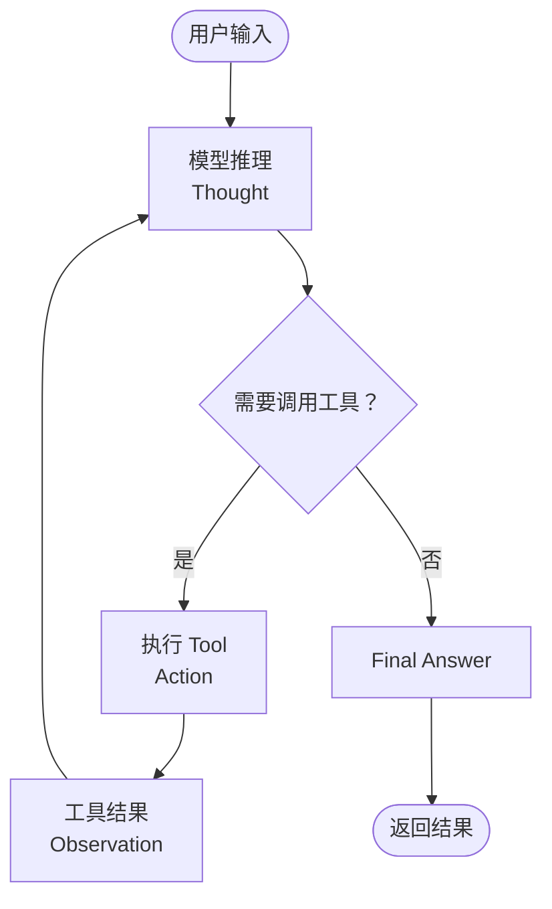
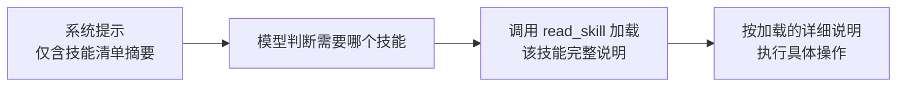

# 第 13 章：Agent 智能体开发

## 学习目标

- 掌握 `ReactAgent` 的构建方式：模型、工具、系统提示、记忆、迭代次数上限；
- 理解 ReAct（Reasoning + Acting）范式与第 05 章"手写 ReAct Prompt"练习之间的对应关系；
- 掌握 Context Engineering 核心实践：Human-in-the-Loop、上下文压缩、工具调用限制；
- 理解 Agent Skills 渐进式披露机制，解决"工具集庞大但每次只需暴露少量"的问题；
- 了解 AgentScope 集成作为"模型原生驱动"范式的扩展阅读（呼应第 02 章的架构定位讨论）。

## 前置知识

- 完成第 01~12 章，尤其是第 05 章（ReAct Prompt 结构）、第 07 章（Tool Calling）、第 08 章（Memory）。

## 核心概念

### 13.1 从"手写 ReAct"到"ReactAgent 开箱即用"

第 05 章你已经理解了 ReAct 的 Prompt 结构（Thought → Action → Observation → 循环 → Final Answer）。`ReactAgent` 就是这个循环的**框架级实现**——你不需要自己写循环控制逻辑、不需要自己判断"是否需要继续调用工具"，框架基于 Graph Runtime（第 02 章已介绍）自动完成这一切：



### 13.2 构建一个 ReactAgent

```java
ReactAgent reactAgent = ReactAgent.builder()
        .name("vehicle-diagnosis-agent")
        .model(chatModel)
        .systemPrompt("你是资深车辆故障诊断专家，善用工具查询故障码知识库和历史维修记录")
        .tools(new DtcLookupTools(), new RepairHistoryTools())   // 第 07 章定义的工具
        .maxIterations(10)                                       // 防止无限循环
        .saver(new MemorySaver())                                // 短期记忆（会话内状态持久化）
        .build();

AssistantMessage result = reactAgent.call("车辆报P0420故障码，之前修过类似问题吗？");
```

| 配置项 | 作用 |
|---|---|
| `.model()` / `.chatClient()` | 底层驱动的模型（可传 `ChatModel` 或已配置好 Advisor 的 `ChatClient`） |
| `.systemPrompt()` / `.instruction()` | 角色设定与行为约束 |
| `.tools()` | 可调用的工具集（复用第 07 章 `@Tool` 定义） |
| `.maxIterations()` | ReAct 循环上限，**生产环境必须设置**，防止模型陷入死循环消耗配额 |
| `.saver()` | Checkpointer，决定 Agent 状态如何持久化（呼应第 08 章 Memory 的存储抽象思想） |

### 13.3 两种调用方式

```java
// call()：适合简单场景，直接拿 AssistantMessage
AssistantMessage msg = reactAgent.call(userInput);

// invoke()：拿到完整的 OverAllState，可以检视中间过程（工具调用轨迹、每一步状态）
Map<String, Object> state = reactAgent.invoke(Map.of("messages", new UserMessage(userInput)));
```

`invoke()` 暴露的完整状态在调试和可观测场景非常有价值——第 18 章会展示如何把这些中间状态接入监控体系。

## API 深入解析：Context Engineering

"Context Engineering"（上下文工程）是 SAA 官方在 Agent Framework 中反复强调的核心设计理念——**Agent 的可靠性很大程度上取决于"喂给模型多少上下文、什么样的上下文"，而不只是模型本身的能力**。

### 13.4 Human-in-the-Loop（人工介入）

对高风险操作（第 07 章"删除文档需要管理员权限"是简化版），Agent Framework 提供了原生的中断-恢复机制：

```java
ReactAgent reactAgent = ReactAgent.builder()
        .name("approval-agent")
        .model(chatModel)
        .tools(new HighRiskTools())
        .interruptBefore("execute_payment")   // 执行该工具前中断，等待人工确认
        .saver(new MemorySaver())
        .build();

// 第一次调用：Agent 执行到 execute_payment 前暂停，返回中断状态
Map<String, Object> state = reactAgent.invoke(input, config);
// ... 应用层展示确认界面，用户确认后 ...
// 第二次调用：从中断点恢复继续执行
Map<String, Object> resumed = reactAgent.invoke(null, config);   // 复用同一个 config/threadId
```

这比第 07 章"工具内部判断角色后返回拒绝文案"更进一步——中断机制让流程**真正停下来**等待外部输入，而不是工具自己做完判断后一次性返回，适合需要在中断点展示丰富信息（如订单详情、金额）供人工核实的场景。

### 13.5 上下文压缩与限制

长对话/长工具调用链会让上下文迅速膨胀，Agent Framework 内置若干应对策略：

- **Context Compaction**（上下文压缩）：类似第 08 章思考题提到的摘要压缩思路，框架层面提供压缩钩子；
- **Model & Tool Call Limit**（调用次数限制）：`.maxIterations()` 就是最基础的一种，防止失控；
- **Tool Retry**（工具重试）：工具执行失败时的重试策略，与第 04 章 `spring.ai.retry` 呼应但作用在 Agent 循环层面；
- **Dynamic Tool Selection**（动态工具选择）：不是把全部工具一次性塞给模型，而是根据当前上下文动态决定暴露哪些工具——这是 §13.6 Agent Skills 要解决的核心问题的思路延伸。

### 13.6 Agent Skills：渐进式披露

第 07 章思考题已经埋下伏笔：工具集庞大时，全部工具描述塞进 Prompt 会消耗大量 token 且降低模型选择准确率。Agent Skills（1.1.2.0 引入）的解法是**渐进式披露**——系统提示里只放"技能清单"（每个技能一句话摘要），模型需要用某个技能时先调用 `read_skill` 加载该技能的完整 SKILL.md 说明，再决定如何执行：



```java
ReactAgent reactAgent = ReactAgent.builder()
        .name("multi-skill-agent")
        .model(chatModel)
        .skills(List.of(
                Skill.of("vehicle-diagnosis", "车辆故障诊断技能，涉及故障码查询、维修历史分析"),
                Skill.of("ota-troubleshoot", "OTA升级故障排查技能，涉及日志分析、回滚建议")))
        .build();
```

这与你在 Claude/GPT 生态里可能了解到的"工具渐进式披露"思路一致，本质上是用一次"元调用"（`read_skill`）换取更小的初始 Prompt 体积——尤其适合工具/技能数量庞大（几十上百个）的企业级 Agent 平台场景。

## 可运行 Demo：带记忆与工具的诊断 Agent

对应仓库位置：`examples/35-agent-demo`。

### VehicleDiagnosisAgentConfig.java

```java
package com.flywhl.saa.agentdemo;

import com.alibaba.cloud.ai.graph.agent.ReactAgent;
import com.alibaba.cloud.ai.graph.checkpoint.savers.MemorySaver;
import org.springframework.ai.chat.model.ChatModel;
import org.springframework.context.annotation.Bean;
import org.springframework.context.annotation.Configuration;

/**
 * @author flywhl
 */
@Configuration(proxyBeanMethods = false)
public class VehicleDiagnosisAgentConfig {

    @Bean
    public ReactAgent vehicleDiagnosisAgent(ChatModel dashScopeChatModel, DtcLookupTools dtcLookupTools) {
        return ReactAgent.builder()
                .name("vehicle-diagnosis-agent")
                .model(dashScopeChatModel)
                .systemPrompt("""
                        你是资深车辆故障诊断专家。收到故障码时：
                        1. 先调用工具查询故障码的标准解释
                        2. 结合解释给出可能原因（按可能性排序）
                        3. 给出具体的排查建议
                        """)
                .tools(dtcLookupTools)
                .maxIterations(6)
                .saver(new MemorySaver())
                .build();
    }
}
```

### DtcLookupTools.java

```java
package com.flywhl.saa.agentdemo;

import org.springframework.ai.tool.annotation.Tool;
import org.springframework.ai.tool.annotation.ToolParam;
import org.springframework.stereotype.Component;

import java.util.Map;

/**
 * @author flywhl
 */
@Component
public class DtcLookupTools {

    private static final Map<String, String> DTC_DB = Map.of(
            "P0420", "三元催化转化器效率低于阈值（1号库）",
            "P0300", "随机/多缸失火",
            "P0171", "系统偏稀（1号库）");

    @Tool(description = "查询OBD-II标准故障码的官方定义")
    public String lookupDtc(@ToolParam(description = "故障码，如P0420") String code) {
        return DTC_DB.getOrDefault(code, "未收录该故障码：" + code);
    }
}
```

### AgentController.java

```java
package com.flywhl.saa.agentdemo;

import com.alibaba.cloud.ai.graph.agent.ReactAgent;
import org.springframework.web.bind.annotation.GetMapping;
import org.springframework.web.bind.annotation.RequestParam;
import org.springframework.web.bind.annotation.RestController;

/**
 * @author flywhl
 */
@RestController
public class AgentController {

    private final ReactAgent vehicleDiagnosisAgent;

    public AgentController(ReactAgent vehicleDiagnosisAgent) {
        this.vehicleDiagnosisAgent = vehicleDiagnosisAgent;
    }

    @GetMapping("/diagnose")
    public String diagnose(@RequestParam String query) {
        var result = vehicleDiagnosisAgent.call(query);
        return result.getText();
    }
}
```

### 运行与验证

```bash
cd examples/35-agent-demo
mvn spring-boot:run
curl "http://localhost:18035/diagnose?query=车辆报P0420故障码，是什么问题？"
```

### 预期输出

```text
根据查询，P0420 故障码表示"三元催化转化器效率低于阈值（1号库）"。

可能原因（按可能性排序）：
1. 三元催化器老化或损坏
2. 氧传感器故障导致误判
3. 发动机机械故障（烧机油、失火）导致催化器过早劣化

建议排查步骤：
1. 先用诊断仪读取氧传感器实时数据，排除传感器误报
2. 检查是否有伴随的失火故障码（如P0300）
3. 若传感器正常，考虑更换三元催化器
```

观察这个输出：模型**先调用了 `lookupDtc` 工具**获取标准定义，再基于工具结果生成结构化的诊断建议——这正是 §13.1 时序图描述的完整 ReAct 循环在真实调用中的体现。

## 关键源码解读

`ReactAgent` 内部编译为一个 `StateGraph`（第 14 章会展开这个底层运行时的完整 API）——`.tools()`/`.systemPrompt()`/`.maxIterations()` 这些 Builder 参数，本质上是在为你自动搭建"LLM 节点 → 条件边（是否调用工具）→ Tool 节点 → 回到 LLM 节点"这样一个图结构，你在第 13 章体验到的"开箱即用"，正是因为框架把第 14 章要手写的图搭建过程封装掉了。这也解释了第 02 章的架构结论——Agent Framework 是 Graph 之上的高层封装。

## 企业实践建议

- **`maxIterations` 是生产环境的强制项**：没有上限的 ReAct 循环在模型"钻牛角尖"（反复调用同一工具、反复得到相似结果却不收敛）时会无限消耗 token 配额，务必设置合理上限（6~15 视场景而定）并监控触顶频率；
- **高风险操作优先用 Human-in-the-Loop 而非工具内判断**：第 07 章的"角色校验返回拒绝文案"适合简单场景，涉及资金、数据删除等高风险操作，应该升级到 §13.4 的中断-恢复机制，让人工确认真正介入执行流程；
- **Agent Skills 是"工具集治理"的答案**：当团队的工具/技能数量超过 15~20 个后，应该认真评估迁移到 Agent Skills 渐进式披露模式，而不是无限制地把所有工具堆进 `.tools()`。

## 性能优化建议

- 每一轮 ReAct 循环都是一次完整的模型调用往返，`maxIterations` 直接影响最坏情况下的响应延迟（如设置 10，意味着最坏情况要等 10 次模型调用完成），产品体验上需要配合流式反馈（第 17 章）让用户感知到"正在思考/正在调用工具"而不是长时间空白等待；
- `MemorySaver`（内存态 Checkpointer）仅用于开发测试，生产环境需要持久化的 Checkpointer 实现（结合第 08 章 Memory 的持久化方案）。

## 安全建议

- Agent 的自主性越强，失控代价越高——`maxIterations`、Human-in-the-Loop、工具权限控制（第 07 章）三者应该组合使用，构成纵深防御；
- 涉及金钱、数据删除、对外通信（发邮件、发消息）等不可逆操作的工具，默认都应该纳入 `interruptBefore` 名单，而不是"觉得没问题就放行"。

## 常见踩坑

| 现象 | 原因 | 解决 |
|---|---|---|
| Agent 反复调用同一工具不收敛 | 工具返回结果模型无法很好理解，或 `systemPrompt` 指引不清晰 | 检查工具返回值的可读性，必要时优化 `systemPrompt` 给出更明确的终止条件描述 |
| `maxIterations` 触顶但任务未完成 | 任务本身超出单个 Agent 的合理处理边界 | 评估是否应该拆分为多智能体协作（第 15 章），而非无限提高 `maxIterations` |
| Human-in-the-Loop 中断后无法恢复 | 恢复调用时 `config`/`threadId` 与中断时不一致 | 确保恢复调用复用同一个会话标识，Checkpointer 依赖它定位中断状态 |

## 版本差异

| 项 | 1.1.0.0（Agent Framework 首次亮相） | 1.1.2.2（本教程） |
|---|---|---|
| 核心能力 | ReactAgent、Context Engineering、HITL 基础形态 | + Agent Skills 渐进式披露、并行子智能体、AgentScope 集成选项 |
| 工具执行 | 同步为主 | 支持异步与并行工具执行（1.1.2.0 起） |

## 为什么这样设计

`ReactAgent` 把"推理-行动循环"这个在 LLM 应用领域已经被反复验证有效的范式，封装成了一行 Builder 调用——这背后的设计判断是：**绝大多数 Agent 场景不需要重新发明循环控制逻辑**，真正需要开发者投入精力的是"给 Agent 配备什么工具、什么系统提示、什么安全边界"，而不是"如何写一个 while 循环判断要不要继续调用模型"。Context Engineering 这套理念的提出，则反映了一个来自大量生产实践的认知转变：Agent 的表现瓶颈往往不在模型能力本身，而在于"上下文管理"这个更工程化的问题——喂给模型过多无关信息会稀释注意力，喂得太少又会缺少必要依据，Human-in-the-Loop、上下文压缩、Agent Skills 都是应对这个核心矛盾的具体手段。

## FAQ

**Q：`ReactAgent` 可以不用工具，纯粹做多轮推理吗？**
可以，`tools()` 不是必需参数，此时 Agent 退化为"带循环终止判断的对话"，但这种场景通常直接用第 04 章的 `ChatClient` 就够了，用 `ReactAgent` 的价值主要体现在有工具参与的场景。

**Q：Agent Skills 和 MCP（第 12 章）是什么关系？**
两者是正交的能力：MCP 解决"工具能力跨进程复用"的问题，Agent Skills 解决"单个 Agent 内工具/技能过多时如何降低 Prompt 负担"的问题。实际上 MCP 提供的远程工具完全可以被组织成 Agent Skills 的形式渐进式暴露。

**Q：什么时候应该用 AgentScope 而不是 SAA 原生 ReactAgent？**
如第 02 章所述，两者是官方并行发展的路径：SAA ReactAgent 更贴近"图编排范式"，适合需要与 Graph/多智能体深度集成的场景；AgentScope 定位"更贴近模型原生的 ReAct 范式"。对于跟随本教程主线学习的场景，建议以 SAA 原生 ReactAgent 为主（生产验证更充分、文档更完整），AgentScope 作为技术雷达关注对象。

## 本章总结

本章把第 05 章"手写 ReAct Prompt"的练习升级为框架级的 `ReactAgent`：一行 Builder 配置即可获得完整的推理-行动循环、记忆持久化、工具调用能力。Context Engineering 理念（Human-in-the-Loop、上下文压缩、调用限制、Agent Skills）体现了框架团队从生产实践中提炼出的核心洞察——Agent 可靠性的关键在于精细的上下文管理而非单纯依赖模型能力。第 14 章将深入 `ReactAgent` 底层依赖的 Graph Runtime，让你理解这一切"开箱即用"背后的完整机制。

## 延伸阅读

- SAA Agent Framework 官方教程：<https://java2ai.com/docs/frameworks/agent-framework/tutorials/agents>
- SAA 快速开始（ReactAgent 完整示例）：<https://java2ai.com/docs/quick-start>
- AgentScope Java 项目：<https://java.agentscope.io>

## 下一章预告

第 14 章深入 Graph：`StateGraph`/`OverAllState`/`KeyStrategy`、节点与边的定义、并行条件边与 `AllOf`/`AnyOf` 聚合策略、Checkpoint 持久化与中断恢复的底层机制——揭开 `ReactAgent` 背后的完整运行时。

## 思考题

1. 如果一个 Agent 任务需要连续调用 20 次工具才能完成，你会提高 `maxIterations` 到 20，还是重新设计任务拆分方式？为什么？
2. 结合你正在做的 Synapse 个人 Agent 平台经验（LangGraph 1.x + PostgreSQL），对比本章 `ReactAgent` 的 `MemorySaver`/Checkpointer 设计，两者在"会话状态持久化"上的思路有什么异同？
3. Agent Skills 的"渐进式披露"本质上是用一次额外的 `read_skill` 调用换取更小的初始 Prompt——这个权衡在什么场景下是不划算的（即额外调用的成本超过了省下的 token）？
