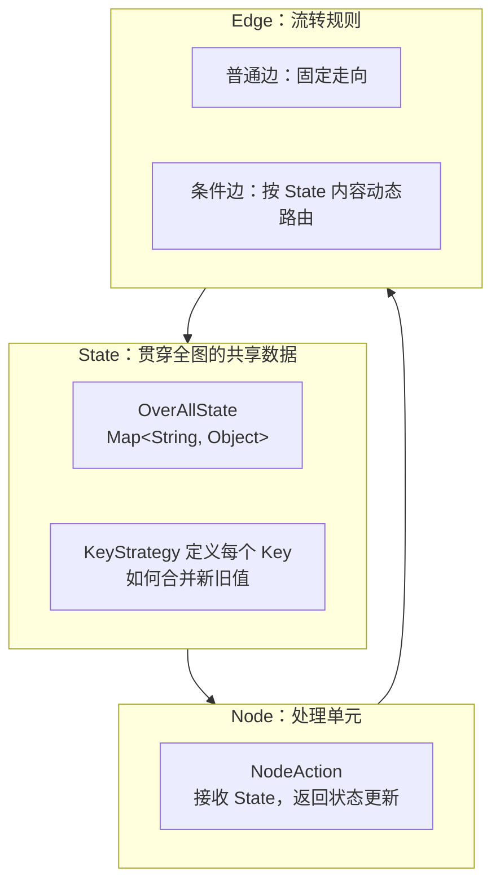
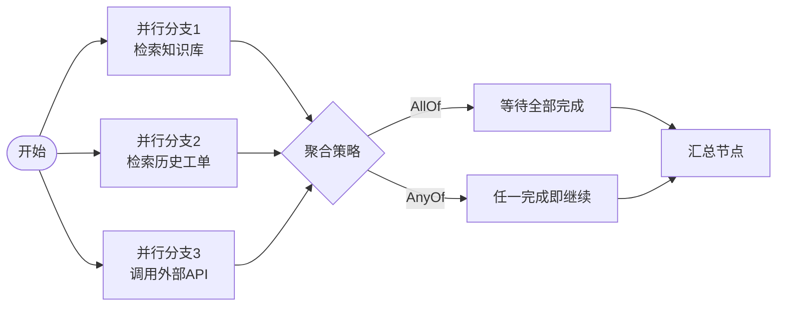

# 第 14 章：Workflow 图编排运行时

## 学习目标

- 理解 `StateGraph`/`OverAllState`/`KeyStrategy` 三大核心概念，能读懂第 13 章 `ReactAgent` 背后的图结构；
- 掌握节点（`NodeAction`）与边（普通边/条件边）的定义方式；
- 掌握并行执行与 `AllOf`/`AnyOf` 结果聚合策略；
- 理解 Checkpoint 持久化机制，能设计支持中断恢复的长时间运行流程；
- 了解失败补偿（Saga 思想）在 Graph 场景下的落地方式。

## 前置知识

- 完成第 01~13 章，尤其是第 13 章（ReactAgent 是 Graph 之上的封装，本章揭开其底层）。
- 有 LangGraph `StateGraph`/`Node`/`Edge` 使用经验会极大加速理解——SAA Graph 明确"受 LangGraph 启发"。

## 核心概念

### 14.1 Graph 三要素



与你的 LangGraph 经验对照：`OverAllState` ≈ LangGraph 的 `State`（TypedDict/Pydantic Model），`KeyStrategy` ≈ LangGraph 的 `Annotated[..., reducer]`，`NodeAction` ≈ LangGraph 的 Node 函数，条件边 ≈ `add_conditional_edges`。核心心智模型完全一致，只是 Java 的强类型特性要求你显式声明每个 State Key 的合并策略。

### 14.2 KeyStrategy：State 如何合并

| 策略 | 行为 | 类比 |
|---|---|---|
| `ReplaceStrategy` | 新值直接覆盖旧值 | 单值字段（如 `question`、`rewritten_query`） |
| `AppendStrategy` | 新值追加到已有列表 | 消息历史、累积结果（如 `messages`） |

```java
StateGraph graph = new StateGraph("diagnosis-workflow", () -> Map.of(
        "question", KeyStrategy.replace(),
        "rewritten_query", KeyStrategy.replace(),
        "messages", KeyStrategy.append(),
        "evidences", KeyStrategy.append()
));
```

## API 深入解析

### 14.3 定义节点

节点是纯函数：接收当前 `OverAllState`，返回一个 `Map<String, Object>` 表示要更新的字段（未出现的字段保持不变）：

```java
NodeAction rewriteQueryNode = (OverAllState state) -> {
    String question = (String) state.value("question").orElseThrow();
    String rewritten = queryRewriteChatClient.prompt()
            .user("请把以下问题改写为更适合检索的表述：" + question)
            .call().content();
    return Map.of("rewritten_query", rewritten);
};

NodeAction retrieveNode = (OverAllState state) -> {
    String query = (String) state.value("rewritten_query").orElseThrow();
    List<Document> docs = documentRetriever.retrieve(new Query(query));
    return Map.of("evidences", docs);
};
```

节点既可以是纯逻辑（向量检索、数据库查询），也可以是 LLM 调用（改写、分类），也可以是一个完整的 `ReactAgent.asNode()`——三种节点类型可以在同一个图里自由混合，这正是 Graph API 相比 Agent Framework 内置模式更灵活的地方。

### 14.4 构建边

```java
graph.addEdge(StateGraph.START, "rewriteQuery")
     .addEdge("rewriteQuery", "retrieve")
     .addNode("rewriteQuery", node_async(rewriteQueryNode))
     .addNode("retrieve", node_async(retrieveNode))
     .addConditionalEdges("retrieve",
             state -> {
                 List<?> evidences = (List<?>) state.value("evidences").orElse(List.of());
                 return evidences.isEmpty() ? "noEvidence" : "hasEvidence";
             },
             Map.of("hasEvidence", "generateAnswer", "noEvidence", "fallbackAnswer"))
     .addEdge("generateAnswer", StateGraph.END)
     .addEdge("fallbackAnswer", StateGraph.END);

CompiledGraph compiledGraph = graph.compile();
```

条件边的路由函数返回一个字符串"标签"，`Map` 把标签映射到下一个节点名——这与 LangGraph 的 `add_conditional_edges(node, router_fn, {"label": "next_node"})` 写法几乎一一对应。

### 14.5 并行执行与结果聚合（1.1.2.0 新增能力）



```java
graph.addEdge(StateGraph.START, List.of("searchKnowledgeBase", "searchTicketHistory", "callExternalApi"))
     .addAggregatedEdge(
             List.of("searchKnowledgeBase", "searchTicketHistory", "callExternalApi"),
             "mergeResults",
             AggregationStrategy.allOf())   // 或 AggregationStrategy.anyOf()
     .addNode("mergeResults", node_async(mergeNode));
```

`ParallelAgent`（第 15 章会详细展开的多智能体内置模式）内部就是基于这套并行边机制实现的，还额外提供了 `maxConcurrency` 参数控制最大并发度，避免并行分支过多导致下游依赖（如向量库、外部 API）瞬时压力过大。

### 14.6 Checkpoint 持久化与中断恢复

```java
CompiledGraph compiledGraph = graph.compile(CompileConfig.builder()
        .checkpointSaver(new RedisSaver(redisTemplate))   // 生产环境持久化 Checkpointer
        .interruptBefore("executePayment")                 // 与第 13 章 HITL 呼应
        .build());

RunnableConfig config = RunnableConfig.builder().threadId("order-12345").build();
Map<String, Object> result = compiledGraph.invoke(initialState, config);
// ... 中断后恢复 ...
Map<String, Object> resumed = compiledGraph.invoke(null, config);
```

`threadId` 是 Checkpoint 定位的关键——同一个 `threadId` 的多次调用共享同一份持久化状态，这与第 08 章 `conversationId` 的会话隔离思路完全一致，只是作用对象从"对话历史"扩展到了"整个工作流的执行状态"。

### 14.7 失败补偿（Saga 思想）

Graph 天然适合表达 Saga 模式——每个正向节点对应一个补偿节点，失败时沿相反路径执行补偿：

```java
graph.addNode("deductInventory", node_async(deductInventoryNode))
     .addNode("chargePayment", node_async(chargePaymentNode))
     .addNode("compensateInventory", node_async(compensateInventoryNode))
     .addConditionalEdges("chargePayment",
             state -> ((Boolean) state.value("paymentSuccess").orElse(false)) ? "success" : "failure",
             Map.of("success", StateGraph.END, "failure", "compensateInventory"))
     .addEdge("compensateInventory", StateGraph.END);
```

这不是框架内置的"Saga 组件"，而是**用 Graph 的条件边 + 补偿节点手动表达 Saga 语义**——对于你熟悉的分布式事务场景（提示词中提到的 Spring Cloud Alibaba 经验），这是一个自然的映射：Graph 节点对应 Saga 步骤，条件边对应"成功继续/失败补偿"的分支逻辑。

## 可运行 Demo：并行检索 + 条件路由 + Checkpoint

对应仓库位置：`examples/38-workflow-demo`（基础 State/Node/Edge）、`examples/39-graph-parallel-demo`（本节展示：并行检索 + 聚合 + 中断恢复）。

### DiagnosisWorkflowConfig.java

```java
package com.flywhl.saa.workflow;

import com.alibaba.cloud.ai.graph.StateGraph;
import com.alibaba.cloud.ai.graph.CompiledGraph;
import com.alibaba.cloud.ai.graph.KeyStrategy;
import com.alibaba.cloud.ai.graph.checkpoint.savers.MemorySaver;
import org.springframework.context.annotation.Bean;
import org.springframework.context.annotation.Configuration;

import java.util.List;
import java.util.Map;

import static com.alibaba.cloud.ai.graph.action.AsyncNodeAction.node_async;

/**
 * 并行检索知识库与历史工单，汇总后交给模型生成诊断建议。
 *
 * @author flywhl
 */
@Configuration(proxyBeanMethods = false)
public class DiagnosisWorkflowConfig {

    @Bean
    public CompiledGraph diagnosisWorkflow(DiagnosisNodes nodes) throws Exception {
        StateGraph graph = new StateGraph("parallel-diagnosis", () -> Map.of(
                "question", KeyStrategy.replace(),
                "kbResults", KeyStrategy.replace(),
                "historyResults", KeyStrategy.replace(),
                "answer", KeyStrategy.replace()
        ));

        graph.addNode("searchKb", node_async(nodes::searchKnowledgeBase))
             .addNode("searchHistory", node_async(nodes::searchTicketHistory))
             .addNode("generateAnswer", node_async(nodes::generateAnswer))
             .addEdge(StateGraph.START, List.of("searchKb", "searchHistory"))
             .addAggregatedEdge(List.of("searchKb", "searchHistory"), "generateAnswer",
                     com.alibaba.cloud.ai.graph.AggregationStrategy.allOf())
             .addEdge("generateAnswer", StateGraph.END);

        return graph.compile(com.alibaba.cloud.ai.graph.CompileConfig.builder()
                .checkpointSaver(new MemorySaver())
                .build());
    }
}
```

### DiagnosisNodes.java

```java
package com.flywhl.saa.workflow;

import com.alibaba.cloud.ai.graph.OverAllState;
import org.springframework.ai.chat.client.ChatClient;
import org.springframework.stereotype.Component;

import java.util.Map;

/**
 * @author flywhl
 */
@Component
public class DiagnosisNodes {

    private final ChatClient chatClient;

    public DiagnosisNodes(ChatClient.Builder chatClientBuilder) {
        this.chatClient = chatClientBuilder.build();
    }

    public Map<String, Object> searchKnowledgeBase(OverAllState state) {
        String question = (String) state.value("question").orElseThrow();
        // 简化示例：真实场景调用第 09 章的向量检索
        return Map.of("kbResults", "知识库匹配：P0420一般与三元催化器老化相关");
    }

    public Map<String, Object> searchTicketHistory(OverAllState state) {
        // 简化示例：真实场景查询历史工单数据库
        return Map.of("historyResults", "历史工单：3个月内同车型同故障码5起，4起为催化器更换解决");
    }

    public Map<String, Object> generateAnswer(OverAllState state) {
        String kb = (String) state.value("kbResults").orElse("");
        String history = (String) state.value("historyResults").orElse("");
        String answer = chatClient.prompt()
                .user("结合以下信息给出诊断建议：\n知识库：%s\n历史工单：%s".formatted(kb, history))
                .call().content();
        return Map.of("answer", answer);
    }
}
```

### WorkflowController.java

```java
package com.flywhl.saa.workflow;

import com.alibaba.cloud.ai.graph.CompiledGraph;
import com.alibaba.cloud.ai.graph.RunnableConfig;
import org.springframework.web.bind.annotation.GetMapping;
import org.springframework.web.bind.annotation.RequestParam;
import org.springframework.web.bind.annotation.RestController;

import java.util.Map;
import java.util.UUID;

/**
 * @author flywhl
 */
@RestController
public class WorkflowController {

    private final CompiledGraph diagnosisWorkflow;

    public WorkflowController(CompiledGraph diagnosisWorkflow) {
        this.diagnosisWorkflow = diagnosisWorkflow;
    }

    @GetMapping("/workflow/diagnose")
    public Object diagnose(@RequestParam String question) throws Exception {
        RunnableConfig config = RunnableConfig.builder().threadId(UUID.randomUUID().toString()).build();
        var result = diagnosisWorkflow.invoke(Map.of("question", question), config);
        return result.value("answer").orElse("未生成结果");
    }
}
```

### 运行与验证

```bash
cd examples/39-graph-parallel-demo
mvn spring-boot:run
curl "http://localhost:18039/workflow/diagnose?question=P0420故障码怎么处理"
```

### 预期输出

```text
结合知识库信息（三元催化器老化是常见原因）与历史工单数据（同车型同故障码5起中4起通过更换催化器解决），建议：
1. 优先检查三元催化器状态
2. 参考历史案例，若确认催化器老化，更换是高置信度解决方案
3. 更换前建议用诊断仪复核氧传感器数据，排除传感器误报可能
```

从日志时间戳能观察到 `searchKb` 和 `searchHistory` 两个节点是**并行执行**的（几乎同时开始），而 `generateAnswer` 等待两者都完成后才启动——这正是 `AggregationStrategy.allOf()` 聚合策略的直接体现。

## 关键源码解读

`OverAllState.value(key)` 返回 `Optional`，这个设计强制调用方显式处理"该 Key 尚未被任何上游节点写入"的情况——对比一个天真的 `Map.get()` 可能返回 `null` 引发 NPE，`Optional` 让状态缺失成为编译期就能感知的问题，这是 Java 强类型生态相比动态类型的 LangGraph 在健壮性上的一个优势体现，也是你在设计自己的 Graph 节点时应该遵循的模式——永远用 `orElse`/`orElseThrow` 显式处理缺失情况，不要假设上游一定写入了某个 Key。

## 企业实践建议

- **能用 Agent Framework 内置模式解决的，不要下沉到 Graph API**（第 02 章已强调，这里再次印证）：本章的并行检索场景，用第 15 章的 `ParallelAgent` 内置模式几行代码就能实现，本章手写 Graph 是为了让你理解底层机制，实际项目优先评估内置模式是否够用；
- **Checkpoint 后端选型直接影响生产可靠性**：`MemorySaver` 仅用于开发调试，生产环境的长时间运行工作流（审批流程可能跨越数小时到数天）必须用持久化 Checkpointer（Redis/JDBC，与第 08 章 Memory 存储选型是同一套决策框架）；
- **Saga 补偿逻辑要覆盖"补偿本身失败"的情况**：本章 §14.7 的简化示例没有处理"库存回补也失败了怎么办"，生产级实现需要补偿节点自身的重试与告警机制。

## 性能优化建议

- 并行边的 `maxConcurrency`（通过 `ParallelAgent` 或自定义聚合策略配置）应该结合下游依赖的实际承载能力设置，不是并行度越高越好；
- 每个 Checkpoint 写入都有 IO 开销，对于节点执行频率极高（如每秒多次）的图，评估是否所有节点都需要写 Checkpoint，还是只在关键节点（如工具调用后、外部交互前）持久化状态。

## 安全建议

- `threadId` 与第 08 章 `conversationId` 一样，不应该是可预测的自增值，避免跨租户/跨用户的状态泄露风险；
- 长时间运行的工作流意味着 Checkpoint 中可能持久化了较长时间的敏感业务数据，需要有相应的数据保留期限与清理策略。

## 常见踩坑

| 现象 | 原因 | 解决 |
|---|---|---|
| `state.value(key)` 总是空 | 上游节点返回的 Map 里 key 名称拼写不一致，或 `KeyStrategy` 未在图初始化时声明 | 检查节点返回的 Map key 与图定义中 `KeyStrategy` 声明的 key 完全一致（区分大小写） |
| 并行分支之一异常导致整个流程挂起 | `AggregationStrategy.allOf()` 语义下，任一分支不完成则永远等待 | 为并行分支设置超时机制，或评估是否应使用 `anyOf()` 语义 |
| 中断恢复后从头重新执行而非从中断点继续 | `threadId` 在恢复调用时与中断时不一致 | 严格保证同一个业务流程使用同一个 `threadId` |
| `AppendStrategy` 字段内容重复累积 | 误将只应保留最新值的字段声明为 `AppendStrategy` | 检查每个 State Key 的语义，单值字段用 `ReplaceStrategy` |

## 版本差异

| 项 | 早期 Graph 实现 | 1.1.2.0 起 |
|---|---|---|
| 并行能力 | 有限或需手动实现 | 原生并行条件边 + `AllOf`/`AnyOf` 聚合策略 |
| 中断恢复 | 基础支持 | `interruptAfter` Hook、更完善的 Checkpoint 生态 |
| 可视化 | 无 | 支持导出为 PlantUML 和 Mermaid 格式（便于文档化与评审） |

## 为什么这样设计

Graph API 之所以要暴露给开发者（而不是完全隐藏在 Agent Framework 之后），是因为**真实企业流程的复杂度天花板往往超出任何预置模式的表达能力**——审批流程可能有十几个条件分支、Saga 补偿链路可能涉及多个外部系统、并行检索的聚合逻辑可能需要自定义权重而非简单的 AllOf/AnyOf。把底层 Graph Runtime 作为公开 API 而不是黑盒实现细节，赋予了开发者在"够用就用内置模式，不够用就直接建模"之间自由切换的能力，这正是第 02 章"三层架构"设计的价值所在：你永远有一条从简单到复杂的平滑升级路径，不会在某个复杂度阈值上被迫推倒重来。

## FAQ

**Q：Graph 和第 09 章的 RAG Pipeline 是竞争关系吗？**
不是。`RetrievalAugmentationAdvisor` 是"检索增强"这个特定场景的开箱即用封装；Graph 是通用的编排底座，完全可以在 Graph 节点内部调用 `RetrievalAugmentationAdvisor` 或直接调用 `DocumentRetriever`，两者是不同抽象层级的工具，服务于不同粒度的编排需求。

**Q：`node_async()` 是必需的吗？**
框架同时支持同步和异步节点定义，`node_async()` 是异步包装器，用于需要非阻塞执行的场景（尤其是并行分支中，异步节点能更好地利用并发资源）。同步场景可以直接使用同步版本的 API。

**Q：Graph 可以导出可视化图表吗？**
可以，官方能力列表中明确提到"支持导出为 PlantUML 和 Mermaid 格式"，这对于团队评审复杂工作流设计、生成文档（呼应本教程"全部图示统一 Mermaid"的要求）非常实用。

## 本章总结

本章揭开了 `ReactAgent` 背后的完整机制：`StateGraph`/`OverAllState`/`KeyStrategy` 构成的状态管理体系，节点与边定义的处理流程，并行执行与聚合策略应对复杂编排需求，Checkpoint 机制支撑长时间运行与中断恢复，以及用条件边+补偿节点手动表达 Saga 语义的思路。这是本教程中与你 LangGraph 经验重合度最高的一章，也是第 15 章多智能体内置模式（本质上是预置的 Graph 拓扑）的直接理论基础。

## 延伸阅读

- SAA Graph 高级用户指南：<https://java2ai.com/docs/frameworks/agent-framework/advanced/context-engineering>
- 阿里云社区《Spring AI Alibaba Graph 快速预览》：<https://www.alibabacloud.com/blog/602455>

## 下一章预告

第 15 章进入 MultiAgent：`SequentialAgent`/`ParallelAgent`/`LlmRoutingAgent`/`LoopAgent`/`SupervisorAgent` 五种内置协作模式的适用场景与代码实现，以及基于 A2A 协议 + Nacos 的跨进程智能体互通——这些内置模式本质上都是本章 Graph 拓扑的"预制件"。

## 思考题

1. 本章 Saga 补偿示例只处理了两步（扣库存、扣款），如果扩展到五步的复杂事务链，你会如何组织补偿节点与正向节点的对应关系，让代码保持可维护？
2. `AggregationStrategy.allOf()` 在某个并行分支（如外部 API 调用）响应缓慢时会拖慢整个流程，你会如何设计超时与降级策略？
3. 结合你熟悉的 LangGraph `Command` 对象（用于节点内部同时更新状态并指定下一跳），SAA Graph 的条件边设计与之相比，在灵活性和类型安全性上分别有什么取舍？
