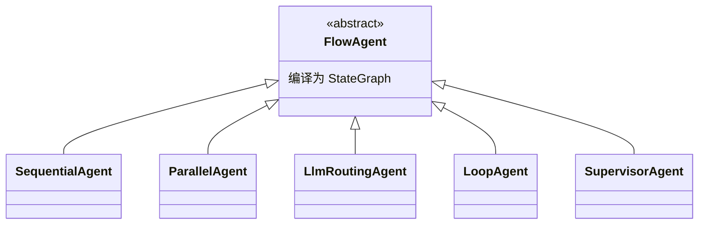
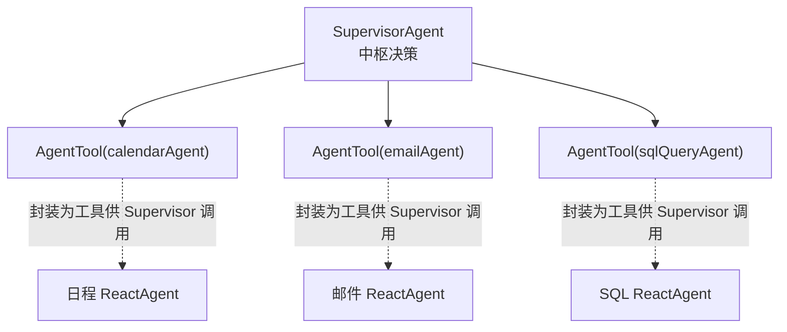

# 第 15 章：MultiAgent 多智能体协作

## 学习目标

- 掌握四种内置协作模式：`SequentialAgent`/`ParallelAgent`/`LlmRoutingAgent`/`LoopAgent` 的适用场景与代码实现；
- 理解 `SupervisorAgent` 与 `AgentTool`（智能体即工具）模式的设计思路；
- 掌握 Handoffs（智能体交接）模式与前几种编排模式的本质区别；
- 了解 A2A 协议 + Nacos 实现跨进程/跨服务智能体互通的机制。

## 前置知识

- 完成第 01~14 章，尤其是第 13 章（ReactAgent）与第 14 章（Graph 底层机制——本章的五种模式都是 `FlowAgent` 子类，内部编译为 `StateGraph`）。

## 核心概念

### 15.1 FlowAgent：内置协作模式的公共基类



与 `ReactAgent` 编译为 Graph 一样（第 14 章已揭示），这五种多智能体模式**本质上是预置的 Graph 拓扑结构**——`SequentialAgent` 是"节点依次相连"的图，`ParallelAgent` 是"并行边+聚合"的图（第 14 章你已经手写过一次）。理解了这一点，你会发现"多智能体编排"并不神秘，只是把常见的协作拓扑封装成了开箱即用的组件。

### 15.2 五种模式速览

| 模式 | 拓扑 | 适用场景 |
|---|---|---|
| **SequentialAgent** | A → B → C 依次执行，状态逐步传递 | 有明确先后依赖的多阶段任务（如"检索→生成→校验"） |
| **ParallelAgent** | A/B/C 并行执行，自定义合并策略 | 无依赖关系、可并发完成的子任务（第 14 章已实践） |
| **LlmRoutingAgent** | 用 LLM 判断意图，动态选择一个子智能体执行 | 意图分类后分发处理（如客服"售前/售后/技术支持"分流） |
| **LoopAgent** | 重复执行直到满足条件 | 需要多轮迭代优化的任务（如"生成→自我评审→改进"循环） |
| **SupervisorAgent** | 中枢智能体决策 + 调度多个子智能体（可并行） | 复杂任务需要中枢协调多个专职智能体分工协作 |

## API 深入解析

### 15.3 SequentialAgent：顺序执行

```java
SequentialAgent pipeline = SequentialAgent.builder()
        .name("rag-pipeline")
        .subAgents(List.of(queryRewriteAgent, retrievalAgent, answerGenerationAgent, verificationAgent))
        .build();

var result = pipeline.invoke(Map.of("question", "P0420故障码怎么处理"));
```

每个子智能体的输出通过共享 State 传递给下一个（与第 14 章 `KeyStrategy` 的合并规则一致），适合"改写→检索→生成→校验"这类有明确顺序依赖的流水线。

### 15.4 ParallelAgent：并行执行 + 自定义合并

```java
ParallelAgent parallelSearch = ParallelAgent.builder()
        .name("multi-source-search")
        .subAgents(List.of(knowledgeBaseAgent, ticketHistoryAgent, externalApiAgent))
        .maxConcurrency(3)
        .mergeStrategy((results) -> Map.of("mergedContext", String.join("\n---\n", results)))
        .build();
```

`maxConcurrency` 与第 14 章讨论的并发度控制对应；自定义 `mergeStrategy` 比 `AllOf`/`AnyOf` 更灵活——可以实现"按置信度加权合并"等业务专属逻辑。

### 15.5 LlmRoutingAgent：智能路由

```java
LlmRoutingAgent customerServiceRouter = LlmRoutingAgent.builder()
        .name("customer-service-router")
        .model(chatModel)
        .routingPrompt("根据用户问题判断应该路由到：售前咨询、售后support、技术支持 三者之一")
        .routes(Map.of(
                "售前咨询", presalesAgent,
                "售后support", afterSalesAgent,
                "技术支持", techSupportAgent))
        .build();
```

这是企业项目三"智能客服平台"的核心编排模式——用一次轻量的 LLM 判断完成意图分类，再把请求转交给真正擅长该领域的专职 Agent，避免"一个 Agent 什么都要会"导致的 Prompt 臃肿和效果打折。

### 15.6 LoopAgent：循环迭代

```java
LoopAgent selfRefiningWriter = LoopAgent.builder()
        .name("self-refining-writer")
        .bodyAgent(draftAndReviewAgent)     // 每轮循环执行的智能体
        .maxIterations(3)
        .exitCondition(state ->
                "APPROVED".equals(state.value("reviewResult").orElse(null)))
        .build();
```

适合"生成初稿 → 自我评审 → 根据反馈改进"这类需要多轮迭代收敛的任务，`exitCondition` 与 `maxIterations` 双重保险，避免第 13 章讨论过的"不收敛"风险。

### 15.7 SupervisorAgent 与 AgentTool：智能体即工具



`AgentTool` 是本章最值得关注的设计——它把一个完整的 `ReactAgent`**封装成一个 Tool**，供另一个 Agent（Supervisor）像调用普通工具一样调用。这意味着"多智能体协作"和"单智能体工具调用"（第 07/13 章）在 API 层面被统一了：

```java
AgentTool calendarTool = AgentTool.from(calendarAgent, "处理日程安排相关任务");
AgentTool emailTool = AgentTool.from(emailAgent, "处理邮件起草与发送相关任务");

SupervisorAgent officeSupervisor = SupervisorAgent.builder()
        .name("office-supervisor")
        .model(chatModel)
        .tools(List.of(calendarTool, emailTool))
        .systemPrompt("你是办公助手总控，根据用户需求调度日程或邮件专职助手完成任务")
        .build();
```

这正是企业项目二"AI 办公助手"的核心编排模式——总控 Agent 不需要自己懂"如何写邮件"的所有细节，只需要判断"这个任务该交给哪个专职 Agent"，专职 Agent 内部的复杂度对 Supervisor 是**上下文隔离**的（第 15.2 表格提到的 Context isolation：子智能体独立执行，结果返回给控制器智能体，避免子智能体的中间过程"污染"总控的上下文）。

### 15.8 Handoffs：智能体交接

与 Supervisor（总控始终掌握控制权）不同，Handoffs 模式是**当前处理者主动把"控制权"转交给另一个智能体**，转交后原智能体不再介入（除非再次被交接回来）：

```java
graph.addNode("generalSupport", node_async(generalSupportNode))
     .addNode("technicalSupport", node_async(technicalSupportNode))
     .addConditionalEdges("generalSupport",
             state -> needsTechnicalEscalation(state) ? "handoff" : "continue",
             Map.of("handoff", "technicalSupport", "continue", StateGraph.END));
```

Handoffs 通常基于状态中的"当前负责智能体"标记来实现路由，适合"客服对话中途升级到技术支持"这类**所有权转移**场景，与 `LlmRoutingAgent`（一次性分类后转发，不再切回）和 `SupervisorAgent`（总控始终在环）都有本质区别——三者的选择要基于"控制权是否需要转移、是否需要中枢持续协调"来判断。

### 15.9 A2A：跨进程智能体互通

前面的模式都假设子智能体在**同一个 JVM 进程内**。当子智能体本身是独立部署的微服务时，需要 A2A（Agent-to-Agent）协议：

```java
A2aRemoteAgent remoteInventoryAgent = A2aRemoteAgent.builder()
        .name("inventory-agent")
        .nacosServiceName("inventory-agent-service")   // 通过 Nacos 服务发现，而非硬编码地址
        .build();

SupervisorAgent supervisor = SupervisorAgent.builder()
        .tools(List.of(AgentTool.from(remoteInventoryAgent, "库存查询与调拨")))
        .build();
```

这与第 12 章 Nacos MCP Registry 的设计思路完全一致——`A2aRemoteAgent` + Nacos 服务发现，让"调用另一个团队维护的远程智能体"和"调用本地智能体"在编程模型上几乎无差别，Supervisor 不需要关心 `inventory-agent` 到底部署在哪台机器、有几个实例。

## 可运行 Demo：客服意图路由 + Supervisor 协作

对应仓库位置：`examples/41-multi-agent-demo`（四种基础模式）、`examples/42-supervisor-demo`（本节展示）。

### OfficeSupervisorConfig.java

```java
package com.flywhl.saa.multiagent;

import com.alibaba.cloud.ai.graph.agent.ReactAgent;
import com.alibaba.cloud.ai.graph.agent.flow.agent.SupervisorAgent;
import com.alibaba.cloud.ai.graph.agent.tool.AgentTool;
import org.springframework.ai.chat.model.ChatModel;
import org.springframework.context.annotation.Bean;
import org.springframework.context.annotation.Configuration;

import java.util.List;

/**
 * @author flywhl
 */
@Configuration(proxyBeanMethods = false)
public class OfficeSupervisorConfig {

    @Bean
    public ReactAgent calendarAgent(ChatModel dashScopeChatModel, CalendarTools calendarTools) {
        return ReactAgent.builder()
                .name("calendar-agent")
                .model(dashScopeChatModel)
                .systemPrompt("你专门负责日程查询与安排，简洁回复")
                .tools(calendarTools)
                .maxIterations(4)
                .build();
    }

    @Bean
    public ReactAgent emailAgent(ChatModel dashScopeChatModel) {
        return ReactAgent.builder()
                .name("email-agent")
                .model(dashScopeChatModel)
                .systemPrompt("你专门负责起草邮件初稿，语气专业得体")
                .maxIterations(3)
                .build();
    }

    @Bean
    public SupervisorAgent officeSupervisor(ChatModel dashScopeChatModel, ReactAgent calendarAgent, ReactAgent emailAgent) {
        return SupervisorAgent.builder()
                .name("office-supervisor")
                .model(dashScopeChatModel)
                .tools(List.of(
                        AgentTool.from(calendarAgent, "处理日程查询、安排会议等日程相关任务"),
                        AgentTool.from(emailAgent, "起草邮件、回复邮件等邮件相关任务")))
                .systemPrompt("你是企业办公助手总控，根据用户需求判断应调度哪个专职助手完成任务，也可以自己直接回答简单问题")
                .maxIterations(6)
                .build();
    }
}
```

### SupervisorController.java

```java
package com.flywhl.saa.multiagent;

import com.alibaba.cloud.ai.graph.agent.flow.agent.SupervisorAgent;
import org.springframework.web.bind.annotation.GetMapping;
import org.springframework.web.bind.annotation.RequestParam;
import org.springframework.web.bind.annotation.RestController;

/**
 * @author flywhl
 */
@RestController
public class SupervisorController {

    private final SupervisorAgent officeSupervisor;

    public SupervisorController(SupervisorAgent officeSupervisor) {
        this.officeSupervisor = officeSupervisor;
    }

    @GetMapping("/office/ask")
    public String ask(@RequestParam String request) {
        return officeSupervisor.call(request).getText();
    }
}
```

### 运行与验证

```bash
cd examples/42-supervisor-demo
mvn spring-boot:run
curl "http://localhost:18042/office/ask?request=帮我看看明天下午有什么安排"
curl "http://localhost:18042/office/ask?request=帮我写一封请假邮件给主管，理由是家里有事"
```

### 预期输出

```text
$ curl ".../office/ask?request=帮我看看明天下午有什么安排"
明天下午 14:00 有产品评审会，16:00 与供应商的例行沟通会。

$ curl ".../office/ask?request=帮我写一封请假邮件给主管，理由是家里有事"
主题：请假申请

尊敬的主管：

您好，因家中突发事务需要处理，特申请请假一天，恳请批准。工作已做好交接安排，如有紧急事项可随时联系我。

谢谢理解！

此致
敬礼
```

两次请求分别被 Supervisor 路由到了 `calendar-agent` 和 `email-agent`——你无需在业务代码中写任何 `if/else` 意图判断逻辑，全部由 `SupervisorAgent` 内部的 LLM 决策 + `AgentTool` 调用机制自动完成。

## 关键源码解读

`AgentTool.from(reactAgent, description)` 背后做的事情，本质上是把一个 `ReactAgent.call(input)` 调用包装成符合第 07 章 `ToolCallback` 接口的对象——从 Supervisor 的视角看，调用一个子智能体和调用一个 `@Tool` 方法没有任何区别，都是"给一个输入、拿到一个输出"。这个统一恰恰印证了第 07 章结尾的设计哲学：**模型只表达意图，应用负责执行**——无论"执行"背后是一次数据库查询还是一整个子智能体的完整推理循环，对上层调用者而言接口是一致的。

## 企业实践建议

- **模式选择要基于"任务依赖关系"而非"看起来高级"**：有明确顺序依赖用 `SequentialAgent`，无依赖用 `ParallelAgent`，纯分类分发用 `LlmRoutingAgent`，需要收敛迭代用 `LoopAgent`，需要中枢持续协调多个专职能力用 `SupervisorAgent`——不要为了"多智能体架构"而强行引入不必要的复杂度，很多场景下 `ReactAgent` + 若干工具就足够；
- **Supervisor 模式下子智能体的 `systemPrompt` 要"专精"而非"全能"**：每个子智能体应该只擅长一件事并把这件事做到极致，Supervisor 的价值正是"协调多个窄而深的专家"而不是"管理多个浅而广的通才"；
- **跨进程 A2A 调用要有降级预案**：远程智能体不可用时，Supervisor 应该有合理的降级话术（"该功能暂时不可用，请稍后重试"），而不是让整个对话因为一个子系统故障而完全失败。

## 性能优化建议

- `SupervisorAgent` 每次调度子智能体都至少多一次模型调用（判断调度哪个 + 子智能体自身的推理），链路比单一 `ReactAgent` 更长，需要在产品体验上配合流式反馈管理用户预期；
- `ParallelAgent` 的 `maxConcurrency` 要结合子智能体各自的资源消耗设置，多个子智能体同时进行模型调用可能瞬时占用较高的 API 配额。

## 安全建议

- Handoffs 模式的"控制权转移"要有清晰的审计轨迹（记录何时、为何从智能体 A 转移到 B），便于事后追溯对话处理过程；
- A2A 跨进程调用涉及企业内部网络边界，需要与第 12 章 MCP 章节相同的鉴权与最小权限原则。

## 常见踩坑

| 现象 | 原因 | 解决 |
|---|---|---|
| `LlmRoutingAgent` 路由判断不准确 | `routingPrompt` 描述模糊，或路由候选类目边界不清晰 | 参照第 05 章 Prompt 工程思路，给出更明确的分类标准与边界示例 |
| Supervisor 调度了错误的子智能体 | `AgentTool` 的 `description` 不够清晰，模型无法准确判断适用场景 | 参照第 07 章"工具描述要包含什么时候不该用"的建议优化描述 |
| `LoopAgent` 死循环直到 `maxIterations` 触顶 | `exitCondition` 判断逻辑有误，或子任务本身无法在合理轮次内收敛 | 检查退出条件的状态字段是否被正确写入，评估任务是否适合循环模式 |

## 版本差异

| 项 | 1.1.0.0（初次引入基础模式） | 1.1.2.x（本教程） |
|---|---|---|
| 内置模式 | Sequential/Parallel/Routing/Loop 基础形态 | + SupervisorAgent、Handoffs、AgentTool（智能体即工具）、并行子智能体执行 |
| A2A | 初步支持 | Nacos 集成的服务注册发现与负载均衡（1.1.2.x 官方发布说明明确列出） |

## 为什么这样设计

`AgentTool` 把"子智能体"统一成"工具"这个设计决策，是本章最深刻的架构洞察：它意味着框架团队认为**多智能体协作和工具调用在本质上是同一类问题**——都是"决策者判断需要什么能力、委托给合适的执行者、拿到结果继续推理"。与其为"多智能体协作"发明一套全新的抽象，不如复用已经被验证成熟的 Tool Calling 机制，只是把"工具"的粒度从"一个 Java 方法"扩展到了"一整个 ReactAgent"。这种"能复用现有抽象就不发明新抽象"的克制，正是让整个框架保持一致性、降低学习成本的关键——你在第 07 章学到的工具设计原则（描述要清晰、粒度要适中、安全边界要明确），几乎原封不动地适用于本章的 `AgentTool` 设计。

## FAQ

**Q：`SupervisorAgent` 和 `LlmRoutingAgent` 的本质区别是什么？**
`LlmRoutingAgent` 判断一次、转发一次，之后不再介入（转发即终止路由逻辑）；`SupervisorAgent` 持续在环，可以根据子智能体的返回结果决定是否需要调度另一个子智能体、是否需要综合多个子智能体的结果、或直接自己回答——控制权始终在 Supervisor 手中，这是两者最核心的差异。

**Q：多智能体协作会不会让 Prompt 工程变得更复杂？**
会，但复杂度被"分而治之"了——每个子智能体的 Prompt 只需要关注自己的专精领域（更简单），复杂度转移到了 Supervisor/Router 的调度判断逻辑上（相对集中、易于迭代优化）。这通常比"一个全能 Agent 塞满所有可能场景的 Prompt"更易维护。

**Q：A2A 和 MCP（第 12 章）该用哪个？**
两者解决不同层次的问题：MCP 面向"工具/能力"的跨进程复用，A2A 面向"完整智能体"的跨进程协作。如果远程能力是"一个具备自主推理能力的智能体"，用 A2A；如果只是"一个确定性的工具/服务"，用 MCP。实际系统中两者常常共存。

## 本章总结

本章完整覆盖了 SAA 的多智能体协作能力：`SequentialAgent`/`ParallelAgent`/`LlmRoutingAgent`/`LoopAgent` 四种基础拓扑，`SupervisorAgent` + `AgentTool` 的中枢协调模式（将子智能体统一为工具这一深刻的架构选择），Handoffs 的控制权转移语义，以及 A2A + Nacos 支撑的跨进程智能体协作。这是企业项目二（办公助手 Supervisor 编排）与企业项目三（客服平台 Routing + Supervisor + 人工接管）的核心技术支柱，也是本教程 Agent 主线（13→14→15 章）的收官。

## 延伸阅读

- SAA 多智能体编排官方文档：<https://java2ai.com/docs/frameworks/agent-framework/advanced/multi-agent>
- SAA GitHub Releases（1.1.2.2 多智能体模式样例集说明）：<https://github.com/alibaba/spring-ai-alibaba/releases>

## 下一章预告

第 16 章回到相对基础但同样重要的话题：结构化输出——`.entity()` API、`BeanOutputConverter`、原生结构化输出模式（`useProviderStructuredOutput`）与自动校验重试（`validateSchema`）。这是让 Agent/Workflow 的每个节点输出都能被下游可靠解析的关键能力，值得专门用一章讲透。

## 思考题

1. 企业项目三"智能客服平台"需要"FAQ→Routing→Supervisor→人工接管"的完整链路，你会如何组合本章五种模式来实现？哪些环节适合用 Handoffs？
2. 如果一个 Supervisor 需要协调的子智能体数量超过 10 个，你觉得会出现什么问题？有什么应对思路（提示：结合第 13 章 Agent Skills 的渐进式披露思想）？
3. A2A 跨进程调用相比同进程内的 `AgentTool` 调用，多了网络延迟和故障可能性，你会如何设计超时和熔断策略，避免一个远程智能体的故障拖垮整个 Supervisor 编排？
