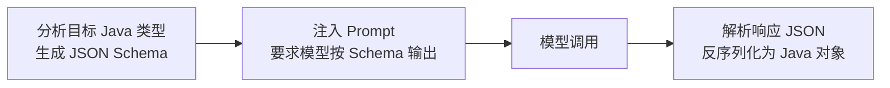

# 第 16 章：StructuredOutput 结构化输出

## 学习目标

- 掌握 `.entity()` API 与 `BeanOutputConverter`/`MapOutputConverter`/`ListOutputConverter` 三大转换器；
- 理解 Record/复杂嵌套对象/泛型集合的结构化输出写法；
- 掌握原生结构化输出模式（`useProviderStructuredOutput`）与自动校验重试（`validateSchema`）两个 1.1.x 增强能力；
- 理解结构化输出失败时的容错解析策略。

## 前置知识

- 完成第 01~15 章。本章内容相对独立，可随时查阅，但建议至少先完成第 04 章。

## 核心概念

### 16.1 为什么需要结构化输出

模型默认输出自由文本，但业务代码需要类型安全的 Java 对象才能继续处理（存库、传给下游服务、渲染前端表单）。`StructuredOutputConverter` 解决"自然语言 → 类型安全对象"这个转换问题，其工作原理分两步：



### 16.2 三种转换器

| 转换器 | 目标类型 | 使用方式 |
|---|---|---|
| `BeanOutputConverter<T>` | 自定义 Record/POJO | `.entity(MyRecord.class)` |
| `MapOutputConverter` | `Map<String, Object>` | `.entity(new ParameterizedTypeReference<Map<String,Object>>(){})` |
| `ListOutputConverter` | 逗号分隔的简单列表 | 适合"给我一个列表"这种最简场景 |

## API 深入解析

### 16.3 最基础用法：Record 直接映射

```java
public record DiagnosisResult(
        String rootCause,
        int confidenceScore,
        List<String> suggestedActions) {}

DiagnosisResult result = chatClient.prompt()
        .user("分析故障码P0420的根因，给出置信度评分(0-100)和建议措施")
        .call()
        .entity(DiagnosisResult.class);
```

Java 21 `record` 是结构化输出的天然搭档——不可变、字段语义清晰，`BeanOutputConverter` 能直接基于其组件（components）生成准确的 JSON Schema，无需额外注解（但复杂字段建议加 `@JsonPropertyDescription` 帮助模型理解含义）。

### 16.4 复杂嵌套对象与泛型集合

```java
public record ActorFilms(String actor, List<String> movies) {}

// 泛型集合必须用 ParameterizedTypeReference，普通 Class 无法表达 List<T> 这种参数化类型
List<ActorFilms> actorFilms = chatClient.prompt()
        .user("生成汤姆·汉克斯和比尔·默瑞各5部电影的filmography")
        .call()
        .entity(new ParameterizedTypeReference<List<ActorFilms>>() {});
```

嵌套对象（Record 内包含另一个 Record 或集合）开箱即用，`BeanOutputConverter` 会递归分析整个类型树生成完整 Schema。

### 16.5 字段顺序控制

```java
@JsonPropertyOrder({"rootCause", "confidenceScore", "suggestedActions"})
public record DiagnosisResult(String rootCause, int confidenceScore, List<String> suggestedActions) {}
```

`@JsonPropertyOrder` 确保生成的 JSON Schema（进而影响模型输出顺序）符合你期望的字段顺序，而不依赖 Record 组件的声明顺序——某些场景下字段顺序会微妙地影响模型的"思考顺序"（比如让模型先给出 `reasoning` 字段再给出 `conclusion` 字段，效果通常优于反过来）。

### 16.6 原生结构化输出模式（1.1.x 增强）

默认情况下，Schema 是以**文本指令**形式注入 Prompt 的（"请按以下 JSON 格式输出：..."），模型仍有一定概率违反格式。1.1.x 提供了**原生约束模式**——直接把 Schema 作为结构化约束传给模型 API（适用于支持该能力的模型），由模型服务端强制保证输出符合 Schema：

```java
DiagnosisResult result = chatClient.prompt()
        .user("分析故障码P0420")
        .call()
        .entity(DiagnosisResult.class, spec -> spec.useProviderStructuredOutput());
```

也可以全局启用（对该 `ChatClient` 的所有请求生效）：

```java
ChatClient chatClient = chatClientBuilder
        .defaultAdvisors(AdvisorParams.ENABLE_NATIVE_STRUCTURED_OUTPUT)
        .build();
```

**原生模式的优势**：更高可靠性（服务端强制约束而非"建议"）、更干净的 Prompt（不需要塞入冗长的格式说明文字）、通常也有更好的性能（模型内部对结构化生成做了专门优化）。**限制**：并非所有模型都支持，需要底层 `ChatOptions` 实现 `StructuredOutputChatOptions` 接口，使用前应确认目标模型（如 DashScope 特定模型）是否支持此能力。

### 16.7 自动校验与重试（1.1.x 增强）

```java
DiagnosisResult result = chatClient.prompt()
        .user("分析故障码P0420")
        .call()
        .entity(DiagnosisResult.class, spec -> spec.validateSchema());
```

`validateSchema()` 会在解析后用 Schema 校验模型的 JSON 响应，若校验失败，**自动把错误信息追加到 Prompt 并重新请求模型**，最多重试 `maxRepeatAttempts` 次（默认 3 次）——底层由 `StructuredOutputValidationAdvisor` 实现。这解决了结构化输出场景下一个常见的生产问题：模型偶尔输出格式略有偏差（缺字段、类型不对）时，与其让应用代码捕获解析异常后放弃，不如让框架自动"要求模型改正"，显著提升端到端成功率。

## 可运行 Demo：诊断结果结构化输出 + 自动重试

对应仓库位置：`examples/20-structured-output-demo`。

### DiagnosisResult.java

```java
package com.flywhl.saa.structuredoutput;

import com.fasterxml.jackson.annotation.JsonPropertyDescription;
import com.fasterxml.jackson.annotation.JsonPropertyOrder;

import java.util.List;

/**
 * @author flywhl
 */
@JsonPropertyOrder({"rootCause", "confidenceScore", "suggestedActions"})
public record DiagnosisResult(
        @JsonPropertyDescription("故障根本原因，一句话概括") String rootCause,
        @JsonPropertyDescription("诊断置信度，0-100的整数") int confidenceScore,
        @JsonPropertyDescription("建议的排查或处理措施，按优先级排序") List<String> suggestedActions) {}
```

### StructuredOutputController.java

```java
package com.flywhl.saa.structuredoutput;

import org.springframework.ai.chat.client.ChatClient;
import org.springframework.web.bind.annotation.GetMapping;
import org.springframework.web.bind.annotation.RequestParam;
import org.springframework.web.bind.annotation.RestController;

/**
 * @author flywhl
 */
@RestController
public class StructuredOutputController {

    private final ChatClient chatClient;

    public StructuredOutputController(ChatClient.Builder chatClientBuilder) {
        this.chatClient = chatClientBuilder.build();
    }

    @GetMapping("/diagnose/structured")
    public DiagnosisResult diagnose(@RequestParam String dtcCode) {
        return chatClient.prompt()
                .user("分析故障码%s的根本原因，给出0-100的置信度评分和建议措施".formatted(dtcCode))
                .call()
                .entity(DiagnosisResult.class, spec -> spec.validateSchema());
    }
}
```

### 运行与验证

```bash
cd examples/20-structured-output-demo
mvn spring-boot:run
curl "http://localhost:18020/diagnose/structured?dtcCode=P0420"
```

### 预期输出

```json
{
  "rootCause": "三元催化转化器效率低于阈值，通常由催化器老化或氧传感器误报引起",
  "confidenceScore": 75,
  "suggestedActions": [
    "使用诊断仪读取氧传感器实时数据，排除传感器误报",
    "检查是否存在伴随的失火故障码",
    "若确认催化器老化，更换三元催化转化器"
  ]
}
```

响应直接是符合 `DiagnosisResult` 结构的 JSON——Controller 方法签名声明返回 `DiagnosisResult`，Spring MVC 自动完成对象到 JSON 的序列化，前端可以直接按字段渲染，无需任何文本解析。

## 关键源码解读

`BeanOutputConverter` 生成 Prompt 格式指令时，本质上是把 Java 类型系统"翻译"成了模型能理解的 JSON Schema 文本描述——这与你在第 07 章了解到的"工具参数 Schema 自动生成"（`JsonSchemaGenerator.generateForMethodInput`）是同一套底层机制的两种应用：一个用于告诉模型"如何调用工具"，一个用于告诉模型"如何格式化最终输出"。两者共享同一套 Java 类型 → JSON Schema 的转换逻辑，这是框架内部保持一致性的又一体现。

## 企业实践建议

- **凡是需要程序化处理模型输出的场景，一律使用结构化输出，不要自己写正则/字符串解析**——手写解析逻辑面对模型输出格式的细微变化（多了个空格、换行位置不同）极其脆弱，`BeanOutputConverter` 处理了大量边界情况（如去除模型可能包裹的 Markdown 代码块标记）；
- **`validateSchema()` 应该成为生产环境结构化输出的默认选项**，重试的成本（多一次模型调用）远小于"解析失败导致整个业务流程中断"的成本；
- **字段描述（`@JsonPropertyDescription`）不要省略**，尤其是语义不够自解释的字段（如 `confidenceScore` 如果不说明是 0-100 还是 0-1，模型可能理解错误）。

## 性能优化建议

- 原生结构化输出模式（`useProviderStructuredOutput`）通常比文本指令模式更快（省去了模型"斟酌格式"的隐性开销），如果目标模型支持，优先启用；
- `validateSchema()` 的重试会增加最坏情况下的延迟（多次模型调用），对延迟极度敏感的场景需要评估是否要设置更小的 `maxRepeatAttempts` 或干脆在应用层做更宽松的容错解析。

## 安全建议

- 结构化输出的字段不应该盲目信任为"已校验的业务数据"——Schema 校验只保证类型和结构正确，不保证内容的业务合法性（如 `confidenceScore` 符合 0-100 的类型是 int，但模型仍可能给出不合理的极端值），关键业务逻辑仍需应用层二次校验。

## 常见踩坑

| 现象 | 原因 | 解决 |
|---|---|---|
| 泛型集合结构化输出报错或类型丢失 | 直接用 `.entity(List.class)` 而非 `ParameterizedTypeReference` | Java 泛型擦除的经典问题，必须用 `new ParameterizedTypeReference<List<T>>() {}` |
| 模型输出的 JSON 被 Markdown 代码块包裹导致解析失败 | 部分模型习惯用 \`\`\`json 包裹输出 | `BeanOutputConverter` 已内置处理此情况，若仍失败考虑是否是自定义解析逻辑未做同样处理 |
| `useProviderStructuredOutput()` 报错不支持 | 目标模型的 `ChatOptions` 未实现 `StructuredOutputChatOptions` | 确认模型是否支持原生结构化输出，不支持则退回默认的文本指令模式 |

## 版本差异

| 项 | 早期 | 1.1.x（本教程） |
|---|---|---|
| 结构化输出保障 | 仅文本指令模式，依赖模型"自觉遵守" | + 原生结构化输出模式（服务端强约束）+ 自动校验重试（`validateSchema`） |

## 为什么这样设计

结构化输出转换器把"如何让 LLM 输出符合特定格式"这个在早期 LLM 应用开发中充满"祖传技巧"（各种精心设计的 Prompt 措辞、正则表达式后处理）的领域，收敛成了一套类型安全、可复用的框架能力。这个演进路径——从"文本指令+运气"到"文本指令+校验重试"再到"服务端原生约束"——恰好反映了整个行业对结构化输出可靠性要求的提升：早期 LLM 应用大多是"辅助性"功能，输出格式偶尔出错影响有限；但当 LLM 输出开始直接驱动业务逻辑（如自动生成数据库记录、触发下游 API 调用）时，格式可靠性就从"锦上添花"变成了"生死攸关"，框架层面的持续加固正是对这一趋势的回应。

## FAQ

**Q：结构化输出和第 07 章的 Tool 返回值有什么关系？**
两者是不同方向：Tool 返回值是"应用代码返回给模型"的数据（模型接收方是自己），结构化输出是"模型返回给应用代码"的数据（应用代码是接收方）。两者共享底层 JSON Schema 生成机制，但服务的调用方向相反。

**Q：流式场景下能用结构化输出吗？**
截至本教程编写时，官方文档明确说明 `stream()` 尚不直接支持 `.entity()`，需要先用 `.stream().content()` 拿到完整字符串流并聚合（`collectList().block()`），再手动用 `BeanOutputConverter.convert()` 转换——这是当前的已知限制，第 17 章会展开讨论。

**Q：`validateSchema()` 的重试和第 04 章 `spring.ai.retry` 的重试是同一个机制吗？**
不是。`spring.ai.retry` 处理的是网络层/API 层的瞬时错误（超时、限流），`validateSchema()` 处理的是"模型响应格式不符合预期"这一语义层面的问题，两者可以同时生效，覆盖不同的失败场景。

## 本章总结

本章讲清了结构化输出从"文本指令"到"原生约束+自动校验重试"的完整能力谱系：`BeanOutputConverter` 让 Java Record 与模型输出无缝对接，`useProviderStructuredOutput()` 提供了更高可靠性的服务端约束模式，`validateSchema()` 用自动重试机制大幅提升了生产环境的端到端成功率。这是让 AI 输出真正可以被程序化消费、驱动下游业务逻辑的关键能力。

## 延伸阅读

- Spring AI Structured Output Converter 官方参考：<https://docs.spring.io/spring-ai/reference/api/structured-output-converter.html>

## 下一章预告

第 17 章进入 Streaming：`stream()` API 的完整用法、SSE 协议在 Spring MVC/WebFlux 下的实现方式、流式场景与工具调用/结构化输出结合时的现实限制与应对策略。

## 思考题

1. 如果一个字段的合法取值范围 Schema 无法完全表达（如"结论必须与证据一致"这种语义约束），你会如何在结构化输出的基础上补充业务层校验？
2. 结合第 07 章 Tool 的 JSON Schema 生成机制，你觉得能否设计一个工具，让模型的输出经过该工具"二次校验+改写"后再返回给用户？这样做和 `validateSchema()` 相比有什么优劣？
3. 原生结构化输出模式声称"性能更好"，你会如何设计一个实验（结合第 10 章的基准测试思路）来验证这个说法在你实际使用的模型上是否成立？
