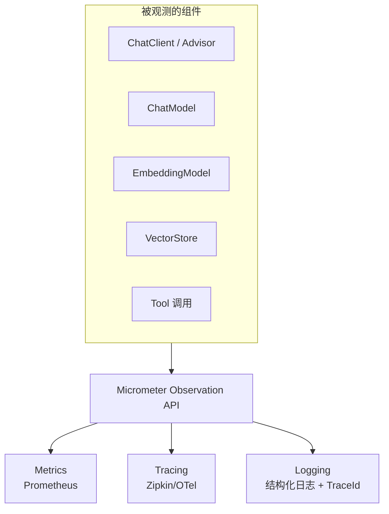

# 第 18 章：Observability 可观测体系

## 学习目标

- 理解 Spring AI 基于 Micrometer 的可观测架构，掌握 `gen_ai.*` 语义化指标命名约定；
- 能配置 Prompt/Completion 内容日志（默认关闭，理解为何默认关闭及何时该开启）；
- 能实现自定义 `ObservationHandler` 采集业务专属指标（Token 成本核算）；
- 搭建 Prometheus + Grafana 的 Token/成本看板。

## 前置知识

- 完成第 01~17 章。第 04 章的 `Usage` 概念是本章成本指标的直接基础。

## 核心概念

### 18.1 三层可观测：Metrics / Tracing / Logging



Spring AI 的可观测能力统一建立在 **Micrometer Observation API** 之上——这是 Spring 生态的标准可观测抽象，一次埋点（Observation）可以同时产出 Metrics（聚合指标）和 Tracing（分布式追踪 Span），这与你在其他技术栈里可能分别接入 Prometheus SDK 和 OpenTelemetry SDK 两套体系不同，Spring 生态把这两件事统一到了一个 API 之下。

### 18.2 语义化指标命名：gen_ai.* 约定

Spring AI 遵循 OpenTelemetry 的 GenAI 语义约定（Semantic Conventions），核心指标：

| 指标 | 含义 |
|---|---|
| `gen_ai.client.operation` | ChatModel 调用耗时（Timer），核心指标 |
| `gen_ai.operation.name` | 操作类型（如 `chat`） |
| `gen_ai.system` | 模型厂商标识（如 `dashscope`） |
| `gen_ai.request.model` | 请求的模型名（如 `qwen-plus`） |
| `gen_ai.usage.input_tokens` / `output_tokens` / `total_tokens` | Token 用量，成本核算的直接依据 |
| `gen_ai.response.finish_reasons` | 结束原因（如 `STOP`） |
| `spring.ai.chat.client` | ChatClient 层面（含 Advisor 链）的调用耗时 |
| `spring.ai.advisor` | 单个 Advisor 的执行耗时 |
| `spring.ai.tool` | 工具调用耗时 |
| `db.vector.client.operation` | VectorStore 操作耗时 |

Prometheus 导出时点号会转换为下划线并加上标准后缀（如 `gen_ai_client_operation_seconds_count`）。

### 18.3 为什么 Prompt/Completion 内容默认不采集

Prompt 和模型响应内容体积大、可能包含敏感信息，Spring AI 出于数据安全考量**默认不把这些内容写入 Observation**（不作为 span attribute 导出）。需要调试时可显式开启：

```yaml
spring:
  ai:
    chat:
      observations:
        log-prompt: true
        log-completion: true
        include-error-logging: true
    chat:
      client:
        observations:
          include-input: true
    tools:
      observations:
        include-content: true
    vectorstore:
      observations:
        log-query-response: true
```

**生产环境建议保持默认关闭**，仅在排障时临时开启，且开启后要留意这些日志本身的访问权限控制（第 06 章审计日志脱敏原则的延伸）。

## API 深入解析

### 18.4 SAA 实测输出：一次真实的 Observation

在 DashScope 模型上实际运行的 `ChatModelObservationContext` 示例（对理解指标的真实结构非常有帮助）：

```text
ChatModelObservationContext:
  name='gen_ai.client.operation'
  contextualName='chat qwen-plus'
  lowCardinalityKeyValues=[
    gen_ai.operation.name='chat',
    gen_ai.request.model='qwen-plus',
    gen_ai.system='dashscope'
  ]
  highCardinalityKeyValues=[
    gen_ai.request.temperature='0.7',
    gen_ai.response.finish_reasons='["STOP"]',
    gen_ai.usage.input_tokens='9',
    gen_ai.usage.output_tokens='7',
    gen_ai.usage.total_tokens='16'
  ]
```

**低基数（low cardinality）与高基数（high cardinality）的区分很关键**：低基数键值（如 `model`、`system`）适合作为 Prometheus 的 Label（取值种类有限），高基数键值（如具体的 `temperature` 数值、`usage` 数字）不适合直接做 Label（会导致时间序列爆炸），Micrometer 已经帮你做好了这个区分，理解这个设计能帮你判断"我想加的自定义标签应该放在哪一类"。

### 18.5 自定义 ObservationHandler：采集业务成本指标

```java
package com.flywhl.saa.observability;

import io.micrometer.observation.ObservationHandler;
import org.springframework.ai.chat.observation.ChatModelObservationContext;
import org.springframework.stereotype.Component;

import java.math.BigDecimal;

/**
 * 基于 gen_ai.usage.* 计算每次调用的估算成本，写入独立的成本统计表，
 * 是第 20 章企业实践"成本看板"的数据采集入口。
 *
 * @author flywhl
 */
@Component
public class CostTrackingObservationHandler implements ObservationHandler<ChatModelObservationContext> {

    // 简化示例：实际应从配置中心读取各模型的实时单价
    private static final BigDecimal PRICE_PER_1K_INPUT_TOKENS = new BigDecimal("0.0008");
    private static final BigDecimal PRICE_PER_1K_OUTPUT_TOKENS = new BigDecimal("0.002");

    @Override
    public void onStop(ChatModelObservationContext context) {
        var usage = context.getResponse() != null ? context.getResponse().getMetadata().getUsage() : null;
        if (usage == null) {
            return;
        }
        BigDecimal cost = BigDecimal.valueOf(usage.getPromptTokens())
                .divide(BigDecimal.valueOf(1000))
                .multiply(PRICE_PER_1K_INPUT_TOKENS)
                .add(BigDecimal.valueOf(usage.getCompletionTokens())
                        .divide(BigDecimal.valueOf(1000))
                        .multiply(PRICE_PER_1K_OUTPUT_TOKENS));

        // 实际实现：写入数据库成本明细表，或直接注册为 Micrometer Gauge/Counter 供 Prometheus 抓取
        System.out.printf("[cost] model=%s tokens=%d estimatedCost=¥%.6f%n",
                context.getRequest().getOptions().getModel(), usage.getTotalTokens(), cost);
    }

    @Override
    public boolean supportsContext(io.micrometer.observation.Observation.Context context) {
        return context instanceof ChatModelObservationContext;
    }
}
```

只需把这个类声明为 Spring Bean，Micrometer 会自动发现并在每次 `ChatModel` 调用完成时回调 `onStop`——这与第 06 章 Advisor 的"横切关注点"思路一脉相承，只是这次是框架内置的观测钩子而非手写的 Advisor。

### 18.6 Prometheus + Grafana 接入

```xml
<dependency>
    <groupId>org.springframework.boot</groupId>
    <artifactId>spring-boot-starter-actuator</artifactId>
</dependency>
<dependency>
    <groupId>io.micrometer</groupId>
    <artifactId>micrometer-registry-prometheus</artifactId>
</dependency>
```

```yaml
management:
  endpoints:
    web:
      exposure:
        include: health,prometheus,metrics
  metrics:
    tags:
      application: ${spring.application.name}
```

Prometheus 抓取配置：

```yaml
scrape_configs:
  - job_name: 'saa-knowledge-qa'
    metrics_path: '/actuator/prometheus'
    static_configs:
      - targets: ['localhost:18029']
```

Grafana 面板可以直接基于 `gen_ai_client_operation_seconds_*` 和自定义的成本指标构建看板：Token 消耗趋势图、按模型分组的调用量、P95/P99 延迟、错误率。

## 可运行 Demo：成本采集端到端验证

对应仓库位置：`examples/45-observability-demo`。

### application.yml

```yaml
server:
  port: 18045

spring:
  ai:
    dashscope:
      api-key: ${AI_DASHSCOPE_API_KEY}

management:
  endpoints:
    web:
      exposure:
        include: health,prometheus,metrics

logging:
  level:
    io.micrometer: INFO
```

### 运行与验证

```bash
cd examples/45-observability-demo
mvn spring-boot:run
curl "http://localhost:18045/chat?message=你好"
curl "http://localhost:18045/actuator/prometheus" | grep gen_ai
```

### 预期输出（Prometheus 格式指标节选）

```text
gen_ai_client_operation_seconds_count{gen_ai_operation_name="chat",gen_ai_request_model="qwen-plus",gen_ai_system="dashscope",} 1.0
gen_ai_client_operation_seconds_sum{gen_ai_operation_name="chat",gen_ai_request_model="qwen-plus",gen_ai_system="dashscope",} 0.812
```

控制台同时应能看到 `CostTrackingObservationHandler` 打印的成本估算日志：

```text
[cost] model=qwen-plus tokens=20 estimatedCost=¥0.000023
```

## 关键源码解读

Spring AI 的可观测埋点采用了"上下文对象 + Handler 回调"的经典观察者模式（`ChatModelObservationContext` 承载一次调用的完整信息，`ObservationHandler` 在关键时刻被回调）——这个设计允许多个 Handler 同时监听同一个 Observation（本章的成本采集 Handler 和框架内置的 Metrics/Tracing Handler 互不干扰、并行工作），是"可扩展可观测性"的标准实现范式，你在第 06 章 Advisor 责任链、第 13 章 Context Engineering Hooks 里都见过类似的"关键节点插入自定义逻辑"设计思路——这是本教程反复出现的一个架构母题。

## 企业实践建议

- **成本看板要按业务维度而非仅按技术维度切分**：不只是"哪个模型花了多少钱"，更要能回答"哪个业务功能/哪个客户花了多少钱"——这需要在 `ObservationHandler` 或第 06 章 Advisor 中把业务上下文（如租户 ID、功能模块）作为自定义标签一并采集；
- **Prompt/Completion 调试日志的开启要有明确的"关闭时限"**：临时排障开启后，务必设置提醒或自动化机制确保问题解决后关闭，避免长期意外泄露敏感数据；
- **TraceId 贯通全链路**：结合第 06 章 `common` 模块 `Result` 记录的 `traceId`，确保从 HTTP 入口、到 Advisor 链、到 ChatModel 调用、到 Tool 执行，同一个请求的所有日志都能通过 TraceId 关联查询，这是排障效率的关键。

## 性能优化建议

- 可观测埋点本身有轻微性能开销，`highCardinalityKeyValues` 的采集比 `lowCardinalityKeyValues` 更"重"，自定义 Handler 中避免做重量级同步操作（如 §18.5 的示例应该是异步写入而非阻塞的数据库操作，生产实现建议结合消息队列异步化）；
- Prometheus 的抓取频率与指标基数直接影响存储成本，避免在自定义指标中引入过多高基数标签（如把用户 ID 直接作为 Label）。

## 安全建议

- 第 18.3 节强调的"默认关闭 Prompt/Completion 日志"是安全默认值，不要在生产环境中为了调试方便而长期开启；
- `/actuator/prometheus` 等管理端点不应该无鉴权暴露公网，需要结合 Spring Security 或网关层做访问控制。

## 常见踩坑

| 现象 | 原因 | 解决 |
|---|---|---|
| Prometheus 抓不到 `gen_ai.*` 指标 | `management.endpoints.web.exposure.include` 未包含 `prometheus`，或缺少 `micrometer-registry-prometheus` 依赖 | 检查依赖与端点暴露配置 |
| 自定义 `ObservationHandler` 没有被调用 | 未正确实现 `supportsContext()` 导致框架判定不适用 | 确保 `supportsContext` 正确判断上下文类型 |
| 成本估算与账单差异较大 | 单价硬编码且未及时更新，或未考虑不同模型的差异化计费规则 | 单价应可配置化管理（参考第 05 章 Nacos 动态配置思路），并定期与官方计费文档核对 |

## 版本差异

| 项 | 早期 | 本教程写法 |
|---|---|---|
| 支持的模型可观测覆盖 | 早期版本仅覆盖 OpenAI/Ollama/Mistral/Anthropic 等有限厂商 | 覆盖范围随版本迭代持续扩展，DashScope 等厂商已有官方可观测最佳实践文档 |

## 为什么这样设计

Spring AI 选择统一建立在 Micrometer Observation API 之上而非自建一套可观测体系，背后是"不重复造轮子、拥抱生态标准"的一贯设计哲学（本教程多次印证）。更深层的价值在于：AI 应用的可观测需求本质上和其他任何分布式系统组件（数据库、消息队列、HTTP 客户端）是一样的——都需要 Metrics/Tracing/Logging 三位一体，把 AI 调用纳入已有的可观测标准（Micrometer + OpenTelemetry GenAI 语义约定），意味着你现有的监控大盘、告警规则、SRE 运维流程可以无缝扩展覆盖 AI 相关组件，而不需要为"AI 这个新东西"重新搭建一套平行的监控体系——这对已经有成熟可观测基础设施的企业（如你的 Prometheus/Grafana 经验）尤其重要。

## FAQ

**Q：Micrometer 和 OpenTelemetry 是什么关系？**
Micrometer 是 Spring 生态的可观测门面（Facade），OpenTelemetry 是行业标准的可观测协议/SDK。两者通过 `micrometer-tracing-bridge-otel` 等桥接依赖连接——你的应用代码面向 Micrometer 编程，底层数据可以导出到任何兼容 OpenTelemetry 的后端（Jaeger、Zipkin、Datadog、Grafana Tempo 等），实现了"一次埋点，多处可用"。

**Q：Token 成本统计需要精确到"分"吗？**
取决于业务需求。多数企业级看板只需要"量级正确、趋势可信"，用于成本优化决策；如果需要对客户精确计费，建议以模型厂商的官方账单为准做月度对账，应用内的实时估算主要用于运营监控和异常告警（如"某个功能突然消耗暴涨"）。

**Q：可观测数据本身要存多久？**
Metrics（聚合指标）通常可以保留较长时间（数月）用于趋势分析；Tracing（详细调用链）数据量大，通常只保留较短时间（数天到两周）用于近期排障，具体策略取决于存储成本预算和合规要求。

## 本章总结

本章建立了 AI 应用的完整可观测体系：Micrometer Observation API 统一了 Metrics 和 Tracing 的采集入口，`gen_ai.*` 语义化命名约定让指标具备跨系统的可理解性，自定义 `ObservationHandler` 打通了从原始 Token 用量到业务成本估算的最后一公里，Prompt/Completion 内容的默认关闭策略体现了安全优先的设计考量。这套体系将在第 20 章的企业级成本优化与容灾决策中发挥数据支撑作用。

## 延伸阅读

- Spring AI Observability 官方参考：<https://docs.spring.io/spring-ai/reference/observability/index.html>
- SAA 可观测最佳实践：<https://java2ai.com/en/docs/1.0.0.2/practices/observability/observability/>
- OpenTelemetry GenAI 语义约定：<https://opentelemetry.io/docs/specs/semconv/gen-ai/>

## 下一章预告

第 19 章进入 BestPractice：把本教程前 18 章反复出现的最佳实践（统一 Advisor、统一异常、统一日志、统一配置）收敛为一个真正可复用的内部 Starter 模块——也是本仓库 `starter/` 目录规划已久的落地时刻，配套统一测试与 CI/CD 实践。

## 思考题

1. 本章 §18.5 的成本估算 Handler 用硬编码单价做了简化，如果要支持"不同模型、不同时段（如夜间折扣）的差异化计价"，你会如何设计这个价格配置的数据结构？
2. 如果团队已经有一套基于 ELK（Elasticsearch+Logstash+Kibana）的日志体系而非 Prometheus+Grafana，你会如何调整本章的可观测方案？Micrometer 的抽象是否还能发挥作用？
3. 结合你正在做的 Langfuse v3 可观测指南经验，Langfuse 这类"LLM 专属可观测平台"和本章"Micrometer 通用可观测体系接入 AI 语义约定"这两种路线，各自的优势场景是什么？
