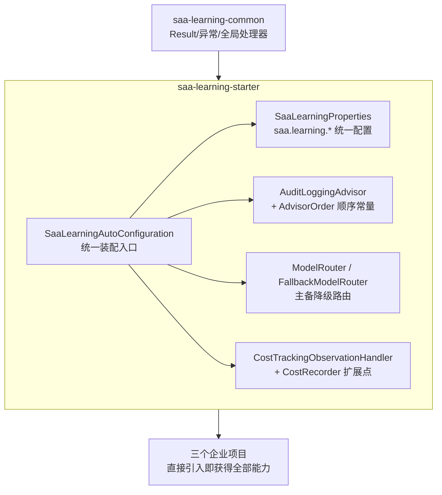

# 第 19 章：BestPractice 统一企业实践

## 学习目标

- 把第 01~18 章反复出现的最佳实践收敛为一个可复用的内部 Starter（本章正式落地 `starter` 模块）；
- 理解统一 Advisor、统一异常、统一配置、统一路由如何通过一个 Starter 一次性下发给所有下游工程；
- 掌握基于 Testcontainers 的集成测试写法；
- 建立统一的 CI/CD、Docker 构建流水线设计。

## 前置知识

- 完成第 01~18 章。本章是对前 18 章知识点的一次系统性"收口"，建议在完成全部前置章节后阅读。

## 核心概念

### 19.1 为什么现在才实现 starter 模块

Phase 1 规划阶段（`starter/README.md`）就已经画出了这个模块的蓝图，但故意等到第 19 章才实现——这是刻意的教学顺序：**在你亲手写过审计 Advisor（06）、多模型路由（04/20）、成本采集 Handler（18）之后，再看"如何把这些能力收敛成一个 Starter"，你会更清楚每个设计决策解决的是什么真实问题**，而不是死记一套模板代码。

### 19.2 starter 模块全景



对应仓库位置：`starter/`（已随本章完整实现，见下方源码导读）。

## API 深入解析

### 19.3 统一配置：SaaLearningProperties

```java
@ConfigurationProperties(prefix = "saa.learning")
public record SaaLearningProperties(
        String primaryModel,
        String fallbackModel,
        boolean auditEnabled,
        CostTracking costTracking) {
    // 紧凑构造器提供默认值兜底（第 03 章模式）
}
```

下游工程的 `application.yml` 只需要：

```yaml
saa:
  learning:
    primary-model: dashScopeChatModel
    fallback-model: deepSeekChatModel
    audit-enabled: true
    cost-tracking:
      enabled: true
      price-per-1k-input-tokens: 0.0008
      price-per-1k-output-tokens: 0.002
```

### 19.4 统一装配：SaaLearningAutoConfiguration

```java
@Configuration(proxyBeanMethods = false)
@EnableConfigurationProperties(SaaLearningProperties.class)
@Import(GlobalExceptionHandler.class)   // 复用 common 模块（第 00 章）
public class SaaLearningAutoConfiguration {

    @Bean
    @ConditionalOnMissingBean
    @ConditionalOnBean(name = {"dashScopeChatModel", "deepSeekChatModel"})
    public ModelRouter modelRouter(SaaLearningProperties properties, ApplicationContext ctx) {
        ChatModel primary = ctx.getBean(properties.primaryModel(), ChatModel.class);
        ChatModel fallback = ctx.getBean(properties.fallbackModel(), ChatModel.class);
        return new FallbackModelRouter(primary, fallback);
    }

    @Bean
    @ConditionalOnMissingBean
    @ConditionalOnProperty(prefix = "saa.learning", name = "audit-enabled", havingValue = "true", matchIfMissing = true)
    public AuditLoggingAdvisor auditLoggingAdvisor() {
        return new AuditLoggingAdvisor();
    }

    // ... CostRecorder / CostTrackingObservationHandler 同理，见完整源码
}
```

三个关键装配原则贯穿全文件（对照第 03 章逐条验证）：

1. **`@ConditionalOnMissingBean`**：任何默认实现都可以被下游工程的自定义 Bean 覆盖；
2. **`@ConditionalOnBean(name = {...})`**：`ModelRouter` 只有在主备模型 Bean 都存在时才装配，避免单模型场景下产生无意义的 Bean；
3. **`@ConditionalOnProperty`**：审计、成本采集都是可关闭的功能开关，默认开启但下游可以按需关闭。

### 19.5 统一 Advisor 顺序：AdvisorOrder

```java
public final class AdvisorOrder {
    public static final int AUDIT = Ordered.HIGHEST_PRECEDENCE + 100;
    public static final int SAFETY = Ordered.HIGHEST_PRECEDENCE + 200;
    public static final int MEMORY = Ordered.HIGHEST_PRECEDENCE + 1000;
    public static final int RETRIEVAL = Ordered.HIGHEST_PRECEDENCE + 2000;
    public static final int LOGGER = 0;
}
```

第 06 章强调"每个自定义 Advisor 都要有明确、不冲突的 order 值"，把这些数字集中到一个常量类，是避免团队协作时"顺序号打架"的最简单有效手段——任何新增 Advisor 只需要在这个类里追加一行常量并写明设计意图，全仓库统一可查。

### 19.6 统一路由：ModelRouter / FallbackModelRouter

```java
public interface ModelRouter {
    ChatModel route();
    void reportFailure(ChatModel model, Throwable cause);
}
```

`FallbackModelRouter` 实现了"连续失败达到阈值 → 切换备用模型 → 冷却期后自动尝试恢复"的最小可用熔断降级语义（第 20 章企业实践会在此基础上讨论更完整的容灾策略）。业务代码只依赖 `ModelRouter` 接口：

```java
@Service
public class DiagnosisService {
    private final ModelRouter modelRouter;

    public String diagnose(String question) {
        ChatModel model = modelRouter.route();
        try {
            return ChatClient.builder(model).build().prompt().user(question).call().content();
        } catch (Exception e) {
            modelRouter.reportFailure(model, e);
            throw e;
        }
    }
}
```

## 可运行 Demo：验证 Starter 装配

Starter 本身没有独立的"运行"形态——它的价值通过被应用引入来验证。以下是引入方式与验证步骤。

### 引入依赖

```xml
<dependency>
    <groupId>com.flywhl.saa</groupId>
    <artifactId>saa-learning-starter</artifactId>
</dependency>
```

### 验证装配报告

```bash
mvn spring-boot:run -Dspring-boot.run.arguments="--debug" 2>&1 | grep -A 5 "SaaLearningAutoConfiguration"
```

### 预期输出

```text
SaaLearningAutoConfiguration matched:
   - @ConditionalOnBean (names: dashScopeChatModel,deepSeekChatModel; SearchStrategy: all) found beans 'dashScopeChatModel', 'deepSeekChatModel' (OnBeanCondition)
```

### 单元测试验证核心逻辑

`starter` 模块自带的 `FallbackModelRouterTest`（`starter/src/test/java/.../routing/FallbackModelRouterTest.java`）覆盖了四个关键场景：默认路由主模型、连续失败触发降级、冷却期后自动恢复、备用模型失败不级联。运行：

```bash
mvn -pl starter test
```

## 关键源码解读：Testcontainers 集成测试模式

单元测试（如 `FallbackModelRouterTest`）验证纯逻辑，但涉及真实中间件（Redis/PostgreSQL/Milvus）的代码需要集成测试。本仓库统一采用 Testcontainers（第 00 章总体架构规范已提及，版本由父 POM `spring-boot-dependencies` BOM 统一管理）：

```java
@SpringBootTest
@Testcontainers
class JdbcMemoryIntegrationTest {

    @Container
    static PostgreSQLContainer<?> postgres = new PostgreSQLContainer<>("pgvector/pgvector:pg16");

    @DynamicPropertySource
    static void registerProperties(DynamicPropertyRegistry registry) {
        registry.add("spring.datasource.url", postgres::getJdbcUrl);
        registry.add("spring.datasource.username", postgres::getUsername);
        registry.add("spring.datasource.password", postgres::getPassword);
    }

    @Autowired
    private ChatMemory chatMemory;

    @Test
    void shouldPersistAndRetrieveMessages() {
        chatMemory.add("conv-1", new UserMessage("你好"));
        List<Message> messages = chatMemory.get("conv-1");
        assertThat(messages).hasSize(1);
    }
}
```

**测试真实容器而非 Mock**，是本仓库对"生产可用"承诺的一部分——第 00 章明确要求"所有源码均可以直接运行"，集成测试用真实中间件跑，比 Mock 更能捕获真实的 SQL 方言、序列化格式等细节问题。涉及真实模型调用的测试则按第 00 章规范用 `@EnabledIfEnvironmentVariable` 跳过无 Key 环境：

```java
@Test
@EnabledIfEnvironmentVariable(named = "AI_DASHSCOPE_API_KEY", matches = ".+")
void shouldCallRealModel() {
    // ...
}
```

## 企业实践建议

- **Starter 的版本演进要向后兼容**：`saa.learning.*` 配置项一旦发布给下游项目使用，废弃时要走标准的 `@Deprecated` + 过渡期流程，不能直接删除，否则会导致下游项目升级时批量报错；
- **不要把业务逻辑放进 Starter**：Starter 应该只包含横切关注点的基础设施（本章的审计/路由/成本采集），任何与具体业务领域相关的逻辑都不应该出现在这里，这是"企业中台"与"业务应用"边界感的直接体现；
- **CI 流水线要覆盖 Starter 的独立可测试性**：`mvn -pl starter test` 应该是 CI 中独立的一步，不依赖上层应用的存在即可验证 Starter 自身正确性。

## 性能优化建议

- 自动装配的条件判断（尤其是 `@ConditionalOnBean` 这类需要遍历容器已注册 Bean 的检查）在超大型应用中有微小的启动期开销，属于可接受范围，不需要过度优化；
- `FallbackModelRouter` 用 `AtomicReference` + 不可变 `State` record 实现无锁并发控制，避免了显式加锁带来的性能损耗与死锁风险，这是高并发场景状态管理的推荐模式。

## 安全建议

- Starter 中的默认实现（如 `LoggingCostRecorder`）仅做日志记录，不涉及外部网络调用或敏感数据持久化，风险面很小；下游项目如果替换为写数据库的 `CostRecorder` 实现，需要自行确保该实现的 SQL 注入防护等安全措施（第 07 章数据库工具章节的原则同样适用）；
- `GlobalExceptionHandler` 统一异常处理避免了不同工程各自实现异常处理时可能出现的"堆栈信息泄露给客户端"这类常见安全疏漏。

## 常见踩坑

| 现象 | 原因 | 解决 |
|---|---|---|
| 引入 Starter 后 `ModelRouter` 未装配 | 应用中只有一个模型 Bean（单模型场景），`@ConditionalOnBean` 条件不满足 | 这是预期行为——单模型场景不需要路由，直接注入 `ChatModel`/`ChatClient` 即可 |
| 自定义 `CostRecorder` 没有生效，仍在用默认日志实现 | 自定义 Bean 的类型或位置不满足 Spring 组件扫描 | 检查 `@ConditionalOnMissingBean` 的类型匹配（`CostRecorder` 接口），确保自定义 Bean 被正确注册 |
| Testcontainers 测试在 CI 环境报错找不到 Docker | CI Runner 未启用 Docker-in-Docker 或未挂载 Docker Socket | 参考所用 CI 平台的 Testcontainers 集成文档配置对应权限 |

## 版本差异

本章内容为本仓库自建能力，不涉及 SAA/Spring AI 官方版本差异；`ModelRouter` 的设计参考了第 04 章多模型 Demo 与第 20 章企业实践的路由需求，是本教程原创的工程实践总结，而非官方 API 的直接封装。

## 为什么这样设计

把"统一 Advisor + 统一异常 + 统一路由 + 统一成本采集"收敛进一个 Starter，而不是让三个企业项目（第 4~6 部分）各自实现一遍，背后是一个朴素但容易被忽视的工程原则：**重复三次的代码就应该抽象**。更深层的价值在于一致性——如果三个项目各自实现审计日志，字段格式、脱敏规则大概率会逐渐产生细微差异，几个月后运维人员在排查跨项目问题时会发现"同样是审计日志，格式却不一样"这种令人沮丧的不一致。Starter 模式把这种一致性作为架构层面的强制约束，而不是依赖团队自觉遵守编码规范文档——这正是本教程从第 01 章就反复强调的"约定优于配置"哲学在企业工程实践层面的最终落地。

## FAQ

**Q：为什么 `ModelRouter` 不直接做成 Advisor？**
可以两种方式结合：`ModelRouter` 是"决定用哪个模型"的策略对象，可以在构造 `ChatClient` 时使用（如本章 `DiagnosisService` 示例），也可以封装成一个 Advisor 在请求进入时动态选择底层 `ChatModel`（更接近第 06 章 Advisor 拦截请求的模式）。两种封装方式服务于不同的接入粒度，本章选择更简单直接的策略对象模式作为教学起点。

**Q：三个企业项目会直接依赖这个 `starter` 模块吗？**
会。第 4~6 部分交付的三个企业项目 POM 都会引入 `saa-learning-starter`，直接获得统一的异常处理、审计 Advisor、模型路由、成本采集能力，不需要重复实现——这是本模块存在的核心价值证明。

**Q：Starter 里的默认实现（如价格 0.0008 元/千 token）是真实价格吗？**
不是，是教学示例值。真实价格应参照模型厂商官方计费页面，且第 18 章已建议实际生产环境应把价格配置迁移到 Nacos 动态配置（第 05 章同源思路），而不是硬编码在 `application.yml` 里。

## 本章总结

本章把前 18 章沉淀的最佳实践，收敛进了一个真正可复用、可测试、可独立演进的内部 Starter：统一配置（`SaaLearningProperties`）、统一装配（`SaaLearningAutoConfiguration`，严格遵循第 03 章条件装配三原则）、统一 Advisor 顺序治理（`AdvisorOrder`）、统一模型路由降级（`ModelRouter`/`FallbackModelRouter`）、统一成本采集（`CostTrackingObservationHandler`/`CostRecorder`）。配合 Testcontainers 集成测试模式，这个 Starter 已经具备了支撑三个企业项目的生产级基础设施能力。

## 延伸阅读

- Spring Boot 官方 Starter 开发指南（第 03 章已引用，本章是其实践范例）：<https://docs.spring.io/spring-boot/reference/features/developing-auto-configuration.html>
- Testcontainers 官方文档：<https://testcontainers.com/>

## 下一章预告

第 20 章展开企业实践的最后一块拼图：多模型路由/降级/容灾的完整策略（在本章 `FallbackModelRouter` 基础上扩展）、Prompt 治理体系、成本优化方法论，以及涵盖 Prompt 注入防护、工具安全、RAG 安全、数据脱敏的完整安全体系。

## 思考题

1. 如果要给 `FallbackModelRouter` 增加"基于成本而非仅基于故障"的路由策略（如"白天用贵但快的模型，夜间批处理用便宜模型"），你会如何扩展 `ModelRouter` 接口而不破坏现有实现？
2. 本章的 `AuditLoggingAdvisor` 通过 `@ConditionalOnProperty` 支持关闭，但审计日志在很多合规场景下是强制要求、不允许关闭的，你会如何在 Starter 层面设计"部分配置项不允许下游随意覆盖"的约束机制？
3. 结合你正在做的多 Agent 资产管理平台经验（Java/Spring 控制面 + Python 执行面），如果要让本章的 Starter 理念延伸到跨语言场景（Python 侧也需要类似的统一路由/成本采集），你会如何设计两边共享的"契约"（如统一的配置命名、统一的可观测指标命名）？
