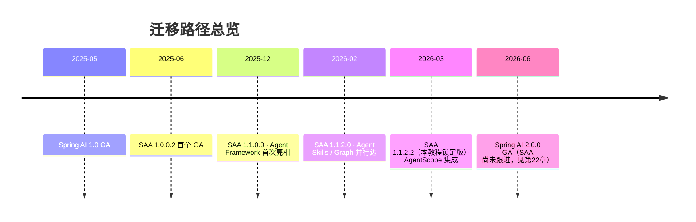
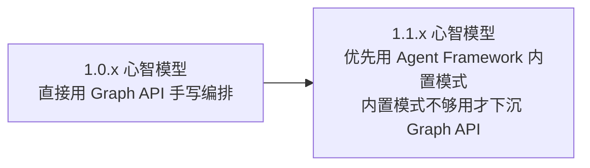
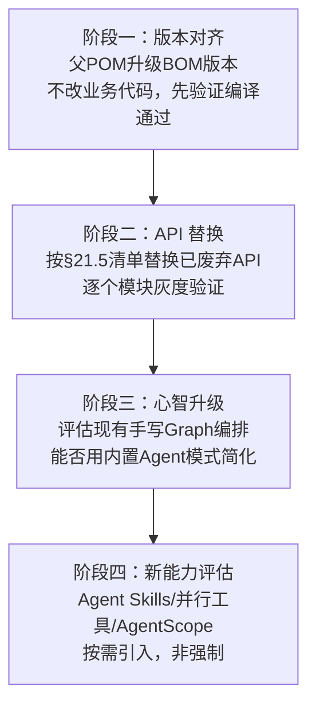

# 第 21 章：Spring AI Alibaba 最新版本升级指南

> 本章是独立成篇的升级手册，汇总第 01~20 章分散标注的"版本差异"小节，供已有 1.0.x 时代代码（提示词原文"几个月前学习过的早期 Demo"）的团队按图索骥完成向 1.1.2.2 的迁移。可以脱离其余章节单独查阅。

## 学习目标

- 掌握从 SAA 1.0.x 到 1.1.2.2 的完整变更清单：新增模块、新增 API、已废弃 API 与替代方案；
- 理解官方推荐实践的演进方向（从"手写 Graph"到"内置 Agent 模式优先"）；
- 掌握一套可执行的迁移步骤与验证方法；
- 了解 1.1.2.0 → 1.1.2.2 的补丁级注意事项。

## 前置知识

- 不要求按顺序读完第 01~20 章才能阅读本章——本章设计为可独立查阅的迁移手册；
- 但每条变更都标注了详解该主题的正课章节，建议迁移时按需跳转回对应章节复习细节，而不是只看本章的摘要级描述。

## 核心概念：升级是"心智模型"的迁移，不只是"API"的迁移

本章的核心概念只有一条，但很重要：**版本升级最容易被低估的部分不是"改了哪些方法签名"，而是"官方推荐的解决问题的思路变了"**。第 21.4 节详细展开的"从手写 Graph 到内置 Agent 模式优先"就是典型例子——即便你的 1.0.x 代码能编译通过、能正常运行，如果不理解这个思路转变，你会持续用"过时但能跑"的方式解决新问题，逐渐积累技术债。本章后续内容按"是什么变了 → 为什么变 → 怎么改"的顺序组织。

## 21.1 版本演进总览



## 21.2 新增模块清单（1.0.x → 1.1.2.2）

| 模块 | 定位 | 首次引入 | 对应章节 |
|---|---|---|---|
| `spring-ai-alibaba-agent-framework` | Agent 开发框架，ReactAgent + 内置多智能体模式 | 1.1.0.0 | 13、15 |
| `spring-ai-alibaba-admin` | 可视化开发/可观测/评测/MCP 管理平台 | 1.1.x 迭代中持续增强 | 02（选读） |
| `spring-ai-alibaba-sandbox` | 工具安全隔离执行环境 | 1.1.x | 07、02 |
| `spring-boot-starters`（Nacos 系：a2a-nacos、config-nacos、nacos-mcp-server/client、nacos-prompt） | 企业云原生集成 Starter 家族 | 1.1.x 逐步完善 | 05、12、15、20 |
| `spring-ai-alibaba-starter-agentscope` | AgentScope 模型驱动范式集成 | 1.1.2.2 | 13（选读） |

## 21.3 新增 API 清单

| API | 能力 | 引入版本 | 对应章节 |
|---|---|---|---|
| `ReactAgent.builder()` | 声明式构建智能体 | 1.1.0.0 | 13 |
| Context Engineering Hooks（HITL、上下文压缩、调用限制） | Agent 可靠性工程 | 1.1.0.0 起持续增强 | 13 |
| `SequentialAgent`/`ParallelAgent`/`LlmRoutingAgent`/`LoopAgent` | 内置多智能体模式 | 1.1.0.0 | 15 |
| `SupervisorAgent`/`AgentTool`/Handoffs | 中枢协调与智能体即工具 | 1.1.2.x 官方样例集固化命名 | 15 |
| Graph 并行条件边 + `AllOf`/`AnyOf` 聚合 | 复杂编排 | 1.1.2.0 | 14 |
| Agent Skills（`read_skill` 渐进式披露） | 大规模工具集治理 | 1.1.2.0 | 13 |
| `A2aRemoteAgent` + Nacos 集成 | 跨进程智能体协作 | 1.1.x | 15 |
| `ConfigurablePromptTemplateFactory`（Nacos 动态 Prompt） | Prompt 热更新 | 1.1.x | 05 |
| 异步/并行工具执行、`ToolContextHelper` | 工具调用性能与可用性提升 | 1.1.2.0/1.1.2.2 | 07 |

## 21.4 官方推荐实践的演进方向

这是比"API 清单"更重要的心智升级，第 01/02 章已埋下伏笔，这里做完整总结：



对应到具体决策：

1. **要不要写循环控制逻辑？** 1.0.x 时代常见做法是自己实现"判断是否需要继续调用工具"的状态机；1.1.x 起 `ReactAgent` 把这个循环封装掉了（第 13 章），**不要重新发明这个轮子**；
2. **多个智能体怎么协作？** 1.0.x 时代需要手工搭建 Graph 拓扑；1.1.x 起先评估 `SequentialAgent`/`ParallelAgent`/`LlmRoutingAgent`/`LoopAgent`/`SupervisorAgent` 五种内置模式（第 15 章）能否覆盖需求，只有真正复杂到内置模式无法表达时才下沉到 Graph API（第 14 章）；
3. **DashScope 依赖怎么引入？** 1.0.x 时代版本经常与主线不同步；1.1.x 起需要同时导入 `spring-ai-alibaba-bom` 与 `spring-ai-alibaba-extensions-bom`（版本调研报告 §2.1.1 已详述，本仓库父 POM 已按此配置）。

## 21.5 已废弃 API 与替代方案

| 已废弃/过期写法 | 替代方案 | 原因 | 对应章节 |
|---|---|---|---|
| `PromptChatMemoryAdvisor`（历史消息拼进纯文本 System Prompt） | `MessageChatMemoryAdvisor` + 显式 `ChatMemory`/`conversationId` | 历史消息作为独立结构化消息注入，模型区分度更好 | 06、08 |
| `CallAroundAdvisor`/`StreamAroundAdvisor`/`AdvisedRequest`/`AdvisedResponse`（1.0.x 常见命名） | `CallAdvisor`/`StreamAdvisor`/`ChatClientRequest`/`ChatClientResponse` | 命名规范化，语义不变 | 06 |
| `FunctionCallback`（Spring AI 1.0.0-M6 之前） | `ToolCallback` + `@Tool` 声明式注解 | 与"Tool"这一行业标准术语对齐 | 07 |
| 各厂商 Options 的可变 setter（部分历史实现） | 不可变 Builder 模式（`XxxOptions.builder()...build()`） | 与 Spring AI 2.0 移除可变 setter 的趋势提前对齐 | 03、04 |
| 直接手写 Graph 实现简单 ReAct 循环 | `ReactAgent.builder()` | 官方框架级封装已足够覆盖绝大多数场景 | 13、14 |
| Admin Flow UI 依赖 `@agentscope-ai/flow` | `@spark-ai/flow` | 1.1.2.0 起包名调整 | 02 |

## 21.6 SAA 内部补丁级差异：1.1.2.0 → 1.1.2.2

| 项 | 1.1.2.0 | 1.1.2.2 |
|---|---|---|
| 版本状态 | 曾是"当前推荐版"（现已过期） | **当前最新稳定版**，1.1.2.1 因缺陷被官方撤回推荐后的修复版 |
| AgentScope | 无 | 新增 `spring-ai-alibaba-starter-agentscope` 集成 |
| 多智能体官方样例 | 基础形态 | 新增 Subagent/Supervisor/Skills/Routing/Handoffs/Workflow 完整官方模式样例集（第 15 章命名对齐这批样例） |
| 多模态/语音 | 无 | 新增 Voice Agent（ASR+ReactAgent+TTS）、Multimodal Agent（超出本教程必修范围，见第 02 章选读提示） |

## 21.7 性能变化

官方 1.1.2.0 Release Notes 中提到的一批修复项本质上是性能与稳定性改进（序列化、MergeStrategy、`DashScopeApi` 默认 HTTP Client 修复 Connection Reset 问题等），升级到 1.1.2.2 的团队应该关注：

- **HTTP 连接复用问题已修复**：1.1.2.0 之前部分场景存在 Connection Reset 问题，如果你的 1.0.x/早期 1.1.x 应用有过"偶发连接重置"的诡异报错，升级后应重点验证是否已解决；
- **并行工具执行**（1.1.2.0 起）可以降低多工具调用场景的端到端延迟，评估现有 Agent 是否可以受益于此特性（需要检查工具实现是否线程安全）。

## 21.8 企业迁移建议：分阶段迁移路径



**关键原则**：阶段一、二是**必须完成**的兼容性迁移，阶段三、四是**按投入产出比评估**的优化性迁移——不要为了"用上新特性"而不计成本地重写已经稳定运行的代码，第 13 章"为什么这样设计"提到的"够用就用，不够用再升级"原则在版本迁移场景同样适用。

## 21.9 迁移验证清单

- [ ] 父 POM 同时导入 `spring-ai-alibaba-bom` 与 `spring-ai-alibaba-extensions-bom`，版本对齐 1.1.2.2（第 03 章）
- [ ] 全局搜索 `PromptChatMemoryAdvisor`，替换为 `MessageChatMemoryAdvisor` + 显式 `conversationId`（第 08 章）
- [ ] 全局搜索 `CallAroundAdvisor`/`AdvisedRequest`，替换为 `CallAdvisor`/`ChatClientRequest`（第 06 章）
- [ ] 全局搜索 `FunctionCallback`，替换为 `@Tool`/`ToolCallback`（第 07 章）
- [ ] 检查所有 `XxxOptions` 构造是否已用 Builder 模式（第 04 章）
- [ ] 用 `--debug` 启动参数（第 02、03 章）逐个验证关键自动装配类是否按预期匹配
- [ ] 跑通全部集成测试（第 19 章 Testcontainers 模式），确认中间件交互未受影响
- [ ] 评估现有手写 Graph 编排是否可用第 15 章内置多智能体模式简化（非强制，按 ROI 评估）

## 21.10 常见迁移踩坑

| 现象 | 原因 | 解决 |
|---|---|---|
| 升级后 Memory 相关 Advisor 报废弃警告 | 仍在使用 `PromptChatMemoryAdvisor` | 参照第 08 章迁移到 `MessageChatMemoryAdvisor` |
| 自定义 Advisor 编译报错找不到 `CallAroundAdvisor` | 该接口在 1.1.x 已重命名 | 参照第 06 章改用 `CallAdvisor` |
| 升级后依赖树出现两个不同版本的 `spring-ai-alibaba-core` | 父 POM 未统一管理版本，某个子模块硬编码了旧版本号 | 检查全仓库是否有遗漏的版本号硬编码，统一交给父 POM BOM 管理（第 03 章 SSOT 原则） |
| Admin Flow UI 升级后前端报错 | `@agentscope-ai/flow` 包名未同步更新为 `@spark-ai/flow` | 按 §21.5 表格更新前端依赖 |

## 可运行 Demo：BOM 对齐自检脚本

升级手册最容易出问题的一步，是"以为 BOM 版本已经对齐，实际依赖树里还残留旧版本"。本节提供一个可直接运行的自检脚本，帮你在迁移的"阶段一"（版本对齐）就发现问题，而不是等到运行期才踩坑。

对应仓库位置：`scripts/version-audit.sh`。

```bash
#!/usr/bin/env bash
# version-audit.sh —— 校验 SAA / Spring AI 版本是否在整个依赖树中唯一且对齐
set -euo pipefail

echo "== 1. 检查 SAA 是否存在多版本（应只有一个版本号）=="
mvn -q dependency:tree -Dincludes=com.alibaba.cloud.ai 2>/dev/null \
  | grep -oE 'spring-ai-alibaba[^:]*:jar:[0-9.]+' | sort -u

echo "== 2. 检查 Spring AI 主线是否唯一 =="
mvn -q dependency:tree -Dincludes=org.springframework.ai 2>/dev/null \
  | grep -oE 'spring-ai[^:]*:jar:[0-9.]+' | sort -u

echo "== 3. 检查是否误引入 2.0 线（当前 SAA 尚不兼容，见第22章）=="
if mvn -q dependency:tree -Dincludes=org.springframework.ai 2>/dev/null | grep -qE ':jar:2\.'; then
  echo "  [警告] 检测到 Spring AI 2.x，当前 SAA 版本线不兼容，请核对！"
  exit 1
else
  echo "  [OK] 未检测到 2.x，符合预期（本仓库锁定 1.1.2 线）"
fi

echo "== 4. 确认父 POM 同时导入两个 BOM =="
grep -q "spring-ai-alibaba-bom" pom.xml && echo "  [OK] 主 BOM 已导入" || echo "  [缺失] spring-ai-alibaba-bom"
grep -q "spring-ai-alibaba-extensions-bom" pom.xml && echo "  [OK] extensions BOM 已导入" || echo "  [缺失] extensions BOM"
```

### 运行与验证

```bash
chmod +x scripts/version-audit.sh
bash scripts/version-audit.sh
```

### 预期输出

```text
== 1. 检查 SAA 是否存在多版本（应只有一个版本号）==
spring-ai-alibaba-starter-dashscope:jar:1.1.2.2
== 2. 检查 Spring AI 主线是否唯一 ==
spring-ai-client-chat:jar:1.1.2
spring-ai-model:jar:1.1.2
== 3. 检查是否误引入 2.0 线（当前 SAA 尚不兼容，见第22章）==
  [OK] 未检测到 2.x，符合预期（本仓库锁定 1.1.2 线）
== 4. 确认父 POM 同时导入两个 BOM ==
  [OK] 主 BOM 已导入
  [OK] extensions BOM 已导入
```

若第 1 步输出**多个不同的 SAA 版本号**，就说明有子模块硬编码了旧版本（§21.10 踩坑表已提及此问题），需要清理后统一交给父 POM BOM 管理。这个脚本把"迁移验证清单"（§21.9）中最关键的版本一致性检查自动化了，是每次升级后应该第一时间运行的守门脚本。

## 企业实践建议

- **迁移要有"回滚锚点"**：正式升级前用 Git 打 tag（如 `pre-saa-1.1.2.2-migration`），阶段二 API 替换建议每替换一类 API 就提交一次，出问题时能精确回退到最小可用状态，而不是一次性大改后"要么全成功要么全回滚"；
- **迁移工作量评估要区分"机械替换"与"心智升级"**：§21.5 的已废弃 API 替换（如 `CallAroundAdvisor` → `CallAdvisor`）大多是可以脚本批量处理的机械工作，工作量可预估；而 §21.4 的心智升级（手写 Graph → 内置 Agent 模式）需要重新理解业务、评估收益，工作量弹性大，排期时两者要分开估算；
- **升级窗口选在业务低峰期**，并保留旧版本可回滚的部署包至少一个观察周期——即便测试全过，生产环境的真实流量仍可能暴露测试覆盖不到的边界问题。

## 性能优化建议

- 升级到 1.1.2.2 后应重点验证 §21.7 提到的 HTTP 连接复用修复是否解决了历史上的"偶发 Connection Reset"问题——如果历史上有过此类诡异报错，升级后应做一轮压测确认；
- 评估是否启用 1.1.2.0 起支持的并行工具执行来降低多工具 Agent 的端到端延迟，但启用前务必确认所有工具实现是线程安全的（并行执行会放大非线程安全代码的隐患），这本身也是一次有价值的代码健康度审查。

## 安全建议

- 版本升级是审查安全补丁的天然时机：升级时应同步检查 Spring AI / SAA 在新版本中修复的安全问题（查阅对应版本 Release Notes 的 security 相关条目），确认历史版本是否受影响；
- 迁移过程中临时开启的调试选项（如第 18 章的 Prompt/Completion 日志）必须在迁移完成后关闭，避免"为了排查迁移问题而临时打开、迁移完成却忘记关闭"导致的敏感数据泄露。

## 常见踩坑

除 §21.10 的迁移专项踩坑表外，还有几个跨版本升级的通用陷阱值得单列：

| 现象 | 原因 | 解决 |
|---|---|---|
| 本地编译通过，CI 却失败 | 本地 Maven 仓库缓存了旧版本 jar，CI 是干净环境暴露了真实依赖问题 | 本地先 `mvn dependency:purge-local-repository` 清缓存后重新验证，不要只信本地"能跑" |
| 升级后启动变慢明显 | 新增模块（Agent Framework 等）引入了更多自动装配类的条件判断 | 属正常现象，若确实影响开发体验可用 `spring.autoconfigure.exclude` 排除确定不用的自动装配 |
| 团队部分成员仍在用旧写法提交代码 | 缺少强制性的 lint/静态检查约束 | 把 §21.5 的已废弃 API 加入代码扫描规则（如 ArchUnit 测试或自定义 lint），让旧写法在 CI 阶段就被拦截 |

## FAQ

**Q：可以跳过中间版本直接从 1.0.x 升到 1.1.2.2 吗？**
可以。SAA 的补丁版本升级不要求逐版本递进，直接对齐到 1.1.2.2 即可，本章的迁移清单就是面向"跨多个版本一步到位"设计的。真正需要关注的不是"跳过了几个版本"，而是 §21.5 的已废弃 API 是否都替换到位。

**Q：迁移到 1.1.2.2 之后，未来 SAA 出对齐 Spring AI 2.0 的版本时，是不是又要大改一次？**
本教程的代码风格已经为此做了防御性准备（第 22 章 §22.3 详述），未来那次迁移的成本主要是机械性的包名/坐标调整。换句话说，把代码迁移到本章要求的 1.1.2.2 规范写法，本身就是为下一次迁移降本。

**Q：如果某个已废弃 API 暂时没有直接替代，怎么办？**
优先查阅官方 Release Notes / Upgrade Notes 确认是否有官方推荐的迁移路径；若确实处于"旧的已废弃、新的尚未提供"的空档期（罕见），可以暂时保留旧写法但用 `@SuppressWarnings("deprecation")` 显式标注并记录 TODO，等官方替代方案就绪后再处理，避免为了"消除警告"而引入更复杂的临时方案。

## 本章总结

本章把全书 20 章分散标注的版本差异，收束成了一份可独立使用的迁移手册：新增模块与 API 清单让你了解"多了什么"，已废弃 API 清单让你了解"什么需要替换"，官方推荐实践的演进方向让你理解"心智模型需要如何升级"，分阶段迁移路径、自检脚本与验证清单则提供了一条可执行的落地路径。对于已有 1.0.x 时代代码的团队，这应该是完成迁移的第一份参考文档。

## 延伸阅读

- SAA GitHub Releases（逐版本变更日志的第一手来源）：<https://github.com/alibaba/spring-ai-alibaba/releases>
- 本仓库版本调研报告：`docs/00-overview/02-版本调研报告.md`

## 下一章预告

第 22 章讨论一个更前沿的话题：Spring AI 2.0 已于 2026-06-12 正式 GA，但 SAA 尚未发布对齐版本——这对本教程读者意味着什么？我们会给出清晰的现状分析、风险评估与前瞻性代码规避建议。

## 思考题

1. 如果团队的存量代码大量使用了手写 Graph 编排（1.0.x 时代的主流做法），你会如何评估"迁移到内置 Agent 模式"的投入产出比？哪些信号提示"值得迁移"，哪些信号提示"维持现状更明智"？
2. 本章验证清单是静态的文档清单，如果要把它自动化（如写成一个代码扫描脚本），你会优先自动化哪几项检查？
3. 结合你在 AgentScope Java 2.0 实践指南、deepagents v2 等项目中积累的"框架版本快速迭代"经验，你觉得团队应该以多长的周期评估一次 SAA 版本升级？评估的触发条件应该是什么（新特性驱动还是安全补丁驱动）？
