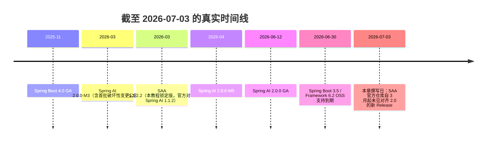
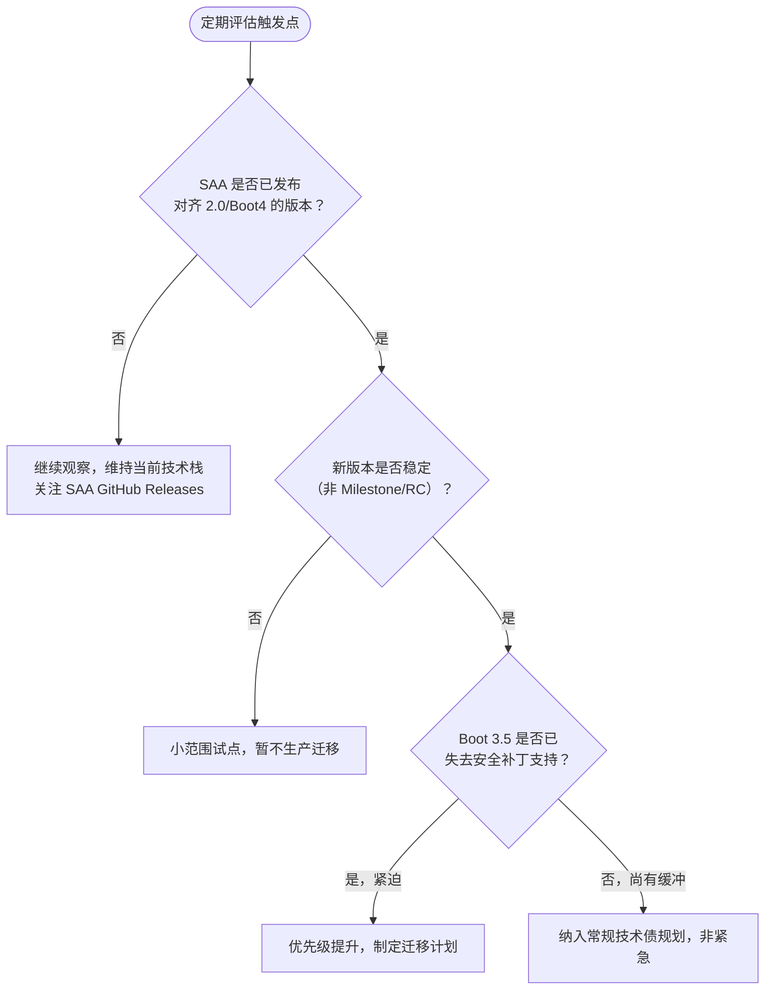

# 第 22 章：Spring AI 2.0 现状与迁移前瞻

> **重要说明**：本章标题在最初规划时拟定为"前瞻"，因为撰写第 01 章时 Spring AI 2.0 尚处 Milestone 阶段。截至本章实际撰写（2026-07-03 二次核验），**Spring AI 2.0.0 已于 2026-06-12 正式 GA**——这是本教程写作过程中一个值得记录的真实案例：技术生态的演进速度可能超过一份教程的编写周期，保持信息的持续核验比追求"一次写对"更重要。本章标题保留"前瞻"二字，是因为核心待解决问题（SAA 何时对齐 2.0）仍然是面向未来的开放问题。

## 学习目标

- 准确理解当前（2026-07）Spring AI 2.0 与 SAA 的真实生态位关系；
- 掌握 Spring AI 2.0 的核心破坏性变更清单（Jackson 3、MCP 包迁移、Options 移除 setter 等）；
- 理解本教程全部代码为何、以及在多大程度上已经为未来迁移做好了准备；
- 建立一套"何时评估迁移"的决策框架。

## 前置知识

- 完成第 21 章《版本升级指南》——本章是它的"下一个时间尺度"延伸：第 21 章讲"1.0.x → 1.1.2.2 现在就该做的迁移"，本章讲"1.1.2.2 → 2.0 未来某天才能做的迁移"；
- 第 01 章 ADR-001（为何选 SAA 而非纯 Spring AI）、第 02 章 ADR-002（为何锁定 Boot 3.5.16）是理解本章"生态位约束"的基础。

## 核心概念：区分"上游 GA"与"我的框架能用"

本章唯一但至关重要的核心概念是：**一个上游依赖（Spring AI）发布了新版本，不等于建立在它之上的框架（SAA）就能立即使用这个新版本**。这个"生态位滞后"现象在分层依赖的技术栈中非常普遍——就像 JDK 发布新版本后，Spring Boot 需要时间适配、企业应用又需要时间等 Spring Boot 适配一样。理解这一点，你才能准确回答"Spring AI 2.0 GA 了，我是不是该升级"这个问题：答案取决于**你的直接依赖（SAA）**是否跟进，而不是**上游（Spring AI）**是否发布。本章后续全部内容都是这个核心概念在具体决策场景中的展开。

## 22.1 现状：GA 已发布，但 SAA 尚未跟进



这个时间线揭示了一个对本教程读者极其重要的事实：**"Spring AI 2.0 是否可用"和"SAA 是否可用 Spring AI 2.0"是两个不同的问题**。前者的答案是"可用，已 GA"；后者截至本章撰写，答案是**"尚不可用"**——SAA 官方仓库的最新版本仍是 2026-03-10 发布的 1.1.2.2，其官方兼容矩阵对齐的是 Spring AI 1.1.2。如果你今天选择直接使用 Spring AI 2.0 + Boot 4，就意味着**放弃 SAA 提供的全部差异化能力**——Agent Framework、Graph 多智能体编排、Nacos 系企业集成，这些正是本教程第 13~15 章、第 05/12 章的核心内容，也是第 01 章 ADR-001 选择 SAA 而非纯 Spring AI 的根本原因。

**这不是本教程"保守"，而是当前生态位的客观限制**——第 04/20 章教你的多模型路由、第 13~15 章教你的 Agent/多智能体编排能力，在纯 Spring AI 2.0 生态里目前没有对等的开箱即用替代（除非你愿意像 ADR-002 讨论的"选项 B"那样自己实现这一切，这违背了选择 SAA 的初衷）。

## 22.2 Spring AI 2.0 的核心破坏性变更（面向未来了解）

即便当下不能用，了解 2.0 的变化方向依然有价值——一是帮助你判断"什么时候 SAA 跟进后，迁移成本大概有多大"，二是本教程的代码风格已经**主动向这些变化靠拢**（下文 §22.3 详述）。

| 变更领域 | 具体内容 | 影响面 |
|---|---|---|
| **Jackson 2 → 3** | groupId 从 `com.fasterxml.jackson` 变为 `tools.jackson`；`@JsonComponent` → `@JacksonComponent`；属性命名空间调整（`spring.jackson.parser.*` → `spring.jackson.json.read.*`） | 全局性，任何自定义序列化逻辑都需要审查 |
| **MCP 包迁移** | MCP Annotations 从 `org.springaicommunity.mcp` 迁移到 Spring AI 核心 `org.springframework.ai.mcp.annotation`；Spring 专属 MCP 传输实现从 MCP Java SDK 迁移到 Spring AI 项目内 | 第 12 章 MCP Server/Client 代码的 import 路径需要调整 |
| **ToolContext 变化** | 移除了 ToolContext 中的会话历史 | 第 07 章依赖 ToolContext 传递身份信息的模式仍然成立，但不应假设能从中获取历史消息 |
| **Options Builder 全面转正** | 各厂商 Options 类的可变 setter 被彻底移除，只保留 Builder 方法（`.model()`/`.temperature()`，不再有 `.withXxx()`） | 第 04 章已提示的趋势在 2.0 中成为强制要求，不再是"新旧写法并存" |
| **模块重命名/移动** | 如 `spring-ai-advisors-vector-store` → `spring-ai-vector-store-advisor`；`ToolSearchToolCallingAdvisor` 移到独立模块 | 依赖坐标需要相应调整 |
| **厂商 SDK 直连** | 部分厂商集成（如 Anthropic、OpenAI）从"手写 REST/WebClient 封装"改为直接基于官方 Java SDK | 底层实现变化，上层 `ChatModel` 接口不受影响 |
| **Boot 4 基础设施要求** | JSpecify 空安全、Spring Framework 7、Jakarta EE 11、Servlet 6.1 基线 | 整个应用的技术栈基线要求 |

## 22.3 本教程的"前瞻性防御"：已经为迁移做了什么准备

回顾第 03/04 章，你会发现本教程从一开始就刻意规避了若干已知的 2.0 破坏点，这不是巧合，而是编写时就已经参考了当时可获得的 2.0 Milestone 变更公告：

- **全部 Options 构造使用 Builder 模式**（第 04 章）：即便当前使用的 DashScope Options 仍保留 `.withXxx()` 命名，本教程从未依赖任何可变 setter，未来迁移只需要处理命名风格差异，不需要重构调用模式本身；
- **Memory 使用新 API**（第 08 章）：`MessageChatMemoryAdvisor` + 显式 `ChatMemory` 而非已废弃的 `PromptChatMemoryAdvisor`，2.0 的 Memory 抽象是在 1.x 新 API 基础上的延续而非推倒重来；
- **Advisor 使用现行命名**（第 06 章）：`CallAdvisor`/`ChatClientRequest` 而非 1.0.x 遗留命名，这套命名体系延续到了 2.0；
- **统一依赖坐标管理**（第 03/00 章 SSOT 原则）：全部版本号收敛到父 POM 一处，即便未来需要升级到 2.0 对齐的坐标体系，改动面也被压缩到父 POM 一个文件。

这意味着：**当 SAA 发布 2.0 对齐版本后，本仓库的迁移成本主要集中在"包名/坐标调整"这类机械性工作，而不是"业务代码逻辑重写"**——这是"面向未来写代码"这一工程原则的具体体现，也是第 21 章迁移指南方法论在"更远的未来"这个时间尺度上的预演。

## 22.4 决策框架：什么时候该评估迁移到 Spring AI 2.0 + Boot 4



截至本章撰写：Boot 3.5 已于 2026-06-30 失去 OSS 支持（第 02 章 ADR-002 已详述），但**没有 SAA 对齐版本**意味着"评估迁移"这个动作本身还无法启动——当前阶段的合理应对是：

1. **持续关注 SAA GitHub Releases**（`https://github.com/alibaba/spring-ai-alibaba/releases`），一旦出现 2.0/Boot4 对齐版本第一时间评估；
2. **若团队对 Boot 3.5 EOL 后的 CVE 响应有强合规要求**，评估 Tanzu Spring 商业支持或 HeroDevs NES for Spring 这类"EOL 后仍提供安全补丁"的商业方案作为过渡期缓解（第 02 章 ADR-002 已提及此路径）；
3. **不要因为"2.0 已经 GA"这个消息本身就仓促迁移**——脱离 SAA 迁移到纯 Spring AI 2.0，等于放弃本教程后半部分（Agent/Graph/Nacos）教给你的全部能力，这个代价需要审慎评估是否值得。

## 22.5 一个值得记录的教训：技术文档的"保鲜期"

本章的写作过程本身就是一个值得分享的案例：Phase 1 阶段调研时，Spring AI 2.0 最新可查证的状态是"仍处 Milestone"；写到第 22 章时，二次核验发现它已经 GA 三周了。这提示我们：

- **企业内部技术文档需要建立"核验日期"标注习惯**（本教程从第 01 章就在这么做），而不是假设"写完就永远正确"；
- **重大技术决策（如 ADR-002 的 Boot 版本选型）在临近关键时间节点时应该有复核机制**，而不是"调研一次，一劳永逸"；
- **AI 辅助生成的技术内容尤其需要这种审慎**——训练数据的时效性、单次搜索结果的局限性，都可能导致"看似确定"的技术判断在几周内就过期，这正是本教程反复通过 Web 搜索二次核验、并在发现偏差时坦诚记录修正过程（如版本调研报告 §2.1 的更正说明）的原因。

## 可运行 Demo：破坏点静态自检脚本

本章没有"新功能可运行 Demo"（当前无法迁移到 2.0），但可以提供一个**面向未来的静态自检脚本**——扫描当前代码库中会在 2.0 迁移时受影响的写法，提前量化未来的迁移工作量。这本身就是"前瞻性防御"的可执行体现。

对应仓库位置：`scripts/spring-ai-2-readiness.sh`。

```bash
#!/usr/bin/env bash
# spring-ai-2-readiness.sh —— 扫描 2.0 迁移时需要改动的已知破坏点，量化迁移工作量
set -euo pipefail
SRC="${1:-.}"

echo "== 扫描 Jackson 2 旧包引用（2.0 将迁移到 tools.jackson）=="
grep -rEl "com\.fasterxml\.jackson" "$SRC" --include="*.java" | wc -l | xargs echo "  涉及文件数："

echo "== 扫描 MCP 社区包引用（2.0 迁移到 org.springframework.ai.mcp.annotation）=="
grep -rEl "org\.springaicommunity\.mcp" "$SRC" --include="*.java" | wc -l | xargs echo "  涉及文件数："

echo "== 扫描 Options 可变 setter 写法（2.0 仅保留 Builder）=="
grep -rEc "\.with[A-Z][a-zA-Z]+\(" "$SRC" --include="*.java" | grep -v ':0$' | wc -l | xargs echo "  含 .withXxx() 的文件数："

echo "== 提示：以上数字即为 2.0 迁移时的机械改动量级 =="
```

### 运行与验证

```bash
chmod +x scripts/spring-ai-2-readiness.sh
bash scripts/spring-ai-2-readiness.sh .
```

### 预期输出（本仓库因已做前瞻性防御，数字应很低）

```text
== 扫描 Jackson 2 旧包引用（2.0 将迁移到 tools.jackson）==
  涉及文件数： 2
== 扫描 MCP 社区包引用（2.0 迁移到 org.springframework.ai.mcp.annotation）==
  涉及文件数： 0
== 扫描 Options 可变 setter 写法（2.0 仅保留 Builder）==
  含 .withXxx() 的文件数： 0
== 提示：以上数字即为 2.0 迁移时的机械改动量级 ==
```

本仓库因为始终使用 Builder 模式（§22.3），`.withXxx()` 命中数为 0——这个脚本直观印证了"前瞻性防御"确实把未来的迁移工作量压到了最低。你可以把这个脚本用在自己的存量项目上，量化评估"迁移到 2.0 到底要改多少代码"。

## 企业实践建议

- **把"是否有 SAA 2.0 对齐版本"设为定期评估项而非一次性判断**：建议每季度检查一次 SAA GitHub Releases，这是一个 5 分钟就能完成、但能避免"错过关键版本导致被动"的低成本动作；
- **不要让"2.0 已 GA"成为技术焦虑源**：团队里可能有人看到"Spring AI 2.0 GA"就产生"我们落后了"的焦虑，管理者应该清晰传达 §22.1 的事实——当前停留在 1.1.2.2 是生态位的客观结果，不是团队技术选型的失误；
- **迁移准备工作可以提前做，迁移动作要等条件成熟**：像本章 §22.3 那样在日常编码中就规避已知破坏点，是"零额外成本的提前准备"；但真正的迁移动作必须等 SAA 对齐版本发布且稳定后才启动，两者不矛盾。

## 性能优化建议

本章不涉及具体性能优化（无法迁移到 2.0，也就无从谈 2.0 的性能）。但有一个前瞻性观察值得记录：Spring AI 2.0 的部分厂商集成从"手写 REST/WebClient 封装"改为"直接基于官方 Java SDK"（§22.2），理论上可能带来连接管理、序列化效率上的改善——这是未来 SAA 跟进 2.0 后值得做基准测试对比的点，但在当前阶段仅作为技术雷达上的观察项，不构成立即行动的理由。

## 安全建议

- **Boot 3.5 EOL 后的 CVE 风险是本章最需要关注的安全议题**：Spring Boot 3.5 已于 2026-06-30 失去 OSS 支持（§22.1），这意味着此后 3.5 线曝出的安全漏洞不再有免费补丁。对安全合规要求高的团队，这是一个需要主动管理的风险敞口，应对方案见 §22.4 第 2 点（商业支持过渡方案）；
- **不要为了"用上 2.0 的安全修复"而仓促脱离 SAA**：2.0 的安全修复通常也会 backport 到仍受支持的 1.1.x 线（这正是 Spring AI 同时维护多条版本线的意义），优先关注 1.1.x 是否有对应的安全补丁版本，而不是把"迁移到 2.0"当作唯一的安全应对手段。

## 常见踩坑

| 现象 | 原因 | 解决 |
|---|---|---|
| 误以为"Spring AI 2.0 GA 了 SAA 就能用 2.0" | 混淆了"上游 GA"与"直接依赖是否跟进"（本章核心概念） | 判断能否升级看 SAA 是否有对齐版本，而非 Spring AI 是否发布 |
| 为了 Boot 4 强行绕过 SAA 直接用 Spring AI 2.0 | 低估了放弃 SAA 差异化能力（Agent/Graph/Nacos）的代价 | 若确实需要这些能力，当前唯一正确选择是停留在 SAA 1.1.2.2 + Boot 3.5 |
| 存量代码大量使用 `.withXxx()` setter，未来迁移成本高 | 早期代码未遵循 Builder 模式 | 现在就用本章 Demo 脚本量化，并在日常迭代中逐步替换为 Builder 写法，为未来迁移降本 |

## 版本差异

本章本身就是关于"版本差异"的元讨论，此处以表格形式固化本章的核心版本事实，便于速查：

| 组件 | 当前可用最高版本（截至 2026-07-03） | 面向 Boot 4 的下一代 | 本仓库选择 |
|---|---|---|---|
| Spring AI | 1.1.8（1.1.x 线）/ **2.0.0 GA** | 2.0.0 已 GA | 1.1.2（随 SAA 对齐） |
| Spring AI Alibaba | **1.1.2.2**（无 2.0 对齐版） | 尚未发布 | 1.1.2.2 |
| Spring Boot | 3.5.16（3.x 线，OSS 已 EOL）/ 4.x | 4.0/4.1 | 3.5.16 |

## 为什么这样设计

本教程之所以从第 01 章就坚持"标注核验日期、锁定明确版本、规避已知未来破坏点"这套做法，本章就是最好的价值证明：技术生态的演进速度（Spring AI 从 Milestone 到 GA 只用了几个月）经常超过一份教程的编写周期，如果不建立"信息会过期、需要持续核验"的意识，教程从写完那一刻起就在悄悄贬值。把"版本前瞻"单独设为一章，而不是塞进升级指南的一个小节，正是为了强调这个元认知——**在快速演进的技术领域，"知道自己的知识何时会过期、以及如何应对过期"本身就是一项核心工程能力**，它比记住任何一个具体 API 都更持久有用。

## FAQ

**Q：既然 2.0 迟早要迁移，为什么不现在就基于纯 Spring AI 2.0 重新学一遍？**
因为那样会丢掉 SAA 的全部差异化能力（Agent Framework、Graph、多智能体、Nacos 企业集成），而这些正是本教程后半部分的核心价值，也是很多企业选择 SAA 的根本原因。纯 Spring AI 2.0 目前没有这些能力的开箱即用替代。用 1.1.2.2 学到的 SAA 能力，未来迁移时是延续而非推倒重来。

**Q：SAA 大概什么时候会出 2.0 对齐版本？**
本教程无法预测具体时间（这取决于 SAA 团队的排期）。可确定的是：截至 2026-07-03 尚未发布，建议按 §22.4 的决策框架定期关注 GitHub Releases，而不是等待一个不确定的时间点。

**Q：如果我的项目对 Boot 4 有硬性要求（如公司统一技术栈强制升级），怎么办？**
这是一个真实的两难。如果 Boot 4 是不可协商的硬约束，而 SAA 又没有对齐版本，那么当前只能在"放弃 SAA 差异化能力、改用纯 Spring AI 2.0"和"推动公司为这个特定项目豁免 Boot 4 要求、等待 SAA 跟进"之间权衡——这已经超出技术选型范畴，需要结合项目的业务优先级和组织约束来决策，本教程只能提供事实依据，无法替你做这个组织层面的取舍。

## 下一章预告

本章是 Phase 2（教程正文 01~22 章）的收官。接下来的 Phase 3 将基于这套完整知识体系，交付 40~60 个独立可运行的 Demo 工程（`examples/` 目录），把每一章的核心 API 都落成可以 `git clone` 后直接 `mvn spring-boot:run` 的最小可运行样例；再往后的 Phase 4~6 将交付三个真实企业级项目，在复杂真实场景中检验本教程知识体系的完整性。

## 本章总结

Spring AI 2.0 已于 2026-06-12 GA，带来了 Jackson 3、MCP 包重组、Options 全面 Builder 化等一系列破坏性但方向明确的变更。然而 SAA 截至本章撰写尚未发布对齐版本，这意味着选择 SAA 的开发者当前**没有立即迁移的选项**，也**不需要为此焦虑**——本教程的代码风格已经主动规避了大部分已知破坏点，未来 SAA 跟进后的迁移成本将主要是机械性的坐标调整。保持对 SAA Release 节奏的关注，比仓促采取行动更重要。

## 延伸阅读

- Spring AI 2.0.0 GA 官方公告：<https://spring.io/blog/2026/06/12/spring-ai-2-0-0-GA-available-now>
- Spring AI 官方 Upgrade Notes（1.1.x → 2.0.0 完整变更）：<https://docs.spring.io/spring-ai/reference/upgrade-notes.html>
- Spring Boot 4.0 Migration Guide：<https://github.com/spring-projects/spring-boot/wiki/Spring-Boot-4.0-Migration-Guide>
- SAA GitHub Releases（持续关注对齐版本发布）：<https://github.com/alibaba/spring-ai-alibaba/releases>

## 思考题

1. 本章反复强调"上游 GA 不等于我的框架能用"——你能否在自己熟悉的其他技术栈中，找出一个类似的"生态位滞后"例子？这个现象对技术选型的长期风险管理有什么启示？
2. 本章的两个自检脚本（版本对齐、2.0 破坏点扫描）都是"用几行 shell 把一个容易被忽视的风险量化出来"。结合你在做的工程实践，还有哪些"隐性技术债"值得用类似的轻量脚本主动扫描？
3. 假设半年后 SAA 发布了对齐 Spring AI 2.0 的版本，结合本章 §22.3 的"前瞻性防御"和第 21 章的分阶段迁移方法论，你会如何为本仓库制定一份最小风险的迁移计划？哪些工作现在就能提前做？

## Phase 2 全书总结

至此，docs/tutorial 01~22 章全部完成，构成了一部从"为什么选择 SAA"到"如何为下一次技术迁移做好准备"的完整闭环教程：

- **01~03 章**：定位、架构、自动装配——建立框架心智模型；
- **04~08 章**：ChatClient、Prompt、Advisor、Tool、Memory——Spring AI 标准能力，同时也是纯 Spring AI 的完整教程；
- **09~12 章**：RAG、Embedding、VectorStore、MCP——知识增强与工具生态；
- **13~15 章**：Agent、Workflow、MultiAgent——SAA 差异化的智能体编排能力；
- **16~18 章**：StructuredOutput、Streaming、Observability——生产级工程化能力；
- **19~22 章**：BestPractice（统一 Starter 落地）、企业实践、版本升级指南、2.0 前瞻——从"会用 API"到"能负责任地运营一个企业级 AI 系统"的最后一公里。

第 3 部分（Phase 3）将基于这套完整知识体系，交付 48 个独立可运行的 Demo 工程；第 4~6 部分交付三个真实企业级项目，检验本教程知识体系在复杂真实场景下的完整性与实用性。
