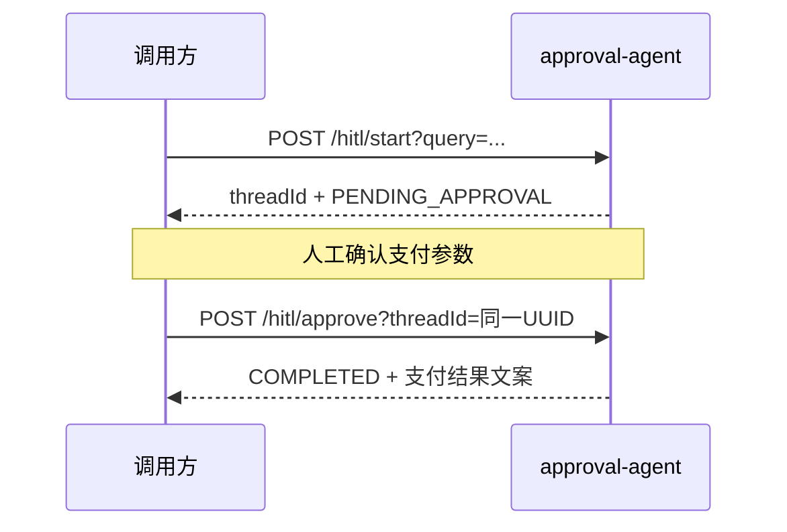

# 37-agent-hitl-demo

`HumanInTheLoopHook.approvalOn("execute_payment")` 高风险支付暂停/恢复（对应教程第 13 章 §13.4）。

## 前置条件
- 中间件：无
- 环境变量：`AI_DASHSCOPE_API_KEY`

## 运行
```bash
mvn spring-boot:run    # 端口 18037
```

## 流程


## 接口
| 方法 | 路径 | 说明 |
|---|---|---|
| POST | `/hitl/start?query=` | 生成 UUID `threadId`，Agent 在 `execute_payment` 前中断 |
| POST | `/hitl/approve?threadId=` | 同一 `threadId` 恢复执行（禁止可预测自增 id） |

## 快速验证
```bash
# 1) 启动会话（会返回 PENDING_APPROVAL 与 threadId）
curl -X POST "http://localhost:18037/hitl/start?query=请向商户A支付99元"

# 2) 将上一步 threadId 填入后审批恢复
curl -X POST "http://localhost:18037/hitl/approve?threadId=<上一步返回的UUID>"
```
预期：
1. start → `status=PENDING_APPROVAL`，`pendingTools` 含 `execute_payment`
2. approve → `status=COMPLETED`，`message` 含支付成功文案

## 源码导读
| 类 | 职责 |
|---|---|
| `HighRiskTools` | `@Tool execute_payment` |
| `HitlAgentConfig` | `HumanInTheLoopHook.approvalOn`（禁止 `interruptBefore`） |
| `HitlController` | start / approve + UUID threadId |

## 运行结果
截图存放于 `images/examples/37-agent-hitl-demo/`（真机运行后补充）。
