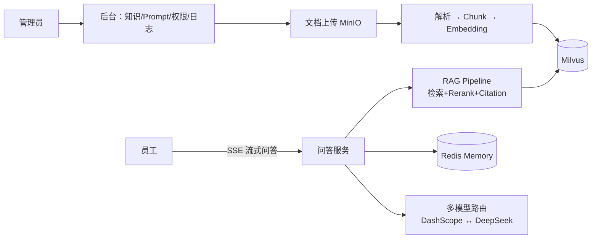
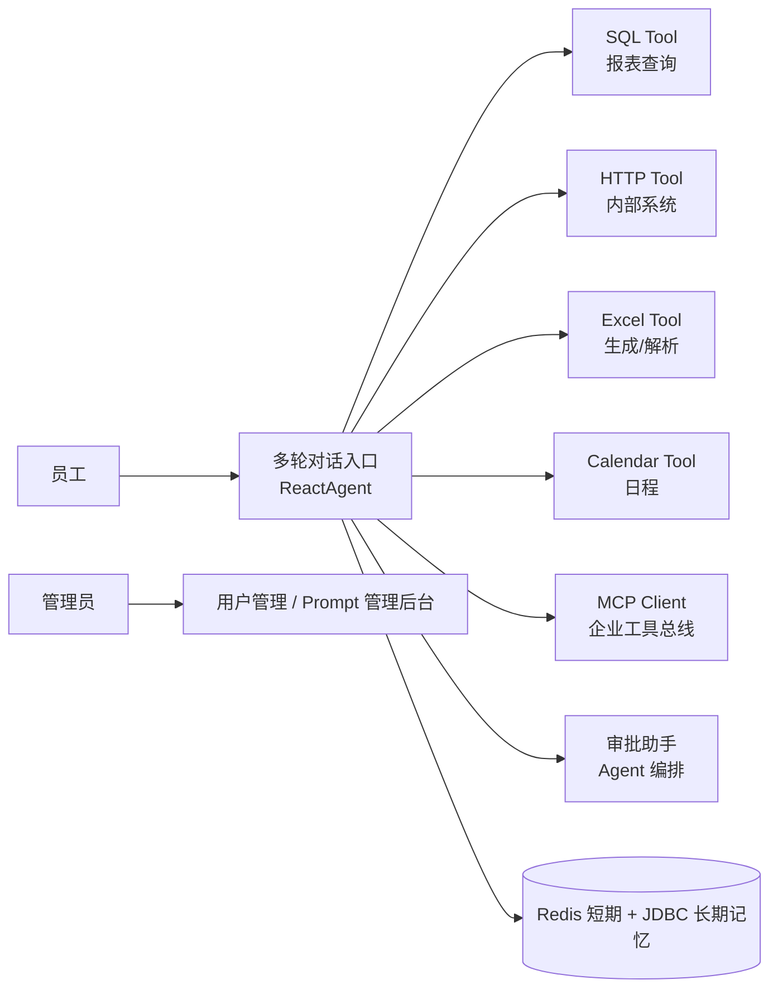
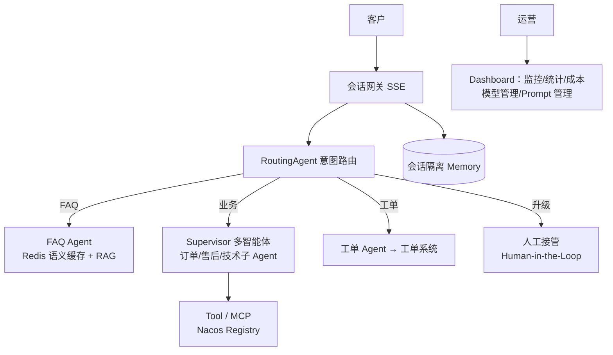

# projects —— 企业级完整项目目录

本目录在 **Phase 4～6** 交付三个真实企业业务项目（非 Todo Demo），**v1.0 已全部落地**（2026-07-18）。  
本 README 是三项目的蓝图 SSOT：业务边界、技术映射、目录骨架在此锁定；后续变更须先修订本文再改代码。

| 项目 | 目录 | 端口 | Phase | 状态 |
|---|---|---|---|---|
| AI 企业知识库问答平台 | [`knowledge-qa-platform`](knowledge-qa-platform) | 19100 | 4 | ✅ |
| 企业 AI Agent 办公助手 | [`office-agent-assistant`](office-agent-assistant) | 19200 | 5 | ✅ |
| 智能客服 Agent 平台 | [`smart-cs-platform`](smart-cs-platform) | 19300 | 6 | ✅ |

每个项目交付标准（统一）：完整源码 + 完整数据库脚本（含演示数据）+ 独立 docker-compose 叠加文件 + 完整文档 + 完整接口（OpenAPI/Knife4j）+ 完整 README + 完整部署说明 + 完整测试（单测 + Testcontainers 集成测试）。

---

## 项目一：AI 企业知识库问答平台（Phase 4）

**业务场景**：企业内部制度、产品手册、技术文档的统一问答入口；管理员维护知识，员工提问获得带引用溯源的答案。

**工程名**：`knowledge-qa-platform`（端口 19100）



| 需求项 | 技术落点 |
|---|---|
| 知识上传/文档解析 | MinIO 对象存储 + Spring AI ETL（DocumentReader/Splitter） |
| Embedding/Chunk | DashScope text-embedding 系列 + TokenTextSplitter |
| RAG + Citation | RetrievalAugmentationAdvisor + 自定义引用溯源 |
| 多模型切换 | ChatModel 路由封装（DashScope 主 / DeepSeek 备） |
| 会话记忆 | Redis ChatMemory |
| Prompt 管理 | 数据库版本化 + Nacos 热更新 |
| 权限/日志/监控 | Spring Security + 审计日志 + Micrometer |
| 管理后台 | REST API 完整实现 + Knife4j |
| Streaming / Tool Calling | SSE 问答流 + 管理类工具 |

数据库：PostgreSQL（业务）+ Milvus（向量）+ Redis（记忆/缓存）。

---

## 项目二：企业 AI Agent 办公助手（Phase 5）

**业务场景**：面向员工的智能办公入口——会议纪要总结、日报生成、邮件起草、数据查询、日程与审批协助。

**工程名**：`office-agent-assistant`(端口 19200)



| 需求项 | 技术落点 |
|---|---|
| 会议总结/日报/邮件生成 | Prompt 模板族 + 结构化输出（Record/JSON Schema） |
| SQL/HTTP/Excel/Calendar Tool | @Tool 工具族 + 权限校验 + SQL 防注入 |
| MCP | 企业工具以 MCP Server 暴露，助手作为 MCP Client 消费 |
| 审批助手 | Agent Framework SequentialAgent/RoutingAgent 编排 |
| 记忆 | Redis（会话）+ JDBC（用户长期偏好） |
| 用户/后台 | 用户管理、Prompt 管理完整 CRUD |

数据库：MySQL（业务，贴近国内企业现状）+ pgvector（轻量知识检索）+ Redis。

---

## 项目三：智能客服 Agent 平台（Phase 6）

**业务场景**：多渠道客服中台——FAQ 秒答、复杂问题多智能体协作、工单创建流转、人工接管、运营看板。

**工程名**：`smart-cs-platform`（端口 19300）



| 需求项 | 技术落点 |
|---|---|
| 多 Agent + Routing | RoutingAgent + Supervisor + Handoffs（并行子智能体） |
| FAQ / 知识库 / RAG | Milvus + Redis 语义缓存 + ES 全文混合检索 |
| 工单 / 人工接管 | 工单域模型 + Graph interrupt（HITL）+ 接管状态机 |
| 监控 / 统计 / 成本 | Micrometer + Prometheus + Grafana + Token 成本统计表 |
| 模型管理 / Prompt 管理 | 后台完整 CRUD + Nacos 热更新 + 多模型配置化路由 |
| 完整后台 / API / 部署 | 管理端 REST 全集 + Knife4j + compose 一键部署 |

数据库：PostgreSQL + Milvus + Redis + ES；配置与注册：Nacos。

---

## 三项目共用骨架（维护时遵循）

```
projects/<project-name>/
├── pom.xml                  # parent 指向仓库父 POM
├── README.md                # 业务说明 / 部署 / 演示账号 / 接口总览
├── docker-compose.override.yml  # 叠加 docker/docker-compose.yml 的项目专属服务
├── db/                      # schema.sql + data.sql（演示数据）
├── http/                    # 全接口 .http 文件 + Postman Collection
└── src/main/java/com/flywhl/saa/<project>/
    ├── controller / service / config
    ├── model（dto·vo·entity）/ mapper
    ├── agent / tool / rag / prompt
    └── admin（后台域）
```
