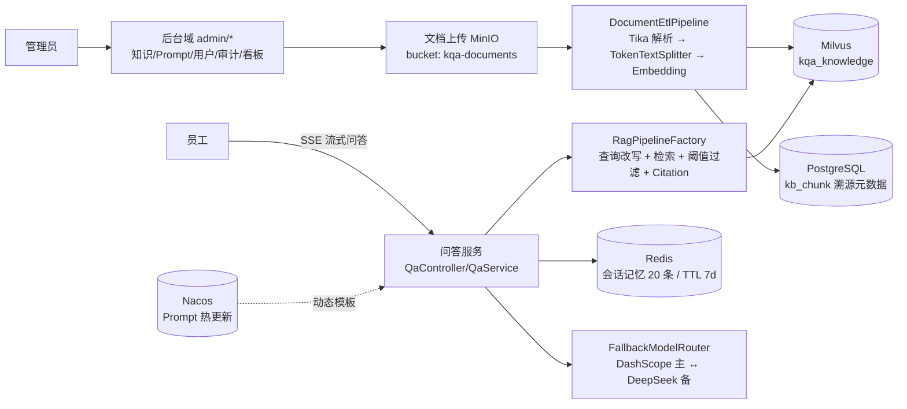

# 项目一 · AI 企业知识库问答平台（knowledge-qa-platform）

> **Phase 4 企业项目** · 端口 **19100** · 蓝图 SSOT：[`projects/README.md`](../README.md)「项目一」
>
> **当前状态**：✅ 工程骨架已交付（pom / 配置 / DDL+演示数据 / compose 叠加 / 全接口契约 / Java 占位）；Java 实现由 Phase 4 后续迭代任务交付，占位类不参与 Bean 装配。

---

## 1. 业务场景

企业内部**制度、产品手册、技术文档**的统一问答入口：

- **员工**：SSE 流式提问，获得**带引用溯源（Citation）**的答案，支持多轮会话与答案反馈；
- **管理员**：后台维护知识（上传/解析/重建索引）、Prompt 版本化管理（Nacos 热更新）、用户权限、审计日志与运营看板。



## 2. 技术栈与落点

| 需求项 | 技术落点 | 代码位置 |
|---|---|---|
| 知识上传/文档解析 | MinIO + Spring AI ETL（Tika DocumentReader / TokenTextSplitter） | `rag/DocumentEtlPipeline` |
| Embedding/向量库 | DashScope `text-embedding-v3`（1024 维）+ Milvus | `config/VectorStoreConfig` |
| RAG + Citation | RetrievalAugmentationAdvisor + 自定义引用溯源后处理 | `rag/RagPipelineFactory`、`rag/CitationPostProcessor` |
| 多模型切换 | starter `FallbackModelRouter`（DashScope 主 / DeepSeek 备） | `config/AiClientConfig` |
| 会话记忆 | Redis + `MessageChatMemoryAdvisor`（显式 conversationId） | `config/ChatMemoryConfig` |
| Prompt 管理 | PostgreSQL 版本化（DRAFT→PUBLISHED）+ Nacos 热更新 | `prompt/*`、`admin/PromptAdminController` |
| 权限/审计 | Spring Security（JWT 资源服务器）+ `audit_log` 双轨审计 | `config/SecurityConfig`、`admin/AuditAdminController` |
| 可观测/成本 | Actuator + Prometheus + starter `CostRecorder`（gen_ai.usage.*） | `application.yml` `saa.learning.*` |
| API 文档 | Knife4j（`/doc.html`） | `config/OpenApiConfig` |

**复用底座**：`saa-learning-common`（`Result`/`PageResult`/`BizException`/全局异常处理器）+ `saa-learning-starter`（审计 Advisor / 模型路由降级 / 成本采集），不重复造轮子。

## 3. 目录结构

```
knowledge-qa-platform/
├── pom.xml                        # parent 指向仓库父 POM，零版本号
├── README.md                      # 本文件
├── docker-compose.override.yml    # 项目专属服务：建库初始化 + MinIO bucket 初始化
├── db/
│   ├── schema.sql                 # PostgreSQL DDL（SSOT，JPA ddl-auto=none）
│   └── data.sql                   # 演示数据（账号/Prompt/文档元数据）
├── http/
│   ├── api.http                   # 全接口 REST Client 文件
│   └── knowledge-qa-platform.postman_collection.json
└── src/main/java/com/flywhl/saa/knowledgeqa/
    ├── config/        # Security / OpenAPI / AI 装配 / VectorStore / Memory / MinIO / 属性
    ├── controller/    # Auth / Qa(SSE) / Conversation / Feedback
    ├── service/       # 问答核心 / 会话 / 认证 / 反馈
    ├── rag/           # ETL 流水线 / RAG 管线工厂 / Citation 后处理 / 状态跟踪
    ├── prompt/        # 模板读取门面（Nacos→DB→本地回退）/ 发布服务
    ├── tool/          # 管理类 @Tool 工具族（ToolContext 校验角色）
    ├── admin/         # 后台域：controller + service（知识/Prompt/用户/审计/看板）
    ├── model/         # entity（8 表）· dto · vo
    ├── mapper/        # MapStruct Converter
    └── repository/    # Spring Data JPA
```

## 4. 快速开始

### 4.1 前置条件

- Java 21、Maven、Docker（OrbStack）
- 密钥（环境变量注入，严禁硬编码）：

```bash
source scripts/setup-env.sh && bash scripts/env-check.sh
# 需要：AI_DASHSCOPE_API_KEY（必须）、DEEPSEEK_API_KEY（备用通道）
```

### 4.2 启动中间件（仓库根目录执行）

```bash
docker compose -f docker/docker-compose.yml \
               -f projects/knowledge-qa-platform/docker-compose.override.yml \
               --profile core --profile vector --profile cloud --profile kqa up -d
```

拉起：Redis / PostgreSQL / MinIO / Milvus(+etcd) / Nacos，并自动完成 `kqa_platform` 建库导数与 `kqa-documents` bucket 创建。**Milvus 冷启动约 30~60s**，等 `docker compose ps` 全部 healthy 再启动应用。

### 4.3 编译与运行

```bash
mvn -f projects/knowledge-qa-platform/pom.xml clean package
mvn -f projects/knowledge-qa-platform/pom.xml spring-boot:run
```

### 4.4 验证

```bash
curl http://localhost:19100/actuator/health
# 登录（演示账号见下）
curl -X POST http://localhost:19100/api/auth/login \
     -H 'Content-Type: application/json' \
     -d '{"username":"zhangsan","password":"zhangsan123"}'
# 全接口见 http/api.http；在线文档 http://localhost:19100/doc.html
```

## 5. 演示账号

| 账号 | 密码 | 角色 | 说明 |
|---|---|---|---|
| `admin` | `admin123` | ADMIN | 后台全部功能 |
| `zhangsan` | `zhangsan123` | EMPLOYEE | 问答/会话/反馈 |
| `lisi` | `lisi123` | EMPLOYEE | 问答/会话/反馈 |

> 演示口令在 `db/data.sql` 中以 `{noop}` 前缀存储（DelegatingPasswordEncoder），仅限本机；生产用户一律 BCrypt。

## 6. 接口总览

统一协议：同步接口返回 `Result<T>`（`code=0` 成功）；分页 `Result<PageResult<T>>`；流式接口 `text/event-stream`，事件类型 `message`（增量文本）/ `meta`（citation、usage）/ `error`（payload 复用 Result）/ `done`。

| 域 | 方法 | 路径 | 权限 | 说明 |
|---|---|---|---|---|
| 认证 | POST | `/api/auth/login` | 匿名 | 登录签发 JWT |
| 认证 | GET | `/api/auth/me` | 登录 | 当前用户信息 |
| 问答 | POST | `/api/qa/ask` | EMPLOYEE+ | 同步问答（含 citations） |
| 问答 | GET | `/api/qa/stream` | EMPLOYEE+ | SSE 流式问答 |
| 问答 | POST | `/api/qa/feedback` | EMPLOYEE+ | 答案点赞/点踩 |
| 会话 | GET | `/api/conversations` | EMPLOYEE+ | 会话分页列表 |
| 会话 | GET | `/api/conversations/{cid}/messages` | EMPLOYEE+ | 历史消息 |
| 会话 | DELETE | `/api/conversations/{cid}` | EMPLOYEE+ | 删除会话（清 Redis 记忆） |
| 知识 | POST | `/api/admin/documents` | ADMIN | 上传文档（multipart） |
| 知识 | GET | `/api/admin/documents` | ADMIN | 文档分页（状态/分类过滤） |
| 知识 | POST | `/api/admin/documents/{id}/reindex` | ADMIN | 重建索引 |
| 知识 | DELETE | `/api/admin/documents/{id}` | ADMIN | 删除（级联清向量） |
| Prompt | GET | `/api/admin/prompts` | ADMIN | 模板版本列表 |
| Prompt | POST | `/api/admin/prompts` | ADMIN | 新建草稿版本 |
| Prompt | POST | `/api/admin/prompts/{id}/publish` | ADMIN | 发布并推 Nacos |
| 用户 | GET/POST | `/api/admin/users` | ADMIN | 用户列表/新建 |
| 用户 | PUT | `/api/admin/users/{id}/status` | ADMIN | 启用/停用 |
| 审计 | GET | `/api/admin/audits` | ADMIN | 审计日志分页 |
| 看板 | GET | `/api/admin/dashboard/stats` | ADMIN | 问答量/成本/满意度/知识规模 |
| 运维 | GET | `/actuator/health` `/actuator/prometheus` | 匿名/内网 | 健康与指标 |

## 7. 数据与存储

| 存储 | 用途 | 初始化 |
|---|---|---|
| PostgreSQL `kqa_platform` | 用户/文档元数据/Chunk 溯源/Prompt 版本/会话归档/审计/反馈（8 表） | `db/schema.sql` + `db/data.sql`（compose 自动执行，幂等） |
| Milvus `kqa_knowledge` | Chunk 向量（1024 维，COSINE） | 应用启动 `initialize-schema: true` |
| Redis | 会话记忆（20 条滚动窗口，TTL 7d）+ 热点缓存 | 无需初始化 |
| MinIO `kqa-documents` | 知识原始文件 | compose `kqa-minio-init` 自动建桶 |
| Nacos | Prompt 热更新（Data ID `spring.ai.alibaba.configurable.prompt`） | 发布接口自动推送 |

## 8. 测试与部署

- **单元测试**：JUnit 5 + AssertJ；**集成测试**：PostgreSQL/Redis 走 Testcontainers，真实模型用例以 `AI_DASHSCOPE_API_KEY` 环境变量门控，无 Key 环境 `mvn clean install` 保持全绿。
- **部署**：`mvn clean package` 产出 `target/knowledge-qa-platform.jar`；生产以 `java -jar` + 上述 compose 编排（替换演示口令、Nacos 鉴权与 MinIO 凭据）。详细生产加固见教程第 15/19 章安全与企业实践。

## 9. 迭代任务清单（骨架 → 实现）

1. `config/*`：Security（JWT）/ AI 装配 / VectorStore / Memory / MinIO 落地；
2. `rag/*`：ETL 流水线与 RAG 管线（含阈值过滤与 Citation）；
3. `controller` + `service`：问答域（SSE 协议按 §6 契约）；
4. `admin/*`：知识/Prompt/用户/审计/看板五组后台 API；
5. 测试补齐（Testcontainers + 环境变量门控）+ `bash scripts/version-audit.sh` / `spring-ai-2-readiness.sh` 门禁。
